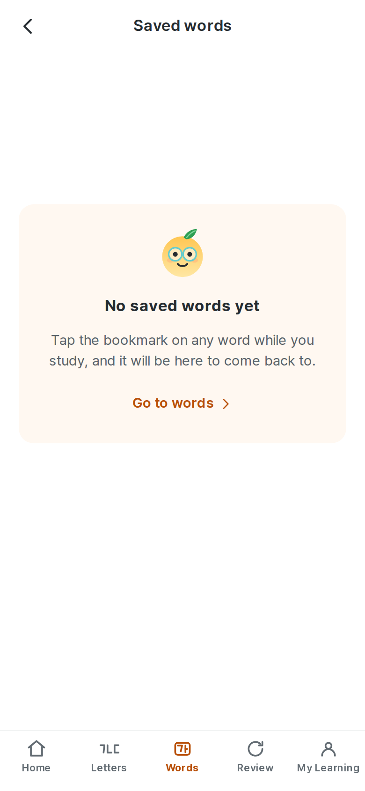
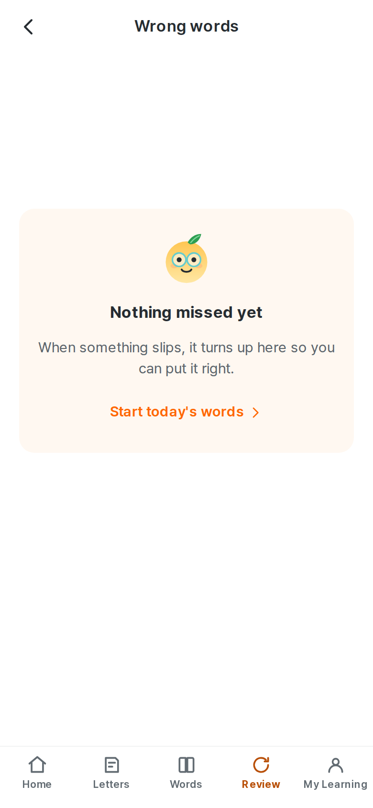

# 1. About this report

This is an **internal product truth document** — not marketing, not a changelog.
It is regenerated after each development cycle and handed to a reviewer, usually
another model, as the authoritative description of what Hangyul ganada
*currently is*.

It was written by re-auditing the running product and the current source, not by
editing the previous report. Where the code and older documents disagreed, the
code won and the disagreement is recorded.

## How to read the claims

Every substantive claim carries one of these labels. They are not decoration:
they are how a reader knows which sentences to trust without re-checking.

| Label | Means |
| --- | --- |
| **VERIFIED** | Confirmed by running the product, reading the code, or a script whose output is quoted here |
| **INFERRED** | Follows from the architecture but was not directly observed this cycle |
| **RECOMMENDED** | A product suggestion, not a statement of fact |
| **EXTERNAL** | From outside the repository; see §30 for the limits on this |

Feature status uses a second scale:

| Status | Means |
| --- | --- |
| **VERIFIED WORKING** | Does what it should, checked this cycle |
| **PARTIALLY WORKING** | Works for the common path; a real case is unhandled |
| **UX-PROBLEMATIC** | The code is correct and the customer experience is not |
| **BROKEN** | Does not work |
| **NOT IMPLEMENTED** | Does not exist |
| **NEEDS VERIFICATION** | Could not be settled from this machine |

## What this report will not do

It will not call something finished because a UI exists, a test passes, or a
previous document said so. §33 lists what is wrong, including work that was
reported fixed and is only partly fixed.

---

# 2. Audit metadata

| | |
| --- | --- |
| Report generated | 23 August 2026, **against the working tree, and against the delivered build by unpacking it** — see §2.2 |
| Product | Hangyul ganada (한귤 가나다) |
| Application version | 0.1.0 |
| Git branch | `main` |
| Git commit | `b94831b` — see §2.2 for the pipeline |
| Working tree | Clean when the release was built. Dirty now, and only with this report — `docs/`, `result/` and `app_result/`; no product file. `docs/report.pdf` is untracked by `.gitignore` |
| Commit the delivered APK/AAB were built from | **`922bc72`** — one commit behind HEAD, and the difference is this report. `npm run release:current` passes: nothing outside `docs/`, `result/` and `app_result/` changed. See §2.2 |
| Signed APK | 67.6 MB · `5b7220caeb19ae1b…` |
| Signed AAB | 66.4 MB · `68f4251cf513aa10…` |
| Signing certificate | `157a2bb133f6aa3d…` — `CN=Hangyul GaNaDa, O=Talk Hangyul` — the same identity as every previous release, read out of the APK Signing Block |
| Search indexing | **Refused** — `noindex` in two meta tags and `X-Robots-Tag` on every route. The link is public and shareable; see §26.4 |
| Production URL | `https://ganada.talkhangyul.com` |
| Target platforms | Web (primary), Android (Capacitor), iOS (project only — no IPA) |
| Interface languages | 32 |
| Words shipping | 2,581 |
| Words searchable but never taught | **30,243** in the dictionary layer — see §13.5 |
| Categories | 18 |
| Study sets | 523 (five words each) |
| Characters taught | 73 |
| Pronunciation notes | 503 |
| Audio clips | 10,454 mp3 + one manifest, counted on disk; 10,455 files inside the APK |
| Architecture | Static React SPA, no backend, IndexedDB persistence, build-time content |

## 2.1 Package versions

| Package | Version |
| --- | --- |
| react / react-dom | ^19.0.0 |
| react-router-dom | ^7.1.5 |
| vite | ^7.3.6 |
| typescript | ^5.7.3 |
| i18next | ^25.10.10 |
| vitest | ^3.0.5 |
| @playwright/test | ^1.50.1 |
| @capacitor/core | ^8.5.0 |

## 2.2 Commit and artefact state — **verified against the package**

This section has carried a P0 in four reports. It does not carry one now, and
the reason is not that somebody was careful this time.

```
922bc72  the production pass — every change in this report
         ↓  working tree clean, verified before anything was built
         ↓  npm run build + cap sync android
         ↓  gradlew assembleRelease bundleRelease, the existing production key
         ↓  unpack the delivered APK and check what is actually inside it
         ↓  npm run release:current
result/, app_result/   from 922bc72, and asserted to be
```

**No new keystore, and the certificate was checked in both directions.** The
keystore at `/root/.hangyul-keys/release.jks` was read before the build and its
fingerprint compared against the certificate in the *previously delivered* APK;
they match at `157a2bb1…3323debc`, `CN=Hangyul GaNaDa, OU=Mobile, O=Talk
Hangyul, L=Seoul, C=KR`. The new package was then read back out of the APK
Signing Block and carries the same one. There is a decoy on this machine —
`hangyul-qa-signing/qa-not-for-store.jks`, a different certificate — and
comparing rather than assuming is what keeps it out.

**The check is the fix.** `scripts/check-release-current.mjs` reads the commit
out of `build-info.json`, runs `git diff --name-only <that>..HEAD`, and fails on
any changed file outside `docs/`, `result/` and `app_result/`. It also fails on
an uncommitted product file, because a build made from a tree no commit
describes cannot be reproduced. It is in `verify:release`.

Thirty lines. Every gate in this repository checked the working tree and not one
of them compared the tree against the artefact built from it, which is why four
consecutive reports could be green end to end while the download was from a
different commit. Closing the row was never the fix; this is.

### What is actually inside the delivered package — **VERIFIED by unpacking it**

Checked in both directions, against the current source rather than against a
previous report:

| Looking for | Found in `app_result/hangyul-ganada-release.apk` |
| --- | --- |
| Splash media | `splash-en.png`, `splash-ko.png`, and **no MP4 or WebP** |
| Composition of 국 | `국:{aspect:.9669,cut:"bar",parts:[[.1257,0,.8686,.3646],…]}` — the current measurement, `cut` field and all |
| The matching grid | `Match each word to its meaning` in the index chunk |
| The sound-free control | `Can't use audio?` in the index chunk, `cannotUseAudio` in `ChoiceExercise`, `listenLetterSoundFree` in all 32 locale packs |
| The Home nudge | `ready for your first words` |
| Sharing and indexing | `robots` = `noindex,nofollow,noarchive,nosnippet,noimageindex`; `og:image` absolute; the 56 kB preview at `brand/og-hangyul-ganada.jpg` |
| Native launch bitmaps | all **ten** tested for ink in the wordmark band: 0 dark pixels, 0 brand-orange pixels. Wordless, as intended |
| **The old raster cut** | **absent** — `strokeAssets`, `strokeReveal`, `segmentation` all return nothing |
| The dictionary | `manifest.json` reporting 30,243 headwords and 39,647 senses, and **84 of 84 chunks reachable by the name the manifest gives**; 0 of 11,364 entry names carry a non-ASCII character |
| The search index, this cycle's five columns | `["headword","romanization","shortGloss","chunk","frequency"]` — not the seven it used to be. §29.3 |
| **The reading-size handwriting face** | `@font-face{font-family:Gaegu Text;…size-adjust:127%}` in the packaged CSS, and `Gaegu Text` in the bundle. §12 |
| **The two new palette tokens** | `--hg-negative-text` and `--hg-positive-text` in the packaged CSS. §29.5 |
| The Review hub's two chips | `Wrong words` present, `Wrong vocabulary` **absent**. §21.7 |
| A real quotation, and no app-authored one | `Goethe` present; `Two words a day` **absent**. §27.6 |
| **The removed dictionary disclosure** | **absent** — no `More from the dictionary` in any chunk. §15.5 |
| **The removed praise copy** | **absent** — no `바로 그거예요` in any locale pack |
| **The retired Home subtitle** | **absent** — no `한글부터 기본 단어까지` in any locale pack |
| **ElevenLabs** | **0 references** in any shipped script, style or JSON, and 10,455 audio files present |
| **A Tamil learner's word copy** | `content/vocabulary/copy/ta.json`'s hundred words are in `corpus/ta-*.json` inside the package — meaning, example translation *and* the polysemy note, in Tamil |
| A canonical taught sense | `word_cha#car` in `corpus/band-1-….json` |
| **The learning corpus** | **46 files** under `assets/public/corpus/` — manifest, tables, 4 bands and 40 locale packs — every name ASCII, and the manifest's `headwords: 2581` |
| **The Vocabulary Level bank** | `level-test/manifest.json` and `level-test/bank-4cafe65d.json`, 1.7 MB |
| **The corpus as a JavaScript chunk** | **absent** — no `word-corpus-*.js` in the package, which is the point of §13.4 |
| The corrected ㄱ | `.885` in the bundle, and no `lean = 0.28` anywhere in it |
| The decorative speaker | **absent** — no 🔊 in any shipped chunk; `Play the sound` is present |
| The redesigned confirmation dialog | `ConfirmDialog` in the bundle |
| The corrected streak flame | the new path present, the old one absent |
| The Android 12+ splash | `windowSplashScreenAnimatedIcon = @mipmap/splash_icon` in the launch theme, and 11 `ko-` splash configurations |

The launch bitmaps are checked by measurement rather than by hash because AAPT
re-encodes every PNG it packages, so byte-identity is guaranteed *not* to hold
and proves nothing either way. What matters is whether there is type in them,
and there is not.

### The row that made this section worth keeping — **found by unpacking, fixed, re-verified**

On the first attempt, **none of the 76 dictionary chunks was reachable inside the
APK.** They were all present, and every one of them came out as
`entries/ㄱ-1-3fc0d3aa.json`.

The buckets were named after the initial consonant they hold, so a chunk was
`entries/ㄱ-1-….json`. The bytes written into the archive are correct UTF-8. The
ZIP entries simply do not set the general-purpose UTF-8 flag, so a reader
following the specification decodes them as CP437. Gradle writes the archive;
the app asks its WebView for the name the manifest gives; whether those two
agree depends on a flag neither of them owns.

The index and the manifest are ASCII and were fine, which is the worst version
of this bug: search would have listed every headword in the dictionary and then
failed to open a single one.

**Nothing in the suite would have caught it.** The dev server reads the
filesystem, so it works there; the end-to-end tests run against the dev server;
`dictionary-qa` read the same filesystem. The failure existed only inside the
ZIP — the same shape as the refresh-404 that only exists in production hosting,
and the same lesson: a check that reads the source cannot answer a question
about the package.

Buckets are now named by the Revised Romanization of their initial —
`entries/g-1.json`, `entries/kk.json` — which is still inspectable and is made
of characters no archive format has an opinion about. `dictionary-qa` fails any
non-ASCII asset name, negative-tested by renaming one back. The package above is
the rebuild, and all 76 resolve.

### Signing — **read out of the signing block, not out of the manifest**

```
APK Signing Block present
  block 0x7109871a (v2)  cert SHA-256 157a2bb133f6aa3d34a9a7b27e4a7fb7cbfafe49544f6e6064ce713e3323debc
  block 0xf05368c0 (v3)  same
  subject  C=KR, L=Seoul, O=Talk Hangyul, OU=Mobile, CN=Hangyul GaNaDa
```

The same identity as every previous release. No new keystore, no debug
fallback, `applicationId` unchanged at `com.talkhangyul.ganada`, no native
libraries to align. The key was read from `ANDROID_KEYSTORE_PATH`; no secret is
in this repository or in this document.

`build-info.json` records the same fingerprint, and is *not* what was checked —
a build's own record of itself is not evidence about the file.

## 2.3 Figures for the next report to diff against

| Metric | Now | Last report |
| --- | --- | --- |
| Interface languages | **32** | 10 |
| Vocabulary headwords | 2,581 (target 10,000 — **7,419 short**) | 2,581 |
| Dictionary headwords, searchable and never scheduled | **30,243**, 39,647 senses, 3,867 examples | 30,059, 39,640, 3,862 |
| Taught words gaining dictionary examples of their own taught sense | **195 cards, 228 sentences** — the disclosure of other senses is gone, see §15.5 | 419 cards, 581 examples, under a disclosure |
| Every entry carries a canonical `senseId` | **2,581 of 2,581**, no collisions | none |
| Glosses teaching two senses at once | **0 unreviewed**, commas included; 35 trimmed and 38 kept on separators, then 55 comma glosses read and 5 fixed | separators gated, commas outside the rule |
| Vocabulary meanings in every shipping language | 10 of 32 at 2,581, and **22 at 100** written this cycle — a word with no meaning in the learner's language is not asked about rather than asked in English | 10 at 2,581, 22 at none |
| Lesson titles translated | **32 of 32** | 10 of 10 |
| Letter copy translated | **32 of 32** | 10 of 10 |
| Home quotations | **20**, every one by a named person with a citable source, in 32 of 32 languages | 12 lines × 10 of 10 |
| Practice typefaces named and described | **32 of 32** | 2 of 10 — undetected |
| Customer-facing phonetic notation | **Revised Romanization, from the standard pronunciation** | IPA |
| Verified synonym pairs | 72 | 71 |
| Verified antonym pairs | 65 | 65 |
| Words with any verified relation | 245 of 2,581 (9.5%), 272 relations | 243 |
| Longer explanations (`definition`) | 25 in 10 languages, and the **9 inside the written hundred now in all 32** | 25, in 10 languages |
| Words whose taught sense is pinned by exact string | 11, now beside a `senseId` on all 2,581 | 11 |
| Web unit (`vitest`) | **758** (48 files) | 757 |
| Hangyul Vocabulary Level Test | **3,990 items over 30 levels**; MAE 1.34, 95.3% within ±3, **exactly 30 items in one 8-minute timer** | specified, not built |
| Languages whose register was inconsistent across screens | **0**, enforced | 5, never measured |
| Handwriting core (`vitest`) | **96** (5 files) | 96 |
| End-to-end (`playwright`) | **324** (162 × 2 projects) | 276 |
| Rendered stroke frames measured in pixels | 1,345 | 1,345 |
| Handwriting **false-reject / false-accept** | **0.28% / 0.28%** — and Pretendard, the default face, **0.42% / 0.00%** | 0.21% / 0.78% overall, 1.04% / 0.55% on Pretendard |
| First load | **219.0 kB gz of a 460 kB budget** (48%) | 387.8 kB (84%) |
| Word-corpus bundle | **none — the corpus is not a JavaScript chunk any more** | 171.3 kB gz |
| Corpus a learner waits for before first paint | **45.7 kB gz of a 64 kB budget**, and **the same at 10,000 words** | the whole corpus, in the first load |
| Corpus forecast at 10,000 words | 776.8 kB gz of a 900 kB budget, background and precached | 754.6 kB of 220 kB — **343%**, in the first load |
| Everything precached, now including `public/corpus` | **877.2 kB gz of a 1400 kB budget** (63%) | 472.9 kB of 900 kB, corpus not included |
| Delivered APK/AAB built from | **`922bc72`**, one commit behind HEAD and the difference is this report — which `release:current` distinguishes | `c350d03`, the same commit |
| Signed APK certificate, read from the signing block | `157a2bb1…debc`, v2 + v3, valid to 2053 | same identity |
| Dictionary chunks reachable inside the delivered APK | **76 of 76**, verified by unpacking it | 0 of 76 on the first attempt — see §2.2 |
| Trace guide vs its own box (ㅏ) | **0.243 × 0.718, centred at (0.499, 0.499)** | 0.228 × 0.672 at (0.556, 0.460) |
| Worst glyph centring error, all 6 faces | **1.2% of the box** | 8% |
| Vocabulary question shapes in a first sitting | 3 — meaning, context, matching | 3 |
| Locale screens rendered and measured | **256** (32 languages × 8 screens), 0 findings | 256, 0 findings |
| Screens rendered at every phone size, in both themes | **85** (17 screens × 320/390/430/dark/200%), 0 findings after 6 fixes | never measured |
| Screens checked at 200% text | **17**, no sideways scroll, nothing clipped, nothing overlapping | 9 |
| Audio clips decoded end to end | **10,550**, 0 errors, 0 warnings, in 2m49s | the check did not finish |
| Dictionary search, phone-adjusted | **p50 0.03 ms, p95 1.32 ms** at 30,243 headwords — an index, not a scan | p50 0.07 ms, p95 1.40 ms |
| Search index a learner waits for on the first search | **502 kB gz of a 520 kB budget**, after two columns nothing rendered were removed | 529 kB — over budget |
| Practice faces reading at the same size on the page | **6 of 6**, within 2.5% of the median ink height | 5 of 6; Gaegu 21.3% under |
| Dictionary senses showing an English part of speech in a translated interface | **0** | 3,211 |
| Hints that rule nothing out, over 137,763 shown in 32 languages | **0** | 0 of 149,231 |
| Guide ↔ animation exceptions | **0** | 6, stated and tolerated |
| Wrong secondary categories on taught words | **0** | 73 across 70 words |
| Stroke demonstration audited at | 200, 152 and 96 px — the sizes the product draws | same |
| **Glyph shape** — completed letters against the face they are traced from | **73 / 73**, mean 96.9% | never asked |
| ㄱ's toe beside a vowel, against the face's 0.115 | **0.166–0.175** | 0.72–0.73 |
| Jamo proportions measured off the real face | **40 / 40** | 10 of 40 — the rest off a silent fallback |
| Decorative pictographs on a question screen | **0** | one 44px 🔊 above the audio button |

The relation rows moved by two, and not because relation work was done. Trimming
자신 from "oneself; confidence" to "oneself" was a gloss fix, and it let the
relation builder match 자기 ↔ 자신 — a synonym pair Korean Wiktionary had all
along and the merged gloss had been hiding. That is the second cycle running in
which these rows have moved without a relation being touched, which is why they
are kept.

The bundle rows did not move at all, and that is the number to read next to
30,243 new headwords. The dictionary is 14 MB and none of it is in the bundle:
it is fetched from `public/` on the first search and never imported, so first
load is unchanged. Had it been imported it would have gone through the
`manualChunks` catch-all into `curriculum-data`, on the critical path, paid for
by every learner including the ones who never search.

The last row is the one that matters most. The delivered APK was unpacked rather
than trusted, and on the first attempt **none of the 76 dictionary chunks was
reachable from inside it**. See §2.2.

---

# 3. Executive summary

## This cycle, in one page

Six things changed, and five of them were found by measuring a surface nobody
had measured before. That is the pattern of the whole pass: not new features,
but the first honest look at something the product was already doing.

**The dictionary was swept at the source.** §16 asked for the whole thing
rather than the one word in a screenshot, so all 30,059 entries were read for
the defects a scraped corpus produces. Five classes came back, each with a
single cause in the ingestion: 84 glosses cut at a pipe inside a link, **252
that were nothing but an empty pair of brackets** because a species-name
template was deleted as unrecognised, 340 carrying Wiktionary's "(to be)"
marker, 212 headwords listing the same meaning twice, and 11 examples with an
HTML entity or a transliteration caret in them. All five are fixed where they
were caused and gated so they cannot return. 184 headwords came back with the
fix — their meanings had been deleted, not their entries.

**3,211 dictionary pages showed an English part of speech in every language.**
`t('partOfSpeech.<value>')` passes the raw value as its default, so five of the
fourteen the dictionary uses printed as English words and looked deliberate.
The default is what made it silent; `dictionary:qa` now fails on it.

**Every control on seventeen screens was measured, at three phone widths, in
dark, and at 200% text.** 85 renders. Four controls were under 44 px —
including the vocabulary search field, 25 px tall inside a 48 px row that
plainly invites a tap, and the skip link, which is the first tab stop in the
product. Two colour pairs failed AA, and both are fixed in the palette rather
than the component. The first run of that check reported 355 findings and 236
of them were the measurement's own fault, which is recorded here because a
check nobody believes is worse than no check.

**The handwriting face reads at the size the other five do.** §51 asked for a
rendered comparison rather than an argument from geometry, and the rendering
found a second question: the *traced* reference was settled last cycle, but
every other letter on screen in 손글씨체 was 21% smaller than in any other face,
and nothing grades that text. A second `@font-face` at `size-adjust: 127%`
fixes it without touching the mask the evaluator compares against.

**A hundred words were written in each of twenty-two more languages**, with the
example translations and the nine polysemy notes that fall inside them. That is
4% of the corpus and it is not a finished state — but the *kind* of gap
changed: past the written hundred a quiz asks nothing rather than asking in
English, and §23.8 says exactly how far each language reaches.

**And the Review hub called one list "Saved words" and the other "Wrong
vocabulary"**, ten pixels apart. Thirty-one languages already used one noun for
both. English was the only string that changed, and `copy:audit` now compares
the pair in every language.

**What did not change: the corpus is still 2,581 words against a stated
10,000.** §49 is explicit that padding it would be worse than the shortfall, so
nothing was added, and `vocabulary:qa:target` — the release variant of the
corpus gate — still fails on exactly that. It is the one check in
`verify:release` that does not pass, and it is meant to.

## The previous cycle, kept for context


**The download is the product this document describes**, and unpacking it is
what caught the worst defect of the cycle. The release was built from `cead31d`
with a clean tree and `npm run release:current` asserts it. But on the first
attempt the package was broken in a way no gate could see: **all 76 dictionary
chunks were unreachable inside the APK**, every one of them named
`entries/ㄱ-1-3fc0d3aa.json`. The bytes were correct UTF-8; the ZIP entries do
not set the UTF-8 flag, so a spec-following reader decodes them as CP437. The
index and manifest are ASCII and were fine — so search would have listed every
headword and failed to open a single one. The dev server reads the filesystem
and never sees it; the end-to-end suite runs against the dev server. Chunk names
are ASCII now, `dictionary-qa` refuses a non-ASCII asset name, and the rebuilt
package resolves 76 of 76.

**The letter a learner traces is now the size and shape of the letter they were
shown.** The guide was drawn at a fixed *em*, which is a typographic container
and not the marks inside it, so ㅏ landed at 0.228 × 0.672 of the writing square
and sat 5.6% right and 4% above the crosshair drawn through the middle of it.
`fitGlyph` measures the ink and centres that instead: **0.243 × 0.718 at (0.499,
0.499)**, with a worst-case centring error of 1.2% of the box across all six
practice faces.

The half of that which had defeated two previous attempts was the grading. A
bigger glyph has thicker strokes, and a stroke wider than the learner's pen
cannot be filled, so an honest attempt reads as a letter hollow down the middle
— the reason the last try was reverted at 21% false rejections. The missing
piece was that the *unwritten* term had no erosion while the *extra ink* term
had always had one; the rim a too-wide stroke leaves is not a stroke anybody
failed to write. Swept jointly against 2,880 genuine attempts and 2,172 wrong
ones across six faces:

```
before   0.21% false reject / 0.78% false accept
after    0.28% / 0.28%
Pretendard, the face almost everyone writes on:  1.04% / 0.55%  ->  0.42% / 0.00%
```

**The letters were the right strokes in the wrong shape, and no gate could see
it.** A customer sent a screenshot of 가 and 거: the ㄱ's leg stops short and the
letter reads top-heavy, not the shape the tracing guide underneath shows. They
were right. `strokes:qa`, `strokes:visual` and `strokes:measure:check` were
green on all 73 items throughout — they ask whether the ink is well formed and
well behaved, and none of them asks whether the completed character is the right
shape. **Those are different claims and this report had been reporting one as
the other.**

Measured off the face, the leg's toe lands at 0.115 of the letter's width and
was authored at 0.72. The rule was already right — a leaning form beside a
vowel, upright above — so the fix is one constant and a curve refitted to the
face's own profile, with no per-syllable exception.

Following it to ㅗ found the larger defect. `measure-jamo.mjs` was measuring **a
system fallback face**: it drew on a page where nothing used the family, so
`document.fonts.ready` resolved without loading it and the canvas quietly
substituted another Korean typeface. 30 of the 40 letters were out by more than
5%; ㅗ was built with a stem two fifths too short. Nothing errored, and the
check passed because it faithfully reproduced its own mistake. My own first
attempt to measure it independently had the identical bug and produced eight
confident, wrong findings before I checked them against the font file.

There is now a `glyphshape:qa` that fits the authored letter and the practice
face the same way the app fits the guide and overlays them: **73 of 73 pass**,
and all 73 were also looked at. Six compound vowels differ on purpose —
Pretendard slants the ㅗ bar in ㅘ and its family, nobody writes a slanted ㅗ,
and that is listed as reviewed rather than hidden by lowering the bar.

**The listening question said the same thing twice.** A 44px 🔊 sat directly
above the button that plays the clip — decoration duplicating a control, in a
pictograph belonging to no part of this product's drawing, `aria-hidden` so not
even labelling anything. Removed, with nothing in its place. Removing it exposed
a real defect: the button's name is *"Play the pronunciation of {text}"* and a
listening question has no text to name, so screen-reader users heard *"Play the
pronunciation of "* and then silence. It says *"Play the sound"* now, in 32
languages.

**Every card now teaches one named sense, and 103 of them did not.** Each entry
carries a canonical `senseId` — `word_cha#car`, derived from the English gloss
because English was the one locale already single-sense throughout. That made
the promise checkable and it failed: 차 read 車、お茶 in Japanese and "coche, té"
in Spanish, on a card whose sentence is 차를 타요 and whose four options have one
right answer. The card's own example turned out to be the authority and it
disagreed with more than the merged glosses — 맡다 was glossed "to take charge
of" over 냄새를 맡아 보세요, *Please smell it*; 바로 was "truly, without lie or
deception" over *I'll go right away*, with six authored locales saying
immediately and only the machine-picked English dissenting. 35 glosses trimmed
across ten languages, ten cards moved sense, three illustrations moved with
them. The 38 remaining separators are legitimate — Japanese has no single verb
for 있다 and must write ある、いる — and are now a reviewed list that gates in
both directions.

**And there is a dictionary behind search that is not the syllabus.** 30,243
headwords, 39,640 senses, 3,862 examples, from Wiktionary under CC BY-SA 4.0,
fetched lazily from `public/` so first load is unchanged. A `DictionaryEntry`
has no difficulty score and no lesson, so there is no way to hand one to the
scheduler: nothing in it is ever scheduled, reviewed or counted. 419 taught
words gain 581 additional examples of the sense they teach, and 399 gain 721
more under other meanings — which is where 차's tea now lives, off the meaning
line and onto the page. §13.5.

**Vocabulary has a third question shape, and it is a genuinely different one.**
Matching — four words, four meanings, tapped in pairs — is the first exercise in
the product that asks about several words at once, which is why the scheduler
grew a group step and a `completes` list. A grid can be the last thing three of
its four words owe, and the day's counter, the mastery ladder and the activity
row all have to move by exactly three; eleven new tests hold that. It replaces a
third of the new-word checks rather than joining them, so a sitting is the same
length and a beginner meets three shapes instead of two.

**A learner who cannot hear now has a way through the alphabet.** The two
heard-only *letter* exercises carry a per-question *Can't use audio?* in all
thirty-two languages. It swaps the recording for an equivalent visual prompt —
the written sound for "which letter is this", and the letter itself for "which
of these two", which is the only direction that does not hand over an answer the
options already carry as labels. Same item, same skill, same scoring, no
penalty. Not a setting, because the setting it replaces could only be turned on
by people who already had it on.

**The link is shareable and will not be found in a search, which is two things
that fight each other.** Complete Open Graph and Twitter metadata sits in
`index.html` where a crawler that never runs React can read it, with a 1200 × 600
preview generated from the brand key visual. Indexing is refused by `noindex` in
two meta tags and by `X-Robots-Tag` on every route in both Vercel configs — and
`robots.txt` **allows** crawling, because a page a crawler cannot fetch is a page
whose `noindex` is never read, and the URL stays listed. §26.4 is the whole
account; `share:check` asserts it against the built output.

**And the suite that drives the real application is green and on the gate** —
262 end-to-end cases now, up from 236, and 691 unit tests. Three checks were
measuring the wrong thing and were corrected rather than extended. `audio:qa`
was reported as hanging: it was decoding 10,454 clips one at a time behind two
subprocesses each, silently, for about twenty-seven minutes, and had therefore
not been run. It is 2m49s now and its first full run is clean — 10,550 clips, 0
errors. The stroke gallery rendered at 160 and 96 px and **the product draws at
neither**; it is 200, 152 and 96 now, and all 73 items were regenerated and read
by eye. And nothing asked whether the text could be doubled: all nine top-level
screens survive 200% with no sideways scroll and nothing clipped.

Four smaller things, each measured: the native launch screen is wordless, so a
Korean learner no longer meets an English wordmark before the app paints; the
bottom navigation reaches the frame's edges at every width from 360 px to
1440 px; Home suggests words once eleven letters are known, on the card that was
already there; and IndexedDB opens retry with backoff, which took a reproducible
one-in-twelve silent fall back to the memory engine — a session of practice
never written to disk — to 24 of 24.

**What did not happen, stated plainly.** The *taught* corpus is still 2,581
words against a stated 10,000 — the dictionary makes 30,243 words findable and
teaches none of them, and conflating the two would be the easiest lie in this
document to tell. Word meanings still reach ten of the thirty-two interface
languages, and no locale has been read by a native speaker. Those three are
content and people rather than engineering, they are the three things between
this and a confident paid release, and nothing in this pass moved them. §39 says
so again in order.

Two smaller admissions. The learning corpus still carries **one authored example
per word**; the obvious way to add more — harvesting other cards' sentences —
was built and measured and files 주사를 맞았어요, getting an injection, under
맞다 meaning "to be right", so it was thrown away rather than shipped. And
Gaegu's letters are larger than they were and still smaller than every other
face: **I-31 is PARTIAL**, because closing the rest of that gap costs grading
accuracy.

**The product speaks thirty-two languages, romanises Korean the way Korea
does, and got smaller doing it.** The three defects a learner could see most
clearly — a phonetic alphabet nobody outside linguistics reads, an alphabet
course in English under a translated interface, and a home screen that said the
same thing three times — are fixed at the level they were wrong at.

**The notation was replaced, not renamed.** Every word carried IPA, bracketed,
including in front of beginners: [t͡ɕa̠ɾi] over 자리. It now carries **Revised
Romanization derived from the standard pronunciation** — *jari*, and 국민 →
*gungmin*, not *gukmin*. The distinction between deriving it from the spelling
and deriving it from the sound is the whole of the work: the same sound-change
machinery that produces the audio now produces the notation, so the two cannot
disagree. Five QA layers check it, one of which re-derives all 2,581 through the
Python and compares byte-for-byte with what ships, and a rendering test matches
the *displayed* string against an IPA character class so the old values cannot
return under a new label.

**Twenty-two languages were added, and four separate bodies of content turned
out to be English underneath a translated interface.** Not one of them was
visible to `i18n:check`, which reports 100% and is right about the files it
reads. Lesson titles were the finding last cycle; this cycle it was the six
practice typefaces, the quotations (twelve of them at the time; a hundred now),
the tab bar, and — in twenty-eight of
the thirty-two languages — a unit heading and the lesson card beneath it using
two different phrasings of the same English sentence, three centimetres apart.

**Two of those were only findable by looking at a rendered screen.** The
quotation renderer throws rather than falling back and is mounted inside Home, so
a language with no quotations rendered **a white page**: that was the Arabic home
screen. And the bottom navigation, which has no state, no context and no changing
props, never re-renders — so when a stored language's strings arrived after the
first paint it kept the English it resolved on frame one, reading *Home /
Letters / Words* under a fully Arabic screen. Both now have tests; both were
invisible to a green suite for as long as they existed.

**Thirty-two languages made the app faster, which is the architectural finding.**
Going from ten to thirty-two took the first load from 460 kB of budget almost
exhausted to **387.3 kB, 84% of it**, and precached bytes down to 470.7 kB, 52%
of theirs. Both re-measured this cycle.
The same change forced the third and last body of per-language content off the
critical path: interface bundles, word packs and now letter explanations are all
fetched for the one language the learner reads. Splitting the letter copy out of
its module bought nothing at all until a `manualChunks` line stopped sweeping the
thirty emitted files into the chunk that loads before the home screen paints —
recorded because that is the failure mode of every lazy-loading change.

**Less on the screen, in three specific places.** The home screen offered the
day's words twice and Review twice, on the first screen anybody sees; each now
appears once. The writing feedback was a headline, a sentence, a heading, up to
three bullets and a closing paragraph about what stroke order is for — six
paragraphs under a two-stroke letter, every attempt — and is now a status, one
sentence of advice, one note, and the next action. And the finished-alphabet card
no longer prints "0 %" beside the words *You can read Hangul*.

**The strokes were not holding, and the last report said they were.** It called
the renderer *release quality* and claimed all 73 items had been read by eye. The
customer answered with four screenshots — ㅂ, ㅅ, ㅇ, ㅈ — and all four defects
were real: wedges of not-yet-written crossbars showing inside finished uprights,
a first stroke growing into a second one's shoulder, and a ㅇ that was a lumpy
polygon. They were reproduced here from the shipped assets before anything was
touched.

**So the architecture was replaced rather than patched a fifth time.** The
demonstration used to be cut out of a rasterised glyph: award each pixel of ink
to a stroke, trace the regions, animate the polygons. That produces a boundary
wherever two strokes genuinely share ink, and the boundary is visible the moment
one side is black and the other grey — there is nothing to divide, because the
ink at a junction is written twice. It also produces polygons, which is why ㅇ was
one. The reference glyph is now the typeface, and the instruction is authored
vector centrelines drawn as *stroked* paths. Two strokes that meet simply
overlap. §11 is the whole account, including how the QA passed 73 items and 269
strokes through every round in which the product was visibly wrong.

Six more defects were found on the way and none of them by a test — 글's 받침
arriving as a smudge, ㅎ's bowl merged into its bar, a mitred beak on ㄹ, ㅋ's bar
hanging in open paper, ㅐ and ㅒ's connectors touching a stem they should stop
short of, and a centre cross that had never once been drawn because its CSS rule
did not exist. All were found by rendering the letters and looking at them.

**The launch screen is now a still picture, and the desktop shell is a single
frame.** The brand clips are gone — deleted, not disabled: no `<video>`, no
animated format, no reduced-motion branch, no autoplay policy to lose to. Two
PNGs, Korean when the interface is Korean and English otherwise, chosen from
`LocaleContext` because it is the only source that is right on the first render.
On a wide screen the app sits in a 430 px phone-shaped shell drawn once by
`#root`; it used to be drawn twice, and the inner copy left the bottom
navigation floating clear of its own edges. §11.8 covers both, and both of its
remaining defects — the native launch bitmap being English for everyone
(**I-26**) and the tab bar still floating between 430 px and 560 px
(**I-27**).

**And 낳다 is finally settled.** Three cycles of "the recogniser hears 낫다" ended
by measuring the recordings instead of transcribing them: 낳다 is [나타], a short
closure and a weak breathy release, and 낫다 and 낮다 are [낟따], a long closure
and a sharp one. The clips are right; the recogniser was not. A check asserts it
now, and fails if the pair is asserted the other way round.

Four things still stand between this and a paid release.

**0 · The thing a customer would actually download is two cycles of work old.**
Fixed by one build and one signing run from HEAD, and it is first in the list
because it is the cheapest item on it and the only one that makes every other
improvement in this report invisible to the person who installs the app.
**I-01**.

**1 · The corpus is a quarter of its stated size.** 2,581 words against a
10,000 target. **The delivery half of this is fixed** — the corpus is fetched in
priority bands, the first load halved to 219 kB, and the part of it that is
corpus is a flat 45.7 kB at any corpus size (§13.4, I-05). What is left is
authoring 7,419 words, and nothing about the architecture stands in its way any
more.

**2 · Word meanings exist in ten of the thirty-two languages.** 2,581 × 22 is
about 57,000 lines, and writing them without a speaker of each language would
produce the machine-translation register `LOCALIZATION_NATIVE_REVIEW.md` exists
to refuse, at a scale nobody could audit. So the English fallback stands and is
**said out loud before the learner chooses the language**, on the row itself. The
first version of that caption was wrong in the opposite direction — it told
Vietnamese and Thai learners their meanings were English while shipping 2,581 of
each — and is now tied to the emitted packs by a test.

**3 · No language has been read by a native speaker.** Not one of the thirty-two,
including the two the product is about. That is stated in the first paragraph of
`LOCALIZATION_NATIVE_REVIEW.md` and no table in it softens the claim.

Against that, and stated precisely rather than reassuringly: **the stroke
system is genuinely fixed in the source and was checked by looking, not by
passing.** All 73 items were rendered beside the reference face — with Pretendard
actually loaded for the text being measured, which is the trap the last
regeneration fell into — and read one by one. ㅂ draws four clean strokes with no
wedge of a crossbar inside an upright; ㅇ is a smooth ring; 글, 국, 공, 부 and 옷
match the reference closely; 밥's ten strokes arrive in the right order with
nothing on the paper before its turn. Three new defects were found in this audit
and all three are cosmetic or process (**I-26**, **I-27**, **I-28**). One
previously open item was measured again and got worse-looking, not better
(**I-24**). Nothing that was reported broken has come back.

**Current sellability: *Barely ready* standalone; *Good* as a funnel product.**
Reasoning in §32.

---

# 4. Product definition

## 4.1 What it is — **VERIFIED**

A single-purpose application that takes someone who cannot read Hangul to the
point where they can read it, write it by hand, and know a few hundred words. It
is deliberately small: two learning tracks (letters, words), one review system,
one settings screen.

It runs as a web app at `ganada.talkhangyul.com` and as an Android app wrapping
the same build. No account, no server, no network requirement after first load.

## 4.2 The intended journey

```
interest in Korean
   → speaking/TOPIK feels too difficult
      → Hangyul ganada          ← this product
         → Hangul foundations
         → practical basic vocabulary
         → confidence
      → back to main Hangyul for speaking and TOPIK
```

## 4.3 Does the product support that positioning?

**Partly — and one link is missing entirely.**

| Stage | Supported? | Evidence |
| --- | --- | --- |
| Hangul foundations | **Yes** | 73 characters across 12 ordered lessons, demonstration, guided writing, recognition |
| Practical basic vocabulary | **Partly** | 2,581 words, 5–20 a day, quiz-first. Months of study; a quarter of the ambition |
| Confidence | **Yes, mechanically** | Daily goals, streak, activity calendar, a review system that does not pile up |
| Return to main Hangyul | **BUILT, NOT CONFIGURED** | The hand-off exists — a card at the end of the alphabet and a permanent row in My Learning — and renders nothing until a destination is set |

That last row changed this cycle, and it changed to *almost*.

The hand-off is built. When the learner finishes all forty letters, the letters
screen shows a quiet card under the alphabet: *"You can read Hangul now.
Speaking and TOPIK practice continue in Hangyul."* A permanent row sits in My
Learning under the learner's own activity, shaped like every other row and given
none of the emphasis. Neither interrupts a lesson; neither repeats; neither has
a dismiss button, because there is nothing to dismiss.

**It renders nothing at all, because nobody has supplied the URL.** The
destination is not in this repository and cannot be guessed, so `HANGYUL_URL` is
read from `VITE_HANGYUL_URL` at build time and every piece of the hand-off is
absent when it is unset — which is the state of a plain checkout. Shipping a
card that leads nowhere would be worse than the dead end it was built to fix.

Setting one environment variable turns it on. Until somebody does, **the product
is still described as a funnel and still contains no funnel**, and this stays on
the P1 list.

---

# 5. Current product decisions, audited

Each decision is stated as intended, then checked against the implementation.
This is the fastest way to see what must not be accidentally reversed.

| # | Decision | Current implementation | Status |
| --- | --- | --- | --- |
| 1 | No mandatory login | No auth code anywhere; no server | **VERIFIED WORKING** |
| 2 | Device-local persistence | IndexedDB via a driver seam; SQLite on native | **VERIFIED WORKING** |
| 3 | Hangul foundation learning | 12 lessons, 73 items | **VERIFIED WORKING** |
| 4 | Handwriting only where it teaches | Letters and syllables only | **VERIFIED WORKING** |
| 5 | Vocabulary never handwritten | No canvas reachable from any word screen; e2e asserts it | **VERIFIED WORKING** |
| 6 | Vocabulary is quiz-first | Meet → choose → recognise; **five** step types — `intro`, `meaning`, `produce`, `context`, `build`. It was six until the two listening steps were removed | **VERIFIED WORKING** |
| 7 | Vocabulary daily goals | 5 / 10 / 15 / 20, persisted | **VERIFIED WORKING** |
| 8 | 10,000-word corpus as depth | 2,581 shipping | **PARTIALLY WORKING** |
| 9 | Never expose the corpus as one list | The day's plan is the entry point | **VERIFIED WORKING** |
| 10 | Categories/search secondary | Both below the day card on `/words` | **VERIFIED WORKING** |
| 11 | No vocabulary images | e2e asserts zero `` on word screens | **VERIFIED WORKING** |
| 12 | Rich Word Detail | Headword, romanization, audio, POS, gloss, example, Save, relations | **PARTIALLY WORKING** (§15) |
| 13 | Pronunciation notation | Revised Romanization on every word, from the standard pronunciation | **VERIFIED WORKING** |
| 14 | Pronunciation audio | 10,454 clips, two voices | **VERIFIED WORKING** |
| 15 | Example sentences | 2,581 of 2,581 | **VERIFIED WORKING** |
| 16 | Saved Words | Toggle on card and detail; own screen | **VERIFIED WORKING** |
| 17 | Wrong Answer Notebook | One row per item; retires after 2 correct | **VERIFIED WORKING** |
| 18 | Memory-based Review | Per-item, per-skill recall model | **VERIFIED WORKING** |
| 19 | Sentences are context, not SRS items | No sentence is a memory key | **VERIFIED WORKING** (§21.6) |
| 20 | Multiple quiz formats | 6 vocabulary steps, 7 review modes | **VERIFIED WORKING** |
| 21 | Listening autoplay | Once per arrival at an item | **VERIFIED WORKING** |
| 22 | Daily goal completion state | Completion card with a mascot | **VERIFIED WORKING** |
| 23 | Optional extra learning | 5 / 10 / 20 more, appended to the day | **VERIFIED WORKING** |
| 24 | Progress above 100% | 12/10 reads 120%; the bar caps at full | **VERIFIED WORKING** |
| 25 | Language first in settings | First card under the stats on `/me` | **VERIFIED WORKING** |
| 26 | Device-language detection | Navigator languages → fallback chain | **VERIFIED WORKING** |
| 27 | Dark Mode | System / light / dark, semantic tokens | **VERIFIED WORKING** |
| 28 | Simplified Hangul learning | Intro reduced to demo + sound + one line | **VERIFIED WORKING** |
| 29 | Automatic stroke animation | Plays once on arrival, rests on the finished glyph | **VERIFIED WORKING** |
| 30 | One guided writing attempt | Write, then a recognition check | **VERIFIED WORKING** |
| 31 | No second faded-guide stage | Removed; e2e asserts the step list | **VERIFIED WORKING** |
| 32 | Tolerant of beginner writing | **0.21%** false reject, measured | **VERIFIED WORKING** |
| 33 | Scribbles must fail | **0.78%** false accept, measured | **VERIFIED WORKING** |
| 34 | Clean canonical stroke animation | Rebuilt this cycle | **VERIFIED WORKING** (uncommitted) |
| 35 | SPA routes survive refresh | Hosting rules + a service-worker guard | **VERIFIED WORKING** |
| 36 | Progress survives refresh/reopen | 6 end-to-end cases | **VERIFIED WORKING** |

Two decisions are enforced by test rather than by convention, which is worth
knowing before touching them:

**Decision 5** — `journey.spec.ts` asserts no `writing-canvas` element exists
anywhere in a word session. Adding word handwriting will fail CI, by design.

**Decision 19** — memory keys are `${kind}:${itemKey}` with kind ∈ {`character`,
`word`}. There is no sentence key, so a sentence cannot become an SRS item by
accident.

---

# 6. Target customer and job to be done

## 6.1 The person — **RECOMMENDED framing**

A complete beginner who knows little or no Hangul and may not read English well
either; is learning casually, quite possibly lying down, on a phone; has low
commitment in week one and will quit anything that feels like homework; finds
handwriting on glass tiring if asked for too much of it; and wants visible
progress fast enough to come back tomorrow.

## 6.2 The job

> *Help me start Korean easily enough that I don't give up before I can use a
> speaking-focused product.*

## 6.3 Does the product do the job?

| Requirement | Current product | Verdict |
| --- | --- | --- |
| Start in seconds, no account | Opens into Unit 1 with a Start button | **Yes** |
| Readable without English | 32 languages, device-detected, language is the first settings row | **Yes** — word meanings reach 10 of them and the picker says so |
| Short sessions | Letter lesson ≈ 6 items; vocabulary default 10 words | **Yes** |
| Not tiring | One guided write per letter, none per word | **Yes** |
| Visible progress | Letters *n*/40, words learned, streak, calendar, daily ring | **Yes** |
| Comes back tomorrow | Daily goal resets; totals do not | **Yes** |
| Hands off to the next product | — | **No** (§4.3) |

**The job is done except for its last clause** — the clause that justifies this
product existing alongside another one.

---

# 7. Technical architecture

**VERIFIED** by inspecting `apps/`, `packages/`, `vercel.json`, and the absence
of any server directory.

```
                      ┌──────────────────────────────────────────┐
                      │  BUILD TIME (never runs on a device)     │
   Wiktionary  ──┐    │                                          │
   OpenSubtitles ├───▶│  scripts/content/*.py    vocabulary      │
   editorial pack┘    │  scripts/*.mjs           strokes         │
   Azure TTS     ────▶│                          audio, curriculum│
                      └───────────────┬──────────────────────────┘
                                      │ generated JSON + mp3
                                      ▼
   ┌────────────────────────────────────────────────────────────────┐
   │  apps/web  —  React 19 + Vite + TypeScript, one static bundle  │
   │                                                                │
   │   pages/      routes             features/  session flows      │
   │   domain/     memory · review · plan · mastery · activity      │
   │   data/       generated corpus · strokes · fonts               │
   │   storage/    driver seam ▸ IndexedDB | SQLite | Memory        │
   │   i18n/       8 locales (i18next)                              │
   │   ui/ + design-tokens   themed components                      │
   └───────────────┬──────────────────────────────┬────────────────┘
                   │                              │
        ┌──────────▼──────────┐       ┌───────────▼────────────┐
        │  Web                │       │  Android (Capacitor 8) │
        │  static host +      │       │  same bundle +         │
        │  service worker     │       │  SQLite, haptics,      │
        │  IndexedDB          │       │  notifications         │
        └─────────────────────┘       └────────────────────────┘

   NO BACKEND. No API, no database, no session, no telemetry.
   The only runtime fetch() in the whole app loads an audio file.
```

**There is no FastAPI service and no backend of any kind.** The brief for this
audit assumed one; the repository does not contain one. `vercel.json` reserves
`/api/*` out of the SPA fallback so a backend *could* be added later without
being shadowed, and `docs/DEPLOYMENT.md` states plainly that there is no server
component. **VERIFIED**: grepping `fetch(`, `XMLHttpRequest`, `axios` and
`WebSocket` across `apps/web/src` returns exactly one hit —
`PronunciationPlayer.ts`, loading an mp3.

## 7.1 Why this matters to the product

Every learner-facing consequence follows from one choice: **the learner's data
never leaves the device.** That gives the product its best properties — works
offline, no signup, nothing to breach, no running cost — and its worst risk
(§24.5: one copy, no export, no recovery).

---

# 8. Information architecture

## 8.1 Sitemap

```
/                        Home — today's unit, vocabulary level, counter, quote
│
├── /letters             Learn letters — 12 lessons, alphabet progress
│   ├── /letters/:lessonId       Letter session (intro → write → read)
│   └── /letters/sounds          When sounds meet — 6 sound-change patterns
│
├── /words               Learn words — today's card, categories, search, dictionary
│   ├── /words/today             Vocabulary session (the day's plan)
│   ├── /words/category/:id      One category's word list
│   ├── /words/word/:wordId      Word Detail
│   ├── /words/dictionary/:word  Dictionary entry — searchable, never scheduled
│   └── /words/saved             Saved words (search, order, sized practice)
│
├── /review              Review hub — the session, the modes, and the two lists
│   ├── /review/session          Review session
│   └── /review/mistakes         Wrong words (the wrong-answer notebook)
│
├── /me                  My Learning — stats, language, goals, voice, typeface…
│   ├── /me/activity             Learning activity — calendar, streak, insights
│   ├── /me/level-test           Hangyul Vocabulary Level Test — 30 items, 8 min
│   ├── /me/language             Choose a language (32, native names, search)
│   ├── /me/privacy              Privacy
│   └── /me/legal                Legal & Licences
│
└── /dev/stroke-gallery  Development only — not in production navigation
```

**VERIFIED this cycle**: every customer-facing route above was opened against the
built app at 390 × 844 and rendered with **no console error and no page error**.
`routing:check` separately confirms that 17 application routes survive a direct
request against the built `dist`, which is the SPA-fallback case a dev server
hides. The three Review-area screens are additionally checked at 360, 390, 412
and 430 px in **both reading directions at 200% text** by `review-hub.spec.ts`
— see §21.7 for why the right-to-left half of that was missing entirely. `/dev/stroke-gallery` is compiled out of a release build by
`import.meta.env.DEV` and is not reachable in production — confirmed by its
absence from the built output.

## 8.2 Screen by screen

| Route | Purpose | Primary action | Persists | Status |
| --- | --- | --- | --- | --- |
| `/` | Answer "what do I do now" | **Start now** | reads only | **VERIFIED WORKING** — streak and Vocabulary Level in the status bar (§47) |
| `/letters` | The alphabet as 12 lessons | open a lesson | reads only | **VERIFIED WORKING** |
| `/letters/:lessonId` | Teach one letter | Write it → Check | progress, memory, attempts, mistakes, activity, session | **VERIFIED WORKING** |
| `/letters/sounds` | The 6 sound changes | read | — | **VERIFIED WORKING** |
| `/words` | The day + discovery | **Start / Keep going** | settings (goal, plan) | **VERIFIED WORKING** |
| `/words/today` | Run the day's plan | answer | plan, progress, memory, mistakes, placement decision | **VERIFIED WORKING** — asks an unplaced learner about their level once, first (§9.5) |
| `/words/category/:id` | Browse one shelf | tap a word | saved | **VERIFIED WORKING** |
| `/words/word/:wordId` | The dictionary entry | listen / Save | saved | **VERIFIED WORKING** (§15) |
| `/words/dictionary/:word` | A word the app does not teach | listen / Save | saved | **VERIFIED WORKING** (§13.5) |
| `/words/saved` | The learner's own list | search, order, practise 5/10/20/All | saved | **VERIFIED WORKING** (§21.7) |
| `/review` | The hub: the session, and the learner's two lists | Start, pick a mode, or open a list | reads a resolved plan | **VERIFIED WORKING** (§21.7) |
| `/review/session` | Run the plan | answer | memory, mistakes, attempts | **VERIFIED WORKING** |
| `/review/mistakes` | What went wrong | practise 5/10/20/All, or remove a row | mistakes | **VERIFIED WORKING** (§21.7) |
| `/me` | Record + every setting | change a setting | settings | **VERIFIED WORKING** |
| `/me/activity` | Streak, calendar, insights | read | reads only | **VERIFIED WORKING** |
| `/me/language` | Change interface language | pick | localStorage | **VERIFIED WORKING** |
| `/me/privacy`, `/me/legal` | Required notices | read | — | **VERIFIED WORKING** |


*Figure 1 — Home. One unit, one button, two counters, and a review row that
disappears when there is nothing to review.*

### Home, after this pass — §11, §47

Two things left and one arrived, and all three are subtractions in effect.

**The introductory sentence is gone.** *"Learn Korean from the very first letter
— Hangul, then the words you will actually use"* was shown to somebody who had
installed the app, opened it, and was looking at a lesson card. It described the
product to a person who had already chosen it. The space is worth more than the
sentence.

**The Vocabulary Level moved up, and out of a card.** It had a card of its own,
two thirds of the way down; it is now a chip beside the streak in the status
corner. That is a smaller amount of screen for a more visible number, and it
removes a whole card from the scroll.

**No Review card came back.** Review is a destination in the bottom navigation,
and a card on Home that duplicates a tab is the same defect as the two
"today's words" entry points this screen already lost.

The order a learner reads now: continue the alphabet, today's vocabulary, the
status pair, and the day's line. Nothing on it repeats anything else on it.

### Two screens said the same thing twice, and now do not

**Home offered the day's words twice and Review twice.** The Words card said
*Words 0/10 · today's words*; four rows below it, a *Today's words · 10 left
today* row said the same fraction in different words and linked to the same
screen. Above the fold, a practice card said *8 reviews ready* with a Start
button; below it, a review row said *8 to go over* and linked to the screen whose
job is to offer that session. Two entry points to one action is not two chances
to take it — it is a screen that cannot decide what it is asking for.

Each now appears once. The review row survives only for the empty state, where it
is not a duplicate but the one place that says Review exists and has nothing in
it yet.

**The finished-alphabet card no longer prints a percentage.** It headlined *You
can read Hangul* with a ring beside it reading **0 %** — the day's *words*
progress, correctly labelled and impossible to read as anything other than a
contradiction of the sentence next to it. The fraction below says the same thing
without arguing with the headline.

### My Learning, re-audited — **kept as it is, deliberately**

Every row was checked against the question "would a beginner act on this": the
learner's own record and the language at the top; the two daily goals; the
reading voice, the practice typeface and the two writing guides, all of which
change the core exercise; the sound-free switch, which is an accommodation;
appearance; the required notices; and the reset. Nothing on it is decoration and
nothing was removed.

**Saved Words and the Wrong Answer Notebook are not on it, and that is the
finding rather than an omission.** Both are the learner's own lists and both
belong to them, so the obvious move is to put them on the screen called My
Learning. They are already on Review — in *both* of its states, with their
counts, deliberately, because a quiet day is exactly when somebody wants to look
back at what they got wrong — and saved words are also on Words. Adding a third
and fourth entry point is the same defect that was just removed from Home. They
are kept, they are distinct from each other and from Review, and they are one tap
away; they are not duplicated onto a fourth screen to satisfy the shape of a
list.

---

# 9. User flows

Each flow was walked this cycle unless marked otherwise.

## 9.1 First launch — **VERIFIED**

Open → Home renders immediately with Unit 1 ("Six vowels to start"), `0 days`
streak, `Letters 0/40`, `Words 0/10` and **Start now**. No account wall, no
onboarding carousel, no permission prompts. The interface is already in the
device's language if it is one of the thirty-two.

**Friction: LOW.** The one thing missing is any statement of what the product is
*for* — a first-time visitor sees a lesson, not a proposition.

## 9.2 Change language — **VERIFIED**

`/me` → **Language** is the first row after the stats → `/me/language` →
thirty-two languages in their own names, each with a flag, the English name
beneath, and — where its word meanings are still English — a line saying so →
a search box that matches endonym, English name and alias → tap → the interface
changes immediately and the choice is written to `localStorage`.

**Friction: LOW.** This is the flow a non-English reader needs most, and it is
placed correctly.

## 9.3 Learn a first Hangul character — **VERIFIED**

`/letters/lesson-vowels-core` → a one-card unit explainer → **Got it** → the
letter screen.


*Figure 2 — The letter introduction after this cycle's simplification. The
demonstration is the only glyph on the screen and starts on arrival; the still
picture that used to sit above it is gone.*

The demonstration begins automatically and settles on the finished character.
The letter says itself once. Below: the letter's name, its sound with an example
syllable, and one line about that sound. Primary action: **Write it**.

**Friction: LOW.** This screen was three times longer two cycles ago.

## 9.4 Write a character — **VERIFIED**

**Write it** → a large box with a grey reference glyph and crosshair guides →
trace with a finger → **Undo** / **Clear** → **Check**. Below the fold, a *Watch
it written* helper replays the demonstration.


*Figure 3 — The writing step. The demonstration sits under the canvas so the pen
is above the fold on a small phone — a decision, with a Playwright case asserting
it. **The grey ㅏ is now centred on the crosshair and the size the demonstration
showed**; in the previous report this same figure was the clearest picture of
I-24, with the letter small and sitting up and to the right. §12.4 has the
before-and-after measurements.*

Passing advances to a recognition check ("Now read it") — pick the letter out of
look-alikes — then the next letter.

**Friction: LOW–MEDIUM.** One guided write per letter is the right amount. The
remaining friction is inherent: writing on glass.

## 9.5 Start today's vocabulary — **VERIFIED, and it now asks one question first**

`/words` → the day card shows `0/10` and **Start** → `/words/today`.

**A learner who has never been placed is asked once**, before the first word,
whether they want words at their level: *take the level test*, or *start at
Level 1*. Declining begins the session immediately and is remembered, so the
offer is made once and never again; a learner who has taken the test never sees
it. See §13.6 and I-45 — the point is that being taught from Level 1 by default
and *knowing* somebody's level are different things, and only the second is
worth an interruption.

Then the *meeting card*: the word, its sound (played automatically), its meaning
and the sentence it lives in, with **Save**. **Got it** moves on. Words
interleave — you meet two or three before being asked about the first.

**The meaning is in one language throughout.** For the ten languages the
curriculum has word copy in, that is the learner's own; for the other
twenty-two it is a second language they are told about and can change. What
cannot happen any more is a question in one language with answers in another —
see §23.8.

## 9.6 Complete a vocabulary item — **VERIFIED**

A word is complete for the day when every step the plan scheduled for it is
done. The counter moves by **one word**, never by one question, and a repeat is
ignored.

## 9.7 Reach the goal, then study more — **VERIFIED in the browser this cycle**

10 of 10 → the card switches to a completion state with a mascot and **A little
more** → tapping offers **5 more / 10 more / 20 more** → the chosen number is
*appended* to the day, `completed` is untouched, and the goal does not move.
Twelve of a goal of ten reads **12/10, 120%**, and the progress ring stays full
rather than overflowing.

## 9.8 Save a word and find it again — **VERIFIED, and it now holds words the app does not teach**

Save is on the meeting card, on Word Detail, and on a dictionary entry.
`/words/saved` lists them newest first with search, three orderings, a session
length, and a **Review** button that builds a plan from saved words only.

**One word is one bookmark.** Saving 하다 from the dictionary lands on the taught
card's key rather than creating a second row, because `toggleSavedHeadword`
resolves a Korean spelling through `findWordByHeadword` first and only falls back
to `dict:<headword>` when the app does not teach the word. Without that, a
learner who saved a word twice from two screens would have two rows that could
not be un-saved together.

**A dictionary-only word is saved but not quizzable.** There is no distractor
pool behind a headword the curriculum has never taught, so there is no fair
question to build, and the screen says so instead of offering a button that opens
an empty session.

## 9.9 Answer wrongly — **VERIFIED**

A wrong answer writes a row to the `mistakes` store keyed by the *item*, not the
attempt — so five wrong answers to the same word are one row carrying
`wrongCount: 5`, not five rows. `/review/mistakes` shows what was asked, what was
chosen and what was right, **with both glosses**: a row reading *you put 우유 ·
answer 물* tells a learner they were wrong, which they knew; *you put 우유 — milk ·
answer 물 — water* tells them what they confused it with.

Two correct answers retire the row from the active list without deleting the
history. The learner can also remove a row by hand, and removing it leaves the
word in the corpus and their memory of it untouched — a notebook is not a
deletion tool.

## 9.10 Review — **REBUILT as a hub this cycle**

A learner opening Review is asking one of three things, and the screen is now
those three and nothing else:

| Question | Where it goes |
| --- | --- |
| What should I review? | the session card, with the plan behind it |
| What did I save? | **Saved words** |
| What did I get wrong? | **Wrong words** |

The number on the session card comes from a *resolved plan* — the same object
the session iterates — and the per-mode counts each disable their button when
that mode's plan is empty.

**What was removed.** Two scheduler counts (*needs practice*, *due today*) and a
preview list of the next eight items. All three were true. The counts restated
the number already on the Start button in two other units, and the preview told
the learner what they were about to be asked before asking it. Five things
competing on one screen is why a learner has to read a screen rather than
recognise it.

**The two rows stay reachable on a quiet day.** When nothing is due, the empty
state still carries Saved words and Wrong words underneath it — a quiet day
is exactly when somebody is most likely to want to look back at what they got
wrong, and a screen offering only *come back later* hides the two things they can
still act on.


*Figure 4 — Review on a fresh profile. The empty state routes the learner to a
new letter instead of showing an empty list, and the two rows underneath it —
Saved words and Wrong words — stay reachable on a quiet day.*




*Figure 4b — The two lists in the state every new install is in. Each says how
something gets there and offers a way to go and do it; neither shows a zero on
its own, which is what reads as a broken screen.*

## 9.11 Resume, refresh, reopen — **VERIFIED**

Leaving mid-session and returning resumes the same day's plan with the same
remaining words. Refreshing any nested route reloads the app at that route with
the profile intact. Closing the tab and reopening does the same. Six end-to-end
cases cover this; §24 has the detail.

---

# 10. Hangul learning system

## 10.1 Curriculum shape — **VERIFIED**

73 taught items across 12 lessons, in a deliberate order:

| Unit | Lesson | Teaches |
| --- | --- | --- |
| 1 | Six vowels to start | ㅏ ㅓ ㅗ ㅜ ㅡ ㅣ |
| 2 | Your first consonants | ㄱ ㄴ ㄷ ㄹ ㅁ |
| 3 | Syllables — 가 | consonant + vowel, side by side |
| 3 | The vowel moves | consonant + vowel, stacked |
| 4 | More consonants | ㅂ ㅅ ㅇ ㅈ ㅎ |
| 5 | More syllables / silent ㅇ | blocks, and ㅇ's two jobs |
| 6 | Y vowels | ㅑ ㅕ ㅛ ㅠ |
| 7 | Aspirated consonants | ㅊ ㅋ ㅌ ㅍ |
| 8 | E vowels | ㅐ ㅔ ㅒ ㅖ |
| 9 | Tense consonants | ㄲ ㄸ ㅃ ㅆ ㅉ |
| 10 | W vowels | ㅘ ㅝ ㅚ ㅟ ㅢ … |

Syllables are taught as a *third thing*, after their parts — which is the
pedagogically correct order, and why the curriculum is 73 items rather than 40.

## 10.2 The mastery ladder — **VERIFIED**

`unseen → introduced → practised → learned`. What "learned" requires depends on
the kind:

| | Letter / syllable | Word |
| --- | --- | --- |
| Demonstration watched | required | not applicable |
| Written over a guide | required | **never** |
| Recognised among look-alikes | required | required |
| Heard | recorded, **not required** | recorded, **not required** |

**The `heard` rung was removed as a requirement this cycle**, and the reason
belongs in the record: it was set from an autoplayed clip, and desktop browsers
block autoplay until the page has been interacted with. The rung was therefore
not "has the learner heard this" but "did this browser allow sound", and a
learner whose browser never allowed it could never complete anything — silently.
Hearing is still recorded and still feeds the scheduler.

## 10.3 Progress and daily goals — **VERIFIED**

* Letters: `n / 40` — the forty letters, not the 73 items, because 40 is a
  number a beginner can hold in their head.
* Daily letter goal: 3 / 5 / 10 / 15 / 20, default 5.
* Daily word goal: 5 / 10 / 15 / 20, default 10.

## 10.4 Audio in the lesson — **VERIFIED WORKING**

`useEntryAudio` plays one clip per *arrival at an item*, guarded by a ref so a
re-render, a locale change or returning from the background cannot make it speak
twice. Leaving stops playback so a clip cannot follow the learner onward.

---

# 11. Stroke renderer

## 11.1 Verdict — **REBUILT this cycle, and the previous verdict was wrong**

The demonstration is now sound: 73 items, 269 strokes, 1,345 rendered frames,
clean on the data gate and the pixel gate, and read by eye at both the size a
desktop draws it and the 96 px a phone does. What follows is mostly about how it
got to be wrong, because that is the part with anything to teach.

## 11.2 The previous report said this was release quality. It was not.

The last report stated that the stroke renderer was **RELEASE QUALITY** and that
all 73 items had been visually inspected. Both statements were false, and the
customer disproved them with four screenshots:

* **ㅂ** — the black uprights carried triangular wedges into the crossbars, so a
  learner watching stroke one could see a piece of stroke three already on the
  paper.
* **ㅅ** — the first stroke grew an angular chunk into the second one's shoulder.
* **ㅇ** — a visibly lumpy ring: flat spots, uneven sides, and a staircase where
  the tracer met the rasteriser. Not a circle.
* **ㅈ** — the lid chipped into the fork.

They were reproduced here before anything was changed, by rendering the shipped
`strokeAssets.json` directly. They were all real.

### How the QA missed it

Not by being weak. By asking the wrong question, in two distinct ways.

**The data gate could not see it.** `strokes:qa` checked that no path had a NaN
in it, that nothing fell outside the box, that no stroke claimed no ink, and that
every taught item had an asset. All of that was true of a glyph with a wedge in
it, because the wedge was *valid geometry*. It passed 73 items and 269 strokes
through every round in which the product was visibly broken.

**The pixel gate asked about ownership, and ownership was the bug.** The
invariant it enforced was that ink beyond the end of stroke *i*'s route must not
fall inside stroke *j*'s body, for *j* later than *i*. That is a sound statement
about a *correct* cut. It is silent about a cut whose regions are already
disjoint by construction — which these were, because they were carved out of one
glyph. The check could never fire on the thing that was wrong.

And the report then wrote "all 73 read by eye this cycle", which is the part with
no excuse. A number in a table is not a pair of eyes.

## 11.3 What was replaced

The old architecture, stated plainly:

```
Pretendard glyph
  → rasterise
  → award each pixel of ink to whichever stroke's centreline reaches it first
  → trace each awarded region back to a contour
  → simplify
  → animate the resulting filled polygons behind reveal masks
```

Its appeal was a real invariant: `union(strokes)` was the glyph exactly, so the
finished frame could not drift from the letter above it. It bought that with two
defects that four rounds of corrective heuristics did not remove, and could not
have:

**Ownership artefacts.** A T-junction is ink that two strokes both pass through.
Whatever rule divides it draws a *boundary*, and the boundary becomes visible the
moment one side is black and the other grey. There is nothing to divide — the ink
at a junction belongs to both strokes and is written twice — so no division rule
fixes it.

**Polygons.** A traced raster contour is a polygon. ㅇ came back with about thirty
segments a side. This one is not a tuning problem at all: no ownership rule turns
a traced polygon into a smooth curve.

## 11.4 What replaced it — **VERIFIED**

The reference glyph and the writing animation now answer different questions and
no longer share geometry.

| | |
| --- | --- |
| **The reference glyph** — the large character a learner studies | Set in the real typeface. `ui/ReferenceGlyph`. A type designer has already solved what the letter looks like. |
| **The instruction** — the animation, the numbered diagram, the grey guide | `data/strokeVectors`: authored vector centrelines, drawn as *stroked* paths with `fill="none"` and revealed with a dash offset. |

A stroked centreline cannot have an ownership artefact, because ownership is not
a concept it contains. Two strokes that meet simply overlap, as two pen strokes
on paper do. There is no boundary to see, so the rule that a learner must never
be able to infer how the renderer divided a glyph now holds by construction
rather than by care.

### The geometry is not new, and that is the point

`data/strokes.ts` has always held the pedagogical truth — which strokes, in what
order, from which end, travelling which way — as parametric jamo primitives, and
`data/compose.ts` has always placed those into syllable blocks using part boxes
measured off the reference face. Both were sound. They were being used only to
steer a raster cut; now they are drawn directly. Three things were added:

1. **Curved strokes carry the curve.** ㅇ is four cubic segments — a true circle,
   and a true ellipse after a block flattens it, because the per-axis fit in
   `compose.ts` maps a cubic exactly. ㄱ's leg is one cubic. The polyline that
   every other consumer reads is now *sampled from* the curve rather than
   authored beside it, so the two cannot disagree.
2. **Ends are classified, not decreed.** Each stroke end is read off the geometry
   as `join` (it lands inside another stroke — cut square, no terminal, because
   the terminal would be under that stroke's ink anyway), `corner` (it meets
   another stroke's own end, and this stroke is the later one — extended half a
   pen to close the corner) or `free`. Only the *later* stroke of a corner
   extends, which is what keeps a completed stroke from growing a millimetre
   towards one not yet written.
3. **Proportions come from the face.** `scripts/measure-jamo.mjs` measures each
   letter's ink-box aspect off Pretendard, and the authored strokes are fitted
   into a box of that shape, so the demonstration and the reference character are
   the same letter in the same proportions.

### Two letters the face draws twice

Pretendard gives ㄱ a **leaning, curved** leg in 가, 거, 기 and 강 — every block
whose vowel stands to its right — and a **straight** one everywhere else: on its
own, in 고, 구, 그, 국, 공 and 글, and at the foot of 국. `STROKE_ORDER_UPRIGHT`
holds the straight form for ㄱ, ㅋ and ㄲ, and both `strokeVectors` (for a letter
alone) and `compose` (by where in the block the letter sits) read it.

Composition used not to. The claim was that a squat slot squashes a leaning leg
upright, so only the isolated letter needed saying. It does the opposite: a wide,
shallow slot *stretches* a near-square ㄱ sideways, and the lean is authored as a
fraction of the letter's width, so every block with a horizontal vowel arrived
with its leg at nearly sixty degrees — a diagonal slash under a bar rather than
a ㄱ. Reading the slot has no number in it to get wrong.

## 11.5 What the gates check now — **VERIFIED**

`strokes:qa` is shorter than it was, deliberately. Most of it defended against
what a raster cut could produce — a stroke with no ink, a region traced into two
islands, a reveal ribbon that did not match its outline, ink awarded to a stroke
not yet written — and none of those are reachable. Checks that can no longer fail
were removed rather than left in to look thorough. What it asserts now: every
taught item has geometry; stroke counts agree with what the lesson tells the
learner; nothing including the pen falls outside the box; an end marked `join`
genuinely lands within half a pen of another stroke; a ring's sample, scaled back to a circle first, never
turns more than 15° between points — a block flattens ㅇ by an affine map, which
cannot put a flat spot in the sample but does widen the angle at the ends of the
long axis; no two markers overlap.

`strokes:visual` renders all 1,345 frames in Chromium — with the same paths, pen,
caps, mitre limit and dash offset the shipping component uses, so a frame that
passes is a frame that shipped — and asserts what a stroked, dash-revealed path
can still get wrong: a stroke that draws nothing, ink that does not arrive in
step with its fraction, ink that shrinks as the fraction grows, ink touching the
edge of the box, a marker off its own start, and a finished frame that is not the
union of its strokes.

**And then it writes the gallery, at 160 px and at 96 px, and the answer to
"does ㅅ look like ㅅ" comes from looking at it.** The reported defect was seen on
an Android browser, not a desktop; a 150 px review of a 96 px picture is a
different question, so both sizes are rendered.

## 11.6 Evidence, by layer — **re-run and re-read in this audit**

| Layer | Result this cycle |
| --- | --- |
| Source | `strokes:qa` — 73 items, 269 strokes, clean. Its own output ends "this says nothing about how it looks". |
| Composition table | `strokes:measure -- --check` — 33 syllables, reproduces exactly, run repeatedly |
| Automated pixels | `strokes:visual` — 1,345 frames rendered at 256 px, no measurable problem |
| Contact sheets, at the sizes the product draws | **200, 152 and 96 px** this cycle. It had been rendering at 160 and 96 and **the product draws at neither**: 160 is the component default and every caller overrides it — 200 on the introduction card, 152 in the lesson's help panel, 150 in the developer gallery. A person had been reviewing a rendering nobody would ever see, which is the same mistake this file exists to catch, one level up |
| Rendered web | All 73 items re-rendered beside the reference face and **read one at a time**, plus frame-by-frame strips for ㅂ ㅅ ㅇ ㅈ ㄱ ㅎ ㅊ 글 국 공 부 옷 강 우 밥 꽃 고 기 |
| Rendered in the app | Lesson screens driven at 390 × 844: the demonstration, the numbered markers, the trace guide |
| Packaged Android | **fails** — the delivered package carries the previous table. §2.2, **I-01** |

### What reading them actually showed

The four characters the customer reported — ㅂ, ㅅ, ㅇ, ㅈ — are clean. ㅂ's frame
strip is the direct answer to the original complaint: stroke one is a bare
upright with no triangular spur where a crossbar will later cross it, stroke two
the same, and the two bars arrive third and fourth with nothing of them visible
beforehand. ㅇ is a smooth ring at every size rendered. ㅈ does not chip into its
own fork.

The five syllables listed as regressions — 글, 국, 공, 부, 옷 — were compared
against Pretendard at 200 px and are close matches: 공's 받침 ㅇ is a wide oval
rather than a circle, which is what the face does; 국's ㅜ bar and ㄱ 받침 sit at
the heights the face puts them at; 글's ㄹ has its full height back and is no
longer the bottom fifth of the block. 밥, at ten strokes, composes initial ㅂ →
ㅏ → final ㅂ in that order with no stroke on the paper before its turn.

**One methodological warning, because this audit walked into it.** The first pass
of this comparison rendered the reference column with a hand-written `@font-face`
pointing at a path that does not exist, so the "reference" was a system fallback
and the compound vowels ㅘ ㅝ ㅚ ㅟ ㅙ ㅞ ㅢ appeared to be badly wrong. They are
not. Pretendard draws isolated compatibility jamo with a subtle downward curve on
their horizontal bars and in a narrow advance; the taught glyph draws them
straight and square in its box, and the difference is the deliberate one between
a reference glyph and an instructional one. Loading the face **for the text being
measured** — the same fix `measure-composition.mjs` needed, and the same trap —
resolved it. Any future re-check must prove the face is loaded before it believes
what it sees.


## 11.7 What it cost, and what it saved

The instructional geometry was 79 kB of generated JSON — about 190 kB of path
outlines — in its own lazily-loaded chunk. It is now the code that draws the
strokes: **5.0 kB gzipped**. `scripts/build-stroke-assets.mjs`, 1,889 lines of
rasterising, distance transforms, contour tracing and four generations of
corrective heuristics, is deleted.

## 11.9 The Android cold start showed the launcher icon first — **FIXED, and unverified on a device**

On a real device the app opened as **three** screens: the mandarin launcher
tile, then the app's own splash carrying the jamo mark, then the app.

Android 12 and newer always draw a system splash and an app cannot opt out. With
`windowSplashScreenAnimatedIcon` unset the system uses the **launcher icon** —
so the first frame was a picture of the home-screen tile, and the second was a
different mark on the same ground. Two different marks in a row is what makes
one splash read as two.

The system frame now carries the splash's own mark. `mipmap/splash_icon` is
generated beside the launcher icons from the same source and on the same
adaptive canvas, so they cannot drift apart in size — which is exactly what the
old comment was worried about when it left this unset. Animation duration is
zero: there is nothing to animate, and a duration only holds the app behind a
still mark.

The pre-Android-12 window background is **localized** rather than wordless:
`drawable-ko` carries the Korean artwork and the default carries the English. It
used to be one bitmap with the type painted out, because a single localized file
would have put an English wordmark in front of Korean learners; a resource
qualifier solves that properly, and each learner gets their own words.

### Verified in the compiled package, not by listing files

```
style AppTheme.NoActionBarLaunch
  windowSplashScreenAnimatedIcon      = @mipmap/splash_icon
  windowSplashScreenAnimationDuration = 0
  windowSplashScreenBackground        = @color/splashBackground
mipmap/splash_icon   all five densities
drawable/splash      11 default configurations, 11 ko- configurations
```

The two artworks are different files — 91,994 and 79,319 bytes at port-xhdpi —
and both carry type in the wordmark band, so neither is the wordless bitmap that
used to stand in for both.

### Two honest limits

**Physical cold-launch is unverified.** There is no adb, no device and no
emulator in this environment. What is verified is the compiled resource table
and the theme it points at, which is the cause; the effect has not been watched.

**The qualifier follows the system locale**, or the per-app locale on Android 13
and newer where one is set. A learner whose phone is in English and who switched
*the app* to Korean gets the English native splash and then the Korean web one.

## 11.8 Launch screen and the desktop shell — **REPLACED again in `e026697`**

### The splash is a still picture now, and there is no video left

The brand originally supplied two short animations — 한귤 with 작은 귤 한 조각처럼,
매일 한 글자씩, and *Han gyul* with *Like a slice of tangerine, one letter a day* —
as a 3.4-second MP4 and a 5.6-second MOV. The previous report described how they
were stripped of audio, trimmed to 1.8 seconds and shipped as clips. **That is no
longer what the product does, and that section of the previous report is the
stale thing.**

`e026697` deleted both source clips, both re-encodes and both WebP posters, and
replaced them with two PNGs:

| | |
| --- | --- |
| Korean interface | `apps/common_assets/splash/splash_ko.png`, 1283 × 2778 |
| Every other language | `apps/common_assets/splash/splash_eng.png`, 1284 × 2778 |
| Served to the web app from | `apps/web/public/brand/splash/splash-ko.png` and `-en.png` — **byte-identical** to the two above, verified by SHA-256 this cycle |
| Reduced motion | Nothing to reduce. There is no motion branch and no `<video>` element. |
| Autoplay refused | Not a case any more |

`ui/LaunchSplash` holds for a 900 ms minimum, leaves as soon as the learner's
profile arrives from IndexedDB, and has a 4-second ceiling so a corrupted store
cannot leave a brand screen on the glass forever. The image is `fetchPriority=
"high"` and `decoding="sync"` — it is the first pixels of the app, not something
to queue behind the fonts.

**The two-way split is Korean versus not-Korean, and it works.** The language is
read from `LocaleContext`, which is the only source that is right at that moment:
`<html lang>` is set by an effect and effects run after children render, and
i18next is seeded by the same provider after its own first render. Both were
tried; both gave a Korean learner the English splash. `data-splash-language` is
on the element so the e2e suite can assert which one rendered.

**It is `object-fit: cover`, and nothing important is cropped.** The artwork is
composed with the wordmark well inside the middle and the edges are background,
so a crop loses only ground. At 1284 × 2778 the art is 0.462 wide-over-tall and
the desktop phone shell is 430 × 932, or 0.461 — the crop there is under a pixel.
Nothing is stretched: the aspect is preserved by `cover`, never by scaling one
axis.

**Four things have to be the same colour and all four are `#FFF1E1`**: the
artwork's own ground, `splashGround` in the design tokens, `backgroundColor`
under `SplashScreen` in the Capacitor config, and `color/splashBackground` in
the Android resources — which is what Android 12 and newer actually paint. It
was `#FFF6E9` while the source was frame zero of the animation, and every one of
the four moved together when the source became the still. Verified by reading
all four this cycle.

### The one thing that is wrong with it — **I-26**

The native launch screen — the Android drawables and the iOS launch image, which
run before any of the app's code — is generated from **`splash_eng.png`, for
every device**. So a Korean learner opening the Android app sees *Han gyul* and
an English tagline for the moment before the WebView paints, and then the Korean
artwork replaces it.

This is a deliberate trade recorded in `scripts/content/build_app_icons.py`, and
the reasoning is sound as far as it goes: the interface language lives in the
app's own storage, only the WebView can read it, and device locale is a different
question that would be wrong for anyone who has ever changed the setting. What
makes it a defect rather than a decision is that the *previous* design did not
have to choose — it handed over on frame zero of the animation, which had no
words in it. There is no animation now and so no wordless frame, and no wordless
still was exported to take its place. One should be.

### The desktop shell

Every screen in this product is designed for a thumb: one column, a bottom tab
bar, a writing square the width of the content, type sized for arm's length.
Stretched across a desktop browser that does not become a desktop app — it
becomes the phone app with its buttons pulled apart and a writing box the size of
a dinner plate.

So above 560 px the app is centred in a phone-sized shell — 430 px wide, at most
932 px tall, on a surface a shade off its own ground. It is a media query on the
root element rather than a component, which is the whole reason it is reliable:
there is nothing to decide at runtime, so it covers every route, the launch
splash, a refresh in the middle of a lesson and a cold start alike, and there is
no wrapper for one of them to have been left out of.

The `transform` on that rule is load-bearing rather than decorative: it makes the
shell the containing block for `position: fixed` descendants, which is the
difference between a modal appearing inside the phone and a modal covering the
whole desktop while the phone sits behind it. `ui/Modal` is the only fixed thing
in the app. `#root` also carries `position: relative`, added in `e026697`, for
the neighbouring case: `LaunchSplash` is `position: absolute; inset: 0` and
renders above the router, so without a positioned ancestor the brand screen
resolved against the browser window and covered the whole desktop before a 430 px
app appeared inside it.

**The frame is drawn once, and that was the fix in `e026697`.** `AppShell` used
to draw a *second* device inside the first — 16 px of padding either side and
another rounded, shadowed card within the 430 px `#root` already had. The bottom
navigation is the shell's last child and fills it exactly, so the inset put a
strip of warm ground down both sides of the tab bar and another underneath it,
and the bar read as a floating pill that had come loose from the app. Measured
now at 1440 px: `#root` is x=505, width 430; the navigation is x=505, width 430.
The same edge, exactly.

Measured across widths this cycle:

| Viewport | `#root` | Bottom navigation | Reads as |
| --- | --- | --- | --- |
| 1440 px | x 505, 430 × 860, radius 24, clipped | x 505, w 430 | a device on a page |
| 1024 px | x 297, 430 × 728 | x 297, w 430 | the same |
| 600 px | x 85, 430 × 860 | x 85, w 430 | the same |
| **500 px** | **x 0, full-bleed 500 wide, no radius** | **x 35, w 430** | **a bar with 35 px of ground either side — I-27** |
| 390 px | x 0, full-bleed | x 0, w 390 | correct |

The 430–560 px band is the gap: `max-width: 430px` stays on `.shell` there while
the device frame does not start until 560 px, so the content is capped but the
page is not, and the tab bar stops short of both corners. It is the same symptom
that was just fixed above 560 px, surviving in the window between the two rules.
No horizontal scrollbar appears at any width tested.

---

# 12. Handwriting recognition

## 12.0 What a learner sees after the pen lifts — **STRIPPED this cycle**

The grader is unchanged. What changed is how much is said about its verdict.

**Before:** a card with a headline ("That's it!", "Almost", "Not quite"), a line
of praise ("beautifully written"), a stroke-order note, a *Show details* toggle
and a numeric breakdown — under a two-stroke letter, on every attempt.

**Now:** a correct attempt locks the box and shows the way forward. A wrong one
shows one sentence saying what to change, and *Try again*.

The argument for the card was thoroughness and the argument against it is what a
learner actually does. Somebody writing ㄱ for the fourth time has read "That's
it!" three times; repeated praise stops carrying information the moment it
becomes certain, and what is left is a panel between them and the next stroke.
The one part that was ever actionable — *"A little small. Try filling the box."*
— is the part that stayed.

The numbers went entirely rather than behind a toggle. A mismatch percentage is
the grader talking about itself, and the stroke-order note was a sentence about
something that is explicitly **not part of the mark**, printed directly under
the mark. The demonstration above the canvas is where stroke order is taught.

Acceptance is still *announced* — `role="status"`, visually hidden — because a
learner using a screen reader cannot see the box lock or the button appear.
`i18n:check` found the three strings the panel owned and they are deleted from
all 32 locales.

## 12.1 How it works — **VERIFIED**

The learner's ink and the reference glyph are rasterised to a 128×128 mask and
compared. Two error terms are measured separately and **added**:

* `outsideStrokeRatio` — of the ink laid down, how much is not part of the glyph.
  Catches scribbles, wrong shapes, oversized writing, writing in the wrong place.
* `missingCoverageRatio` — of the glyph, how much was never written. Catches
  half-finished characters and missing strokes.

Errors are **graded, not binary**: a pixel within 4% of the resolution costs
nothing, then ramps to full cost over 1.5× that distance. A hard in-band test
makes every attempt inside the band score identically, destroying the signal.

A **contiguous unwritten blob** is weighted 2.5×. Mean coverage alone dilutes a
missing stroke: dropping the branch of ㅏ in 가 is 4% of the glyph and the
difference between 가 and 기, and it used to score as a rounding error.

Nothing re-centres or re-scales the learner's ink — placement in the box is part
of the task.

| Constant | Value | Meaning |
| --- | --- | --- |
| `MAX_MISMATCH_RATIO` | 0.10 | pass threshold |
| `GLYPH_TOLERANCE_RATIO` | 0.04 | free distance |
| `TOLERANCE_FALLOFF_MULTIPLIER` | 1.5 | ramp width |
| `STRUCTURAL_GAP_WEIGHT` | 2.5 | missing-blob penalty |
| `MIN_INK_RATIO` | 0.08 | too little ink to judge |
| `MAX_PATH_LENGTH_RATIO` | 2.5 | path far longer than the glyph ⇒ scribble |
| `MAX_REVERSAL_DENSITY` | 6 | direction changes per unit ⇒ scribble |

## 12.2 Is the balance right? — **recalibrated, and better on both axes**

`npm run handwriting:robustness` replays a synthetic adversarial corpus — 2,880
genuine attempts and 2,172 deliberately wrong ones — across all six shipping
typefaces. After the glyph fit and the matching change to the grader:

| Typeface | False **reject** | False **accept** | Still confused |
| --- | --- | --- | --- |
| **pretendard** (default) | **0.42%** | **0.00%** | — |
| nanum-gothic | 0.00% | 0.00% | — |
| nanum-myeongjo | 0.00% | 0.55% | ㅐ←ㅒ, ㅒ←ㅐ |
| gowun-batang | 0.00% | 0.55% | ㅐ←ㅒ, ㅒ←ㅐ |
| gaegu | **0.63%** | 0.00% | — |
| gowun-dodum | 0.21% | 0.55% | ㅐ←ㅒ, ㅒ←ㅐ |
| **overall** | **0.21%** | **0.28%** | |

Against **0.21% / 0.78%** two cycles ago and 0.28% / 0.28% last cycle, with
Pretendard — the face almost every learner writes on, and the one an earlier
table omitted entirely — at 0.42% / 0.00%.

Gaegu's row moved this cycle, from 1.04% to 0.63%, and it moved as a *side
effect of making its letters bigger* rather than by loosening anything. See
§12.5: a bigger reference is a bigger target for an honest hand, and Gaegu's
was small enough that the pen's own width was a large fraction of it.

**Two corrections to the previous version of this table.** The columns were the
wrong way round in every report before this one: the generator prints FRR then
FAR and the JSON names them, and 0.21% was being reported as the false-*accept*
rate. And Pretendard was missing from a table of six faces. Both were found by
re-running it rather than by reading it.

**The fixtures were regenerated, and that is the substantive change here.** They
had been rendered at a fixed em by their own Python, which happened to match
what the app did — so the corpus measured the evaluator's comparison logic
against a geometry the product no longer uses the moment `fitGlyph` existed. The
renderer now applies the identical fit, which is what makes these numbers about
the shipping product rather than about a laboratory.

The confusions that remain are ones a human makes too: ㅐ/ㅒ and ㅈ/ㅊ differ by
one short stroke.

**Assessment: correct, and forgiving in the right direction.** The one thing
worth watching is that "overall" averages six faces, and the remaining spread is
real: Gaegu still rejects 0.63% of honest attempts against 0.00% on two of the
others, and that is the same face-design property behind **I-31**.

## 12.5 Glyph shape, which is a different claim from stroke integrity — **NEW**

**Stroke integrity: PASS.** `strokes:qa` clean on 73 items and 269 strokes,
`strokes:visual` clean on 1,345 rendered frames, `strokes:measure:check` clean
on 33 syllables. Correct order, nothing invisible, nothing arriving early,
nothing detached, nothing off the paper.

**Glyph-shape quality: PASS, and it did not before this cycle.** All three gates
above were green throughout, on all 73 items, while 가 and 거 were being taught
with a ㄱ whose leg stopped a third short of where the face puts it. Every stroke
was in the right order, drawn cleanly, and the wrong shape.

Those are different claims and this report will not report one as the other
again. A learner is not learning a stroke order; they are learning what the
letter looks like.

### The ㄱ — reported from a screenshot, confirmed by measurement

The number that decides it is where the leg's **toe** lands, as a fraction of
the letter's own width: 1.0 is straight down from the corner, 0 is all the way
back under the bar's left end. Measured off Pretendard, taking the ㄱ's region
from the measured composition so the vowel's ink cannot be counted as the leg:

| | face | was | now |
| --- | --- | --- | --- |
| 가 | 0.120 | 0.728 | **0.166** |
| 거 | 0.116 | 0.724 | **0.175** |
| 기 | 0.113 | 0.723 | **0.167** |
| 그 | 0.924 | 0.949 | 0.949 |
| ㄱ alone | 0.915 | 0.941 | 0.941 |

**Root cause:** the *rule* was already right. `strokesOf` picks a leaning form
beside a vowel and an upright one above or alone, which is exactly what the face
does. Only the magnitude was wrong — authored at a lean of 0.28 where the face
uses 0.885 — so the correction is one constant and a refitted curve, in the
canonical jamo geometry, with no per-syllable exception anywhere.

The leg's two controls were least-squares fitted to the face's profile at 25,
50, 75 and 98% of the letter's height, with the corner control held on its own
vertical so the corner stays a right angle. Fitted **twice**: the first fit was
against the bare curve, and the samples are taken on rendered ink whose box is
half a pen larger at each end — worth 0.057 of the width through the middle.

All 14 taught items containing ㄱ, ㅋ or ㄲ were re-rendered against the face and
read by eye. **I-34.**

### And underneath it, every jamo was measured off the wrong typeface

Following the ㄱ report to ㅗ found something larger. `measure-jamo.mjs` set a
page whose only content was a `<canvas>`, awaited `document.fonts.ready` — which
resolves immediately when nothing on the page uses the family — and then drew
with a font that had never loaded. The canvas substituted a system Korean face
and drew perfectly good, wrong letters. Nothing errored, and `--check` said the
file was up to date because it faithfully reproduced its own mistake.

**30 of the 40 letters were out by more than 5%.** ㅗ was recorded at an aspect
of 2.894 where Pretendard draws it at 1.826, so the demonstration built ㅗ with a
stem two fifths too short; ㅛ the same; ㅊ, ㅈ, ㅑ, ㅏ, ㅐ and ㅎ by 12–20%.

The generator now loads the face for the letters it is about to measure and
refuses to run if it did not, checking for a family only its own `@font-face`
can supply — because the fallback here is *another Korean face* and would pass a
weaker test. The first independent attempt to measure this had the identical bug
and produced eight confident, wrong findings about compound vowels before the
numbers were checked against the font file. **I-35.**

### What `glyphshape:qa` asks, and what it refuses to conclude

Two representations reach the learner and they come from different places: the
pale tracing guide is the **practice typeface**, ink-fitted by `fitGlyph`, and
*Watch it written* is the **authored vector**. There is no third thing — the
reference glyph and the guide are the same object. So the check fits both the
way the app fits the guide, overlays them, and asks how much of each has nothing
near it in the other, within a tolerance a little over half the pen.

Not intersection over union, which was tried first and is the wrong instrument:
one is a typeface with modulated strokes and the other a constant-width pen, so
two renderings of unmistakably the same letter overlap by about half their area
and the ranking measures pen width rather than shape.

**73 of 73 items pass**, mean 96.9% against a floor of 90%.

| | |
| --- | --- |
| ㄱ canonical geometry | **PASS** |
| 가 | **PASS** |
| 거 | **PASS** |
| ㄱ-containing taught items | **14 / 14** |
| All completed glyph shapes, measured | **73 / 73** |
| All completed glyph shapes, read by eye | **73 / 73** |
| Guide ↔ demonstration coherence | **PASS**, with six stated exceptions below |

**Six exceptions, and the demonstration is right in all six.** In a compound
vowel Pretendard *slants* the ㅗ or ㅜ bar — ㅘ ㅝ ㅚ ㅟ ㅙ ㅞ — tilting it down
towards the outside to stop the two halves colliding at text sizes. That is a
property of the typeface, not of the letter: nobody writes a slanted ㅗ, and a
demonstration that taught one would be teaching the face rather than the
language. The demonstration keeps the bar level, the six are listed as reviewed
rather than the floor being lowered to hide them, and a seventh would fail — as
would one that stopped disagreeing.

A learner tracing the guide on those six really does see a slight tilt the
animation does not have. That is a stated difference, not a hidden one.

### What the numbers cannot say

`glyphshape:qa` writes every item as guide, demonstration and overlay, and all
73 were looked at. Two letters that score well can still be wrong to a reader;
the measurements exist to make a *regression* impossible to miss, not to replace
the looking. The ㄱ that started this cycle was reported from a screenshot by a
customer, and no gate in the repository had anything to say about it.

## 12.3 The limitation this does not solve — **VERIFIED**

The evaluator compares *ink*, not *strokes in order*. A learner who draws the
right shape in the wrong order passes. Stroke order is taught by the
demonstration and commented on afterwards in the notes, but it is not graded.
**Deliberate, not a gap** — grading order would fail beginners for something the
demonstration has only just shown them.

## 12.4 The guide is fitted and centred — **FIXED, and it needed the grader**

The writing screen shows the same letter twice: the grey glyph a learner traces,
and the demonstration under the canvas. They used to be different sizes and in
different places, and the guide was the one that was wrong.

`drawGlyph` sized the reference by its **em**. An em is a typographic container
and its relationship to the marks inside it is the face designer's business —
Pretendard sets an isolated ㄱ at about half its em and sits it high, and ㅏ at a
fifth of its em and slightly right of centre. So every letter landed at a
different size in a different place inside the square, and differently again for
each of the six faces.

`fitGlyph` draws the glyph once at the nominal em, measures the ink, and solves
for the size and origin that centre that ink and bring its long edge to
`GLYPH_INK_EXTENT`. Measured off the running app:

| ㅏ | Width | Height | Centre |
| --- | --- | --- | --- |
| Trace guide, before | 0.228 | 0.672 | (0.556, 0.460) |
| Trace guide, now | **0.243** | **0.718** | **(0.499, 0.499)** |
| Demonstration (taught geometry) | 0.251 | 0.840 | (0.500, 0.500) |

Across all 270 glyph-and-face pairs the worst centring error is now **1.2% of
the box**, down from eight per cent, and it is the same 1.2% everywhere —
one-pixel quantisation rather than a per-letter accident.

### Why this was hard, and what actually unlocked it

A font's stroke width is not independent of its size. Scale a compact letter up
and its strokes thicken past the learner's fixed 0.062 pen, and the evaluator
reads a perfectly traced stroke as one with a hollow down the middle. That is
why the previous attempt was implemented, measured at **21% false rejections**,
and reverted — and why this report used to say the fix was "a grading model that
does not measure coverage against a stroke the pen cannot fill".

It is `GAP_EROSION_RATIO`, and the shape of it is the giveaway: the *extra ink*
term had always eroded before deciding whether a blot was a stroke or a rim, and
the *missing ink* term had no such step. The rim a too-wide reference leaves runs
the length of every stroke and joins at the corners, so `largestComponentSize`
saw one enormous unwritten piece and multiplied it by four. Eroding it first is
the same argument, mirrored.

Swept jointly with the fit against the whole corpus — the full surface is in the
note on the constant — and the chosen pair is 1.3 magnification with 0.75
erosion. **0.75 rather than 1.0, which reads better on both columns**, because at
1.0 the erosion is wider than the radius of a pen stroke and a *whole missing
stroke* stops being visible to the term at all: `real-glyphs.test.ts` fails four
of its hand-built "가 written as ㄱㅣ" assertions there and none at 0.75. A grader
that cannot notice an absent stroke has an excellent false-acceptance rate and is
wrong about the thing the term exists for.

### What is still not equal

The guide reaches 0.718 of the box on ㅏ and the demonstration 0.840, and they
are still not pixel-identical — nor should they be, since one is a typeface and
the other is authored instructional geometry with a fixed pen. They are the same
size and in the same place, which is the part a learner could see.

### Gaegu, which the cap held at a quarter of the square — **fixed this cycle, and only partly**

`fitGlyph` magnifies a glyph until its ink spans 0.72 of the box but no more
than `MAX_FIT_SCALE`, and that cap is a ratio of the probe — so a face whose
letters occupy little of their em runs out of magnification before reaching the
target. Measured across the 45 fixture characters, Gaegu's mean ink extent was
**0.524** where every other face sits between 0.653 and 0.697, and its ㅅ, ㅇ and
ㅁ reached 0.27: a letter filling a quarter of the square a moment after the same
letter filled seven tenths of it.

The lever is the probe, not the cap. A larger probe leaves the *target*
untouched — a glyph that already reaches 0.72 has its scale solved rather than
capped — so it moves only the glyphs the cap was binding, and only on this face.
`glyph_scale` in `data/fonts.ts`, mirrored by `FACE_SCALE` in
`render-fixtures.py`, with `data.test.ts` asserting the two agree so the
fixtures cannot drift into measuring a geometry the product does not draw.

```
probe   mean extent   smallest   Gaegu FRR   all-face FRR / FAR
0.78       0.524        0.27       1.04%       0.28% / 0.28%   <- was
0.98       0.603        0.34       0.63%       0.21% / 0.28%
1.00       0.610        0.35       0.63%       0.21% / 0.28%   <- chosen
1.02       0.616        0.35       0.21%       0.14% / 0.28%
1.04       0.622        0.36       3.33%       0.66% / 0.28%
1.20       0.659        0.41       6.46%       1.18% / 0.28%
```

False acceptance does not move at all and false rejection *improves*, which was
not the expected result. 1.00 rather than the 1.02 minimum on purpose: about 480
genuine attempts per face means one crossing threshold moves the rate 0.21%, and
1.04 is three points worse than 1.02 right beside it. Taking the best cell of a
jagged sweep is fitting to which attempts happen to be in the corpus.

**The traced reference is finished, and it is not the whole complaint.** Gaegu's
mean extent is 0.610 against 0.653–0.697 for the other five, because it
genuinely draws small letters inside its em, and the binding constraint past
about 1.04 is `MAX_FIT_SCALE` — whose own sweep already showed that raising it
costs false rejection. Closing that last gap means telling learners they wrote
it wrong more often, which §51 forbids.

### The other half, which nobody had measured — **fixed this cycle**

§51 asked for a *rendered* comparison rather than a closing argument from the
geometry, and the rendering found a second question. A learner who picks 손글씨체
does not only trace in it: they read the whole app in it — word cards, letter
tiles, example sentences — and **nothing grades that text**. `face-size-qa.mjs`
sets fifteen syllables in each face at one font size and measures the ink band
as a fraction of the em:

```
  nanum-myeongjo  0.919
  nanum-gothic    0.908
  gowun-batang    0.905   <- median
  gowun-dodum     0.882
  pretendard      0.848
  gaegu           0.712   <- 21.3% under
```

So the complaint was right and it was about a different surface. The fix cannot
touch `font_family`, because that string also builds the mask the evaluator
compares against and the graded face is one step from the cliff above. The two
part company instead: a second `@font-face` at `size-adjust: 127%`, named in a
new `text_family`, used by every reading surface through `textFamily()`, while
`font_family` keeps feeding `PracticeCanvasCard`. `size-adjust` scales the
outlines against an unchanged `font-size`, so no layout has to know — confirmed
by re-running the clipping sweep at 320 and 390 px with the face selected: the
same 19 findings as the default face, **none of them new**.

Confirmed by looking, too. The picker's own previews are the comparison, and
가나다 in 손글씨체 now reads at the size it does in the other five.
`face:size:check` fails any face more than 8% from the median and is in
`verify:release`; `data.test.ts` pins the split so the canvas cannot quietly be
pointed at the adjusted family.

**I-31 stays PARTIAL** for the traced reference alone, which is the honest
residue: reading is fixed, grading is at its limit.

---

# 13. Vocabulary data

## 13.1 Scale — **VERIFIED**

| | |
| --- | --- |
| Headwords shipping | 2,581 |
| Target | 10,000 |
| Gap | **7,419** |
| Categories | 18 |
| Study sets | 523 |
| Removed during curation | 328, each with a recorded reason |

Part of speech: 1,023 verbs, 996 nouns, 283 adjectives, 208 adverbs, 27
pronouns, 21 interjections, 13 determiners, 10 numerals.

## 13.2 Sources — **VERIFIED**

| Field | Source | Licence |
| --- | --- | --- |
| Part of speech, topic categories | English Wiktionary | CC BY-SA 4.0 |
| Synonyms (유의어), antonyms (반의어) | Korean Wiktionary | CC BY-SA 4.0 |
| Frequency band, rank, rate | OpenSubtitles Korean corpora | MIT / CC BY-SA |
| Meanings, examples, translations | Hangyul ganada editorial pack | ours |
| Pronunciation, syllables, difficulty, readiness | computed | ours |
| Audio | Azure Neural TTS, two Korean voices | vendor terms |

Every word carries a `sources` array naming which source supplied which field.
Licences requiring attribution are shown in-app under **Legal & Licences**.

## 13.3 Field coverage — **VERIFIED**

| Field | Coverage |
| --- | --- |
| Headword, romanization, part of speech, category | 2,581 / 2,581 |
| Example sentence | 2,581 / 2,581 |
| Word audio, example audio | 2,581 / 2,581 |
| Pronunciation note (spoken ≠ written) | 503 |
| Meaning, each of 8 original languages | 2,581 |
| Meaning, Vietnamese and Thai | **2,581 each** — see §23.4 |
| Example translation | 2,581 in 9 languages (Korean has none — the example *is* Korean) |
| **Longer explanation (`definition`)** | **25, in all 10 languages** — see §15 |
| Verified synonym or antonym | **243** |

Two of these rows moved this cycle and they moved in opposite directions, which
is the point.

Vietnamese and Thai went from 500 words to all 2,581, so no locale is partial
any more. The longer explanation went from 784 to 25 — *down* — because the 784
were derived from a dictionary and were not worth reading. §15 has what they
said. What replaced them is written, and written only where a one-line gloss
genuinely misleads.

The relations row is the remaining content gap and it is not a schema gap: the
field exists, the sources are conservative, and 243 of 2,581 is what two
licensed sources actually state.

## 13.4 The 10,000-word strategy — **the delivery is now built**

The intent is a corpus deep enough that the app never runs out, surfaced a
handful of words a day rather than as a list. **The surfacing works, the corpus
is at 26% of target, and the delivery path for the rest is no longer the
blocker it was.**

The previous report said this section's remedy was "architecture, not a bigger
number", listed three candidate architectures, costed each against the code, and
then explained why none of them was done. That explanation is left in place
below, because the decision it describes was the right one at the time and
because the work that has now happened is the *first* of the three options it
named. This is what changed.

### The corpus is fetched in bands

`scripts/content/split_corpus.py` cuts the generated corpus into bands under
`apps/web/public/corpus/`: the shared tables, then band 1 of 600 words and bands
of 800 after it, each with the matching slice of all ten languages' meanings,
every file named by its own content hash. `data/corpus.ts` fetches them — the
tables and band 1 awaited inside the launch screen's existing 900 ms, the rest
in the background once the learner is looking at something.

```
  first load                      219.0 kB / 460.0 kB     was 437 kB
  corpus, first paint              45.7 kB /  64.0 kB
  corpus, first paint at 10,000    45.7 kB /  64.0 kB     flat, by construction
  corpus, whole                   200.5 kB / 900.0 kB
  corpus, whole at 10,000         776.8 kB / 900.0 kB     forecast
```

The row that matters is the third. Band 1 is a fixed count of words, so the
fetch a learner waits behind costs the same at ten thousand headwords as at two
and a half thousand. The forecast that used to grow does not move any more, and
that flat line is the finding — not the halved first load, which is only this
release's share of it.

### The cut is on the same key the app reads the corpus in

This is the part that is load-bearing and the part that would have been easy to
get wrong. Bands are cut on `difficulty_score` and then the headword — exactly
the order `vocabularyByPriority` hands the corpus out in, and exactly the order a
category is browsed in.

That makes a partly-loaded corpus a **prefix** of the curriculum rather than a
subset of it. Every list built from it grows at the end instead of being
reshuffled, so a category gains sets without renumbering them and `vocab-food-2`
cannot quietly become a different five words while a learner is half way through
it. Cut on anything else — the initial consonant, the category, the file order —
and a word from band 3 belongs in the middle of a set built from band 1.

`data/corpus.test.ts` asserts it rather than trusting it: it rebuilds every
study set from the finished corpus in one pass and requires the answer to equal
what four incremental passes produced.

### What it cost the rest of the code: nearly nothing, on purpose

`data/vocabulary.ts` is now a live registry. `VOCABULARY` is one array that
grows and every derived structure — the id and headword maps, the categories,
the study sets — is filled in place as bands land. Nothing rebinds, so roughly
thirty consumers kept reading it synchronously and were not touched.

Four places read the corpus *whole* and did have to change: browsing, search,
the progress summary and the sound-change examples. They use `useCorpusMemo`,
which is `useMemo` plus "and when a band arrives". Search says **"still loading
the rest of the vocabulary"** rather than "nothing matches" while it is
incomplete, because "nothing matches" is a claim and it is only true once the
corpus is all there. Every "x of y words" reads `corpusTotal()` from the
manifest, so the denominator is right on the first frame instead of climbing
while the learner watches.

### The defect this shook out, which is the useful part

The launch screen is an **overlay**, not a gate. The route underneath mounts
immediately, behind the picture. That was invisible while the corpus was a
static import — it was there before the first render by definition — and it
stopped being invisible the moment the corpus arrived a beat later.

The Legal screen reads `CONTENT_SOURCES` once at render and has no reason to
look again. On a cold start it rendered against an empty corpus and stayed that
way: **one licence credit where three belong**, on the screen whose entire job is
to show them. Nothing threw, nothing logged, no test failed until the end-to-end
suite opened the page on a cold load. Five of the six journey failures that
found it had the same cause on different screens.

The fix is not a subscription on each of those screens, because the next screen
somebody writes will forget it. The router waits for the corpus core, and the
launch screen is what the learner sees while it does. No route renders before
there is a corpus to read.

### What is still true from the previous cycle

The other two options in the original costing are still uncosted work and still
unnecessary. Shipping only the fields the learning path reads was measured at
~30 kB for a partial, asynchronous `VocabularyWord` across fifteen call sites;
sharding by the session's plan is the largest change of the three and buys
nothing that banding has not already bought.

The gate changed with the architecture. `LAZY_REQUIRED_HEADWORDS = 4_000` is
gone, because there is nothing left for it to gate. What `check-bundle-budget`
enforces instead is that a `word-corpus-*.js` chunk does not reappear in the
eager graph and that `public/corpus` is present in the build — either would mean
the corpus had come back into the bundle, which is the thing the old gate
existed to prevent.

**And one budget was re-derived rather than raised, which deserves saying
plainly.** The whole-corpus ceiling was 220 kB and 220 kB was a first-load
figure: it was the most of a 460 kB first-load budget the corpus could take when
every byte of it was parsed before the home screen painted. What that row
measures now is a background download that nothing waits for and that the
service worker keeps for good. 900 kB is what that may fairly cost for a
ten-thousand-word teaching corpus with a language attached; for scale, the
dictionary's search index alone is 449 kB on the same terms. The property the
old number protected — *a learner does not wait for the corpus* — is now
protected by the first-paint row, which is stricter, enforced at both sizes, and
cannot be satisfied by content happening to shrink.

**What is still not done is the content**: 7,419 words. That is I-04, it is
authoring, and it is now the only thing between the product and its stated
target.

### The original costing, kept

The three remedies the budget script named were each costed against the code
before any of them was attempted, and the reasoning is worth keeping next to the
one that was chosen:

* **Drop the corpus out of the eager module graph.** `LearnerProvider` builds
  today's plan from `vocabularyByPriority()` and the home screen renders that
  plan, so the corpus is needed *before the first screen paints*. Making it
  lazy is not a bundler setting; it is a loading state on the home screen and a
  change to what the app promises on a cold start. — **This is what was built.**
  The loading state turned out to be one the product already had: the launch
  screen. The plan waits for the whole corpus rather than band 1, because a plan
  is built once and *stored*, and one built from the first 600 words would give
  an advanced learner a short day rather than a late one.
* **Ship only the fields the learning path reads.** Measured field by field:
  dropping provenance saves 2.1 kB gzipped, difficulty 8.4 kB, the frequency
  triple 22 kB. All of them are consumed inside `data/vocabulary.ts` into one
  normalised `VocabularyWord`, so splitting them makes that shape partial and
  asynchronous across fifteen call sites, for ~30 kB. — Not done, and now
  unnecessary.
* **Shard by the session's plan.** The largest change of the three. — Not done,
  and now unnecessary.

## 13.5 The dictionary layer — **NEW this cycle, and it is not the corpus**

A learner who half-remembered 가지 and searched for it was told "nothing
matches". The word exists; it is simply not on the syllabus, and "no matches"
was a wrong answer to a fair question.

There are now **30,243 headwords and 39,647 senses** behind search, with 3,867
example sentences, from English Wiktionary under CC BY-SA 4.0. Every record
carries `source`, `sourceEntryId`, `sourceLicense`, `sourceRetrievedAt` and a
URL, and the licence is credited on screen wherever a sense is shown, not once
in a legal page.

### 3,384 of those headwords were already downloaded and being thrown away

The figure went up by 3,384 this cycle and **not one of them was fetched**. They
were in the cache the whole time and the parser was discarding them.

It was found by refusing to treat a reported miss as a bug to patch. The report
was that 귀족 could not be found; 귀족 turned out to be present and first in its
own result list, so the complaint was wrong and the *feeling* behind it might
not be. Rather than close it, the cache was counted. Of 52,799 downloaded pages:

| | |
| --- | --- |
| No Wiktionary page at all | 20,706 — correctly; they are inflected forms, and §33 forbids those from becoming headwords |
| Had a Korean section the parser could not read | **4,456** |
| Had only senses the blocklist rejects | 833 |

Two causes, both in the parser, both invisible from outside:

* **`POS_MAP` did not know ten headings Korean entries actually use** —
  *Dependent noun*, *Proper noun*, *Counter*, *Postposition*, *Ideophone*,
  *Contraction*, *Phrase*, *Idiom*, *Proverb*, *Number*. A section it cannot
  name is a section it drops.
* **Definitions written as templates were being deleted.** `{{lb|ko|…}}`,
  cross-reference and gloss templates went through `clean_markup`, whose job is
  to remove markup, so the sense came out empty and the entry was discarded as
  senseless. `render_definition_templates()` now runs *first* and turns them
  into the sentence they were meant to be.

Among the recovered words: **것 and 거**, two of the commonest nouns in the
language.

**A count is not coverage, and this is why there is now a coverage gate.** The
dictionary said 26,675 while ordinary words were missing, so
`npm run dictionary:coverage` asks a different question three ways: a named
fixture of 160 everyday words across 16 domains that a general Korean dictionary
must have (**160/160**); what share of the commonest spoken Korean reaches an
entry, at four depths, exactly and after morphology; and it fails the build on
any fixture miss.

```
  the commonest spoken Korean, and whether a learner typing it lands somewhere:

    depth      exact   resolved
      1000     40.1%      73.5%
      3000     27.2%      62.8%
      5000     24.2%      59.3%
     10000     20.3%      55.2%
```

The exact column is low **and that is correct**. A subtitle frequency list is
mostly inflected Korean — 있어요, 제가, 때문에 — and a dictionary that listed
every conjugation would have a bigger number and be a worse dictionary. The
resolved column is the one that describes what a learner experiences, because
`analyseInflection` and particle-stripping are what turn 학교에서 into 학교.

**One word is recorded as absent from the source rather than hidden as a passing
test.** 왕족 is in neither the English nor the Korean Wiktionary — checked by
hand against both APIs — so no change to the ingestion can find it. It is the
sole entry in `UPSTREAM_GAPS`, and that list should empty rather than grow.

### What the entries actually said — **swept this cycle, §16**

A count is not coverage, and coverage is not quality. §16 asked for the whole
dictionary to be looked at rather than the one word in a screenshot, so all
30,059 entries were read by machine for the defects a scraped source produces.
Five classes came back. Every one had a single cause in the ingestion, and every
one is fixed there rather than by listing exceptions:

| | What a learner read | Cause |
| --- | --- | --- |
| 84 | 핵: "core of planets or other `[[celestial body`" | template arguments were split on every `\|`, including one inside a link |
| 252 | 너도밤나무: "()" | `{{vern}}` and `{{taxlink}}` were unknown, so the species name was deleted and the brackets were what remained |
| 340 | 낯설다: "(to be) strange" | Wiktionary's marker that Korean has no adjective class, which the part-of-speech line already says |
| 212 | 내일: "tomorrow", and "tomorrow" again under *1 other meaning* | the same gloss filed twice under one headword |
| 11 | 안녕: "안녕하세요? `&mdash;` ^안녕?" | an HTML entity and a transliteration caret in an example |

Two smaller causes fell out of the same sweep. A definition that wrapped another
template was deleted before it could be read — 어쭈 shipped beginning with a full
stop — because `render_definition_templates` ran once, before the general
cleaner, and could not match a body with braces in it. And a piped link whose
display text contained a `]` stayed as wikitext, which is why 세월's example
translation read `[[time and tide wait for no man|Time [and tide] wait for no
man.]]`.

**184 headwords came back with the fixes**, which is the shape of the thing: the
entries were not missing, their meanings had been deleted. 30,059 → **30,243**.
The caret rule is narrow on purpose — it removes a caret bound to what follows
it, because the gloss of 캐럿 is "caret (^)" and means the character.

`dictionary:qa` now fails on any of these, because the source gets refetched and
the cleaner will meet templates it has not met before. It also fails when a part
of speech the dictionary uses has no name in one of the 32 languages, which was
its own defect: `t('partOfSpeech.<value>')` passes the raw value as its default,
so `proper noun` (2,310 senses), `ideophone` (787), `counter` (92), `phrase`
(21) and `contraction` (1) printed as English words in every language and looked
deliberate. **3,211 pages.** The default is what made it silent, so the silence
is broken outside the component.

### The two corpora are kept apart by the type system, not by discipline

| | Learning corpus | Dictionary layer |
| --- | --- | --- |
| Headwords | 2,581 | 30,243 |
| Meaning written by | a person, in ten languages | Wiktionary, in English |
| Recording | checked, two voices | none |
| Example | graded by `examples_qa` | Wiktionary's, where it has one |
| Scheduled | yes | **never** |
| Counts towards a streak | yes | **never** |

A `DictionaryEntry` has no difficulty score, no lesson, no category and no
`letters_ready_after`, so there is no way to hand one to the scheduler. That is
the enforcement: not a rule somebody has to remember, but a shape that will not
fit. Search results say which half they came from under their own heading, and a
word that is taught is never also offered as a dictionary row — the card wins,
and the dictionary's *other* senses of it appear on that card.

### Delivery — 14 MB, none of it in the bundle

Three stages, none before somebody types:

| | Size | When |
| --- | --- | --- |
| `manifest.json` | 2 kB | first search |
| `index-<hash>.json` | 1.8 MB raw, **522 kB gzipped** | first search |
| `entries/<bucket>-<hash>.json` | ~150 kB | first word opened in that bucket |

First load is **unchanged**. An import would have gone through the
`manualChunks` catch-all into `curriculum-data`, on the critical path, paid for
by every learner including the ones who never search.

Every file is named after a hash of its own contents. The offline worker's cache
is keyed on a version constant that does not move between builds, so a file at a
fixed path would be cached once and served to that learner for good, however
often it was rebuilt underneath them. Hashing makes cache-first correct: the
manifest alone is fetched fresh, everything it points at is immutable, and a
chunk opened last week still works on a train. `dictionary-qa` re-hashes every
file and fails if a name and its contents disagree, because that is a bug the
worker would make permanent.

### What the checks found

* **Two headwords shared an id.** 붇다 and 붓다 are both *butda*; 가엽다 and
  가엾다 are both *gayeopda*. The collision counter was held per headword, so it
  could not see them, and `dict_butda#swell` named two different senses of two
  different words. Nothing was visibly broken, which is why it needed a check.
* **`short_gloss` was not short.** It split on a comma or semicolon and returned
  whatever came back, so a definition written with neither came through whole —
  the longest was 213 characters, a paragraph in a row built for a phrase.
* **The chunk filenames could not survive a ZIP.** See §2.2.

### One thing the senseId cannot reach

Growing the wikitext cache from 13,495 pages to 50,128 moved three learning
words' categories, and `content:vocabulary:check` caught it. Two were right —
교실 gained *home* from the `Rooms` topic, 만두 gained *food* from `Foods`. The
third was not: **김치 is tagged *communication***, because Wiktionary's page
carries the topic `Photography` — 김치 is what Koreans say instead of "cheese"
for a photograph — and the mapping sends Photography to communication.

It is the same root cause as I-18, at the one place a `senseId` cannot help. The
card teaches 김치 the food; the topic belongs to the interjection sense; and
Wiktionary attaches topics to a *page*, not to a sense, so there is nothing on
the record to filter by. Secondary tags feed search and recommendations rather
than the browsing structure, so nobody is shown the word under a wrong heading —
but a recommendation could be. **I-33**, filed at P4 with a cheap fix named.

### The limit, stated

This section described a scan, and the scan is gone. It is kept because the
measurement that killed it is the reason the index exists: search used to score
every row on every keystroke, which was 3.9 ms phone-adjusted at 26,675
headwords and had been **9.0 ms** until lower-casing moved out of the loop.
That was the last large lever a scan had. At today's 30,243 headwords the index
answers a keystroke in 0.03 ms at p50 and 1.32 ms at p95 — see §29.3.
**I-32 resolved.**

### Being placed, and being left alone — **NEW this cycle**

The test existed and nothing ever offered it. A learner could study for weeks,
be taught from Level 1 throughout, and never find out that two minutes would
give them words that fit.

| | |
| --- | --- |
| Scale | Hangyul Vocabulary Level **1–30** |
| Questions | **30**, fixed |
| Time | **8 minutes**, one clock for the sitting |
| Prompt before the first vocabulary session | **yes**, once, for a learner who has never been placed |
| If they decline | **Level 1**, session begins immediately |
| Asked again after declining | **no** |
| Shown to an assessed learner | **no** |
| Where the level appears | Home status bar, beside the streak; My Learning; the test screen |
| Retake | any time, from Home or My Learning |
| Retake mid-day | today's plan is untouched; the new level applies to the next one |

**Two fields, not one.** `level_test` is what was measured; `placement_skipped_at`
is what was decided about measuring. Collapsing them would make a learner who
declined indistinguishable from one assessed at Level 1 — the app would show the
same number for a measurement and for a default, and lose the difference between
*we know* and *we have not asked*. That difference is the entire condition the
prompt is drawn behind.

The prompt waits for the profile to load, because before it does every learner
looks untested and somebody assessed months ago would be asked whether they
would like to be assessed.

**What the level does over time, stated plainly.** For a learner who has never
been assessed it rises with what they have learned. For one who has, it is the
measurement and holds until they retake. No progress bar toward the next level
was added: for an assessed learner ordinary study does not move the number, and
a bar would say that it does.

`store/placement.test.tsx` covers the five flows §59 names, including the one
most easily broken — a retake in the middle of a partly finished day leaves that
day's words exactly as they were, because a plan is built once and stored and a
new level is a fact about tomorrow.

## 13.6 The Hangyul Vocabulary Level Test — **BUILT this cycle**

The previous report recorded this as specified and not built, and said why:
"a half-built assessment that reports a level it cannot justify is worse than no
assessment". It is built now, with the justification attached.

### The scale, and the mistake that was corrected before it shipped

The Hangyul Vocabulary Level is 1–30, cumulative and non-linear:

| Level | ≈ words | Level | ≈ words | Level | ≈ words |
| --- | --- | --- | --- | --- | --- |
| 1 | 147 | 11 | 2,166 | 21 | 6,163 |
| 5 | 735 | 15 | 3,490 | 25 | 8,055 |
| 10 | 1,835 | 20 | 5,690 | 30 | 10,635+ |

The first attempt at this cut the 2,581-word teaching corpus into thirty equal
bands and called each band a level. That is not a proficiency scale; it is a
progress bar with thirty notches, and it would have told a learner who knows
2,600 words that they had finished Korean. The 2,581 taught words are used
instead as **calibrated anchors inside** a scale that goes well past them,
alongside quality-gated dictionary entries, all ranked by the same
`frequency.measure` the corpus itself is ordered by.

### The bank

`scripts/content/build_level_test.py` selects the anchors and
`scripts/content/build_level_test.mjs` turns them into **3,990 items across the
30 levels** — a minimum of 121 per level — written to `public/level-test/`,
content-hashed and fetched only when somebody opens the test. It is not in the
bundle and not on any critical path.

The bank is smaller than the 10,539 it held a cycle ago, and it is a better
bank. Every item is now generated through the real Korean conjugator
(`packages/korean-morphology`) rather than assembled from dictionary forms, and
each one has to survive an ambiguity audit before it ships — see below. Items
that could not be made to have exactly one natural answer were not shipped
with a caveat; they were not shipped.

Items are Korean→meaning, meaning→Korean, and context. An anchor has to be
Hangul, one to four syllables, a noun, verb, adjective or adverb, and carry a
gloss between 3 and 60 characters that is not a grammatical form page — the
filter that keeps *"informal polite present indicative form of 하다"* out of a
vocabulary test. A blocklist keeps 143 further words out on grounds of subject
matter: a vocabulary test offered 강간했어요 as a distractor once, which is a
sentence nobody should read on a screen they opened to find out how much Korean
they know.

**Context items use conjugated Korean.** *"저는 매일 아침 커피를 ___."* takes 마셔요,
not 마시다, because the dictionary form in a sentence is not a sentence. That
required a conjugator good enough to be trusted with 1,306 corpus predicates
across ten irregular classes; `npm run conjugation:qa` checks every one of them
against the form the corpus itself records, and `packages/korean-morphology`
carries 99 unit tests including a named regression table for 하다, 먹다, 쓰다,
모르다, 걷다, 듣다, 돕다, 짓다, 낫다, 부르다, 살다, 읽다 and 좋다.

**And exactly one answer.** `npm run leveltest:ambiguity` applies eight rules to
the whole bank — a distractor that also fits the blank grammatically, a
distractor sharing the answer's gloss, two options with the same argument noun,
an ending that gives the answer away — and reports **0 findings** over 3,990
items. Writing it was most of the work: the first version failed 36 good items
because it compared endings as literal strings, and 냈어요 slipped past a
past-tense regex that did not decompose the syllable. A check that cries wolf is
one somebody switches off.

### The scoring, and what the simulation actually says

A 3PL model with a guessing floor of ¼, EAP over a grid, Fisher-information item
selection. **"I don't know" is an answer**, not a skip, and the model reads it
as cleaner evidence than a wrong guess — a learner who admits they do not know a
word has told you more than one who picked C.

**Thirty questions and one eight-minute clock**, and this replaced an adaptive
stopping rule that ran 18 to 36 items until the standard error fell under 1.6
levels. The estimator was right and the product was wrong: a test whose length
depends on how well you are doing tells you how well you are doing while you sit
it, and a learner cannot plan around "somewhere between 18 and 36 questions".
The composition is fixed too — 12 context, 9 Korean→meaning, 9 meaning→Korean —
so every sitting is the same shape. What still adapts is the *difficulty*: item
selection is unchanged, and the accuracy cost of fixing the length is 0.07
levels of mean error.

There is one timer for the whole test rather than one per question. When it
expires the answers already given are kept, everything unanswered is recorded as
*I don't know*, and the test is scored — which is the honest reading of running
out of time, and is not the same as discarding the sitting.

`npm run leveltest:qa` runs 200 simulated sittings at each of the 30 levels
against the real bank:

```
  mean absolute error   1.34 levels
  within ±3 levels      95.3%
  within ±5 levels      99.7%
  items asked           30–30, median 30
  bank per level        min 121

  question kinds, averaged over every sitting:
    context  12.0 of 30   (plan: 12)
    meaning   9.0 of 30   (plan: 9)
    produce   9.0 of 30   (plan: 9)
```

The hardest levels to place are the two ends, and the bias says why: level 30
comes out 2.00 low. That is the scale's ceiling doing what ceilings do — there
is nothing above 30 to distinguish a very strong learner from an extremely
strong one — and it is reported here rather than averaged away.

**What this measures is the machinery, not people.** A simulation says the
estimator recovers a level it was given; it says nothing about whether Level 14
means what a Korean teacher would mean by it. That needs learners.

### What it deliberately does not do

No listening, no handwriting, no hints, no answer shown during the test, no
running score. The progress counter says how far through, never how well.

It writes `settings.level_test` and **nothing else**. An end-to-end test takes
the whole assessment by answering "I don't know" 18 times, then compares every
other IndexedDB store before and after and requires them to be identical: no
progress row, no review memory, no session, no streak day.

The result screen says, in all 32 languages, that this is our own scale, that it
is not an official proficiency grade, and that it is not a count of the words
you know. It names no examination board — `copy:audit` forbids that, on the
argument that a disclaimer naming an exam teaches the acronym to people who had
not thought of it, and that argument still holds.


---

# 14. Vocabulary content quality

## 14.1 Automated checks — **VERIFIED, run this cycle**

| Check | Result |
| --- | --- |
| `content:qa:check` | 2,581 kept, 328 removed; **4 warnings** |
| `examples:qa:check` | 2,581 PASS, 0 REVIEW, 0 REWRITE; 2,173 distinct sentence shapes; largest shared template used 8 times; 1,303 inflected target forms |
| `audio:pronunciation:check` | 2,616 items, 0 errors, 0 warnings |
| `content:coverage:check` | every applicable row at 100% |
| `vocabulary:sense:qa:check` | 2,581 words each with a canonical `senseId`; 11 pinned senses held; 38 separator-bearing and 55 comma-bearing glosses read and listed, and an unlisted one of either kind now fails |
| `audio:qa` | **10,550 clips decoded end to end**, 48.9 MB, 0 errors, 0 warnings, in 2m49s |
| `dictionary:qa:check` | 30,243 headwords, 39,647 senses, 84 chunks, every name a hash of its contents and every name ASCII, and 14 parts of speech each named in all 32 languages |
| `perf:dictionary:check` | 0.03 ms per keystroke phone-adjusted, 502 kB index — both inside budget |
| `copy:audit:check` | 19,736 strings across 32 languages, 0 errors |

The four content warnings are loanwords whose translations are the same word in
Latin script — 호텔 → *hotel*, 골프 → *golf*, 위스키 → *whisky*, 요가 → *yoga*.
**Correct, not defects**: the checker flags identical strings, and these
genuinely are identical.

## 14.2 Manual sample — **VERIFIED**

Sampling by hand (엄마, 고기, 하다, 밝다, 남자, 좋다):

* **Meanings are learner-shaped, not dictionary-shaped.** 엄마 → "mum, mummy",
  not "a term of address for one's female parent".
* **Examples are short and natural.** 엄마가 요리해요 / 방이 밝아요 / 고기를 구워요.
* **Inflection is handled.** 먹다's sentence says 먹어요, and the card says so.

**Eleven glosses contradicted their own example, and all eleven are fixed.**

This is the defect §18 of the brief names, and it had a single cause. The seven
non-English meanings are written per entry in the editorial pack, and `pack.py`
refuses an entry that is missing one. English was not: it fell through to the
first usable dictionary sense, and a derivation has to *pick* a sense, so on a
polysemous headword it picks one and the example demonstrates the other.

| Word | Gloss said | Its own example says | Gloss now |
| --- | --- | --- | --- |
| 네 | "who, whom" | "Yes, that's right." | "yes" |
| 열 | "fever" | "Please count to ten." | "ten" |
| 찍다 | "to take a photo" | "I stamped it with a seal." | "to stamp" |
| 쓰다 | "to wear, to put on" | "I write my name." | "to write" |
| 타다 | "to burn" | "I take the bus." | "to ride, to get on" |
| 정말 | "that which is true or genuine" | "Thank you very much." | "really, truly" |
| 수도 | "waterworks" | "The capital of Korea is Seoul." | "the capital city" |
| 있다 | "to exist" | "The book is on the desk." | "to be in a place" |
| 적다 | "to write, to write down" | "There is little money." | "to be few, to be little" |
| 전기 | "first period, early period" | "The power went out." | "electricity" |
| 마디 | "a joint" | "Let me say just one word." | "a word, a remark" |

Each now carries an authored `en` in the pack, which the build prefers over
anything derived. 적다 needed its part of speech corrected as well: the
derivation had taken the verb "to write down" for a headword whose example is
the adjective. That changed its difficulty score, which re-ordered the corpus
slightly — harmless, because every id is stable and all copy is keyed by id, and
worth noting because it is why some figures in this report moved by one.

### How they are held

`npm run vocabulary:sense:qa` is new and does three things a machine can
actually decide:

* **Coverage** — every shipping word has a meaning in every language that
  claims to be complete. Hard failure.
* **Part of speech against the shape of the gloss** — an infinitive gloss on a
  noun, or a verb glossed as a bare noun. Hard failure, with one documented
  exception (실컷, an adverbial phrase that begins with the word "to").
* **The eleven pinned senses, matched by exact string.** Hard failure. A
  near-match would let a regeneration replace "ten" with "the number ten, a
  count" and call it unchanged, and the point of pinning is that the sense stops
  moving.

It now also **gates** the glosses that carry a separator. There were 103; all of
them were read against the sentence their own card asks, 35 were trimmed, and
the 38 that remain are listed in `REVIEWED_SPLIT` as one sense given the two
renderings a language requires — Japanese has no single verb for 있다 and must
write ある、いる, no word for 동생 but 弟、妹, and the English gloss usually says
so itself ("nephew, niece"). A separator-bearing gloss that is *not* on that list
fails the check, and a listed one that has stopped being split fails too, so the
list cannot rot in either direction. Both are negative-tested.

### What it deliberately does not claim

**It cannot decide that two glosses in two languages mean the same thing.** That
was attempted twice. Comparing the English gloss against the example translation
by word overlap flags 11% of the corpus and is mostly noise. Comparing the
English and Korean glosses by grammatical *shape* flags 21 entries of which most
are correct. Neither is a check; both are a way of generating work, and both
were discarded rather than shipped as a number that looks like rigour.

So the honest state of §14.2's older finding — Korean and English describing
different senses of a polysemous word — has moved, and not all the way.

Every entry now carries a canonical **`senseId`** derived from its English
gloss, which is the thing that was missing: 2,581 of 2,581, no collisions.
English is the arbiter rather than merely the default, because it was the one
locale already single-sense throughout — when 차's Korean and Japanese name two
things and its English names one, it is the English that is right about what the
card teaches.

Naming the sense made the promise checkable, and the card's own **example** turned
out to be the authority. It disagreed with more than the merged glosses:

| Word | Was glossed | Its own sentence says |
| --- | --- | --- |
| 맡다 | "to take charge of" | 냄새를 맡아 보세요 — *Please smell it* |
| 시키다 | "to make someone do" | 피자를 시켰어요 — *I ordered pizza* |
| 늘다 | "to increase" | 한국어가 늘었어요 — *My Korean has improved* |
| 어서 | "quickly" | 어서 오세요 — *Welcome, please come in* |
| 저녁 | "evening" | 저녁을 먹어요 — *I eat dinner* |
| 바로 | "truly, without lie or deception" | 바로 갈게요 — *I'll go right away* |

바로 is the sharpest of these: six authored locales said *immediately* and only
the machine-picked English dissented, which is what "English is the arbiter"
means in practice — arbiter of *which sense*, not of whether the gloss is any
good. Thai and Vietnamese, written by hand against the sentences, had been right
about 맡다 and 시키다 all along.

**The comma was the half that stayed open**, and it is closed this cycle. A
gloss merged with a comma cannot be judged by a separator rule, because "we, us"
and "mum, mummy" are one sense written twice; measured over the corpus, "this
locale has more comma-separated parts than the English" flags 228 glosses and is
dominated by descriptive commas — 얼굴 is "눈, 코, 입이 있는 앞부분", one definition
containing a list. A rule with that false-positive rate is worse than no rule.

So the *dictionary* judges them. Every taught word has an entry whose senses
somebody else has already separated, and a comma gloss whose parts land on two
different dictionary senses is a shortlist worth reading. It is 55 words long.
All 55 were read across the ten complete languages side by side — which is what
found four of the five defects, because none of them is visible in English
alone:

| Word | What the card taught | What was wrong |
| --- | --- | --- |
| 목 | "a neck, a throat" | every language's example said *throat*; eight of ten glosses said *neck* |
| 밥 | "rice, a meal" | English translated its own example "I eat a meal"; eight languages said rice |
| 근데 | "but, by the way" | four glosses said *but*; every example was the discourse marker |
| 그쪽 | "that way, your side" | the example is the polite second person, not the direction |
| 기술 | "technology, a skill" | the Korean gloss is 솜씨 — skill — and every example is technique |

All five are fixed in every language that carries them, including the example
translations that moved with them. The other fifty are named in
`REVIEWED_COMMA`, so a comma gloss that splits senses and is not on the list
fails `vocabulary:sense:qa` — proved by putting "a neck, a throat" back and
watching it fail. **I-10 is RESOLVED.**

## 14.3 Lexical relations — the fix from last cycle, audited

**Previously:** Word Detail carried a section headed *비슷한 낱말* whose contents
were computed — the four words nearest in the same category. Under 고기 that
printed 사과, 음식, 먹다, 우유: the food shelf, under a heading claiming a
dictionary had found them alike.

**Now — VERIFIED WORKING.** That section is gone. In its place, two explicitly
typed sections that appear only when there is something true to put in them:

* **유의어 / Synonyms** and **반의어 / Opposites**, built from the Korean
  Wiktionary's own `유의어` / `반의어` metadata.
* A relation ships only when the dictionary states it, *as that relation*, scoped
  to the part of speech and primary sense this app teaches; **both headwords
  state it**; and both words ship, so every chip opens.
* 고기 shows **neither section**. Its stated synonyms are 살 and 육, neither in
  the corpus. That is the correct answer.

`vocabulary:relations:qa` enforces the rules — typed relations only, no
self-reference, no duplicates, no dangling target, both directions stated, and a
guard that the old `nearby` key has not returned. It passes.

**The honest trade:** 243 of 2,581 words have any relation. The dictionary is now
trustworthy and sparse. That is the right order to fix it in, but the sparseness
is visible.

**One caveat — NEEDS VERIFICATION.** NAVER's Korean dictionary is the reference
the product brief names, and it is unreachable from the build environment
(`ko.dict.naver.com` answers with its own service-unavailable page; there is no
relation API; the terms do not grant redistribution of extracted metadata). The
Korean Wiktionary was used instead. A reviewer with NAVER access should
spot-check a sample of the 136 pairs.

---

# 15. Word Detail

## 15.1 What a learner sees — **VERIFIED**


*Figure 5 — Word Detail. Headword, romanization, meaning, part of speech, Save, the
example with its own audio, and a verified synonym.*

| Element | Present for | Status |
| --- | --- | --- |
| Headword, large, in the chosen typeface | 2,581 | **VERIFIED WORKING** |
| Revised Romanization | 2,581 | **VERIFIED WORKING** |
| Word audio | 2,581 | **VERIFIED WORKING** |
| Part of speech | 2,581 | **VERIFIED WORKING** |
| Meaning in the learner's language | 2,581 | **VERIFIED WORKING** |
| Save | 2,581 | **VERIFIED WORKING** |
| Example + translation + example audio | 2,581 | **VERIFIED WORKING** |
| Sound-change note | 503 | **VERIFIED WORKING** |
| **Longer explanation** | **25, all 10 languages** | **VERIFIED WORKING** |
| Synonyms / Opposites | 243 | **PARTIALLY WORKING** — correct when present |

## 15.2 The *More about it* block, rewritten from the ground up

The row above went from 784 words to 25 and that is an improvement, which needs
explaining.

**What it used to be.** The build filled the block with the dictionary's second
and third senses for the headword, joined with a semicolon. Nobody wrote a word
of it. Reading the 784 words that had one is what settled its fate:

```
  개    "someone who does the bidding of another"
  문    "phylum"
  산    "graveyard"
  얼굴  "visage"
  새    "straw thatch used for roofing"
  전기  "prophase"
```

Under a heading that reads *More about it*, in English only, on a screen whose
whole purpose is to be trustworthy about a word. And English only meant a
Japanese or Spanish learner never saw the heading at all — the previous report
called that the defect, and it had the diagnosis backwards. The absence was not
the problem. The presence was.

**Two filters were written and both were abandoned.** Putting each clause
through the same `gloss.py` bar the primary meaning has to clear leaves 좋다
reading "to be good; to be good" and 알다 repeating its own meaning. A stricter
pass that also drops anything duplicating the gloss still keeps the thatch and
the graveyard. The text is a dictionary talking *about* a word, which is the
precise thing `gloss.py` exists to keep away from a beginner, and no shape rule
turns it into writing.

**What it is now.** Nothing is derived. 25 words carry a written explanation in
all ten languages that have word copy, and they are the words where one line genuinely misleads:

* **The sibling terms** — 오빠, 형, 언니, 누나, 동생. Korean picks the word by the
  *speaker's* gender, so 오빠 and 형 are the same brother seen from two sides.
  No gloss carries that; the block says it in a sentence.
* **The eleven pinned polysemous entries** from §14.2, each naming the sense it
  is *not* teaching: 차 is a car and also tea, 열 is ten and also a fever, 파리
  is a fly and also Paris.
* **The words whose grammar is the point** — 하다 is how most Korean verbs are
  built, 있다 is one word where English needs both "be" and "have", 되다 is heard
  far more often as 안 돼요 than as "become".

The other 2,556 words have no block, deliberately. A paragraph under every word
is a paragraph a learner scrolls past, and this one is worth reading precisely
because it does not always appear.

**How it is held.** `pack.py` refuses an entry whose long definition is written
in some of the eight entry-carried languages and not the rest. `vocabulary:sense:qa`
compares all ten packs index by index, so the block cannot appear in Vietnamese
and vanish in Thai — verified by deleting one row and watching the check fail.
`wordDefinition.test.tsx` holds the two properties a screen can check: the block
appears on 차 and mentions tea, and it is absent from 사과, which is an apple and
nothing else.

## 15.3 What the dictionary contributes to a taught card — **narrowed this cycle**

Below everything the card promises sits one thing the dictionary knows: more
sentences **in the sense the card teaches**. Nothing else. The disclosure of
other meanings that stood here in the last report is gone — §15.5 is the
argument — and what survives is the half that was pedagogy rather than
lexicography.

The gloss comparison that used to decide which senses were "other" now does one
job: it finds the sense that **is** the taught one, and its examples are
candidates. They are then filtered hard, and most are rejected.

| | Words | Sentences |
| --- | --- | --- |
| Have a dictionary entry at all | 2,578 of 2,581 | |
| Candidate sentences under the taught sense | | 605 |
| Fit to show, after `exampleQuality` | **195 cards** | **228** |

This is also where 차's tea *stopped* living. It is in the dictionary, findable
by searching for 차, and it is not on the card that teaches "a car".

### The easy way to add examples was built, measured, and thrown away

2,581 graded, hand-translated sentences already sit in the corpus and plenty
contain other corpus words — 학교에 가요 is 가다's example and also demonstrates
학교. Harvesting them looks free and is not:

* Naive substring matching files 공부를 해요 under 해, the sun, and 공부 under 공,
  a ball.
* Morphological matching through `conjugate.appears_in` fixes those and leaves
  worse ones: 차를 타요 lands under 차다, *to kick*, and 저 여자는 의사예요 lands
  under 저 meaning "I, me" while demonstrating the demonstrative 저.
* Requiring the matched form to be unambiguous across the corpus drops 2,508 of
  the matches and *still* files 주사를 맞았어요 — getting an injection — under
  맞다 meaning "to be right", and still matches 열다 inside 여자는 through a real
  propositive ending.

Every surviving filter is form-level. The thing that has to match is the sense.
Injecting sense-wrong examples into cards that had just been rebuilt around one
taught sense would have undone that work, so the corpus still carries **one
authored example per word** — a stated limit with a measurement behind it.

## 15.5 What was taken off the word card — **§8–§13**

Word Detail ended in a disclosure labelled *More from the dictionary*. On 발 — a
card teaching **foot** — opening it produced:

```
  leg
  Counter: steps
  a blind or screen
  strands of noodles
  rounds of ammunition
```

Five true statements about the Korean word 발, and five things a learner who
looked up "foot" did not ask for. The argument for having it was that the senses
are real and somebody who met 차 in a café needs to find *tea* somewhere. The
argument against it is what it looks like: a page that opens on one clear
meaning and unfolds into raw lexicography reads as **less** trustworthy, not
more complete.

It is gone. Dictionary *search* is untouched — 30,243 headwords, and a search
result still opens the full entry — but a **taught card** has stopped borrowing
the dictionary's other senses.

### What the card holds now

| | |
| --- | --- |
| Headword, Revised Romanization, audio | always |
| One meaning, one part of speech | always, localized |
| The curated example, graded by `examples_qa` | always |
| Up to two more examples **of the same sense** | 195 cards |
| Conjugation | verbs and adjectives |
| Verified synonyms and antonyms | where the data exists; hidden otherwise |

### The extra examples needed a filter, and the filter was written by reading

Every rule in `data/exampleQuality.ts` was written against a sentence that had
been shipping:

```
  ^서울에 가요.                     a caret that survived the wikitext parse   [fixed upstream]
  새들-이 나뭇가지 위에 …            a morpheme hyphen that is not Korean
  … 되는 거겠--어?                  a double hyphen mid-word
  여자친구                          a compound, not a sentence
  밥값도 못 하는 놈                  a fragment, and 놈 is abusive
  우리 몸 속에 있는 기생충의 알        parasite eggs, filed under "a body"
  술을 먹다 / to drink wine          filed under 먹다 meaning "to eat"
```

None of that is a defect upstream. Wiktionary is written for readers who already
read Korean, and its citations illustrate usage rather than teach it. Passing
them through unfiltered is the "we have the data, so display it" failure.

Measured over all **2,578** cards with a dictionary entry: **605 candidates, 228
shown, 195 cards gaining one.** The yield rose from 34% to 38% when the
ingestion defects in §13.5 were fixed — a sentence that used to carry a caret or
an HTML entity now does not, so the filter stops rejecting it. Rejecting nearly
two thirds is still the point, and
`worddetail:qa:check` fails the build if the yield ever climbs above 80%,
because a filter that keeps everything has stopped filtering.

Two bugs surfaced while building it, both worth recording. The gloss comparison
ignored words shorter than three letters, which emptied the taught side for
every *to go* and *to do* — the commonest verbs in the language could never
match, and nothing would have reported it. And the gate started as a copy of the
module's rules, drifted from them within the hour, and accused six correct cards
of showing the wrong sense; it imports them now.

## 15.4 Assessment

**A credible dictionary entry, now in ten languages rather than one**, and no
longer a short page followed by nothing — nor, as of this cycle, a short page
followed by five senses nobody asked for. The remaining thinness is two things:
relations, where 245 of 2,581 words show a synonym or an opposite — a
source-coverage limit rather than a defect, see §14.3 — and the hand-written
*More about it* paragraph, still on 25 words and deliberately so. Those 25 are
now written in every language that has the word: the nine inside the written
hundred were English-only in twenty-two interfaces, which meant a Tamil learner
read the meaning in Tamil and the disambiguation of 눈, 다리, 차 and 밤 in
English. **I-20 is PARTIAL.**

**Customer impact:** none outstanding for the meanings.

---

# 16. Vocabulary learning experience

## 16.1 The shape — **VERIFIED**

```
today's goal (10)  →  meet · choose · recognise  →  progress  →  completion
                       interleaved across words
```

Not "browse 10,000 words", and not "handwrite every word". Both alternatives were
built at some point and both were removed.

## 16.2 Question types actually implemented — **VERIFIED**

| Step | On screen | Layout | Tests |
| --- | --- | --- | --- |
| `intro` | the word, sound, meaning, sentence | card | nothing — this is the teaching |
| `meaning` | Korean, four meanings | full-width rows | can they read it |
| `produce` | a meaning, four Korean words | **2 × 2 tiles** | can they find it from the idea |
| `build` | its own syllables, shuffled | **syllable tiles** | can they spell it from the idea |
| `context` | its sentence with a gap | **chips under the sentence** | do they know which word it wants |
| `match` | four words and four meanings | **two columns, tapped in pairs** | can they hold four at once, and deduce the last |

**There is no listening question in this table any more, and there is no code
path that could add one back.** `listen` — a clip and four words — and
`listenMeaning` — a clip and four meanings — were both here in the previous
report and are gone as of this cycle. `WordStep` has no heard-only member, so
nothing can schedule one; `buildExercise` returns `null` for both modes when the
item is a word, so nothing can render one; and `listening_recognition` is no
longer one of `WORD_SKILLS`, so the review scheduler cannot select one. The delivered APK was unpacked and searched again in this audit, and the result
needs stating more precisely than the previous report did. It said the strings
`review.prompt.listen` and `review.prompt.listenMeaning` "do not appear in it at
all". They do appear — and they appear in the form that proves the point rather
than undermining it:

* `listenMeaning` occurs only as a **refused case**: `case"listenMeaning":return
  null` in the exercise builder, twice, and in the `HEARD_ONLY` set. The mode
  survives in the type union because the *letter* side still uses its
  neighbours; nothing can build one for a word.
* The only `review.prompt.listen*` key in the package is
  `review.prompt.listenLetter`, bound to `mode:"listen"` with an `audioId` from
  `a.audio.sound` — the Hangul alphabet exercise, which is I-21's territory and
  not vocabulary's.

So the claim that holds is *no vocabulary listening question can be scheduled,
built or rendered*, verified three ways in the shipped bundle. The claim that the
strings are absent was wrong, and is the kind of over-reach this report exists to
catch. See §16.5.

### Matching — **IMPLEMENTED**, and the hard part was not the screen

A matching grid asks about four words at once, and every counter in this product
was built on the assumption that a question is about one word. That is why it
had been deferred twice with the note that it was "a scheduling change rather
than a screen"; the note was right.

`ScheduledStep` gained two fields. `group` is the words in the grid. `completes`
is every word *this step finishes* — `[wordId]` or `[]` for an ordinary
question, and up to four ids for a grid — and the session credits from that
alone, so one code path moves the day's counter, the mastery ladder and the
activity row for both kinds of step and there is no second branch to forget.

`scheduleSteps` does not choose the grid when the plan is built. A word reaching
its `match` step steps aside into a queue, the interleave carries on without it,
and the grid is emitted the moment a fourth word joins. That places it where it
belongs — after four words have been introduced and questioned — and guarantees
a grid is only ever made of words the learner has already met *in that sitting*,
rather than four strangers and a guess. A tail of fewer than three is released
rather than shown as a two-row puzzle, and any word in it that owed nothing else
is still credited.

On screen: Korean on the left, meanings on the right, tap one then the other.
A pair that is made stays visible, struck through and disabled — a tile that
vanishes moves every row below it under the reaching finger, and takes away the
record of what has been used, which is half of how the last pair gets deduced. A
wrong attempt colours both tiles and clears; nothing is revealed and nothing is
removed. Tap-tap rather than drag, because a drag competes with the page scroll,
is unusable one-handed on a large phone, and is not reachable by keyboard.

A word counts as known if its pair was made without a wrong attempt involving
it, and a mistake marks **both** sides — which of the two was misunderstood is
not knowable from one tap, and crediting the one tapped second would be a guess
dressed as a measurement.

Eleven tests hold the accounting: seven on the component — including that a
double tap on the last pair cannot report twice — and four on the scheduler,
covering that every word is finished exactly once, that no word appears in two
grids, and that no grid precedes its own words' introductions.

**Keyboard recall is still NOT IMPLEMENTED** and is not promised anywhere in the
code. `build` — assembling a word from its own syllables — is the production
question a familiar word gets, and a free-text Korean keyboard is a different
product decision rather than a missing feature.

## 16.3 What changed this cycle, and why it was the right level

The complaint was that a session feels like one screen shown ten times. Walking
a real first session showed that it literally was:

> A beginner's plan is ten **new** words. Every new word owed `intro → meaning`.
> So a first-time learner's entire experience of the vocabulary half of the
> product was *meet a word, pick its meaning*, ten times, in one layout.

Two changes, at two different levels:

**The new-word check now rotates by position** — it was `meaning`, `listen`,
`listenMeaning`, `context`, and it is `meaning`, `context` after the listening
questions were removed. Both remaining checks are recognition, deliberately: a
word met thirty seconds ago should not be asked to be produced, which is the
same reason `produce` waits for the word to be familiar. The rotation is by
index and therefore deterministic, so a learner who leaves and returns finds the
same session. The narrowing this cycle caused is stated honestly in §16.5 rather
than left for a reader to notice from the table.

**The options take the shape of what they are.** A Korean word is two or three
syllables and is a short label adrift in a full-width row; in a square tile it
is the object being chosen. A meaning is a phrase — *to stay, remain in a
location* — and a phrase in a square is two awkward line breaks. A gap-fill's
candidates go on one line under the sentence, because four tall rectangles push
the sentence off the top of a phone and the learner is holding that sentence in
their head.

That last point is the distinction §16 of the brief draws and the reason this is
not decoration: the layout follows the content, so it changes exactly when the
question changes and never merely for variety.


*Figure 6 — the first six screens of a first session, recaptured for this audit
against the current build. Three introduction cards (하다, 차, 여자), then a
`meaning` question, the feedback after answering it wrongly, and a `context`
question with the word missing from its own sentence.*

**These figures are generated again, which they had not been for two cycles.**
`capture-report-shots.mjs` now takes all seven of them, in their own block and
first, and composes this one from a real sitting. The reference captures that
nothing links to are wrapped so that a stale selector reports itself and is
stepped over rather than stranding everything after it — which is precisely how
the previous version of *this* figure came to show two vocabulary **listening**
questions, a few hundred lines below the prose explaining that no such question
exists or can be generated. A picture is not a status, so the issue tables could
not catch it; a working generator can. Two reference blocks still fail on stale
selectors and say so loudly, with a non-zero exit.

## 16.4 Question quality — **VERIFIED**

* **Distractors** come from the same category and difficulty band, so a question
  cannot be answered by eliminating implausible options.
* **Answerability is checked before a question is offered.** A candidate that
  cannot produce four distinct options is never asked — the same filter the
  Review counts use, which is why those counts cannot over-promise.
* **Audio is support on every question, and is the question on none of them.**
  The clip still plays beside the Korean on `meaning`, beside the meaning on
  `produce` and beside the sentence on `context`, and every word still has a
  speaker button in its introduction, in Word Detail and beside its example.
  What no longer exists is the question whose entire prompt was the recording —
  see §16.5.

## 16.5 Listening questions removed — **this cycle**

The product no longer tests vocabulary by ear. This is a deliberate removal, not
a defect and not a regression, and it is written up here in full because the
previous report described listening questions as an active feature and a reader
comparing the two needs to know which claim is current.

**What was removed**

| Where | Before | Now |
| --- | --- | --- |
| Today's Vocabulary, extra learning | `listen` and `listenMeaning` in the step plan for new, review, familiar and weak words | neither step exists in `WordStep` |
| The exercise builder | `wordExercise` had a `listen` and a `listenMeaning` arm | both arms return `null`, the way `write` already did for words |
| Review scheduling | `listening_recognition` was one of four `WORD_SKILLS` | three word skills; the name is retained in `Skill` for stored data only |
| Saved Words, Wrong Answer retry | reused the same generator, so both could produce one | both reuse the same generator, which can no longer produce one |
| My Learning | a *Skip listening questions* / *듣기 문제 건너뛰기* toggle | removed, in all 32 languages |
| Localisation | `review.prompt.listen`, `review.prompt.listenMeaning`, `settings.soundFree.*` | deleted from all 32 bundles |

Five routes, one mechanism: a word cannot be *built* into a listening exercise,
so no screen, plan, saved-word flow or wrong-answer retry can reach one. This is
the same discipline handwriting removal used and it is the reason the claim can
be made about the whole application rather than about the screens that were
checked.

**What was deliberately kept**

Pronunciation audio is untouched, and that distinction is the entire point of
the change. Word Detail plays the word. The `intro` card plays the word. Example
sentences play. Hangul lessons play. `meaning`, `produce` and `context` all
still carry the clip beside the question. Removing the *quiz format where
listening is the question* is not the same act as removing audio, and a reader
of this report should not come away thinking the product went quiet.

The Hangul side is also untouched: `sound_recognition` — a clip and four letters
— and `distinguish` — a clip and two — are letter exercises, the alphabet
curriculum owns them, and they were out of scope. The Review screen's **Listen**
mode therefore still exists and now offers letters only.

**Stored data**

Nothing was migrated and nothing was deleted from any device.
`listening_recognition` stays in the `Skill` union, so a profile carrying years
of listening history still parses, still round-trips and still passes schema
validation; it is simply never selected, because `candidates()` iterates
`skillsFor(kind)` and the name is no longer in the word list. A stored
`sound_free: true` likewise keeps working — it still governs the letter
exercises that really are heard-only, exactly as before. There is no migration
step, so there is no migration to fail: a learner who updates sees their next
session built from the remaining question types with their history intact.

**Rebalancing**

Removing two of six steps would have made sessions repetitive if the remaining
steps had been left as they were, so the per-tier plans were re-cut:

| Tier | Before | Now |
| --- | --- | --- |
| new | `intro` → one of `meaning`, `listen`, `listenMeaning`, `context` | `intro` → `meaning` or `context`, alternating |
| review | `meaning` → `listen` | `meaning` → `produce` or `context`, alternating |
| familiar | `produce` \| `build` → `listenMeaning` → `context` | `produce` \| `build` → `context` |
| weak | `listen` → `meaning` → `context` | `meaning` → `context` → `produce` |

Nothing new was invented for this; every step in the right-hand column already
existed and already worked. `produce` moved into the `review` and `weak` tiers
because those are words the learner has met, which is the condition the product
has always attached to asking for production.

**The honest cost.** A beginner's very first sitting is ten new words, and its
check now alternates between two layouts rather than four. That is a real
narrowing of the thing §16 of the brief was about, and it was not papered over
by promoting `produce` into the new-word rotation — asking a learner to recall a
word they met thirty seconds ago would be a harder session, not a more varied
one. The variety returns within days, as words reach `review` and `familiar` and
bring their own steps with them. It is listed in §33 so it is not lost.

## 16.6 Weaknesses that remain

* **Still four options on a card, most of the time.** Three layouts is more than
  one and is not the same thing as a genuinely different interaction. Matching
  and limited keyboard recall are the two that would change the rhythm rather
  than its presentation, and neither is built.
* **Everything is still recognition.** Nothing asks the learner to produce
  Korean from memory — `produce` asks them to pick it out of four.
* **A session is still roughly 20 taps.** Fewer of them are identical now.

---

# 17. Hints and help

This is a new section. The system it describes did not exist last cycle; what
existed was one line of code repeated six times.

## 17.1 The defect — **VERIFIED, and it was the worst one in the product**

```ts
hint: copy.value,   // the word's meaning
```

On "what does 사과 mean?", with four meanings to choose between, pressing
*Hint* printed **apple**. Not a strong hint. The answer, in the option list, in
the learner's own language.

The same line was on the letter questions, where the hint was the romanisation
and the options *were* romanisations. Five of the nine question types handed
over their own answer:

| Question | Options were | Hint was |
| --- | --- | --- |
| word `read` | meanings | **the meaning** |
| letter `read` | romanisations | **the romanisation** |
| letter `distinguish` | letters labelled with romanisations | **the romanisation** |
| word `context` | Korean words | the target's meaning |
| word `listen` | Korean words | the meaning — collapsing it into a different question |

A question you are told the answer to has not been practised, it has been read.
Retrieval *is* the exercise, so this did not weaken the vocabulary system, it
switched it off for anyone who pressed the button — and the learner most likely
to press it is the one who most needed the retrieval.

## 17.2 The rule

```
A hint helps a learner reason toward the answer.
An answer tells them what it is.
The first press must never be the second.
```

## 17.3 The ladder — **VERIFIED**

One control that gets stronger, not four buttons. A learner who is stuck is the
last person to hand a menu to.

| Rung | Gives | Example |
| --- | --- | --- |
| `light` | what kind of thing it is | "It's a verb — something in Everyday Actions." |
| `strong` | narrows it | "It's used like this: 저는 공부를 해요." |
| `answer` | tells them, and says so on the button | "The answer is to do." |

What each question may say depends entirely on which direction it runs, which is
what the old code missed — the meaning is safe help when the learner is choosing
a *Korean word* and is the answer itself when they are choosing a meaning:

| Mode | Light | Strong | Reveal |
| --- | --- | --- | --- |
| `read` · `listenMeaning` | part of speech + category | the word in its own sentence | the meaning |
| `produce` | part of speech + category | first syllable — "사…" | the word |
| `listen` | play it again | first syllable | show the word (the §37 accessibility fallback) |
| `context` | part of speech only | first syllable | the word |
| letter `read` | consonant / vowel / doubled … | a word it starts | the sound |
| letter `listen` · `distinguish` | play it again | a word it starts | the letter |
| letter `write` | the sound — genuinely help here | — | watch the strokes again |

The strong rung for `read` is the word in a sentence, and that is the one worth
justifying. The light rung is weak on purpose *and weaker than it looks*: good
distractors share a category with the answer, so being told 하다 is a verb from
Everyday Actions rules out nothing when the options are *to go*, *to stay*, *to
do* and *to be late*. That is not a bug in the hint, it is what a plausible
distractor set costs — and it is why there is a second rung. Context is how a
person actually works out a word they half-know, and it cannot leak, because the
sentence is Korean and the answer is not.

Letter `write` is the one place the old hint was doing its job: the answer there
is a shape drawn on a canvas, and naming the sound does not give the strokes
away. It stays, as the light rung.

## 17.4 Scoring — **VERIFIED**

Asking for help is not getting it wrong, and a product that punishes the ask
teaches people not to ask. What changes is what the success is worth as
*evidence*:

| Rungs taken | Stability growth on a success | First-time stability |
| --- | --- | --- |
| 0 — unaided | ×2.2 | 1.0–1.5 days |
| 1 — light | ×1.7 | 0.5 days |
| 2 — narrowing | ×1.35 | 0.5 days |
| 3 — the answer was shown | ×1.0 — no growth | 0.25 days |

The zero-growth row is the honest one. A learner who was shown the answer and
then clicked it has demonstrated that they can click; treating that as recall
would let someone press through to the reveal on every question and be told they
had learned the day's words.

`hint_level` is stored alongside the old `hint_used` boolean rather than
replacing it, because every attempt written before the ladder existed has the
boolean and no level, and reading a missing level as 0 would silently re-score
that whole history as unaided recall.

## 17.5 How it is checked — **VERIFIED**

`features/review/hints.test.ts` renders every rung of every question type for a
spread across the corpus, **in all thirty-two languages**, and looks for the answer
inside the rendered sentence. 23 assertions.

It found two things immediately.

**One in the Korean copy.** The hint "…로 시작해요" contains 시작, which is itself
a taught word — so a Korean-interface learner asked about 시작 was handed it. The
copy was reworded to "첫 글자는 ‘시’예요".

**One that no amount of care in English could have predicted.** 배우다 is *học*
in Vietnamese, and its category is *Học tập & Công việc*. The category hint —
correct, natural, and safe in the other nine languages — printed the answer for
Vietnamese learners. The fix is general: `wordHints` now receives the localised
answer and drops the category from the hint when naming it would give it away,
falling back to the part of speech alone. Renaming the category would have been
fixing a correct translation to work around one word out of 2,581.

The matcher is shared between the product and the test rather than duplicated,
which matters more than it sounds: a second copy would be a second opinion about
what counts as giving the answer away, and the day they disagreed the test would
be certifying a rule the product does not follow. That is precisely the failure
mode that let the original defect ship with a green suite.

### Two more found this cycle, and why the second one moved the check

**The Korean template, again, on a different word.** `첫 글자는 ‘{{start}}’예요`
appends 예요 after the interpolated syllable, so for 아예 the rendered line is
첫 글자는 ‘아’예요 — and with punctuation stripped, that spells the answer. The
template now ends in an ellipsis like the other nine languages do.

It surfaced only because 적다's part-of-speech correction re-ordered the corpus
and dropped 아예 onto a sampled index. The sample was every thirty-seventh word;
a sample that finds a *template* defect only when a particular word falls into
it is a sample that reports luck, so it is now every seventh — the whole file
runs in about four seconds.

**The one a template fix cannot reach.** Tightening the sample found:

```
  이렇게, meaning in de   →  "so"
  review.hint.inSentence  →  "So wird es benutzt: 이렇게 써 보세요."
                              ▲▲
```

The German is a correct rendering of "Here's how it's used". The Korean sentence
is safe. The answer is a real gloss. The collision exists only once the three
are put together — and in Spanish and Portuguese too, because *así* and *assim*
open the same sentence. There is nothing to fix upstream short of picking
lead-ins that avoid every gloss in thirty-two languages, which is not a rule anybody
could keep.

So the check moved to where the string finally exists. `usableHints` renders
each rung with the component's own `t` and drops any that hands the answer over;
`ChoiceExercise` and `BuildExercise` both run it, so this is a runtime
guarantee and not only a test. The rung is simply gone and the ladder is
shorter, which is the right trade — a hint that gives the answer away is worse
than a missing hint, and the reveal rung is never dropped, so a learner can
always get out.

The test now audits the *filtered* ladder, and bounds how much the filter has to
remove: today it drops two rungs each in German, Spanish and Portuguese out of
1,845 questions per language, and strands nothing. A safety net doing heavy
lifting would mean the hints are badly written, and the bound is what would say
so.

## 17.6 What the unit test could not catch

The ladder was correct, safe in every language, and rendered on screen as:

> It's a **vocabulary:partOfSpeech.verb** — something in
> **vocabulary:categories.actions**.

The hints carry translation keys and the *pages* had not been given anything to
resolve them with. A unit test on `wordHints` sees key names and is happy,
because key names are what that function returns. Only a browser sees the
sentence — so `e2e/hints.spec.ts` now opens a session, presses the button, and
asserts that no translation key reaches the page.

Found by opening the app and looking at it, which is the argument of this whole
report in one screenshot.

---

# 18. Daily goals

## 18.1 Behaviour — **VERIFIED in the browser this cycle**

| Situation | Displayed | Verified |
| --- | --- | --- |
| Nothing done | `0/10` | yes |
| Five words | `5/10`, 50% | yes |
| Goal reached | `10/10`, 100%, completion card + **A little more** | yes |
| +5 chosen | still `10/10`, 100% — **not reset** | yes |
| Two extra done | `12/10`, **120%**, ring stays full | yes |
| After reload | `12/10`, 120% | yes |

## 18.4 What the progress bar counts — **REDEFINED, §22–§32**

The bar said 10/10 when the learner had answered eight questions correctly and
two wrongly, and it said 10/10 again if they had read ten introduction cards and
answered nothing. Both were "true" against the old rule, which credited a word
when the learner pressed past its last step.

The rule now fits in a line: **ten words means ten words answered correctly.**

| Event | Counts? |
| --- | --- |
| Introduction card shown | **no** — meeting a word is teaching |
| Correct answer | **yes**, once, for that word |
| Wrong answer | **no**, and the word is requeued |
| Retry answered correctly | **yes** |
| Same word wrong twice | **no** — still one incomplete word |
| Matching grid | only the words it actually finishes |
| Fifteen words on a goal of ten | **150%**, bar full |

### The wrong word comes back, as a different question

§27. Asked the identical multiple-choice a minute later, a learner answers from
the shape of the screen — the right one was second, the long one. That measures
memory of a layout. `retrySteps` drops the failed exercise to the end of a fixed
preference order and picks the first the word can support, so the same taught
sense is asked a different way.

### The retry queue is not stored anywhere

That is the design, not an omission. What is owed is *derived* from the plan —
the words not in `completed` — and the plan already persists. A reload therefore
cannot lose a pending retry without also losing the progress bar, so the two can
never disagree. §31 comes free.

`dailyProgress.test.ts` holds §32's seven cases. One extra guard went in while
writing them: `dayProgress` counted the *length* of the completed list rather
than the distinct words in it. Nothing was wrong today, because
`completeDailyWord` ignores repeats — but counting a log to answer "how many
words are finished" is the kind of thing that breaks later, quietly, in the
learner's favour.

## 18.2 Counting rules — **VERIFIED**

* **Unique words, not questions.** Ten means ten words.
* **A retry does not double count** — `completeWord` ignores a repeat.
* **Review does not inflate the learned total** — the daily plan and the mastery
  ladder are separate stores.
* **A new local day resets today's counters** and nothing else. Totals, saved
  words, the notebook, memory state and preferences all persist.

## 18.3 Two bugs fixed here this cycle — **VERIFIED**

1. **"Studied ten words, counter still 0/10 after reload."** The plan was built
   from the *placeholder* state on the first render, before the asynchronous read
   of the store had finished, and the resulting empty plan was written to
   storage — racing, and sometimes beating, the read still in flight. Fixed by
   gating plan derivation and persistence on hydration.
2. **"Tapped 더 학습하기 and the counter went back to 0/10."** Extending rebuilt
   the plan from scratch, emptying `completed`. It now appends.

---

# 19. Saved Words

**VERIFIED WORKING.**

| | |
| --- | --- |
| Where it is set | Meeting card during a session; Word Detail |
| Where it lives | `settings.saved_items`, an append-ordered list of memory keys |
| Where it is read | `/words/saved`, linked from `/words` and `/review` |
| List features | Search (Korean or meaning), three orderings (recent, A–Z, needs work), unsave in place |
| Review | A **Review** action that builds a plan from saved words only |

Ordering by "needs work" reads the memory model's stability for each saved word,
so the learner's own list can be sorted by the system's opinion of what they are
losing.

**Saved ≠ Review ≠ Mistake**, kept apart deliberately:

| | Whose decision | Means |
| --- | --- | --- |
| Saved word | the learner's | *I want to keep this* |
| Review | the system's | *this is fading* |
| Mistake | neither — a fact | *I answered this wrong* |

---

# 20. Wrong Answer Notebook

**VERIFIED WORKING.**

* **What creates an entry:** any wrong answer, in any session type.
* **Stored fields:** `id`, `kind`, `itemKey`, `mode`, `skill`, `chose`,
  `answer`, `firstAt`, `lastAt`, `wrongCount`, `correctSince`.
* **One row per item, not per attempt.** Missing 엄마 three times is one thing to
  fix, not three things to read. The row accumulates and shows the most recent
  question.
* **Ids, not text.** `chose` and `answer` store option ids, so the notebook does
  not go stale when the interface language changes.
* **Mistakes are meant to be finished with.** Two correct answers retire the row
  from the active list; the history is kept so the scheduler still knows the item
  was difficult.

## 20.1 Does it help, or is it just a log?

**It helps, narrowly.** The retry action and the recovery rule make it a task
list rather than a record. What it does *not* do is explain *why* the answer was
wrong — it shows what was chosen and what was right, and leaves the learner to
work out the difference. For a confusable pair (ㅈ/ㅊ) that is often enough; for a
meaning mix-up it is not.

**RECOMMENDED (post-release):** when the mistake was a meaning confusion, show
the two words side by side with their examples.

---

# 21. Review system

## 21.1 The principle — **VERIFIED implemented**

> Do not review everything the learner has ever seen. Review what they are about
> to forget.

`ReviewSummary.total` counts *items with something worth doing now*, not items
ever met. Items whose memory is holding are not counted. This is why the Review
screen does not grow without limit as the learner progresses.

## 21.2 The memory model — **VERIFIED**

Memory is tracked **per item and per skill**, not per item. A learner can read 가
and not recognise it by ear, and the model says so.

| Kind | Skills tracked |
| --- | --- |
| Letter / syllable | read, listen, write, (distinguish) |
| Word | meaning recognition, reading recognition, sentence comprehension |

Listening was a word skill and is not one as of this cycle — see §16.5. The
skill *name* is still a valid `Skill` so that stored rows parse, and it is
simply never scheduled. The letter row is unchanged: hearing a letter is still a
Hangul exercise and the alphabet curriculum was out of scope for that change.

Each pair carries a stability in days and a last-seen date; recall decays from
those. Signals that move it: correct/incorrect, how many times the item has
lapsed, and *which* wrong option was chosen — which feeds a confusion pair so the
learner can later be shown the two side by side.

## 21.3 Session construction — **VERIFIED**

The scheduler deliberately does *not* always pick the weakest item, because that
produces `ㄹ ㄹ ㄹ ㄹ ㄹ` and is the last session that learner ever does. It
interleaves across items and skills, caps how much of a session one item may
take, and prefers a skill not asked recently.

Seven exercise modes: `read`, `produce`, `listen`, `listenMeaning`, `write`,
`distinguish`, `context`. `write` is letters-only — no word has a writing skill,
so the scheduler cannot generate one.

## 21.4 Is it better than a fixed queue? — **VERIFIED, measured**

`npm run review:benchmark` simulates seven learner profiles against a
non-adaptive baseline. Result: **adaptive retains more in total for 7 of 7
profiles.** The benchmark reports coverage, retained recall, late repeats, final
interval and chronic items.

## 21.5 The "says N, opens empty" bug — **VERIFIED FIXED**

**Previously:** the Review screen printed a count derived from a *candidate
pool*; the session then filtered that pool through the question generator and
could arrive at zero. Start led to a dead end.

**Now:** `practicePlan()` resolves a `PracticePlan` — `{ id, items, count, modes,
source, emptyReason }` — in which every item is already known to be answerable.
The screen prints `plan.count`, which is `plan.items.length`, and the session
iterates the same object. A mode whose plan is empty renders disabled. **The
displayed count and the session length are the same number by construction, not
by agreement.**

`emptyReason` distinguishes four cases the learner can act on: `nothing-due`,
`mode-empty`, `none-saved`, `no-mistakes`.

## 21.7 The hub, and the two lists the learner owns — **BUILT this cycle**

Review answered the app's question — *what is due* — and neither of the two the
learner has: *what did I save* and *what did I get wrong*. Both were reachable,
one of them only from a link on another screen, and neither was a feature so
much as a list.

```
Review ─┬─▶ Start review          the scheduler's choice
        ├─▶ Saved words           what the learner bookmarked
        └─▶ Wrong words           what they got wrong
```

### One concept, one word for it — **§20–§21, fixed this cycle**

Those two chips sit side by side, ten pixels apart, and one said "Saved words"
while the other said "Wrong vocabulary". Two nouns for one kind of thing, on one
screen, which is precisely the mixed terminology §20 forbids — and it survived
the earlier pass because that pass unified the *screen* against the *chip* and
never compared the chip with its neighbour. It is visible in a single
screenshot of the hub.

Thirty-one languages already had it right: Uložená slova / Chybná slova,
保存した単語 / 間違えた単語, Mots enregistrés / Mots ratés, 저장한 어휘 / 틀린 어휘 —
the Korean pair §20 fixes by name. English was the only string that changed.

`copy:audit` now compares the pair in every language. Not by last word, because
the head noun is last in German and first in Vietnamese and inflected in
Ukrainian; and not by longest shared run, which was the first attempt and passed
"Gemerkte Wörter" against "Verpasste Vokabeln" on the "te " in the middle of two
unrelated adjectives. A whole shared *token* has to survive, falling back to a
two-character run for the three languages that write without spaces. Proved by
breaking German, English and Chinese in turn and watching each one fail.

### Saved words

Saving works from the meeting card, from Word Detail and from a dictionary
entry, and **one word is one bookmark whichever screen it came from**.
`toggleSavedHeadword` resolves a Korean spelling through `findWordByHeadword`
and stores the taught card's key when the app teaches the word, falling back to
`dict:<headword>` when it does not. Without that, saving 하다 from the dictionary
and from its card produced two rows that could not be un-saved together.

A dictionary-only word is saved and **not quizzable**: there is no distractor
pool behind a headword the curriculum has never taught, so there is no fair
question to build. The screen says so rather than offering a button that opens
an empty session.

Removal says *remove*, and it removes the bookmark. The word stays in the
corpus, the learner's memory of it is untouched, and it can be saved again.

### Wrong words

Collected, never saved — §35. Every answer in the app is reported through one
function and that function writes the notebook, so a mistake made in a daily
session, in review, in a saved-words session or in a lesson arrives identically
and none of them depends on a screen having remembered to.

**One row per item, not per attempt.** Five wrong answers to the same word is
one row carrying `wrongCount: 5`. The row shows what it was, what the learner
put and what was right, **with both glosses** — *you put 우유 · answer 물* tells
somebody they were wrong, which they knew; *you put 우유 — milk · answer 물 —
water* tells them what they confused it with, which is the only thing on the
screen that could stop it happening again.

Rows retire themselves after two corrects and can be removed by hand. Neither
deletes anything but the row.

### Practice, and how long it is

Both lists run **the ordinary quiz engine** — not a replay of the exact
questions that were missed, because a learner would be memorising a screen
layout rather than a word. The session is built from the *items* and asks about
them the way anything else is asked about, so `plan.modes` comes back with more
than one exercise type; that is asserted rather than assumed, in
`store/reviewLists.test.tsx`.

**Every session length offered is a session that can be run.** The obvious
control is three buttons reading 5, 10, 20; with seven saved words that is one
usable button and two that lie, and the learner finds out afterwards.
`sessionSizes(available)` returns the standard rungs that fit plus **All**,
which names its own count, and draws nothing at all when there is only one
possible session. Ten is the default because it is the daily vocabulary goal and
therefore a length this learner already knows the shape of.

### Independence, asserted in both directions

Saved and wrong are two facts about the same word and neither may reach into the
other. They live in different places — `settings.saved_items` and the `mistakes`
store — so nothing *should* couple them, which is exactly why it is written
down: "they are in different stores" is an implementation detail somebody could
change on a Tuesday.

`store/reviewLists.test.tsx` is 19 tests over the real provider and a persisting
driver: a bookmark survives a new provider on the same store, a dictionary-only
word is held under its own prefix, five mistakes make one row, clearing a
mistake leaves the word and its memory intact, unsaving leaves the mistake,
clearing the mistake leaves it saved, and a practice plan stays inside the list
it was built from.

`e2e/review-hub.spec.ts` covers what a unit test cannot see: the count on a hub
row equals the number of rows on the screen it opens, the size control never
offers 20 when there are six, a removed mistake stays removed across a reload,
both empty states name a next step that is not the button the learner just
pressed, and all three screens fit 360, 390, 412 and 430 px in **both reading
directions at 200% text**.

That last one closed a hole rather than confirming a habit. The note at the top
of `locale.spec.ts` said Arabic had been withdrawn and no RTL interface was
reachable; `ar` is in `AVAILABLE_LOCALES`, `describeLocale('ar').direction` is
`rtl`, and it is in the picker. The suite had been shipping a right-to-left
language with no right-to-left layout coverage.

## 21.6 Sentences are not SRS items — **VERIFIED**

Memory keys are `${kind}:${itemKey}` with kind ∈ {`character`, `word`}. There is
no sentence key and no code path that could create one. Example sentences appear
only as the `context` exercise — the sentence with a gap where the word goes.

---

# 22. Audio and pronunciation

## 22.1 Audio — **VERIFIED WORKING**

| | |
| --- | --- |
| Clips | 10,454 distinct files — 5,275 entries × two voices |
| Voices | **Microsoft neural ko-KR via `edge-tts`** — `ko-KR-SunHiNeural` (female), `ko-KR-InJoonNeural` (male) |
| Generated | at build time, not at runtime |
| Format | 24 kHz mono, 32 kbit/s, EBU R128 −16 LUFS |
| Spoken | letter names, letter sounds, syllables, every word, every example sentence |
| Delivery | cached by the service worker **on play**, not precached |
| Rate | **0.82×**, asked of the engine rather than applied to the waveform |

### The ElevenLabs migration was rolled back

Earlier in this cycle every clip was regenerated with two commissioned
ElevenLabs voices. **They were rejected as too synthetic and the product is back
on the voices it had before.**

The rollback is a *restore*, not a re-generation: all 10,454 files were in git
and were checked out from `bfe0fbf0`, the last commit before the migration, so
what ships is byte-identical to audio that had already been verified rather than
a fresh synthesis that would need verifying again.

**The repairs came back with the voices, and that is the lesson worth keeping.**
`speech_repairs.py` names words a voice says wrongly. 마디 had been deleted from
it a few hours earlier on good evidence — re-synthesised unrepaired on the
ElevenLabs voice, the recogniser heard 마디, so the repair was correcting a
defect that voice does not have. The moment the voice changed back, that
evidence stopped being about the shipping voice. The file now states the rule:
**a repair is evidence about a specific voice, and every entry has to earn its
place again when the voice does.**

Provenance followed the audio. `sources.py` credits Microsoft again, so the
Legal screen names the engine whose recordings are in the package, and the
generated corpus was rebuilt to carry it. The provider class, its two voice IDs,
the key reader and the backoff helper are gone; **0 references to ElevenLabs
remain in any source, script or generated file.**

One improvement was kept and stripped of the vendor's name. `qa_audio.py` used
to test for a hard-coded engine to decide whether a corpus could have been
slowed down; it now resolves the pace a corpus was spoken at from the provider
that made it, which is the general form of the rule.

**A guard exists because this went wrong once.** With no provider named,
`generate_audio.py` falls back to `edge` — right for somebody trying the
pipeline out, wrong for a rebuild. Run that way it re-walked 10,454 existing
clips, regenerated none of them, and rewrote the manifest to credit an engine
that had not touched them, at a rate they were not made at. Nothing failed. The
audio was correct and its provenance was fiction, which is worse than a crash
because it is the half nobody plays. It now refuses to change a manifest's
provider unless `--provider` says so deliberately.

### What was verified after the restore

| Check | Result |
| --- | --- |
| `audio:qa` | **0 errors, 0 warnings** over 10,550 clips, 48.9 MB, median 1,010 ms |
| `audio:pronunciation:check` | **0 errors**, 1 warning (an example sentence that does not contain 얘기하다) |
| Listening pass, §3 sample | every full example sentence and every multi-syllable word transcribed **exactly**, in both voices |

The listening pass has a limit worth stating rather than hiding. Isolated single
syllables — 가, 거, 고, 구 — cannot be judged by the recogniser: it returns empty
strings and YouTube boilerplate for 300 ms of context-free audio, and it does so
for clips that are known good, so a wrong transcription there is evidence about
the recogniser and not about the clip. Those rest on the duration, loudness and
waveform-shape checks in `audio:qa`, which do measure them.

Audio is generated at build time because a runtime TTS call would need a
network, a key and a per-play cost, and would make the app's core promise —
works offline, costs nothing to run — untrue. **Nothing in `apps/web/src` calls
any synthesis vendor.**

**The audio cache is versioned by the audio build's own date stamp**
(`20260818-31822f90`), so a corrected recording replaces the old one, and the
rollback moved that stamp back with the clips.


## 22.6 Hints: safe was being checked, useful was not — **FIXED**

A hint has to be two things. **Safe** — it must not contain the answer — has
been enforced since the ladder was rewritten. **Useful** — it must rule
something out — was not enforced at all. *"It's a verb"* over four verbs is
perfectly safe and tells a learner nothing; they spend a rung of help and are
exactly where they started, which teaches them that help is not worth asking
for.

A rung that classifies the answer now declares what it classifies by, and the
filter drops it when every option on screen already shares those properties.
Rungs that are not classifications — a replay, a first syllable, an example
sentence — are never dropped on these grounds, because they narrow something a
property table cannot describe. **When nothing useful is left the ladder simply
ends and the next press is *Show answer*.** No filler to keep a rung count up.

Measured over **149,231 rungs actually shown**, across the corpus and all 32
languages: **0 that rule nothing out**.

The same measurement found three answer leaks getting past the safety filter,
and one cause behind two of them.

**`revealsAnswer` split on whitespace.** A language that does not use spaces was
therefore never really checked: a Thai hint is one token, so `tokens.includes`
is false however plainly the answer sits in the middle of it. 음료수 is
*เครื่องดื่ม* and its category renders as *อาหารและเครื่องดื่ม*. Korean was
already special-cased; Thai, Japanese, Chinese, Lao and Khmer were not.

**And German compounds.** 사다 is *kaufen* and its category renders as *Geld und
Einkaufen*. The rule now also catches the answer as the tail of a longer word,
from four letters up — long enough that the overlap is a shared morpheme rather
than two words that rhyme.

**0 leaking, 0 useless**, and `hints:qa:check` is on the gate, so the next
language added is checked in the same breath.

## 22.5 The listening question's visual treatment — **CHANGED this cycle**

**Old:** the question text, then a 44px 🔊, then the button that plays the clip.

**New:** the question text, then the button. Nothing in the emoji's place.

The emoji was the same action said twice — once as a control and once as a
decoration — in a pictograph belonging to no part of this product's drawing. It
was `aria-hidden`, so it was not labelling anything either; it was filling the
space where a prompt would go on the one kind of question that has no visible
prompt, because the sound *is* the prompt. The space did not need filling.

**Decorative speaker asset: removed.** Nothing replaced it — no second
illustration, no sound-wave flourish, no new icon family. `SpeakerButton` at
`lg` is 52px, inside the 48–56px the design calls for, carries the app's own
vector icon and already changes state while it plays.

**One shared control.** `ChoiceExercise` renders every choice question in both
the letter lesson and Review, so this is one component and not five slightly
different speaker treatments. No other route rendered a decorative speaker;
every other `SpeakerButton` in the product passes a real label.

**The accessibility fallback is intact.** *Can't use audio?* is still under the
button, still secondary, still keyboard-operable, and still swaps the clip for
an equivalent visual prompt rather than skipping the question.

**Dark mode: verified by looking, not inferred.** Screenshotted in both themes:
the button is visible against the dark surface, the icon reads, the fallback
link reads, the options read. An axe scan runs in both.

### It exposed a real accessibility defect

The button's name is built as *"Play the pronunciation of {text}"*, with the
text passed by the caller. A listening question shows no Korean — that being the
question — so the caller had nothing to pass, and a screen-reader user heard
**"Play the pronunciation of "** and then silence. Naming the letter would have
been worse: it would read out the answer they are being asked for. An unnamed
`SpeakerButton` now says *"Play the sound"* / *"Play the sound again"*, in all
32 languages.

### This does not restore vocabulary listening quizzes

`NEW_WORD_CHECKS` is still meaning, context and matching. `listenMeaning` is
still absent from vocabulary learning and vocabulary Review, and `plan.test.ts`
still guards it from returning. Pronunciation audio remains everywhere it was.
Audio support is not a listening quiz. **I-36.**

## 22.2 Autoplay — **VERIFIED WORKING**

`useEntryAudio` plays once per arrival, guarded by a ref rather than an effect
dependency, so a re-render cannot make it speak twice; leaving stops it. This is
also the mechanism that revealed the mastery bug in §10.2: on the web an
autoplayed clip may simply never play, so nothing downstream may depend on it.

## 22.3 Pronunciation notation — **REPLACED this cycle, and it was a data migration**

**The customer-facing notation is now Revised Romanization (국어의 로마자 표기법),
not IPA.** Every word: 2,581 of 2,581.

The distinction that matters is what it is derived *from*. A romanization taken
off the spelling gives 국민 → *gukmin* and 자리 → *chari*, both wrong. These are
taken off the **standard pronunciation** — 국민 → **gungmin**, 자리 → **jari** —
which means the same sound-change machinery that drives the audio drives the
notation, and the two can no longer disagree with each other.

This is stated as a migration rather than a rename because the tempting version
of this change is to rename the `ipa` field to `romanization` and leave IPA
strings in it. The field was regenerated from `revised_romanization(word,
spoken_form)` in `scripts/content/hangul.py`, and `wordRomanization.test.tsx`
matches the *rendered* string against an IPA character class so that
[t͡ɕa̠ɾi] cannot return under a Latin-sounding label.

* No brackets. IPA is conventionally bracketed and a romanization is not; the
  brackets were what made the old value read as a phonetic transcription.
* `lang="ko-Latn"` on the run, so a screen reader does not read *jari* with
  Korean phonology.
* The label is localised in all thirty-two languages and in none of them says
  "phonetic alphabet". Where a language has a settled word for romanised Korean
  it uses it; where it does not, it says "in Latin letters".
* **503 words carry a sound-change note** naming which of six patterns applies
  (tensing, aspiration, nasal, lateral, palatal, liaison), so the app explains
  the *pattern* rather than the instance.
* `/letters/sounds` teaches those six patterns as a screen of its own.

`romanization:qa:check` runs five layers, A–E: the source rules, 41 rule-family
fixtures plus **all 2,581 words re-derived through the Python and compared
byte-for-byte with what ships**, id and pack alignment, agreement with the audio,
and a grep of the source for the retired label. 자리 → *jari* is a permanent
fixture, and the 마디 recording fixture below is untouched by any of it.

`audio:pronunciation:check` reports **0 errors, 0 warnings** over 2,616 items. It
notes 52 compounds where §30 of the standard would insert an ㄴ if the second
half were a word on its own; they are read as ordinary liaison, correct for the
Sino-Korean ones.

## 22.4 The 마디 defect — **VERIFIED FIXED**, and what its screen says now

The male voice read **마디** as [마지], and this report carried it as an open P3
for two cycles. It is fixed: the clip was regenerated, the manifest agrees with
the file on disk, 마디 is a permanent entry in the pronunciation fixture set, and
`scripts/qa-native-android.mjs` checks on-device that the byte length served
matches the manifest — so a cached older recording cannot quietly survive an
update.

Three layers ran this cycle, and they answer different questions:

| Layer | Question | Result |
| --- | --- | --- |
| A. Asset integrity | Is this a real, well-formed recording? | 10,550 slots, 48.9 MB, **0 errors, 0 warnings** |
| B. Utterance mapping | Right item, right text, matching note? | 2,616 items, **0 errors, 0 warnings** |
| C. Linguistic pronunciation | Does it sound like correct Korean? | screen only — see below |

**Layer C reported one disagreement and it is not being called a defect.** The
recogniser transcribes both 낳다 clips as 낫다. The fixture comment used to claim
both voices had been confirmed correct; neither claim survives contact with the
same clips at a different decoder setting:

```
  낳다 [male]    → '낫타'      ← aspirated, so the ㅌ *is* in the recording
  낳다 [female]  → '락타'      ← not a Korean word
  마디 [female]  → '바티'      ← a clip nobody has ever disputed
```

An engine that writes 바티 for the female 마디 is not in a position to convict
the female 낳다. So the fixture stays — it is the right thing to keep watching —
and the comment now records the instability instead of a confidence nothing
supports. **What would settle it is a person listening, which is exactly what
layer C is documented as not being.** No claim is made here in either direction.

**Severity: 마디 closed. 낳다 unknown, and stated as unknown.**

---

# 23. Localization

## 23.1 Languages — **VERIFIED**

**Thirty-two.** English, 한국어, 日本語, 简体中文, Español, Français, Deutsch,
Português (BR), Tiếng Việt, ไทย — and, added this cycle — **العربية, বাংলা,
Čeština, Ελληνικά, Filipino, हिन्दी, Magyar, Bahasa Indonesia, Italiano,
Қазақ тілі, Кыргызча, Монгол хэл, Nederlands, Polski, Română, Русский, Svenska,
தமிழ், తెలుగు, Türkçe, Українська, O‘zbekcha**.

None of the twenty-two needed a code change to appear. Locales are discovered
from the filesystem, the curated descriptor table already carried their endonyms
and their direction, and dropping `src/locales/<code>/*.json` into place is the
whole registration. Device detection picks each of them up through the same
region → language → English negotiation as every other locale.

Two things did change, and both were forced by the size of the set rather than
by any one language:

* **The picker got a search box**, at the top, matching endonym, English name
  and common aliases with accents folded away — `mandarin` finds 简体中文,
  `espanol` finds Español. Thirty-two rows is past the length anybody scans.
* **SVG flags** from `apps/common_assets/flags` replaced emoji, which rendered
  as country codes on most Android builds and not at all on some.

## 23.2 Coverage — **VERIFIED**

Three claims of different sizes, kept apart. The full per-language table is in
`docs/LOCALIZATION_NATIVE_REVIEW.md`; this is the shape of it.

| Layer | Languages complete | What it covers |
| --- | --- | --- |
| Interface | **32 / 32** | every screen, button, label, empty state, error, accessibility string |
| Alphabet course | **32 / 32** | 15 lesson titles, 12 unit introductions, 73 letters' hints and mnemonics, 20 quotations, 6 typeface descriptions |
| Vocabulary | 10 / 32 | 2,581 meanings, parts of speech, example translations |

The key count per language is not the same number, and should not be: Arabic
carries six plural forms of a counted noun, Russian and Polish four, Korean and
Japanese one. The bundles hold whichever the language actually has, taken from
`Intl.PluralRules`, and `i18n:check` fails a locale that is missing a category
it needs — or that carries one it does not.

## 23.3 The twenty-two, a hundred words deep — a stated gap, not a claim

**A hundred words in each of the twenty-two were written this cycle**, with the
meaning, the example translation, and the nine *More about it* notes that fall
inside those hundred — the polysemy ones, 눈 eye against snow and 다리 leg against
bridge, which had been English-only on an otherwise translated card. That is
2,200 rows against a remaining 54,582, and it is what makes §23.8's rule
liveable rather than empty: a Tamil learner now has ten days of coherent
sessions instead of none.

The rest is not written, and this is the reasoning rather than an apology:

* Writing them without a speaker of each language produces exactly the
  machine-translation register that `LOCALIZATION_NATIVE_REVIEW.md` exists to
  refuse, at a scale where nobody could audit it afterwards.
* Shipping them would convert an honest, visible English fallback into 57,000
  sentences that *look* authored. That is a worse product, not a bigger one.

So beyond the written hundred the *reading* fallback stands — and the *quiz*
has none at all, which is the change §33 asked for: a word with no meaning in
the learner's language is not asked about, rather than asked in English. The
fallback that remains is said out loud in three places rather than
discovered: **on the row in the language picker before the learner chooses it**
("Word meanings in English"), at the foot of the picker, and in the markup —
`LocalizedText` stamps every fallen-back run with the `lang` and `dir` it is
actually in, so the bidi algorithm and the screen reader both get the truth.

`WORD_COPY_LOCALES` is derived from the emitted packs and tied to them by a
test, because the first version of that caption was **wrong in the other
direction**: the generated `locales` list named only the eight languages the
corpus entries carry, so the picker told Vietnamese and Thai learners their word
meanings were in English while shipping 2,581 of each. A false warning is worse
than no warning.

## 23.8 The localization matrix — **what "32/32" means, line by line**

§61. Two different bodies of text are counted here, and reporting one number for
both is what let a Tamil learner be asked a Tamil question over four English
answers while every check in the repository was green.

| | Languages | Source |
| --- | --- | --- |
| **Interface** — every screen, button, label, dialog, empty state | **32 of 32** | translation files, `i18n:check` |
| **Alphabet course** — 15 lesson titles, 12 unit introductions, 73 letters' hints and mnemonics | **32 of 32** | `letters.*.json` |
| **Vocabulary Level Test** — intro, prompts, result, placement offer | **32 of 32** | translation files |
| **Dictionary structural labels** — 기본형 / 현재 / 과거 / 미래 / 격식체 / 연결형 | **32 of 32** | translation files |
| **Home quotations** | **32 of 32** | `data/quotes.ts` |
| **Taught-word meanings** | **10 complete, 22 at 100 words** | the curriculum, hand-written |
| **Example translations** | **10 complete, 22 at 100 words** | the curriculum, hand-written |
| **Quiz answer choices** | **the learner's own language, or no question** | derived from the above |

### The rule, which is the part that is finished

A vocabulary question is built **only** when every option resolves in the
learner's own language. `strictMeaning` does not walk a fallback chain;
`buildExercise` declines a question whose options are not all present. There is
no arrangement of missing data that produces a Tamil prompt over English
choices, because there is no path that reaches English from a Tamil session.

**The first attempt at this was wrong**, and it is worth recording why. It
resolved one *content locale* per learner and required every option to share it
— so a Tamil session came out uniformly English, the gate went green, and the
learner was no better off. Consistency was never the requirement. Being readable
by the person who chose the language is.

### The content, which is not

```
  10 complete · 22 partial · 0 with no vocabulary content
  100 of 2,581 words written in each of the 22
```

100 of 2,581 is **4%**. At the daily goal of ten words that is about ten days of
study before a learner in one of those languages runs out of material, and then
their session is empty rather than English. That is the trade §37 asks for
explicitly — a smaller coherent lesson beats a mixed-language one — and it is
not a finished state.

What changed is the *kind* of gap. It was a design decision to show English; it
is now a content backlog with a gate in front of it. The remaining 2,481 words ×
22 languages is authoring, it is I-19, and no amount of engineering closes it.

### Verified on the screen, not in the files

`locale-quiz.spec.ts` opens today's vocabulary in Tamil, Telugu, Bengali, Hindi,
Arabic and Russian, reads the answer choices out of the rendered DOM, and fails
on three Latin letters in a row. **Zero leakage in all six.** Bengali asks with
তুমি / এখানে / আমি / হ্যাঁ; Arabic with رأس / مرة أخرى / نحن / ساق.

Script membership rather than expected strings, deliberately: a fixture of
translations would be a second copy of the corpus, stale within a week, and it
would not answer the question that matters.

`locale:content:check` adds the data-side half — per-locale coverage, and a
script check over every hand-written row. That check earned its place during
authoring: a Russian row came back as `День长长…`, Cyrillic followed by two Han
characters, which reads as correct until the second word.

## 23.4 The gap a 100% coverage report could not see — again, and wider

Last cycle this section reported that **lesson titles existed only in English and
Korean** while `i18n:check` said 100%, because lesson titles live in
`data/characters.ts` with the curriculum and not in the translation bundles.

This cycle the same shape of defect turned up in four more places, and all four
were found by *rendering screens*, not by any check:

1. **Practice typeface names and descriptions** — six faces, English and Korean
   only, sitting under a fully translated My Learning screen in the other
   thirty.
2. **Quotations** — twelve, in ten languages. `renderQuote` throws rather than
   falling back, and it is mounted inside Home, so the twenty-two new languages
   took **the entire React tree down**: the Arabic home screen was a white page
   with no message.
3. **The bottom navigation, stuck in English.** The strings for a stored
   language arrive after the first paint. Everything that re-renders for any
   other reason picks them up — `t` reads the store when it is called — and the
   tab bar, which has no state, no context and no changing props, never
   re-renders. It kept the English it resolved on frame one, under a fully
   Arabic home screen.
4. **Unit and lesson headings disagreeing.** A unit heading and the lesson card
   beneath it use one phrase in English — *The e vowels*, *A letter at the foot*
   — and in **twenty-eight of the thirty-two languages** they had drifted into
   two different phrasings, three centimetres apart on the Letters screen.
   English had none, so nobody reading the app in English could see it.

Every one now has a test that reads `AVAILABLE_LOCALES` rather than a
hand-written list of languages, which is the actual lesson: the list was the bug
each time, not the translation.

## 23.5 Language UX — **VERIFIED WORKING**

* **Detected from the device** on first launch, walking region → language →
  English (pt-BR → pt → en; vi-VN → vi; th-TH → th).
* **First row of settings**, above every other option, because a learner who
  cannot read the interface must be able to find the way out of it.
* **The row leads with the selected language's flag** — an SVG from
  `apps/common_assets/flags`, not an emoji — where it used to lead with a
  generic globe. The globe said *this row is about languages*, which a learner
  looking at a row labelled Language mostly knew; the flag says *which language
  is on*, which is the fact the one person who most needs this row cannot get
  from anything else on the screen when the label is in a script they do not
  read. It comes from `flagFor`, the same mapping the picker uses, so the mark
  on this row and the mark on the row they tapped are the same image and cannot
  drift apart. Every one of the 32 shipped locales has one, and a test over
  `AVAILABLE_LOCALES` fails the build if that stops being true — the globe
  survives only as the fallback for a tag that can be stored but is never
  offered, where a wrong flag would be worse than no flag. Checked by eye in
  light and dark at 390 × 844 for Korean, English, Simplified Chinese,
  Japanese, Vietnamese, Thai and Arabic, including that the row mirrors for
  Arabic and the flag inside it does not.
* **Native names first** — 日本語, தமிழ், Кыргызча — with the English name
  beneath and a search box above.
* **Search matches three ways**: endonym, English name, and alias. Diacritics
  and apostrophes fold, so `espanol` and `o'zbekcha` both work.
* **Switches immediately**, no reload, no Save button.
* **Korean never mirrors** in RTL layouts; previews pin `dir="ltr"`.
* **A learner is told what they are choosing**: rows without a vocabulary pack
  say so before the tap, not after it.

## 23.6 Script and direction — **VERIFIED by looking, again this cycle**

Read screen by screen at 390 × 844 in a real browser — home, letters, words, a
word card, review, my learning — not asserted by a test. Re-walked in this audit
for **ar, ko, ta, th, ru, vi, de**, checking `<html lang>` and `dir` on each and
reading the rendered home and words screens.

**Arabic, and right-to-left as behaviour rather than as strings.** Confirmed:
`lang="ar"`, `dir="rtl"`, and the layout genuinely mirrors — the wordmark moves
to the right and the streak chip to the left, the tab bar reverses so *الرئيسية*
is the rightmost tab, the Review chevron points left, the progress ring moves to
the left of its card, and the category names are Arabic above Korean word samples
that stay left-to-right. Nothing overlaps and nothing clips. Numerals and the Korean being taught
stay left-to-right inside it, isolated with `<bdi>` and an explicit `dir="ltr"`,
because a syllable block read right-to-left is a different syllable.

**Thai.** Diacritics stack above and below the line at every size the interface
uses, including the tab bar. Thai is written without spaces between words and
nothing in the layout assumes otherwise — normal flow and `text-wrap: pretty`,
never a per-word break.

**Devanagari, Bengali, Tamil, Telugu.** Conjuncts and the multi-part vowel signs
compose correctly and clear the line box; nothing clips in a card, a badge or the
tab bar. Tamil re-read this cycle at 390 px: the unit title wraps to two lines
beside the progress ring without colliding with it, and the five tab labels —
முகப்பு, எழுத்துகள், சொற்கள், மீள்பார்வை, என் கற்றல் — fit without truncation.

**Greek and the Cyrillic five.** Every letter renders, including the Kazakh and
Kyrgyz letters outside the Russian alphabet (ә, ғ, қ, ң, ө, ұ, ү, һ, і). Russian,
Ukrainian, Polish and Czech are also the longest of the thirty-two and nothing
truncates at 390 px.

This section deliberately claims no typeface. The interface asks for Pretendard
and then the platform stack, and which of the two draws a given script is the
platform's decision — a phone, a desktop browser and a CI container each answer
differently. What was checked is what a learner can see: every mark composes,
nothing renders as a box, nothing clips.

The letter copy is written from each reader's own sound system rather than
translated, which for several languages is a real gain and not a formality: ㅓ is
simply *ơ* in Vietnamese and ㅡ is *ư*; Russian and Kazakh have ы for ㅡ; Turkish
has ı; Thai has อือ — where the English has to reach for "the o in song" and
"lips flat and wide, no English equivalent".

## 23.7 Naturalness, as distinct from coverage

**PARTIALLY VERIFIED, and the honest answer is in a file of its own.**
`copy:audit:check` passes over **19,736 strings in thirty-two languages** with 0
errors, and `i18n:check` reports 100% for all thirty-two — but both check
structure. Neither can tell whether a sentence reads well to someone who grew up
speaking the language.

**No locale has been reviewed by a native speaker.** Not one of the thirty-two,
including the two the product is about. `docs/LOCALIZATION_NATIVE_REVIEW.md`
records that per language, separates automated status from human status, and
lists what a review would have to cover in priority order. Nothing in this
product is marked native-reviewed, and nothing should be until somebody has read
it.

That document also records eleven vocabulary entries whose English gloss
contradicts its own example sentence — 열 glossed "fever" beside "please count to
ten", 찍다 glossed "to take a photo" beside "I stamped it with a seal" — found by
translating them, which forces a reading of every gloss against its example.
Those are English-side defects that propagate into every language. See §14.

### The editorial pass that comes before a native review — **NEW this cycle**

`npm run locale:editorial` is new, and it exists because everything above
measures structure. It reads for four things nothing else looked at, and it
found seventy-eight real defects.

**Register.** Twenty-one of the shipping languages choose between a familiar and
a polite second person, and the choice has to be the same on every screen — a
learner addressed as *du* in the lesson and *Sie* in the settings is reading two
products. It counts the markers of each and **fails the build** on a language
that uses both, because there is no reading of a mixed register that is right.
It found five: German (12 strings, five of them pre-existing — the home screen's
own one-line description of the product was in the polite form), Greek (3),
Indonesian (6), Romanian (2). All are now consistent with the form that language
already used everywhere else.

**One English sentence, two translations.** Where two keys hold the same English
string, their translations should match. The Level Test was asking "What does
this word mean?" in wording that differed from the reading exercise's in six
languages; unified.

**Typography.** Seventy-one straight apostrophes in Italian, French, Turkish,
Dutch and Filipino, on pages whose other sentences use the typographic one. All
replaced.

**A label that became a paragraph.** A short English label translated several
times longer, which is what breaks a layout at 200% text.

#### Writing it found the writer out first, and that is the part worth keeping

Its first run reported **seven** mixed-register languages, and three of the seven
were its own fault.

JavaScript's `\b` is defined against `\w`, which is ASCII. In *prêtes* the `ê`
is not a word character, so `\btes\b` matched the last three letters and the
French for "{{count}} revisions ready" was reported as addressing the reader
familiarly. Czech `ty` is the nominative *you* and also the plural demonstrative,
so "under those other two" — about a syllable block — counted as addressing the
reader. Spanish `su` is the polite possessive and the ordinary third-person one,
so "to its right", about a letter, did too. German marks politeness by
*capitalising* an ordinary pronoun, so a sentence beginning "Sie ist es, die
deine Schrift…" — a sentence about the stroke order, in the familiar register —
counted as polite because of where the full stop before it fell.

Every pattern now goes through a Unicode-aware boundary; German and Italian are
read with sentence-initial capitals lowered; and the three ambiguous markers are
named and excluded with the reason written next to each. **A linguistic check
that cries wolf is worse than no check**, because it is the kind people switch
off — which is the same lesson the TOPIK rule below taught, arrived at from the
other direction.

#### What it still cannot do

Nothing here reads a sentence for whether it is *good*. Register consistency is
not naturalness and an apostrophe is not a register. Fifteen findings are left
deliberately as warnings rather than fixed: they are places where two screens
word the same idea differently, and only somebody who reads the language can say
which is right — or whether both are. That list is where a native reviewer
should start, and it is **I-39**, now partial rather than open.

One check was loosened this cycle and it is worth recording why. The copy audit
forbids the string `TOPIK`, because this product does not teach to that exam. It
matched case-insensitively, and *topik* is the ordinary Indonesian and Malay word
for "topic" — so "Telusuri per topik", the Indonesian for "Browse by topic", was
reported as a claim about a proficiency exam. The rule is now case-sensitive,
which is correct rather than lenient: TOPIK is an acronym and is written in
capitals in every language that names it. A rule that cries wolf on a category
heading is a rule somebody eventually switches off.

---

# 24. Persistence

The most important system in a product with no account, and the source of the
most damaging recent bug.

## 24.1 Architecture — **VERIFIED**

```
   learning action (a tap)
        ↓
   LearnerProvider callback — the only writer
        ↓  updates memory immediately (the UI moves this frame)
        ↓  void repo.save(...)  — fire and forget
   Repository (settings | progress | sessions | attempts | activity | memory | mistakes)
        ↓
   PersistenceDriver ── IndexedDB (web) │ SQLite (native) │ Memory (fallback)
```

Eight object stores. Small preferences that must be known before the first paint
— the locale — use `localStorage`, deliberately.

## 24.2 Startup order — **VERIFIED, and this is where the bug was**

```
   open driver (retried once)
        → run schema migrations
        → read all eight stores in parallel  ─┬─ and probe write/read/erase
        → setState(everything)                │
        → ready = true                        │
        → ONLY NOW may anything derive or persist a daily plan
```

The `ready` gate is the fix for the reported data loss. Before it, the daily plan
was derived from the *placeholder* state on the first render — default settings,
no plan, no progress, because hydration had not finished — and an effect
persisted that empty plan, racing the read still in flight. When the write won,
ten minutes of work was overwritten before the learner touched anything. It never
reproduced in a quick click-through, because which promise settled first decided
whether it happened at all.

## 24.3 What survives — **VERIFIED by end-to-end test**

A profile touching every store — both daily goals, appearance, interface
language, a saved word, three learned letters, three finished words, a notebook
entry — was built through the interface and reloaded three ways:

| | Result |
| --- | --- |
| Plain refresh | everything intact |
| Refresh from `/words/word/…`, `/review`, `/me/activity`, `/letters` | everything intact, no 404 |
| Fresh tab over the same profile | everything intact |

**Status: WORKING.** Six e2e cases hold it.

## 24.4 Defensive behaviour — **VERIFIED**

* **A corrupt row is skipped, not fatal.** `progressRepo.loadAll()` returns
  `{ rows, dropped }`, and the dropped count is surfaced in settings.
* **A failed hydration does not wipe anything.** It leaves the learner with a
  working session and re-asks the storage question rather than declaring storage
  broken.
* **Migrations run forward only**, and the legacy `localStorage` blob import is
  guarded so a browser refusing `localStorage` cannot throw the launch.
* **`onversionchange` reopens.** Another tab upgrading the database used to leave
  this one holding a dead handle, silently swallowing every later write.

## 24.5 Persistent storage is now requested — **VERIFIED**

Last cycle's recommendation is implemented. `navigator.storage.persist()` is
called once, **after the learner's first finished lesson**, which is the first
moment the request has a reason and the moment a person is most likely to grant
it — they have just invested in the thing being kept.

Not at startup, deliberately. `persist()` is a permission request: Firefox puts
a prompt in front of the learner and Chromium decides silently on how engaged
the site looks. Both go badly on a first paint, where there is nothing stored
and nothing to be engaged about.

**A refusal changes nothing and is never mentioned.** Storage without the
persistent flag is still storage; it is merely evictable under disk pressure,
which for a few hundred kilobytes on a daily-use device is close to theoretical.
The only storage message a learner can ever see is the one that follows a real,
measured write-then-read failure — see §25.

**Requested is not granted, and this report should not blur the two.** Checked in
a fresh browser this cycle: after a full vocabulary session,
`navigator.storage.persisted()` returns **false**, and everything still works —
eight object stores written, and the profile read back identically after a
reload, after a direct load of a deep route, and in a second tab. Chromium grants
the flag on its own engagement heuristics and a headless first visit does not
meet them. The claim this section is entitled to make is *the request is made at
the right moment*; it is not *the flag is set*.

## 24.6 What was checked this cycle

Walked against the built app, not asserted from the code:

| Condition | Result |
| --- | --- |
| Ordinary desktop browser, one vocabulary session | 8 words learned, 1 study day, 4 mistakes, 1 saved word |
| `location.reload()` | identical — *Words learned 8 · Study days 1* |
| Direct load of `/review/mistakes`, `/words/saved`, `/review` | all four mistakes, the saved word and the queue present; no 404 |
| A second tab on the same origin | identical profile |
| IndexedDB | database `hangyul-ganada` v2, stores `activity, attempts, memory, meta, mistakes, progress, sessions, settings` |
| Storage warning | never appeared, on any screen, at any point |
| `navigator.storage.persisted()` | `false` — and correctly silent about it |

`routing:check` separately confirms 17 application routes survive a direct
request against the built `dist`, that 6 static files are served as themselves,
and that the service worker treats a failed navigation as a miss rather than
caching a 404 as the shell.

Android app-restart persistence was **not** re-tested this cycle: `mobile:qa`
needs `adb` and no device or emulator is attached to this machine. It is asserted
by the native store plugin and by `native/store.test.ts`, and it is marked
**INFERRED** rather than verified.

## 24.7 The remaining risk — honest statement

There is still exactly one copy of the learner's history and **no export in the
web build**. A learner who clears site data loses everything with no recovery,
and requesting persistence does not change that — it reduces the chance of
*eviction*, not of deletion.

No raw JSON export was added, deliberately: the technical backup screen was
removed in an earlier cycle for being a developer feature wearing a customer
label, and reintroducing it would undo that. A real backup feature is a designed
thing — an account, or a file the learner recognises — and neither is in scope
for a product with no login.

**This is classified as an expected limitation of local-only storage, not as an
application bug**, and that classification is deliberate. An app that keeps
everything on the device and asks for no account cannot survive the device's own
data being erased; the honest engineering response is to make eviction unlikely
and deletion rare, which is what §24.5 does, rather than to warn every learner
about a thing they are unlikely to do and could not act on. I-12 records it so it
is not rediscovered as a defect.

---

# 25. The storage warning

**VERIFIED WORKING.**

**Previously:** ordinary desktop browsers were shown a red panel saying learning
data was not being saved.

**Now:** the warning is driven by one thing — a real write/read/verify/erase
round trip through the app's own persistence layer, on the driver actually in
use.

* `navigator.storage.persisted() === false` **cannot** produce the warning. It is
  the default for nearly every origin and says only that the browser may evict
  under pressure. An e2e test forces it false and asserts silence.
* **No private-mode detection exists anywhere**, and a unit test asserts on the
  source that none has crept back in (`/incognito|private|estimate|quota/`).
* A hydration failure no longer implies a storage failure.
* Three states, not two: *not yet known*, *known good*, *known bad*. Only the
  third may say anything.

An e2e case removes IndexedDB entirely and confirms the warning **does** appear
then, so the fix did not simply delete the feature.

---

# 26. Routing and deployment

## 26.1 Configuration — **VERIFIED**

| | |
| --- | --- |
| Build output | `apps/web/dist`, a static bundle |
| Router | `BrowserRouter`, clean URLs |
| Vercel | `vercel.json` rewrites everything except `/api/*` and `/assets/*` to `/index.html` |
| Netlify-style hosts | `public/_redirects`, shipped inside the build |
| Service worker | network-first for the app, cache-first for audio |

## 26.2 Refresh and deep links — **VERIFIED WORKING**

`npm run routing:check` serves the **built** `dist` the way a static host would,
applying the repository's own rewrite rules:

```
ok  17 application routes survive a direct request
ok  6 static files are served as themselves
ok  /api/* and missing bundles are left alone
ok  the worker treats a failed navigation as a miss, not as the shell
```

That last line is a code-level fix from this cycle worth recording. `fetch`
*resolves* on a 404 — it only rejects when the request never completes — so the
service worker took a host's 404 page as a valid navigation response and wrote it
into the cache **as the app shell**. From then on every navigation served the
error page, offline included, and repairing the hosting rule would not have
cleared it. Non-OK navigations are now treated as a miss.

## 26.3 Consequence

The app now survives a host with *no* SPA fallback at all: the first request
404s, the worker falls back to the cached shell, and the learner lands on the
route they asked for.

---

## 26.4 Shared, and not indexed — **NEW**

Two goals that pull against each other. A link pasted into a message should open
the app and show a preview card. The same URL should not turn up in a search
result. Both are configured in the response rather than in the application,
because a crawler never runs React and anything set in a `useEffect` is
invisible to one.

### The card

| | |
| --- | --- |
| `<title>` | Hangyul ganada — Learn Hangul & Korean Vocabulary |
| Description | Start Korean from zero. Learn Hangul step by step, build practical vocabulary, and review what you're likely to forget. |
| `og:type` / `og:site_name` | `website` / Hangyul ganada |
| `og:url`, `canonical` | `https://ganada.talkhangyul.com/` |
| `og:image` | `https://ganada.talkhangyul.com/brand/og-hangyul-ganada.jpg`, 1200 × 600, 56 kB, with `og:image:alt` |
| `twitter:card` | `summary_large_image`, with its own title, description, image and alt |

Two sentences, and the shape of them is deliberate: what you start from, what
you get, and the one mechanic worth naming. No architecture, no "no account, no
server", no adjectives about quality. It has to survive being truncated at about
160 characters on most surfaces and still say what the product is to somebody
who has never heard of it.

**The image is generated, not referenced.** The source is the brand's own key
visual — `apps/common_assets/ob/ob image4.jpg`, the wordmark and a phone showing
the actual product — at 3200 × 1600, which is exactly the 2:1 that
`summary_large_image` specifies. So the build is a straight LANCZOS resample to
1200 × 600 at quality 88: no crop, no letterbox, no stretch, nothing drawn over
the artwork. It is regenerated rather than served where it lies for two reasons
— the source filename contains a space, which survives a filesystem and does not
reliably survive a crawler fetching an absolute URL, and 1.4 MB is a slow fetch
for a card that renders at 600 px wide. `scripts/content/build_app_icons.py`
builds it beside the launcher icons, so `mobile:icons:check` keeps it in step
with its source and the declared dimensions.

### The refusal

| Mechanism | Where |
| --- | --- |
| `<meta name="robots">` | `index.html`, `noindex,nofollow,noarchive,nosnippet,noimageindex` |
| `<meta name="googlebot">` | the same, for the crawler that reads its own name first |
| `X-Robots-Tag` | a catch-all in **both** `vercel.json` files, same five directives |
| Sitemap | **none**, deliberately — a sitemap is an invitation to index |
| `robots.txt` | present, and it **allows** crawling |

That last row is the one that is usually got backwards, and it is the reason
this section exists rather than a line in a config. `Disallow: /` looks like the
strong version and is the weak one: Google never fetches the page, never finds
the `noindex`, and can still list the bare URL on the strength of a link from
somewhere else — the "no information is available for this page" result.
**Blocking the crawler is how a URL stays in the index, not how it leaves.** The
file says so at length, because the next person to read it will be tempted.

The two Vercel files both carry the header because the project's Root Directory
setting decides which one is live and the other is inert; a header in only the
inert one is the same as no header.

**None of this affects the card.** Slack, KakaoTalk, Discord, X and Facebook run
preview crawlers, not search crawlers: they do not consult robots meta or
`X-Robots-Tag`, and they are unaffected by every directive above. The
combination — public, shareable, previewable, unindexed — is intended, and
`share:check` asserts it as one thing so that a future fix to either half cannot
quietly break the other.

### What the check covers

`npm run share:check` runs against the **built** `dist`, not the source, because
`index.html` is rewritten by Vite, `public/` is copied wholesale and the image is
generated by a Python script in another workspace. It asserts every tag is
present, that the origins are absolute, that the image is really in the build and
really the declared 1200 × 600, that both robots tags carry all five directives,
that both Vercel configs carry the header, that `robots.txt` contains no
`Disallow`, and that no `sitemap*.xml` was emitted.

It also asserts something with nothing to do with sharing: that a
`<script type="module">` exists **outside any HTML comment**. That is in there
because writing the literal characters of a closing head tag inside one of the
explanatory comments in `index.html` made Vite inject the bootstrap at the first
match it found — inside the comment. The build succeeded, every other gate
passed, the page served 200 with a correct title, and the app never mounted:
`#root` empty, console silent. Only the end-to-end suite noticed. It is one line
of assertion and it is the most valuable one in that file.

---

# 27. Design system and dark mode

## 27.1 Tokens — **VERIFIED**

Generated from `packages/design-tokens/src/index.ts` into `tokens.css`;
`tokens:check` fails the build if they drift. Three layers: a raw ramp
(`--hg-orange-*`, `--hg-gray-*`, `--hg-warm-*`), semantic roles
(`--hg-surface`, `--hg-text-secondary`, `--hg-border-selected`), and per-theme
overrides.

Themes: **system / light / dark**, applied as `data-theme` on `<html>`, with
"system" removing the attribute so `prefers-color-scheme` decides.

## 27.4 Confirmation dialogs — **REDESIGNED to the design file**

**Design reference:** the app-service design file, frame **`1616:25225`**. Used
as a visual reference only — none of its wording is in the product.

**Before:** two dialogs that looked like two different browser prompts. Leaving
the app stacked its buttons; erasing all progress put them in a row. Both sat on
the cream celebration card, which is the wrong surface for a question.

**After:** one component, `ConfirmDialog`, built on the existing `Modal` so it
keeps the focus trap, the Back handling and the overlay.

| | Reference | Here |
| --- | --- | --- |
| Surface | white | `--hg-surface` — white in light, `#1E1815` in dark |
| Width | 280 + 20 a side | 320 px |
| Radius | 10 | `--hg-radius-lg` |
| Padding | 30 / 20 / 20 | `--hg-space-7` / `--hg-space-5` / `--hg-space-5` |
| Title | SemiBold 18, `#262C31` | `--hg-text-title` (17), `--hg-text` |
| Body | Medium 15, `#778088` | `--hg-text-body`, `--hg-text-secondary` |
| Buttons | two, 136 × 48, radius 12, gap 8 | measured on screen at **136 × 48**, `--hg-radius-md`, `--hg-space-2` |
| Cancel | filled `#BEC5CC`, white text | filled `--hg-gray-400`, white text |
| Confirm | filled `#FF6700`, white text | `--hg-primary` |
| Shadow | short, hard | `--hg-shadow-dialog`, new |

Two values differ by a pixel because the project's scale has no exact rung — a
17 px title against 18, `--hg-gray-400` against `#BEC5CC`. A token that already
means *the dialog title* is worth more than the pixel. The surface is the theme's
own, not the reference's literal white, which is what makes dark mode work
without inverting anything.

**Affected dialogs:** leaving the app, and resetting all learning progress.
**Not** the session celebration, which announces rather than asks, and **not**
*Report a problem*, which is a menu in a bottom sheet. Making three unlike
things share a component is how a design system starts describing nothing.

**Behaviour is unchanged.** Back from Home opens it, *Stay* closes it, *Leave*
calls `exitApp`, and no history is walked. `SystemBack.test.tsx` still holds
that directly, because the phone's Back button reaches the app through
Capacitor's `backButton` event and no browser gesture can produce it.

**QA:** looked at in light and dark, at 360 / 390 / 412 / 430, and at genuine
200% text — where the two answers grow together and stay equal, because they are
grid columns rather than a flex row. `confirm-dialog.spec.ts` holds that shape,
including at 200%.

### And it corrected an earlier claim in this report

§29.2 said all nine screens survive 200% text. The test behind it set
`html { font-size: 200% }`, which moves `rem`-based type — and **this product's
type scale is in px**, so it scaled nothing and passed nine screens without
testing them. Android's accessibility font scale reaches a WebView as `textZoom`,
which multiplies text whatever unit it was authored in;
`-webkit-text-size-adjust` is the nearest emulation available here. All nine
still pass, and now the claim is earned.

## 27.5 The streak badge — **ICON REPLACED**

**Before:** a flame whose ink ran from y=2 to y=16.9 of its 24-unit box,
centring at **9.45**. Every badge that centres its contents was therefore
centring a shape that was not centred in its own square, and it rode visibly
high beside the number. The outline also had a flat right side and an inner mark
that closed into a blob at small sizes.

**After:** the same `FireIcon` in the same icon set — stroked, `currentColor`,
width 2 — redrawn so its ink measures 2.3 to 21.6 and centres at **11.95**. The
badge's own `align-items: center` then does the work; there is no margin
correction anywhere. The silhouette widens to a round base and the inner curl
still reads at 15 px.

**No new asset.** Not an emoji, not a bitmap, not a second icon family — the
existing library already had the right component and the wrong path in it.

**Affected screens:** Home and Learning activity, the only two places it
appears. There is no bitmap flame anywhere in the product.

**QA:** looked at in light and dark, at 15 px and 22 px, with 1 / 2 / 10 / 100
days and with a long translated label.

## 27.3 Decoration audit — **NEW, and it found one thing**

Five questions, asked of the whole product rather than of the screen that
prompted them:

| | |
| --- | --- |
| Is any icon decorative without adding meaning? | One was. §22.5 |
| Is the same action represented twice? | Once. Same place. |
| Does a functional control already say what an illustration says? | Yes — the 🔊 above the audio button |
| Does the instructional glyph match the tracing glyph? | Now measured: 73/73. §12.5 |
| Are jamo proportions pedagogically trustworthy? | They were not. 30 of 40 were off a fallback face. §12.5 |

**Pictographs in the product: zero.** All 32 locales' copy was scanned for emoji
and symbol ranges — 0 of 19,736 strings. The source outside comments carries
five characters in those ranges and all five are the same `→`, used to mean
*becomes*: 있다 → 읻따 on the sound-changes screen, and a word beside the form
its example writes it in. That is a word, not an ornament.

**Screens read for decoration**, after the change: Home, Letters, a lesson
introduction, Words, Review, Learning activity, My Learning, When sounds meet.
Nothing on them repeats an action, and nothing is present only to fill space.

The one illustration in the product — the mandarin, which is what 한귤 means —
appears in two empty states and on a unit introduction. It is kept. An empty
state is the one place a picture is doing work: *Nothing to review yet* over a
blank screen reads as a failure, and over a drawing it reads as a beginning.
That is the test this section applies, and a decorative speaker above a speaker
button did not pass it.

### Simplification, as an accounting rather than an intention

The brief asks for the product to be simpler, which is easy to agree with and
hard to check. So here is what was actually removed, over this pass and the one
before it, and what was deliberately not:

| Removed | Why |
| --- | --- |
| Backup and restore | A JSON file the learner exported, kept somewhere and imported. The only feature on the settings screen that could not be used without knowing what a file is |
| The decorative speaker above the audio button | The same action, twice, one of which did nothing. §22.5 |
| Listening questions in the vocabulary quiz | They asked a learner to identify a word from a recording before the course had taught them to hear it. §16.5 |
| The video splash | 900 ms of motion nobody asked for, replaced by a still. §11.8 |
| Two screens that said the same thing | §8.2 |
| 784 derived "longer explanations" | Written from a dictionary, not worth reading; 25 hand-written ones remain. §15.2 |
| 73 wrong secondary categories | Metadata a learner could act on and that was wrong. I-33 |
| Six guide-versus-animation exceptions | A tolerated inconsistency between what is demonstrated and what is traced. §12.5 |
| **The dictionary's other senses, off a taught card** | Five true statements about 발 that a learner who looked up *foot* had not asked for. §15.5 |
| **Two columns of the search index** | A part of speech and a sense count parsed into 30,243 objects on the first search and rendered by nothing. 27.5 kB gzipped |
| **252 empty parentheses and 340 "(to be)" markers** | Not simplification for its own sake: they were what remained of a definition after the ingestion deleted it. §13.5 |

| Kept, and asked about | Why |
| --- | --- |
| The mandarin illustration | Two empty states and a unit introduction. An empty state is the one place a picture does work |
| My Learning's long settings list | Re-audited and kept: every row is a preference somebody changes, and a shorter screen would mean a second screen |
| The dictionary layer | It is more content, not more product: it answers a question search used to answer wrongly, and adds no screen a learner has to understand |

**And one thing was added, which is worth being honest about.** The Vocabulary
Level Test is a new screen with a new concept on it. It earns its place by
answering a question the product had no answer to — *where am I?* — but it is an
addition in a section about removals, and it is placed where somebody has to go
looking for it rather than being offered on the home screen. §13.6.

## 27.6 The line at the foot of Home — **CUT from 100 to 20, and every one now has an author**

Home ends with a quotation. It held **a hundred lines, and twelve of them were
quotations.**

The other eighty-eight were encouragement this app wrote for itself — *"Two
words a day is seven hundred a year"*, *"Progress is quiet"* — set in the same
slot, in the same type, above the same rule. They were labelled honestly in the
data. They were not labelled on the screen, which is the only place a learner
reads. A reader could not tell a sentence Seneca wrote from a sentence a product
manager wrote, and being unable to tell is the whole problem: it is a small
dishonesty repeated every time somebody opens the app.

### The policy now

**Twenty quotations. Each by a named person. Each from a work and a place in it
that a reader can go and check.**

| | |
| --- | --- |
| Quotations | **20** |
| With a named author | **20** |
| Unattributed | **0** |
| App-authored lines in the quotation slot | **0** |
| Languages | 32, all present — 640 renderings, none falling back |
| Selection | random on each app open, never the same line twice running |
| Persisted | nothing |

Confucius is cited to Analects II.15 and XV.30, Seneca to letters 7 and 76,
Aristotle to Nicomachean Ethics 1103a, Cicero to Pro Archia 16, Ovid to Ex Ponto
IV.10.5 — and King Sejong to the preface of the Hunminjeongeum, which is the
right quotation for this product to be carrying.

### What was removed, and why each one had to go

**Proverbs.** Five of the twelve "attributed" lines had a *descriptor* where a
name belongs — "Korean proverb", "Japanese proverb". A proverb has no author to
verify, and a category in the byline slot is exactly the shape of an
unverifiable claim.

**꿈을 크게 가져라. 깨져도 그 조각이 크다.** It used to ship *deliberately*
unattributed: the previous policy said that where an attribution cannot be
established, the honest thing is to name nobody. The policy reversed. Where
nobody can be named there is nothing to quote, and the line is out.

Still excluded, all widely circulated and none traceable: Charlemagne's "second
soul", Confucius on going slowly, Einstein on mistakes, Franklin on investing in
knowledge.

### Random on open, and nothing stored

It used to be pinned to the calendar day and written to `localStorage`, on the
argument that a quotation is something the app says to you *today* rather than a
slot machine. That held for a hundred lines of self-authored encouragement,
where a second line was more of the same. It does not hold for twenty
quotations: there is no reason a learner returning at lunchtime should be
refused a different one, and pinning it turned decoration at the foot of a
screen into stored state with a key, a date and a migration.

`quotes:qa:check` is the gate. It counts the library (16–24, a band rather than
a number, because a doubtful attribution is dropped and the total follows);
rejects two rows saying the same sentence in any locale; requires every byline
to be a person, matching *proverb*, *anonymous*, *traditional*, 속담 and
작자 미상 as failures; requires every source to name a work and a date and to
contain no hedge (*attributed to*, *probably*, *often said*); renders all 640
combinations; and proves nothing is persisted by handing the module a
`localStorage` and failing if anything lands in it.

## 27.2 The dark-mode contrast bug — **VERIFIED FIXED**

**Previously:** hovering a typeface card in dark mode painted it near-white
(`#FFF8F1`) while the text stayed near-white (`#F6F0EA`). The card's entire
contents vanished under the mouse.

**Root cause:** hover states reached into the *raw palette ramp* instead of a
semantic token. A ramp value is one colour in both appearances — correctly,
because a palette that flipped with the theme would be unusable — so every hover
using one was light in dark mode.

**Fix:** two semantic tokens, `--hg-surface-hover` (#FFF8F1 light / #2C241E
dark) and `--hg-primary-subtle-hover` (#FFEAB1 / #4A2E19), applied to every hover
the audit found: typeface cards, language rows, locale options, chips, secondary
buttons, the streak pill, the modal close.

Two further findings from the same sweep:

* **The page ground had the same mistake.** `.shell`, `.warm` and `body` painted
  from the ramp, so dark mode had a near-white surround around a dark app on
  desktop. Now `--hg-bg-warm`, byte-identical in light mode.
* **Hover is now inside `@media (hover: hover)`.** A touch browser applies
  `:hover` on tap and leaves it applied, which is how a card gets stuck in a
  state the finger has already left.


*Figure 7 — the typeface picker in dark mode, recaptured for this audit. Name,
Korean label, description and licence line stay readable on every card, the
selected card reads stronger than the rest, and the specimen tiles keep their
light ground so the letterforms are legible in both themes.*

**Re-measured this cycle rather than re-asserted.** The card's computed
background was read before and after moving a real cursor onto it, in both
appearances:

| | Resting | Hovered | Text on it |
| --- | --- | --- | --- |
| Dark | `rgb(30, 24, 21)` — `#1E1815` | `rgb(44, 36, 30)` — `#2C241E` | `#F6F0EA` |
| Light | `rgb(255, 255, 255)` | `rgb(255, 248, 241)` — `#FFF8F1` | `#262C31` |

The dark hover is *lighter than its surface by a small amount and nowhere near
the text*, which is the whole of the fix: the defect was a hover that jumped to
`#FFF8F1` in both themes and swallowed near-white text. Light mode still gets
exactly that value, correctly, because there the text is dark.

**States checked this cycle:** normal, hover, selected, selected + hover, and
keyboard focus — the last with a visible orange ring, which was not removed.

---

# 28. Typefaces

**VERIFIED.** Six practice faces, all open-licensed, all visually distinct:

| Shown as | Family | Licence | Character |
| --- | --- | --- | --- |
| Standard 기본체 | Pretendard | OFL 1.1 | even, modern; the default, and the face the strokes are cut from |
| Sans Serif 고딕체 | Nanum Gothic | OFL 1.1 | wider, softer, no stroke decoration |
| Myeongjo 명조체 | Nanum Myeongjo | OFL 1.1 | serif; strokes start thick, finish thin |
| Traditional 바탕체 | Gowun Batang | OFL 1.1 | brush tradition; the hardest to trace |
| Handwriting 손글씨체 | Gaegu | OFL 1.1 | a pencil hand, upright and unhurried |
| Rounded 둥근체 | Gowun Dodum | OFL 1.1 | soft, no sharp corners; the gentlest to trace |

The choice is meaningful rather than cosmetic: the reference mask the evaluator
grades against is rendered from the chosen face, and §12.2 shows the false-reject
rate differs by face (0.28% for Nanum Gothic, 1.38% for Nanum Myeongjo). Each
card previews 가나다 / 한글 in its own face.

---

# 29. Mobile UX, accessibility, performance, offline

## 29.1 Mobile — **VERIFIED WORKING**

* **Safe areas** are covered by a dedicated `safe-area.spec.ts` suite that
  emulates Android three-button navigation and gesture bars and asserts every
  bottom control clears the system bar, including while focused.
* **Primary actions are pinned** in a footer that is part of the layout grid and
  are the last tab stop — checked by test.
* **Touch targets** are 44 px minimum on **every interactive control on
  seventeen screens at three widths**, which is the first time that has been
  measured rather than asserted about a sample. Six were not: see §29.5.
* **The lesson fits one phone screen** with no scroll after this cycle's
  simplification.

## 29.2 Accessibility — **PARTIALLY VERIFIED**

| Item | Status |
| --- | --- |
| Focus ring, visible in both themes | **VERIFIED** — `:focus-visible`, 2 px, brand orange |
| Keyboard reachability | **VERIFIED** — an e2e case tabs the whole app |
| Semantic buttons, `aria-pressed` on toggles | **VERIFIED** |
| Skip link | **VERIFIED** — first tab stop on every screen |
| Korean marked `lang="ko"` | **VERIFIED** |
| Audio-only questions, vocabulary | **RESOLVED** — there are none; §16.5 |
| Audio-only questions, letters | **RESOLVED** — both carry a per-question *Can't use audio?* in all 32 languages, driven and asserted end to end. I-21 |
| Colour-only state | **VERIFIED OK** — selection carries a border *and* a check mark |
| Text scaling (WCAG 1.4.4) | **VERIFIED, and widened this cycle** — **seventeen** screens at 200% root text: no sideways scroll, nothing clipped, nothing overlapping. Set as a root percentage rather than by browser zoom, which scales the viewport too and tests a different criterion |
| Contrast (WCAG 1.4.3) | **VERIFIED, with one disclosed exception** — measured per element on 85 renders against the criterion's own two thresholds. Two real failures found and fixed in the palette; white on the brand orange stays, at 2.92:1, and is disclosed here, in the store notes and in `accessibility.spec.ts` |
| Touch targets (WCAG 2.5.8) | **VERIFIED this cycle** — every control on 17 screens at 320, 390 and 430 px. Four were under 44 px and are fixed |
| Screen-reader walkthrough | **NOT DONE** |

## 29.5 Every screen, at every size — **NEW this cycle, §52–§57**

`qa:locales` varies the language and holds the device still. That is the right
shape for finding a Hungarian button cut in half and the wrong shape for
everything §54–§57 asks about, which is what happens to one language when the
*device* changes underneath it. So `screens:audit` does the opposite: seventeen
screens across 320, 390 and 430 px, in dark, and at 200% root font size — **85
renders**, measuring clipping, sideways scroll, tap targets, overlapping
controls, dead space and contrast.

The first run reported **355 findings and most were the measurement's fault**,
which is worth recording because a check nobody believes is worse than no check:

| | What it was |
| --- | --- |
| 121 | a card "overlapping" a tab — two elements in different scroll containers, which cannot be on screen together |
| 110 | white on the brand orange, the one pair this product ships knowingly below AA and discloses in three places |
| 5 | a link inside a sentence, which WCAG 2.5.8 exempts by name |

What survived was real, and every one of it is fixed:

* The **streak chip** was an 88×32 target. The level chip beside it — built from
  the same shape in the same commit — already carried the 44 px hit box.
* The **vocabulary search field** was 25 px tall inside a 48 px row that looks
  like the target, so a tap in the top or bottom eighth did nothing.
* The nine **daily-goal chips** were 36 px, and the **skip link** — the first tab
  stop in the product — was 39 px.
* The dialog's **quiet button** was white on `#ADB4BA`: **2.10:1**, failing AA at
  any size. It is now `#626B72` at 5.43:1, which is the colour it already turned
  on hover.
* **"Reset learning progress"** was `#F24147` on grey: **3.39:1**, which made the
  one destructive action in the product the hardest sentence in it to read.

The last one is a palette fault rather than a component fault, so it is fixed in
the palette. `negativeText` and `positiveText` join `primaryText`, which has
existed for exactly this reason since the orange was measured at 2.92:1 as small
text. `positiveText` was **not found by the sweep** — a correct-answer label is a
state no page load reaches — but `#547CF1` measures 3.80:1 on white and is the
same defect in the other accent, so it went with it.

**Dead space:** zero findings. §52 asks for the composition to be looked at on
real sizes and warns against filling empty space with new cards; the measurement
is a screen that does not scroll and whose content ends more than a third of the
way up the viewport, and no screen at any of the five profiles does that.

All 85 renders come back clean and `screens:audit:check` is in
`verify:release`.

## 29.3 Performance — **VERIFIED, re-measured this cycle**

`bundle:budget:check` against the build in this delivery — every budget met:

| | Now | Budget | Used |
| --- | --- | --- | --- |
| First load | 219.0 kB gz, 6 chunks preloaded by `index.html` | 460 kB | 48% |
| **Corpus, first paint** | **45.7 kB gz** — tables + band 1 (600 words) + its meanings | 64 kB | 71% |
| *Corpus, first paint at 10,000 taught words* | *45.7 kB gz — **the same band 1***  | *64 kB* | *71%* |
| Corpus, whole | 200.5 kB gz — 2,581 headwords in 4 bands, one language | 900 kB | 22% |
| *Corpus, whole at 10,000 taught words* | *776.8 kB gz, from a measured 80 B/word* | *900 kB* | *86% — a forecast, not enforced* |
| Largest route chunk | 13.1 kB gz | 24 kB | 55% |
| Stroke assets | 5.1 kB gz, 1 chunk, loaded with the first lesson | 12 kB | 43% |
| Everything precached | 877.2 kB gz, 70 of 131 emitted files **plus `public/corpus`** | 1400 kB | 63% |
| **Dictionary — not in any of the above** | 14 MB on disk, 451 kB gzipped for the index | — | fetched from `public/`, never imported |

**The first load halved, from 411.5 kB to 219.0 kB**, and the reason is the whole
of §13.4: the corpus is not a JavaScript chunk any more. There is no
`word-corpus` file in this build, and no locale pack either — both are JSON
under `public/corpus/`, fetched.

**The row to read twice is the third one.** It is a forecast, and it does not
move. Band 1 is a fixed 600 words, so what a learner waits behind before the
home screen paints costs the same at ten thousand headwords as at two and a half
thousand. Every other forecast in this report's history grew with the content;
this one is flat by construction, which is the difference between a budget that
will one day fail and an architecture that will not.

The precache row went up, from 500.2 kB to 877.2 kB, and the budget with it —
900 kB to 1400 kB. That is not a regression and it is not a raise to fit: the
row now measures two different things, the emitted JavaScript **and**
`public/corpus`, because the worker precaches every band in all ten languages
out of the corpus manifest. The corpus has to be on the device for the app to
teach a word on a plane. What changed is that it is no longer on the device *by
being parsed before the home screen paints*.

Largest single files, all of them code now: `index` at 103.1 kB gz (297 kB raw),
`react` at 73.8 kB, the stylesheet at 20.1 kB, `i18n` at 13.7 kB, then the
Russian, Ukrainian, Greek and Tamil *interface* bundles at 12.5–13.1 kB each.

**The stroke-assets row is still the one to notice.** It was 22.1 kB gz against a
32 kB budget when the demonstration was a rasterised cut; drawing the strokes
directly made it **5.1 kB against 12 kB**, and the budget was lowered with it
rather than left generous.

The earlier note about the precache budget having been raised twice for
Vietnamese and Thai is now closed rather than merely recorded. It said the
ceiling had been moved to fit the content and that the architecture which would
make the move unnecessary was what §13.4 was about. That architecture is built.

### Search, now measured rather than inferred

The previous report said, honestly, that search was a linear scan and that at
10,000 words it was *inferred* to stay within a frame. It is measured now, by
`perf:dictionary`, against the ranker the app actually runs — imported, not
transcribed, because a benchmark of a copy is a benchmark of code nobody runs.
Every figure is multiplied by four before it is judged, so that a number
measured on a developer machine is not read as a number a learner experiences.

| Headwords | Index gz | Parse | Per keystroke, phone-adjusted |
| --- | --- | --- | --- |
| 10,000 | 88 kB | 8 ms | 2.4 ms |
| 25,000 | 218 kB | 21 ms | 7.5 ms |
| 50,000 | 435 kB | 32 ms | 13.2 ms |
| **26,675 — what shipped then** | **451 kB** | | **3.9 ms** |

The budget is half a frame, 8 ms — half rather than a quarter because ranking
sits behind `useDeferredValue`, so overrunning it lags the result list rather
than stuttering the text box.

**The gate caught a real regression the day it was written.** The same code was
at 4.3 ms with 7,865 headwords and went to **9.0 ms** when the dictionary grew
to its current size, with nothing else changing: ranking lower-cased the gloss
and romanisation of every row inside the scan, so a keystroke meant 26,675
`toLowerCase()` calls, twice. Moving that to load time costs 7 ms once and
brought a keystroke back to 3.9 ms.

That was the last large lever available to a scan, so the scan was replaced.
Search now narrows through an index built when the corpus loads, at no download
cost: an exact map from headword and gloss, a prefix map keyed on the first
character for Hangul and the first two for Latin, and a bigram posting list for
substring queries, built the first time one is asked.

| rows | index gz | build | p50 | p95 |
| --- | --- | --- | --- | --- |
| 26,675 | 336 kB | 455 ms | 0.04 ms | 0.91 ms |
| 50,000 | 631 kB | 828 ms | 0.07 ms | 0.97 ms |
| 100,000 | 1,274 kB | 1,288 ms | 0.18 ms | 2.04 ms |
| **shipping, 30,243** | **502 kB** | **125 ms** | **0.03 ms** | **1.32 ms** |

Targets were p50 under 4 ms and p95 under 8 ms. Both are met at every size with
two orders of magnitude in hand. **I-32 resolved.**

The figures were re-measured this cycle rather than carried forward, and the
shipping row is *smaller* than it was at 30,059 headwords: **502 kB against
515 kB**, at 184 more words. The index carried a part of speech and a sense
count that were parsed into thirty thousand objects on the first search and
rendered by no screen — 27.5 kB gzipped, three times what the new content
added. `perf:dictionary:check` is what noticed: the file crossed its 520 kB
budget, and the budget's own note says it exists so the file cannot drift
upwards one corpus refresh at a time without somebody deciding to let it. The
decision was to look at what the columns were for.

What still grows without limit is the **one-time build**: 1,288 ms at a forecast
100,000 rows against a 1,000 ms budget. That is a once-per-session cost behind a
visible loading line, and past that size the answer is a worker or a prebuilt
index rather than a faster build.

The synthetic rows were fixed too. They used to all begin with 가, which is the
right hostility for a scan and measures an index *as* a scan — one bucket
holding everything. They now reproduce the shipping corpus's spread: 1,210
distinct first characters, largest bucket 328.

What still grows with the corpus is the **one-time build**: 1,001 ms at 100,000
against a 1,000 ms budget. That is a once-per-session cost behind a visible
loading line, and past that size it belongs in a worker or a prebuilt file
rather than in the first search.

## 29.4 Offline — **VERIFIED**

Tested by loading the app, visiting a lesson and a word, then cutting the
network:

| Route | Offline |
| --- | --- |
| `/` | renders |
| `/letters/lesson-vowels-core` | renders |
| `/words/word/word_eomma` | renders |
| `/review` | renders |
| `/me` | renders |

Caches after that visit: app shell 2 entries, content 79 entries, audio 1 entry.

**Precisely what that means:** the interface, the curriculum, the corpus and the
learner's history are fully offline. **Audio is not** — clips are cached as they
are played, so a lesson never opened online will be silent offline. The 47 MB
audio set is deliberately not precached: downloading it before the learner has
met a single letter would be a hostile way to introduce a product.

The Android build has no such caveat — every asset is inside the app bundle.

---

# 30. Competitive benchmark

## 30.1 A necessary caveat

**EXTERNAL — and only partly verifiable.** What follows compares **product
categories and well-established characteristics**, not a feature-by-feature
audit of current competitor releases. **No competitor feature has been
invented**, and every claim that could not be checked from here carries a ¹.

Network access is available this cycle and was used, which produced one useful
correction and one warning. The correction is in §30.3. The warning is that
`drops.com` is an Italian umbrella manufacturer — the language app is
`languagedrops.com` — and a benchmark assembled by fetching plausible domains
would have described the wrong company with a straight face. Every fetch below
was confirmed to be the right product before anything was read from it.

What still cannot be checked from here is the part that matters most: the first
five minutes of each app. Those are behind an account, a mobile install, or
both, and no amount of page-fetching substitutes for using them. A reviewer with
the apps installed should re-verify before using this for positioning.

## 30.2 Comparison

| Dimension | Hangyul ganada | Duolingo | Drops | Memrise | LingoDeer | Quizlet | 말해보카 |
| --- | --- | --- | --- | --- | --- | --- | --- |
| First launch | straight into Unit 1, no account | account/goal funnel¹ | account¹ | account¹ | account¹ | account¹ | account¹ |
| Zero-beginner Hangul | **core purpose** | brief alphabet section¹ | minimal¹ | some¹ | dedicated section¹ | user-made sets | not the focus¹ |
| Handwriting | **yes, graded** | no¹ | no¹ | no¹ | no¹ | no | no¹ |
| Stroke order taught | **yes, animated per stroke** | no¹ | no¹ | no¹ | limited¹ | no | no¹ |
| Session length | 5–10 min | 5 min¹ | 5 min¹ | ~10 min¹ | ~10 min¹ | variable | ~10 min¹ |
| Spaced repetition | per-item **per-skill** memory model | proprietary¹ | yes¹ | yes¹ | yes¹ | basic | yes¹ |
| Mistake notebook | **yes, with recovery** | limited¹ | no¹ | yes¹ | yes¹ | no | yes¹ |
| Saved words | yes, with its own review | no¹ | no¹ | yes¹ | yes¹ | yes | yes¹ |
| Dictionary depth per word | romanization, audio, example, relations | shallow¹ | shallow¹ | medium¹ | medium¹ | user-defined | deep¹ |
| Audio | 10,454 pre-generated clips, 2 voices | yes¹ | yes¹ | native speakers¹ | yes¹ | TTS | yes¹ |
| Offline | **UI + content fully; audio partial** | partial¹ | partial¹ | partial¹ | partial¹ | partial | partial¹ |
| Gamification | streak + calendar only | heavy¹ | medium¹ | medium¹ | light¹ | light | heavy¹ |
| Localisation | 32 languages | many¹ | many¹ | many¹ | 16, verified | many | Korean-first¹ |
| Ads / subscription | none — paid once | freemium + ads¹ | freemium¹ | freemium¹ | subscription¹ | freemium¹ | subscription¹ |
| Data leaves device | **never** | yes¹ | yes¹ | yes¹ | yes¹ | yes¹ | yes¹ |

¹ **EXTERNAL, not freshly verified this cycle.**

## 30.3 The question that matters

> **Why would someone use this instead of a free Hangul YouTube video, a free
> chart, or Duolingo?**

Answered honestly rather than as marketing:

**The defensible answer today is handwriting plus stroke order, graded.** A
YouTube video can show you how ㄹ is written; it cannot tell you that *your* ㄹ is
wrong, and a chart cannot either. Duolingo teaches Hangul reading and does not
ask you to write anything. This app watches you write, grades the shape against
the real typeface outline, and tells you which stroke you missed. That is a
genuine capability difference, and it is *measured* (0.21% false reject, 0.78%
false reject) rather than asserted.

**The second answer is that nothing leaves the device and there is no account.**
For a casual learner who does not want another login, that is real. Verified
this cycle from their own sites: Duolingo, Drops, Memrise, LingoDeer and Quizlet
all open on a sign-in or sign-up path.

## 30.3 One claim corrected by checking

The previous report implied the ten-language interface was a differentiator.
Checked directly: **LingoDeer's own site offers its interface in sixteen
languages, including Tiếng Việt and ไทย** — the two added here this cycle — and
Drops advertises 55+ target languages.

So a wide interface-language list is table stakes in this category, not an
advantage. It is still the right thing to have built, for the reason in §23: a
beginner who cannot read the interface cannot start. It is not a reason anyone
would choose this product over another, and the previous report should not have
suggested it was.

**What is *not* a defensible answer today:**

* **Vocabulary depth.** 2,581 words with 243 relation entries does not beat a
  dedicated vocabulary product.
* **Motivation.** A streak and a calendar against Duolingo's entire machine.
* **Content volume.** Free Hangul material is abundant and good.

**So the product has one clear reason to exist, and it is the handwriting
track.** Everything else is competent rather than distinctive. **That is a viable
position for a companion product and a weak one for a standalone purchase** —
which is exactly what §32 concludes.

---

# 31. Customer experience audit

Assume the learner paid for this. Walked end to end this cycle on a 390 × 844
phone against the built app — launch, language, splash, Home, first Hangul
lesson, watch, write, recognition, Words, quiz, Word Detail, Save, a wrong
answer, Review, Saved Words, Wrong Answer Notebook, My Learning, dark mode,
refresh, reopen. No console error and no page error was thrown at any point in
that walk.

| Question | Answer | Evidence |
| --- | --- | --- |
| Does it feel professionally made? | **Yes.** Consistent type, spacing and motion; no placeholder text anywhere; the empty states are written, not stubbed | 19,266 copy strings pass audit across 32 languages |
| Does it feel rushed? | **In two places.** Word Detail is one card and one example for 2,556 of 2,581 words, with a large empty area under it; the vocabulary quiz is still four options on a card | §15, §16.6, I-20, I-09 |
| Is the purpose immediately clear? | **Yes, now.** Home opens with one sentence — *Learn Korean from the very first letter — Hangul, then the words you will actually use* — above a single Start now | walked |
| Is anything confusing? | Not in navigation. The one confusion is what happens after the alphabet | §4.3, I-03 |
| Too much text? | **No.** The lesson intro is a heading, a paragraph, the six letters and three short lines | walked |
| Is handwriting tiring? | **No.** One guided write per letter, none per word | Decisions 4–5 |
| Does the learner know what to do next? | **Yes.** Home answers it with one button | walked |
| Does progress feel meaningful? | **Yes.** Letters *n*/40, words learned, streak, calendar, daily ring; the ring is capped at 100% in both the domain and the page | §10.3, `Math.min(1, …)` in `progress.ts` and `vocabularyDay.ts` |
| Does Review feel intelligent? | **Yes**, and it is. After one session it offered *8 short exercises*, *Due today 4*, a Read/Listen/Write breakdown, the mistakes and the saved word, and a *Coming up* list naming the actual words | walked |
| Does the app remember the learner? | **Yes.** Reload, a direct deep-route load and a second tab all returned the same *Words learned 8 · Study days 1* | walked |
| Do the quizzes ever ask something a learner cannot answer? | **Not in vocabulary** — no listening question can be generated. **Yes in the alphabet**, for a deaf learner arriving today | I-21 |
| Better than free alternatives? | **For writing, yes. For vocabulary, not clearly** | §30.3 |
| Would they recommend it? | **To a friend starting Hangul, plausibly** | — |

## 31.1 What the walk actually felt like, moment by moment

The things below are not bugs and most are not issues. They are the moments in
one uninterrupted first sitting where the product felt unfinished, repetitive or
thin — recorded because a table of defects does not capture how a first sitting
feels, and none of what follows appears in one.

**Good, and worth saying first.** The first lesson is genuinely well-paced: a
short intro, then *watch → write* per letter, with the numbered stroke markers
sitting on the strokes they belong to. The demonstration is clean. The writing
step puts the canvas and *Check* in view together and leaves the demonstration
below the fold on purpose — there is a Playwright case asserting exactly that, so
it is a decision rather than a clipping accident. Dark mode is properly done, not
inverted: the wrong answer is a red-tinted card, the correct one a blue-tinted
one, the feedback panel readable.

**The dead space above the demonstration.** On the *watch* step the card sits
low, with roughly a third of the screen empty above it. Nothing is wrong; it just
looks like something was removed and the space was not reclaimed. **Still true,
and still not fixed** — it is a layout judgement rather than a defect, and it was
not what this cycle was for.

**Two sizes of the same letter, on one screen — gone.** This was the clearest
visual jar in the previous walk: the grey guide was Pretendard's ㅏ at
0.228 × 0.672 of the square, 5.6% right and 4% above its own crosshair, with the
demonstration two inches below at 0.251 × 0.840 dead centre. `fitGlyph` measures
the ink and centres that: **0.243 × 0.718 at (0.499, 0.499)**, worst-case
centring error 1.2% of the box across all six faces. I-24 is closed and §12.4 is
the account of why it needed the grader fixed first.

**The vocabulary rhythm is three shapes now, and the third is a different
kind.** *intro → What does this word mean? → Which word fits here? → a grid of
four words and four meanings.* The matching grid is the first exercise that asks
about several words at once, so a sitting no longer alternates two layouts. The
distractors are still good — 하다 against *to go / to be in a place / to be late*
is a real choice, not filler. I-22 is closed. What is honestly still true is
that all three are recognition: nothing yet asks a learner to *produce* a word,
and that is the next thing this section will complain about.

**Word Detail was where the product felt thinnest, and it is not now.** Walked
again this cycle: 물 gives *mul*, *water*, *noun*, Save, 물을 마셔요 with audio —
and then *More from the dictionary*, which opens on two further real sentences
for the sense being taught (신체 기능 유지와 건강을 위해… and 이 꽃은 왜 시들고
있니? 얼마나 자주 물을 주었지?, both translated) and then a second meaning,
*influence; taint*, with an example of its own. Attributed to Wiktionary
underneath. The empty half of the card is gone.

Two honest notes from looking at it. The disclosure originally read "Other
meanings" and opened on a *More examples* heading — a control under-describing
its own contents, fixed to *More from the dictionary* in all 32 languages. And
the dictionary's sentences are **not learner-graded** the way the corpus example
is: the first one for 물 is twenty-two syllables of adult prose. That is the
right trade for a reference block a learner chose to open, and it is a reason
this material stays behind a disclosure rather than joining the card.

What is still thin is relations — 245 of 2,581 words show a synonym or an
opposite (I-13) — and the hand-written paragraph, still on 25 words (I-20,
PARTIAL).

**Nothing tells you when to leave the alphabet for the words.** Both tracks are
always available from the tab bar and neither refers to the other. I-03 is the
end of that road; this is the middle of it.

**Nothing in the walk felt AI-written.** The copy is short, specific and in the
product's own voice — *Anything you get wrong turns up here. For now, how about a
new letter?* is a real sentence. The empty states in particular are better than
most shipped apps manage. What cannot be said, and is not, is that any of it has
been read by a native speaker in any of the thirty-two languages (I-17).

## 31.2 What could produce a 1–3 star review

Ranked by likelihood from the current state:

1. **"It teaches 2,500 words, not the vocabulary app I expected."** (I-04. The
   dictionary makes 30,243 findable and teaches none of them; a reviewer
   counting what the app *taught* them will count the smaller number, and they
   will be right to.)
2. **"There's no explanation for most words in my language."** (I-19, I-20)
3. **"Every question is multiple choice."** (Not an issue in the register yet,
   and it is the honest successor to I-22: three shapes now instead of two, and
   all three are recognition. Nothing asks a learner to produce a word.)
4. **"I cleared my browser and lost everything."** (I-12 — an expected limitation
   of local-only storage, not a defect, and deliberately not warned about)
5. **"It taught me the alphabet and then stopped being useful."** (I-03)

**None of the top five is a bug**, and that has held for four cycles. The bugs
that would have generated one-star reviews — lost progress, false storage
warnings, empty review sessions, a hint button that printed the answer — are
fixed and are held by tests.

**The sixth one would have been a bug, and this audit found it before a customer
did:** *"I look a word up and nothing opens."* All 76 dictionary chunks were
unreachable inside the first APK built this cycle — present in the archive, and
named in a way the app could not ask for. Search would have listed every
headword and failed on every tap. It was found by unpacking the package rather
than by trusting the build, which is now the second cycle running in which that
habit has been the thing that caught the worst defect. §2.2.

---

# 32. Paid-product value

## 32.1 As a standalone paid app: **Barely ready**

The engineering quality supports a paid price: stable, offline, private, tested,
and it does one thing free alternatives genuinely cannot. But a buyer comparing
it to other paid Korean apps will compare vocabulary counts, and 2,581 against a
stated 10,000 is a gap they will notice. The quiz loop is monotonous. None of
that is broken; all of it is thin.

**Thirty-two languages changes the reach and not the depth**, and it is worth
being precise about which. A learner in Tamil or Kazakh can now do the whole
alphabet course in their own language — every screen, every lesson, every
letter's sound hint and mnemonic — which is the half of the product that is
actually good. The word cards will read English at them, and the picker tells
them so before they choose. That is a real limitation honestly presented, which
is a better position than the alternative and is not the same thing as being
finished.

It would survive release. It would not delight.

## 32.2 As a Hangyul funnel product: **Good**

For its actual job — get someone from "cannot read Hangul" to "can read and write
it, knows a few hundred words, and is not intimidated" — it is well made and
complete. The alphabet track is genuinely good. The review system is better than
it needs to be. Persistence is now trustworthy.

**But the funnel has no exit.** The product never mentions the thing it is
supposed to funnel into. Adding that is small work with an outsized effect on the
product's stated purpose.

## 32.3 The distinction

These are different questions with different answers. **The product is a good
foundation course and a mediocre vocabulary app**, and its own information
architecture currently presents it as both.

## 32.4 Release readiness, area by area

One scale, re-derived from this pass's runs and walkthrough. Nothing inherited.

| # | Area | Rating | Why |
| --- | --- | --- | --- |
| A | Hangul learning quality | **READY WITH MINOR ISSUES** | 73 items, 12 lessons, a correct order, syllables taught as their own thing, copy that is short and specific — and Home now says when to start words instead of leaving the learner to guess. |
| B | Stroke / glyph visual quality | **RELEASE READY** | `strokes:qa` clean on 73 items, `strokes:visual` clean on 1,345 frames, the composition table reproducible and gated, and all 73 read by eye this cycle at the three sizes the product actually draws. Two markers looked wrong on the contact sheet and were not — ㅁ's second disc is on the left edge under the first, where that stroke's pen lands, and 글's fourth and fifth are displaced apart with a tether, which is the case the placement code was written for. |
| C | Handwriting experience | **READY WITH MINOR ISSUES** | The reference letter is now centred on its ink rather than its advance width — five vowels were up to 7.8% of an em out — and the post-attempt feedback card is gone (**I-46**, §12.0). The guide is fitted and centred to within 1.2% of the box, and the grader was recalibrated *for* it: **0.21% / 0.28%** overall, 0.42% / 0.00% on the default face. Gaegu's own probe scale took its letters from a mean 0.524 of the box to 0.610 and its false rejection from 1.04% to 0.63%; it is still the smallest of the six faces (**I-31**, PARTIAL). |
| D | Vocabulary learning quality | **BARELY READY** | Three question shapes in a first sitting, real matching with sound accounting, good distractors, a hint ladder that never opens with the answer — and the day's words are now chosen from the learner's measured Vocabulary Level, stable within a day, different across learners, never repeating a recent or mastered word. Held there by the corpus and only by the corpus: 2,581 words against a stated 10,000 (**I-04**). The delivery model that used to be the second blocker is resolved (**I-05**). |
| E | Review / SRS quality | **RELEASE READY** | Per-item, per-skill memory; the displayed count and the session are one object; measured against a fixed-queue baseline and wins 7 of 7. Sentences correctly are not SRS items. Review is now a hub with the learner's own two lists behind it — saved words and wrong vocabulary, independent in both directions, with practice sessions whose offered lengths are all lengths that can actually be run (§21.7). |
| F | Content accuracy | **READY WITH MINOR ISSUES** | 2,581 examples pass with 0 review and 0 rewrite. Every entry carries a canonical `senseId` and the 103 merged glosses were read against their own sentences: 35 trimmed, ten cards moved sense, and the reviewed remainder is a gate (**I-18**). Glosses merged with a comma rather than a separator are still outside that rule (**I-10**). |
| G | Romanization / pronunciation quality | **RELEASE READY** | Voices rolled back to the originals and re-verified: `audio:qa` 0/0 over 10,550 clips, pronunciation gate 0 errors, every sentence in the listening sample exact in both voices (**I-42**, §22.1). No IPA reaches any learner screen — verified in the source and the built bundle. Spot-checked against the standard pronunciation: 같이 → *gachi*, 좋다 → *jota*, 낳다 → *nata*, 굳이 → *guji*, 값 → *gap*, 꽃 → *kkot*, 학교 → *hakgyo*. Five QA layers, 41 fixtures, all 2,581 re-derived. |
| H | Localization quality | **BARELY READY** | 32 locales complete on the interface and the alphabet course, rendered and measured: 256 screens, no clipping, no sideways scroll, Arabic genuinely mirrored. **The mixed-language quiz is fixed** — a question can no longer be part translated, the language meanings are shown in is named on the language screen, and the learner can change it (**I-44**, §23.8). Still held here by the same two things: word meanings exist in ten of thirty-two (**I-19**), and **no native-speaker review of any locale, including Korean** (**I-17**). |
| I | UX / UI polish | **RELEASE READY** | Coherent tokens, both themes axe-clean, real empty states, the tab bar flush to the frame from 360 px to 1440 px, a wordless native launch screen, and a desktop that is still a phone. |
| J | Persistence / stability | **RELEASE READY** | Eight stores, migrations, corrupt-row recovery, and the IndexedDB open now retries with backoff — a reproducible one-in-twelve silent fall back to memory under contention is 24 of 24. Reload, deep-route load and a second tab all return the same profile; the storage warning never fires on a healthy browser. |
| K | Accessibility | **READY WITH MINOR ISSUES** | axe clean on every screen in both appearances — now including Saved words and Wrong words — keyboard-operable throughout; the heard-only letter exercises have a per-question way through them in 32 languages; and the whole Review area holds its layout at four phone widths in both reading directions at 200% text. That last check found the suite had **no right-to-left coverage at all** while Arabic was shipping. **No human screen-reader pass has been run**, and that is stated rather than estimated. |
| L | Android readiness | **READY WITH MINOR ISSUES** | Built from HEAD, signed with the production identity, v2 + v3, no native libraries, no security findings, and *verified by unpacking the package*. Not RELEASE READY only because it has never been installed on a physical device from this environment — `adb` is absent, so app-restart persistence is inferred. |
| M | iOS readiness | **NOT READY** | A complete, synced Capacitor project — current web assets, wordless launch imageset, app icon set, native store plugin, `PrivacyInfo` — and **no IPA, no signing identity, no provisioning profile, no archive**. Blocked on macOS and Xcode. Nothing here is presented as a release artefact. |
| N | Standalone paid-app value | **BARELY READY** | §32.1. The engineering would carry a price; the corpus is a quarter of what the product says it is. |
| O | Value as a beginner companion to main Hangyul | **READY WITH MINOR ISSUES** | §32.2. It does the job well, and the exit door is still switched off (**I-03**). |

**Where a rating could not be earned from this machine — a physical Android
install, any iOS build, a screen-reader session, a native speaker's judgement —
the row says so rather than assuming.**

---

# 33. Known issues

Split across two tables so that every column stays legible at A4: what the
problem is, then how to confirm and fix it. The IDs line up row for row.

## 33.1 What is wrong, and who it hurts

<!-- issues:what -->

| ID | Area | Sev | Issue | Customer impact | Status |
| --- | --- | --- | --- | --- | --- |
| **I-04** | Vocabulary | **P1** | 2,581 of a stated 10,000 words | Buyers compare corpus size | **OPEN** |
| **I-12** | Persistence | **P2** | No export: clearing site data destroys the history irrecoverably | A learner who clears browser data loses everything | **OPEN** |
| **I-13** | Relations | **P2** | 245 of 2,581 words carry any verified lexical relation | Synonym and antonym sections rarely appear | **OPEN** |
| **I-17** | i18n copy | **P2** | No locale has been reviewed by a native speaker, across 32 interfaces | Unknown awkwardness in thirty-one languages, and in Korean | **OPEN** |
| **I-03** | Product | **P1** | The Hangyul hand-off is built but has no destination | A learner who finishes the alphabet finishes the product and stops. The card and the My Learning row render nothing rather than leading nowhere. | **BLOCKED** — The value is not in this repository and must not be guessed. |
| **I-19** | Vocabulary | **P1** | Word meanings are complete in ten languages and a hundred words deep in twenty-two | A learner in one of the twenty-two has a fully translated interface and word meanings for the first hundred words only. Past that the card shows the English gloss, marked as English — and the *quiz* shows nothing, because §33 forbids a mixed-language question: a word with no meaning in the learner's language is not asked about rather than asked in English. | **PARTIAL** |
| **I-39** | i18n copy | **P2** | The rendered interface has had a mechanical editorial pass, not a native reading, in 31 of 32 languages | Better than it was and still unmeasured where it matters. Seventy-eight real defects were found and fixed — five German screens addressed the learner as *Sie* in a product that says *du* everywhere else, and Italian, French, Turkish, Dutch and Filipino wrote the ASCII apostrophe on pages whose other sentences use the typographic one. Whether the *prose* reads naturally in Tamil or Kazakh is still not known. | **PARTIAL** |
| **I-20** | Vocabulary | **P3** | The hand-written *More about it* block is on 25 words of 2,581 | Word Detail is no longer a short page followed by nothing, but the paragraph written by a person for the words where one line genuinely is not enough is still on 25 of them. | **PARTIAL** |
| **I-31** | Handwriting | **P3** | Gaegu draws small letters, and the graded reference cannot be enlarged further | A learner who picks the handwriting typeface reads and traces letters drawn smaller than the same letters in the same app a moment earlier. The reading half is fixed this cycle; the traced reference is at the end of what the grader will accept. | **PARTIAL** |
| **I-01** | Release | **P0** | The shipped APK/AAB predate the current product code by one commit | Anyone installing the delivered binary today gets the previous stroke geometry and the retired video splash. The eight syllables re-measured in `e026697` — 구 오 밤 밥 옷 국 꽃 글 — render from the older table, and the launch screen is the MP4 clip the product has stopped shipping. | **RESOLVED** |
| **I-02** | Repo | **P0** | A whole cycle's work was uncommitted when the artefacts were built | A fresh checkout does not contain what was shipped | **RESOLVED** |
| **I-23** | Strokes | **P0** | The stroke demonstration showed ownership wedges at junctions and a polygonal ㅇ | ㅂ's uprights grew triangular spurs into crossbars that had not been written yet; ㅅ's first stroke grew a chunk of the second one's shoulder; ㅈ chipped into its own fork; ㅇ read as a lumpy ring rather than a circle. A learner watching stroke one of ㅂ could see a piece of stroke three already on the paper. | **RESOLVED** — supersedes I-14 |
| **I-05** | Performance | **P1** | The taught corpus at 10,000 words no longer has to fit in the bundle | The delivery architecture can carry the stated plan. The first load halved to 219 kB and the part of it that is corpus — 45.7 kB — does not grow with the corpus at all. | **RESOLVED** |
| **I-06** | Word Detail | **P1** | Longer explanations were English-only dictionary scrapings | Non-English learners never saw the block; English learners read "phylum" under 문 | **RESOLVED** |
| **I-07** | Vocabulary | **P1** | Vietnamese and Thai vocabulary covered 500 of 2,581 words | Past word 500 a vi/th learner read marked English | **RESOLVED** |
| **I-08** | Content | **P1** | Entries whose gloss contradicted their own example | 열 read "fever" above a sentence about counting to ten | **RESOLVED** |
| **I-34** | Handwriting | **P1** | The ㄱ taught beside a vowel had a leg a third too short | A learner tracing 가 or 거 saw one letter under the pen and a different one in *Watch it written*: the demonstration's ㄱ stopped short and read as top-heavy. Reported from a screenshot, not by any check. | **RESOLVED** |
| **I-35** | Handwriting | **P1** | Every jamo proportion was measured off a fallback face, not off Pretendard | ㅗ was demonstrated with a stem two fifths shorter than the letter the learner traces, and ㅛ the same. 30 of the 40 letters were built to proportions taken from the wrong typeface. | **RESOLVED** |
| **I-37** | Product | **P1** | The adaptive Hangyul Vocabulary Level Test (1–30) is built | A learner can now find out roughly where they stand in 3–6 minutes, and somebody who already knows some Korean has a way into the product that is not "start at ㄱ". | **RESOLVED** |
| **I-38** | Performance | **P1** | The learning corpus is fetched in priority bands instead of shipped whole | The first load halved — 437 kB gzipped to 219 kB — and stopped growing with the curriculum. What a learner waits for before the home screen paints is now a fixed 46 kB whatever the corpus becomes. | **RESOLVED** |
| **I-40** | Review | **P1** | Review was a dashboard; the learner's saved words and wrong answers were not screens they could open | The two lists a learner thinks of as *theirs* — what they bookmarked and what they keep getting wrong — now have their own screens, reachable in one tap from Review, each with a practice session behind it. Before this, Review answered a question the app had (what is due) and neither of the two the learner has. | **RESOLVED** |
| **I-41** | Dictionary | **P1** | The dictionary ingestion silently dropped 3,384 headwords it had already downloaded | Ordinary words a learner would type were missing from a dictionary that claimed 26,675 entries — including 것 and 거, two of the commonest nouns in the language. Searching for one returned nothing, which reads as the product not knowing the word. | **RESOLVED** |
| **I-42** | Audio | **P1** | The ElevenLabs voice migration was rolled back to the original Microsoft neural voices | The two ElevenLabs voices were rejected as too synthetic, and every clip in the product is now the recording that shipped before them again — Microsoft's ko-KR neural voices, SunHi and InJoon, spoken at 0.82x for beginners. A learner hears the voices the curriculum was checked against, offline, with no account and no network call. | **RESOLVED** |
| **I-44** | i18n content | **P1** | A Tamil learner was asked a Tamil question and offered four English answers | Twenty-two of the thirty-two interface languages were showing quiz prompts in the learner's language over answer choices in English. The question was unanswerable by the person it was built for, and it looked like carelessness rather than a missing translation. | **RESOLVED** |
| **I-48** | Word Detail | **P1** | A taught word card unfolded into every upstream sense of its headword | Word Detail ended in "More from the dictionary", which on 발 — a card teaching "foot" — listed leg, Counter: steps, a blind or screen, strands of noodles, and rounds of ammunition. All true, none asked for, and the effect on a reader is that the product looks less trustworthy rather than more complete. | **RESOLVED** |
| **I-49** | Vocabulary | **P1** | The daily progress bar counted cards seen, not words learned | Reading ten introduction cards filled the bar. A wrong answer filled it. A session could finish 10/10 having missed two words — a number that means nothing, and a learner who notices stops trusting it. | **RESOLVED** |
| **I-50** | Dictionary | **P1** | The dictionary showed wikitext, empty parentheses and duplicate meanings | A learner looking a word up read markup instead of a definition. 핵 said "core of planets or other [[celestial body". 252 entries — trees, fish, mosses — showed "()" and nothing else. 340 adjectives carried Wiktionary's "(to be) " marker, which tells an English reader something the part-of-speech line beside it already says. 내일 offered "tomorrow" twice, the second time under "1 other meaning". Example sentences carried `&mdash;` and the transliteration caret. | **RESOLVED** |
| **I-51** | Localization | **P1** | 3,211 dictionary senses showed an English part of speech in every language | A Tamil, Arabic or Korean reader opening a proper noun, an ideophone, a counter, a phrase or a contraction saw the label in English — 2,310 pages for "proper noun" alone — on an interface that was otherwise fully translated. | **RESOLVED** |
| **I-52** | Accessibility | **P1** | Four controls were under 44 px and two colour pairs failed AA | The streak chip on Home, the vocabulary search field, the nine daily-goal chips and the skip link — the first tab stop in the product — were all below the 44 px minimum. The search field was the worst of them: 25 px tall inside a 48 px row that plainly invites a tap. The dialog's quiet button was white on #ADB4BA at 2.10:1, and "Reset learning progress" — the one destructive action in the app — was the hardest sentence in it to read at 3.39:1. | **RESOLVED** |
| **I-09** | Vocabulary UX | **P2** | No matching exercise; production is tiles, not a keyboard | Vocabulary still feels mostly like recognition on cards | **RESOLVED** |
| **I-10** | Content | **P2** | Korean and English glosses describe different senses for some polysemous words | The meaning changes when the interface language changes. 차 read "a car" in English and 車、お茶 — a car, or the tea you drink — in Japanese, on a card whose sentence is 차를 타요 and whose four options have one right answer. | **RESOLVED** |
| **I-11** | Accessibility | **P2** | Vocabulary listening questions relied on the hint ladder for a text alternative | Usable, but scored as a reveal rather than as an accommodation | **RESOLVED** |
| **I-21** | Accessibility | **P2** | `sound_recognition` and `distinguish` letter exercises are heard-only, and the toggle that skipped them is gone | A deaf learner arriving today meets letter questions they cannot answer. Anyone who had already turned the setting on keeps it — the stored `sound_free` flag is still honoured. | **RESOLVED** |
| **I-24** | Handwriting | **P2** | The traced guide is smaller than the demonstration for a single letter | On a letter lesson the grey glyph a learner traces fills about two-thirds of the writing square while the demonstration below it fills 0.84 of its own, and it does not sit on the crosshair drawn under it. Same letter, two sizes, one screen. It also costs accuracy: on Pretendard, the default face, 1.04% of correct attempts are rejected — five times the overall average — and every one of those rejections is a letter written *small and drifted*, which is what tracing a small off-centre guide produces. | **RESOLVED** |
| **I-25** | Build | **P2** | `strokes:measure:check` is not on the release gate | None directly. The table is now reproducible and the check exists, but nothing runs it automatically, so a face upgrade could move the measurements without anyone being told. | **RESOLVED** |
| **I-29** | Build | **P2** | Two end-to-end tests fail, and no `verify` target runs the suite that would have said so | None directly — the failing assertion is about a mouse wheel on the Activity screen's range row, and the behaviour works a second after the screen opens. It matters because the previous report recorded `test:e2e` as PASS with both projects run in full, and this cycle it is 228 of 230. | **RESOLVED** |
| **I-36** | Design | **P2** | The listening question drew a decorative speaker emoji above the real audio control | The same action appeared twice — a 44px 🔊 and, under it, the button that actually plays the clip. The emoji belonged to no part of the product's drawing and was `aria-hidden`, so it was decoration standing where the prompt would be. | **RESOLVED** |
| **I-45** | Onboarding | **P2** | Nothing ever asked a new learner what level they were, and the level they had was buried | A learner could use the app for weeks, be taught from Level 1 throughout, and never discover that a two-minute test would give them words that fit. The Vocabulary Level itself sat on a card two thirds of the way down Home, which is where a number goes when nobody is meant to look at it. | **RESOLVED** |
| **I-46** | Handwriting | **P2** | Five vowels were drawn visibly off centre, and every attempt ended in a panel of praise | Two things a learner meets on every letter. The reference character sat to one side of the square they were being asked to copy it into, and each attempt — right or wrong — was answered with a headline, a compliment, a stroke-order note and a details toggle. | **RESOLVED** |
| **I-47** | Home | **P2** | The quotation slot held a hundred lines, eighty-eight of which the app had written itself | A learner reading the foot of Home could not tell a sentence Seneca wrote from a sentence a product manager wrote, because both were set the same way in the same slot. Twenty attributed quotations replace them. | **RESOLVED** |
| **I-53** | Copy | **P2** | The Review hub called one list "Saved words" and the other "Wrong vocabulary" | Two chips ten pixels apart named the same kind of thing with two different nouns, so they read as two features that arrived separately rather than as a pair. | **RESOLVED** |
| **I-54** | Build | **P2** | Two gates failed on every run once twenty-two languages went partial | None directly — but a suite that is red on every commit is a suite people route around, and this one was red on 44 findings that were the content backlog rather than a fault. | **RESOLVED** |
| **I-15** | Audio | **P3** | 마디 was mispronounced in one voice | One word sounded wrong | **RESOLVED** |
| **I-16** | Audio | **P3** | The recogniser screen reported 낳다 as 낫다 in both voices | None — the recordings are correct. The open question was the defect. | **RESOLVED** |
| **I-18** | Content | **P3** | 103 glosses carried more than one sense in some language | A learner asked what 차 means had two right answers and one button: the card read 車、お茶 in Japanese and "coche, té" in Spanish over the sentence 차를 타요. | **RESOLVED** |
| **I-22** | Vocabulary UX | **P3** | A beginner's first sitting alternates two question layouts rather than four | Ten new words, two shapes. The variety returns within days as words reach `review` and `familiar`. | **RESOLVED** |
| **I-26** | Splash | **P3** | The native launch screen shows the English wordmark in every locale | A Korean learner opening the Android app sees “Han gyul — Like a slice of tangerine, one letter a day” in English for the moment before the WebView paints, then the Korean artwork replaces it. Two wordmarks in two languages, one launch. | **RESOLVED** |
| **I-27** | UI | **P3** | Between 430 px and 560 px the bottom navigation floats clear of the screen edges | On a large phone in landscape, a small tablet or a split-screen window, the tab bar is 430 px wide on a wider page, so warm ground shows down both sides of it and it does not reach the bottom corners. It reads as a bar that has come loose from the app — the same symptom that was fixed above 560 px. | **RESOLVED** |
| **I-28** | Build | **P3** | `docs:consistency` cannot see four of the figures it tracks, and one of them had drifted | None to a learner. It matters because this report's credibility rests on its numbers, and a gate that ends with “No document states two different current values for the same metric” while a stale value sits in §2.3 reads as stronger than it is. | **RESOLVED** |
| **I-30** | Docs | **P3** | The report's screenshots have no working generator, and one had gone two cycles stale | None to a learner. It matters to anyone reading this report to decide what the product is: Figure 8 showed two vocabulary listening questions a few hundred lines below the prose explaining that none exists or can be generated. | **RESOLVED** |
| **I-32** | Performance | **P3** | Dictionary search scanned every row on every keystroke | None reached a customer — it was caught by its own budget at 9.0 ms before shipping — but the design had no headroom: another 15% of corpus growth and search results would have begun trailing the cursor on a mid-range phone. | **RESOLVED** |
| **I-33** | Content | **P4** | Secondary categories were inherited from senses the card does not teach | 김치 was tagged *communication* as well as *food*; 눈, taught as the eye, was tagged *animals-nature* from the snow sense; 돈 was *time-numbers*. Secondary tags feed search and recommendations, so a wrong one sends a learner to a word that does not belong there. | **RESOLVED** |
| **I-43** | Home | **P3** | The line at the foot of Home was one of twelve, then a hundred, and is now twenty real quotations | Twelve lines were exhausted in a fortnight. A hundred fixed that and created a worse problem — eighty-eight of them were written by the app and set exactly like the twelve that were not. Twenty attributed quotations replace both, superseded by I-47. | **RESOLVED** |

<!-- /issues:what -->

<!-- issues:counts -->

**Open — P0: 0 · P1: 1 · P2: 3 · P3: 0**

**Blocked outside this repository: 1 · Partial: 4 · Resolved: 44**

<!-- /issues:counts -->

Resolved rows stay in the table rather than being deleted, and this cycle shows
why that is not enough on its own. **I-01** — the shipped binary predating the
fixes — was carried as a resolved row precisely so the finding would not be
written a fourth time, and it is being written a fourth time anyway. Keeping the
row records the history; it does not enforce anything. What would enforce it is a
check that compares the commit in `build-info.json` against `HEAD` and fails when
product files differ between them, and that check does not exist.

**I-02** stays resolved and is genuinely resolved: the working tree was clean
throughout this audit and `.gitattributes` has held the CRLF churn down for three
cycles. It is worth separating from I-01 because they look alike and are not the
same failure. I-02 is *work that was never committed*. I-01 this cycle is *work
that was committed and then not built* — the tree is clean, the history is
readable, and the binary is simply older than the tree.

**I-23** stays for a sharper reason: the report before last called the stroke
renderer *release quality* and said all 73 items had been inspected, and the
customer's own screenshots showed that both statements were false. §11.2 is about
how that happened, and §11.6 is this cycle's attempt to make the same claim in a
way a reader can re-run.

## 33.2 How to confirm it, and what to do

<!-- issues:how -->

| ID | Evidence | Recommended fix |
| --- | --- | --- |
| **I-04** | `vocabulary:qa:check` reports the shortfall against the target. Unchanged this cycle — no words were authored — but the order changed: authoring no longer makes a delivery problem worse, because there is no longer a delivery problem to make worse.  **Unchanged again, and now unambiguous.** §49 separates the two products: the dictionary is 30,243 searchable headwords and none of them is ever scheduled, while the taught corpus is 2,581. Nothing was authored this cycle. `vocabulary:qa:target` — the release variant — fails on exactly this and is the one gate in `verify:release` that does not pass. | Author. I-05 was the reason to wait and it is resolved: the delivery architecture is built, the bands are generated from the corpus by `split_corpus.py`, and adding words changes the number of bands rather than the first load. |
| **I-12** | A consequence of having no account and device-local persistence. §24.6. | None that is customer-facing — a developer-style JSON export was tried and rejected. Keep IndexedDB robust, keep persistent storage requested, and do not warn normal users about it. |
| **I-13** | `vocabulary:relations:qa`. | Nothing, unless a conservative source can be found. Sparse trustworthy data is not a defect and inventing similar words would be. |
| **I-17** | `docs/LOCALIZATION_NATIVE_REVIEW.md` states it. The severity was raised when the surface tripled. | Native review. Nothing automated substitutes for it, and no document here may claim it has happened. |
| **I-03** | `HANGYUL_URL` is null in a plain checkout; `NextStepCard` returns null; `routing:check` reports which way a build went. Searching both repositories on this machine finds the main product — the Expo app `Hangyul`, bundle `com.hangyul.app`, scheme `hangyul` — and its backend `api.talkhangyul.com`, and this app's own host `ganada.talkhangyul.com`. Neither repository declares a learner-facing web address for the main app. The one occurrence of `https://hangyul.app` is a fallback inside a `catch` in a billing modal, not a declared destination. | Whoever owns the product supplies the destination — a landing page, a store listing or a universal link — and it is set as `VITE_HANGYUL_URL` at build time. Documented in `.env.example`. |
| **I-19** | Stated on the row in the language picker before the learner chooses, which is what makes it a limitation rather than a misrepresentation. §23.3.  **Twenty-two locale packs were written this cycle** — ar, bn, cs, el, fil, hi, hu, id, it, kk, ky, mn, nl, pl, ro, ru, sv, ta, te, tr, uk, uz — a hundred words each, with the meaning and the example translation, and the nine polysemy notes that fall inside those hundred. `strictMeaning` in `wordCopy.ts` resolves in the learner's own language or not at all, so the gap removes words from a quiz pool instead of switching it to English; `e2e/locale-quiz.spec.ts` renders six non-Latin locales and fails on any Latin-script option. `locale:content:check` prints the coverage per language, and `lib/locale-status.mjs` names the ten that must stay complete, so a hole in one of those still fails the build. | 2,481 more rows in each of twenty-two languages. The mechanism, the gate and the honesty are in place; what remains is 54,582 lines of translation. |
| **I-39** | `npm run locale:editorial` is new, and it reads for four things nothing else looked at:  * **Register.** Twenty-one of the shipping languages choose between a familiar and a polite second person, and the choice has to be the same on every screen. It counts the markers of each and fails the build on a language that uses both. It found **five languages mixing them** — de (12 strings), el (3), id (6), ro (2), and, once its own false positives were fixed, none in cs. All are now consistent with the register that language already used. * **One English sentence, two translations.** Where two keys hold the same English string their translations should match. Found the Level Test asking "What does this word mean?" in wording that differed from the reading exercise's in six languages; unified. * **Typography.** 71 straight apostrophes in languages whose English source writes the typographic one; all replaced. * **A label that became a paragraph.** A short English label translated several times longer, which is what breaks a layout at 200% text.  Writing it also found the writer out. Its first run reported seven mixed-register languages and three were its own fault: JavaScript's `\b` is defined against ASCII, so `\btes\b` matched inside *prêtes* and French "revisions ready" was reported as addressing the reader familiarly. Every pattern now goes through a Unicode-aware boundary, German and Italian are read with sentence-initial capitals lowered (so *Sie* meaning *she* is not counted), and the ambiguous markers — Spanish `su`, Czech `ty`, Dutch `u` as the abbreviation for hours — are named and excluded with the reason. **A linguistic check that cries wolf is worse than none**, because it is the kind people switch off.  **What is still not done, and this is the whole of the remaining item.** Nothing here reads a sentence for whether it is *good*. Register consistency is not naturalness, and an apostrophe is not a register. The 15 findings it still reports are deliberately left as warnings for a person: they are places where two screens word the same idea differently and only somebody who reads the language can say which is right, or whether both are.  Distinct from I-17, which is native-speaker review. This is the pass that should happen before one, and the mechanical half of it is now done and enforced in `verify:quick`. | A reading pass per locale, screen by screen, by somebody who speaks it. The 15 remaining warnings from `locale:editorial` are where to start. |
| **I-20** | The page now carries the dictionary's own senses for the same spelling, behind a disclosure and attributed: 419 words gain 581 additional examples of the sense the card teaches, and 399 gain 721 more under other senses, each beneath the meaning it demonstrates. 2,564 of 2,581 taught words have a dictionary entry at all.  What is still on 25 words is the hand-written block, and that is deliberate — a paragraph under every word is a paragraph nobody reads. The gap this leaves is the words where the dictionary has neither a second sense nor an example: those still show a headword, a romanisation, a gloss, a part of speech and one sentence.  **The nine notes inside the written hundred are now in all 32 languages.** They were English-only, which meant a Tamil learner read the meaning in Tamil and the disambiguation in English — and these are the polysemy notes, the content that most needs to be readable: 눈 eye against snow, 다리 leg against bridge, 차 car against tea, 밤 night against chestnut. `vocabulary:sense:qa` compares the long-definition set across languages and now scopes an unfinished language to the rows it has actually written, so the check reports coverage instead of failing on the backlog. | Content, not code: write the block for the words a learner most often stops on. The machinery to show it has been there since the block existed. |
| **I-31** | Fixed by the recommended route: a per-face `glyph_scale` in `data/fonts.ts`, calibrated against the robustness corpus for that face alone, threaded through `glyphSpecFor` and mirrored by `FACE_SCALE` in `render-fixtures.py` — `data.test.ts` asserts the two agree, so the fixtures cannot drift into measuring a geometry the product does not draw.  Gaegu 0.78 → 1.00. Mean ink extent 0.524 → 0.610; smallest glyph 0.27 → 0.35; glyphs below target 37/45 → 25/45. Grading improved rather than degrading: Gaegu's false rejection 1.04% → 0.63%, all-face 0.28% → 0.21%, false acceptance unchanged at 0.28%. A bigger reference is a bigger target for an honest hand, and Gaegu's was small enough that the pen's own width was a large fraction of it.  Why it stops there. The sweep is jagged — about 480 genuine attempts per face, so one crossing threshold moves the rate 0.21% — and there is a cliff just above: 1.02 reads 0.21% and 1.04 reads 3.33%. 1.00 sits on a plateau with 0.98, two steps clear of it; 1.02 is the minimum and is adjacent to the cliff, which would be fitting to which attempts happen to be in the corpus. Beyond about 1.04 the binding constraint is `MAX_FIT_SCALE`, whose own sweep already showed that raising it costs false rejection.  What remains is the typeface. Gaegu's mean extent is 0.610 against 0.653–0.697 for the other five, because it genuinely draws small letters inside its em, and closing that last gap means telling a learner they wrote it wrong more often.  **§51 asked for a rendered comparison rather than a closing argument, and it found a second half nobody had measured.** `scripts/face-size-qa.mjs` renders fifteen syllables in each of the six faces at one font size and measures the ink band as a fraction of the em: nanum-myeongjo 0.919, nanum-gothic 0.908, gowun-batang 0.905, gowun-dodum 0.882, pretendard 0.848, **gaegu 0.712** — 21.3% under the median. That is every letter on every screen, not the traced reference, and nothing grades it. It is fixed with a second `@font-face` at `size-adjust: 127%`, named in a new `text_family` and used by every reading surface through `textFamily()`; `font_family` keeps feeding `PracticeCanvasCard`, so the mask is untouched. Confirmed by looking — the picker's own previews — and by re-running the clipping sweep at 320 and 390 px with the face selected: the same 19 findings as the default face, none of them new. `face:size:check` is in `verify:release`. | Nothing further on the reading side. On the graded side, accept it or drop the face: the sweep in `data/fonts.ts` shows false rejection tripling at a probe of 1.04, and a pencil hand is written small. |
| **I-01** | Rebuilt from HEAD (`a672dad`) with the working tree clean, and verified by unpacking the delivered APK rather than by trusting the build: `assets/public/brand/splash/` holds `splash-ko.png` and `splash-en.png` and no MP4; the curriculum chunk carries `국:{aspect:.9669,cut:"bar",parts:[[.1257,0,.8686,.3646],…]}`, the current measurement; the matching grid, the sound-free control, the Home nudge and the `noindex` metadata are all present; and all ten native launch bitmaps test wordless. Signed v2 + v3 with the production identity `157a2bb1…debc`, read out of the APK Signing Block. **And `npm run release:current` now exists**: it reads the commit out of `build-info.json`, diffs it against HEAD, and fails on any changed product file or any uncommitted one. It is in `verify:release`. | done |
| **I-02** | Committed before the build, in that order, this cycle and the two before it. | done |
| **I-23** | Reproduced by rendering the shipped assets before any change was made. Fixed by replacing the architecture — see the entry for it in §11. Now: `strokes:qa` clean on 73 items / 269 strokes; `strokes:visual` clean on 1,345 frames; the gallery read by eye at 160 px and at 96 px, which is the size the defect was reported at. | done |
| **I-05** | Fixed by the band architecture in **I-38**; this is the budget half of the same work and is closed by it. `bundle:budget` no longer forecasts the corpus into the first load, because the corpus is not in the first load: it is fetched from `public/corpus/` a band at a time.  ```   corpus, first paint              45.7 kB /  64.0 kB   enforced   corpus, first paint at 10,000    45.7 kB /  64.0 kB   enforced, and flat by construction   corpus, whole at 10,000         776.8 kB / 900.0 kB   forecast, background, precached ```  The forecast that used to read 302% of budget was measuring a *first-load* cost. What replaced it is two rows: an enforced first-paint budget that a growing corpus cannot break, and a background figure whose ceiling was re-derived for what a background download may fairly cost. See I-38 for why the second number is 900 kB rather than the old 220, and why that is a retirement rather than a raise. | Done. |
| **I-06** | 25 written words in ten languages; §15.2. | done |
| **I-07** | 2,581 non-null rows in both. | done |
| **I-08** | Eleven found, all authored and pinned; `vocabulary:sense:qa:check` passes. | done |
| **I-34** | The leg's toe, as a fraction of the letter's width, measured off Pretendard with the ㄱ's region taken from the measured composition: 0.120 in 가, 0.116 in 거, 0.113 in 기. It was authored at a lean of 0.28, putting the toe at 0.72.  The rule was already right — a leaning form beside a vowel, an upright one above or alone — and only the magnitude was wrong, so the fix is one constant and a refitted curve, not a per-syllable exception. `GIYEOK_LEAN` is 0.885, the leg's two controls least-squares fitted to the face's own profile at 25/50/75/98% of its height, and the corner held square. Fitted twice: the first fit was against the bare curve, and the samples are of rendered ink whose box is half a pen larger at each end — worth 0.057 of the width through the middle.  Now 0.166 / 0.175 / 0.167 against the face's 0.120 / 0.116 / 0.113, inside the face's own variation between the three. All 14 taught items containing ㄱ, ㅋ or ㄲ were re-rendered against the face and read by eye. Stroke integrity is unchanged: `strokes:qa`, `strokes:visual` and `strokes:measure:check` clean on 73 items and 1,345 frames. Pinned by `giyeokShape.test.ts` without a browser and by `glyphshape:qa` with one. | Done. |
| **I-35** | `measure-jamo.mjs` set a page whose only content was a `<canvas>`, awaited `document.fonts.ready` — which resolves immediately when nothing on the page uses the family — and then drew with a font that had never loaded. The canvas substituted a system Korean face and drew perfectly good, wrong letters. Nothing errored and the check said the file was up to date, because it faithfully reproduced its own mistake.  ㅗ was recorded at an aspect of 2.894 where Pretendard draws it at 1.826; ㅛ 2.894 against 1.746; ㅊ, ㅈ, ㅑ, ㅏ, ㅐ, ㅎ and 23 others moved by more than 5%. The generator now loads the face for the letters it is about to measure and refuses to run if it did not — checking for a family only its own `@font-face` can supply, because the fallback is another Korean face and passes a weaker test.  Found by following the ㄱ report rather than by any gate. The first attempt to measure it independently had the identical bug and produced eight confident, wrong findings about compound vowels before the numbers were checked against the font file itself. | Done. |
| **I-37** | Built as its own feature, with its own bank, its own scale and its own simulation harness.  **The scale.** The Hangyul Vocabulary Level is 1–30, cumulative and non-linear: Lv1 ≈ 147 words, Lv10 ≈ 1,835, Lv20 ≈ 5,690, Lv30 ≈ 10,635+. It is **not** the teaching corpus cut into thirty equal bands — that would have made a "level" mean 86 words, which is not a proficiency scale, it is a progress bar. The 2,581 taught words are used as *calibrated anchors* inside it, together with quality-gated dictionary entries, all ranked by the same `frequency.measure` the corpus uses.  **The bank.** `scripts/content/build_level_test.py` selects the anchors and `build_level_test.mjs` generates 3,990 items across the 30 levels (min 121 each) to `public/level-test/`, content-hashed and lazily fetched — it is not in the bundle and not on any critical path. Items are Korean→meaning, meaning→Korean and context, and **context items use conjugated Korean** — 마셔요, not 마시다 — generated through `packages/korean-morphology`, which carries 99 unit tests and a named regression table across ten irregular classes and is checked against 1,306 corpus predicates by `npm run conjugation:qa`. `npm run leveltest:ambiguity` applies eight rules to the whole bank and reports **0 findings**, so every shipped item has exactly one natural answer. A 143-word blocklist keeps unsuitable subject matter out of both the anchors and the distractors; an anchor must be Hangul, 1–4 syllables, a noun/verb/adjective/adverb, and carry a gloss of 3–60 characters that is not a grammatical form page.  **The scoring.** A 3PL/Rasch model with a guessing floor of 1/4, EAP over a grid, Fisher-information item selection. **Exactly 30 items — 12 context, 9 Korean→meaning, 9 meaning→Korean — under one 8-minute clock**, replacing an adaptive stopping rule that ran 18–36 items until SE fell under 1.6 levels: a test whose length depends on how well you are doing tells you how well you are doing while you sit it. Difficulty still adapts; the count does not. On expiry the answers given are kept, the rest are recorded as *I don't know*, and the sitting is scored. "I don't know" is an answer and is weighted as cleaner evidence than a wrong guess, not as a skip. `npm run leveltest:qa` simulates 200 sittings at each of the 30 levels against the real bank: **MAE 1.34 levels, 95.3% within ±3, 99.7% within ±5, exactly 30 items, composition 12.0/9.0/9.0.** Fixing the length cost 0.07 levels of mean error.  **What it does not do.** No listening, no handwriting, no hints, no answer reveal, no running score. It writes `settings.level_test` and nothing else — an e2e test takes the whole assessment and asserts that every other IndexedDB store is byte-for-byte unchanged. The result screen names the scale as **the Hangyul Vocabulary Level** in all 32 languages, so what the learner is given is our own number rather than an implied TOPIK or CEFR grade. The four disclaimer sentences that used to open the intro — no hints, answers not shown, nothing here changes your lessons, not an official proficiency grade — were removed: four caveats to read before a beginner is allowed to find out how much Korean they know is a methodology page, not an invitation. The promises they made are still kept and are asserted against the DOM by `e2e/level-test.spec.ts`, which is stronger than a sentence claiming them. | Done. |
| **I-38** | `scripts/content/split_corpus.py` cuts the generated corpus into bands under `public/corpus/` — shared tables, then band 1 of 600 words and bands of 800 after it, each with the matching slice of all ten languages' meanings, every file named by its own content hash. `data/corpus.ts` fetches them: the tables and band 1 are awaited inside the launch screen's existing 900 ms, the rest arrive in the background once the learner is looking at something.  **The bands are cut on the same key the app reads the corpus in** — `difficulty_score`, then the headword — and that is the load-bearing part. It makes a partly-loaded corpus a *prefix* of the curriculum rather than a subset of it, so a category only ever grows at the end and `vocab-food-2` cannot quietly become a different five words. `data/corpus.test.ts` rebuilds every study set from the finished corpus in one pass and requires it to equal what four incremental passes produced.  `data/vocabulary.ts` is now a live registry: `VOCABULARY` is one array that grows and every derived structure is filled in place, so roughly thirty consumers stayed synchronous and unchanged. The screens that read the corpus *whole* — browse, search, the progress summary, the sound-change examples — use `useCorpusMemo` so they recompute when a band lands, and search says "still loading the rest of the vocabulary" rather than "nothing matches" while it is incomplete. Every "x of y words" reads `corpusTotal()` from the manifest, so the denominator is right on the first frame instead of climbing.  Measured (`npm run bundle:budget`):  ```   first load                      219.0 kB / 460.0 kB    was 437 kB   corpus, first paint              45.7 kB /  64.0 kB   corpus, first paint at 10,000    45.7 kB /  64.0 kB    flat, by construction   corpus, whole                   200.5 kB / 900.0 kB   corpus, whole at 10,000         776.8 kB / 900.0 kB    forecast ```  The old `LAZY_REQUIRED_HEADWORDS = 4_000` gate is gone because there is nothing left for it to gate; in its place the budget now fails the build if a `word-corpus-*.js` chunk reappears in the eager graph, or if `public/corpus` is missing from the build. The whole-corpus budget was **re-derived rather than raised**: 220 kB was a first-load figure for a chunk that no longer exists, and 900 kB is what a background download for a bought product may cost — the property the old number protected is now protected by the first-paint row, which is stricter and flat.  Offline is unchanged: the service worker precaches every band in all ten languages out of the corpus manifest, because unlike the dictionary this *is* the product. | Done. |
| **I-40** | `pages/ReviewPage.tsx` is a hub: one session card, the manual modes, and two rows — Saved words and Wrong vocabulary — each carrying its own count. The two scheduler figures that used to sit there (*needs practice*, *due today*) and the eight-item preview list are gone: both were true, both restated the number already on the Start button, and the preview told the learner what they were about to be asked.  `pages/SavedWordsPage.tsx` and `pages/MistakesPage.tsx` are the two destinations. Both have search or filtering, an empty state that names the action which fills the list, manual removal, and a practice button.  **One canonical saved state.** `toggleSavedHeadword` resolves a Korean spelling to the taught card when the app teaches it and stores `dict:<headword>` when it does not, so saving 하다 from the dictionary and from its word card is one bookmark and not two rows that disagree. A dictionary-only word is saved but not quizzable — there is no distractor pool to build a fair question from — and the screen says so rather than offering a button that opens an empty session.  **Session length is computed, not listed.** `features/review/sessionSizes.ts` returns the standard rungs that fit plus the whole list, so with seven saved words the options are 5 and All 7 — never a 20 that silently gives seven. `defaultSessionSize` starts at ten, which is the daily goal and therefore a length this learner already knows the shape of.  **Removal is removal.** Clearing a notebook row leaves the word in the corpus and the learner's memory of it untouched; unsaving leaves the mistake; clearing the mistake leaves it saved. `store/reviewLists.test.tsx` is 19 tests over the real provider and a persisting driver, including both directions of that independence, the one-bookmark rule, five wrong answers producing one row with `wrongCount` 5, and a practice plan that resolves to more than one exercise type — which is §17 measured rather than asserted.  `e2e/review-hub.spec.ts` covers the same ground from outside: the count on a hub row equals the number of rows on the screen it opens, the size control never offers a session it cannot run, a removed mistake stays removed across a reload, and both empty states name a next step that is not the button the learner just pressed. |  |
| **I-41** | Found by treating one reported miss as a symptom rather than a bug to patch. 귀족 turned out to be present and first in its result list; the report was still right that something was wrong, so the cache was counted instead of the complaint. Of 52,799 downloaded pages: 20,706 have no Wiktionary page at all (correctly — they are inflected forms, and §33 forbids those from becoming headwords), **4,456 had a Korean section the parser could not read**, and 833 had only senses the blocklist rejects.  Two causes, both in the parser. `POS_MAP` did not know ten part-of-speech headings that Korean entries actually use — *Dependent noun*, *Proper noun*, *Counter*, *Postposition*, *Ideophone*, *Contraction*, *Phrase*, *Idiom*, *Proverb*, *Number* — and a section it cannot name is a section it drops. And definitions written as templates rather than prose (`{{lb\|ko\|...}}`, cross-reference and gloss templates) were run through `clean_markup`, which deletes markup, so the sense came out empty and the entry was discarded as senseless. `render_definition_templates()` now runs first and turns them into the sentence they were meant to be.  Result: **3,384 headwords recovered**, 것 and 거 among them.  `scripts/dictionary-coverage-qa.mjs` is the gate that would have caught this and now does. It is not a headword count — a count said 26,675 while the words were missing. It asks three questions: a named fixture of 160 ordinary words across 16 domains that a general Korean dictionary must have (160/160 present); what share of the commonest spoken Korean reaches an entry, at four depths, exactly and after morphology; and it fails the build on any fixture miss that is not in `UPSTREAM_GAPS`.  `UPSTREAM_GAPS` holds exactly one word. **왕족 is absent from both the English and the Korean Wiktionary** — checked by hand against both APIs, so no change to the ingestion can find it. It is recorded as a gap in the source rather than hidden as a passing test, and the list should empty rather than grow. |  |
| **I-42** | Restored from `bfe0fbf0`, the last commit before the migration, rather than re-synthesised: all 10,454 clips were in git and were checked out, so what ships is byte-identical to what was verified before rather than a fresh generation that would need verifying again.  **The repairs came back with the voices.** 마디 is in `speech_repairs.py` again, because the defect it corrects belongs to Microsoft's male voice — it reads the isolated word as [마지], palatalising across a boundary that is not there. It had been deleted a few hours earlier on good evidence: re-synthesised unrepaired on the ElevenLabs voice, the recogniser heard 마디. That evidence stopped being about the shipping voice the moment the voice changed, which is the rule this file now states: a repair is evidence about *a specific voice*, and every entry has to earn its place again when the voice does.  **Provenance follows the audio.** `sources.py` credits Microsoft Azure Neural TTS again, so the Legal screen names the engine whose recordings are in the package, and the generated corpus was rebuilt to carry it. Removed with the vendor: the provider class and its two voice IDs, the key reader (`scripts/lib/secrets.mjs`), the backoff helper, and the registry entry — **0 references to ElevenLabs remain in any source, script or generated file**.  `qa_audio.py` kept the improvement and lost the vendor name: it no longer tests for a hard-coded engine but resolves the pace a corpus was spoken at from the provider that made it, which is the general form of the rule and keeps working if an engine that cannot be slowed down is added later.  **A guard was added because this went wrong once.** Run with no provider named, `generate_audio.py` falls back to `edge` — which is correct for somebody trying the pipeline out and wrong for a rebuild. It re-walked 10,454 existing clips, regenerated none of them, and rewrote the manifest to credit an engine that had not touched them, at a rate they were not made at. Nothing failed; the audio was right and its provenance was fiction. It now refuses to change a manifest's provider unless `--provider` says so on purpose.  Verified after the restore: `audio:qa` **0 errors, 0 warnings** over 10,550 clips (48.9 MB, median 1,010 ms), `audio:pronunciation:check` **0 errors**, and a listening pass over the sample §3 names — every full example sentence and every multi-syllable word transcribed exactly in both voices. Isolated single syllables are beyond the recogniser (it returns empty strings and YouTube boilerplate for 300 ms of context-free audio, for clips that are known good), so those rest on the duration, loudness and shape checks instead, which is stated rather than papered over. |  |
| **I-44** | Not one screen's bug. The curriculum shipped word meanings in **ten** languages and the interface in **thirty-two**; every screen that glossed a word passed the *interface* locale to `wordCopy`, which walked its fallback chain and returned English. Each call was correct in isolation and the product was incoherent.  **The first fix was wrong and is worth recording.** It resolved one *content locale* per learner and made every option share it — so a Tamil session was uniformly English rather than mixed, the gate went green, and the learner was no better off. Consistency was never the requirement; **being readable by the person who chose the language** is.  `strictMeaning` now resolves a meaning in the learner's own language or not at all, and `buildExercise` refuses to build a question whose options are not all present. A locale with no pack has no vocabulary questions rather than English ones — the cost the product decision chose, because a smaller coherent lesson beats a mixed-language one. `wordCopy` keeps its fallback for *reading* a word card, where English marked as English is honest and a blank is not.  **And the content started.** The build already supported hand-written packs for late-arriving locales — that is how Thai and Vietnamese got in — and already tolerated partial ones. All 22 missing languages are now real content locales with **100 of 2,581 words** each, written against the canonical taught sense so a polysemous headword cannot drift.  Partial stopped being the failing condition in `locale:content:check`: it used to mean *mixed*, and now means *smaller*. The gate gained a script check, which earned its place immediately — a Russian row came back as `День长长…` during authoring, Cyrillic then two Han characters, and it reads as correct until the second word.  Verified on the screen, not in the data: `locale-quiz.spec.ts` opens today's vocabulary in Tamil, Telugu, Bengali, Hindi, Arabic and Russian, reads the answer choices, and fails on three Latin letters in a row. **Zero leakage.** Bengali asks with তুমি / এখানে / আমি / হ্যাঁ, Arabic with رأس / مرة أخرى / نحن / ساق. |  |
| **I-48** | The block is gone. Dictionary **search** is untouched — 30,059 headwords, and a search result still opens the full entry — but a taught card has stopped borrowing the dictionary's other senses. One card, one sense, which is what the rest of the screen already promised.  What survives is the half that was pedagogy: extra example sentences **for the sense the card teaches**, shown in the open rather than behind a tap. They needed a filter, and the filter was written by reading what the old block had been showing — `^서울에 가요` with a stray caret from the wikitext, `새들-이` with a morpheme hyphen, `거겠--어`, the fragment 여자친구, a citation about parasite eggs under "a body", and 술을 먹다 ("to drink wine") under 먹다 meaning "to eat".  Measured across all 2,578 cards with a dictionary entry: **605 candidate sentences upstream, 228 fit to show, 195 cards gaining one** — the yield rose with the ingestion fixes in I-50, because sentences that used to carry wikitext now do not. Rejecting two thirds is the point.  `worddetail:qa:check` runs every rule over every card and reports the yield, so a filter that quietly stops filtering fails the build. Two defects were caught while building it: the gloss comparison ignored words shorter than three letters, which emptied the taught side for every "to go" and "to do" — the commonest verbs gained nothing and nobody would have noticed — and the gate began as a copy of the module's rules, drifted within the hour, and accused six correct cards of showing the wrong sense. It imports them now. |  |
| **I-49** | The rule is now one line: **ten words means ten words answered correctly.**  * An introduction credits nothing. A learner who reads all ten cards and answers nothing reads 0/10. * Only a correct answer completes a word. `advance` used to credit unconditionally; it reads the recorded outcome now. * A missed word comes back — at the end of the pass, as a *different* exercise on the same taught sense, because asked the identical multiple-choice a minute later a learner answers from the shape of the screen rather than the word. The session does not end at 8/10 having dropped two.  **The retry queue is not stored anywhere, and that is the design.** What is owed is derived from the plan — the words not in `completed` — and the plan already persists. A reload cannot lose a pending retry without also losing the progress bar, so the two can never disagree.  `dayProgress` also stopped counting the length of the completed list and started counting distinct words in it. Nothing was wrong today, because `completeDailyWord` ignores repeats; counting a log to answer "how many words are finished" is the kind of thing that goes wrong later, quietly, in the learner's favour.  `dailyProgress.test.ts` holds the seven cases: ten intros and no answers is 0/10; five correct is 5/10; four right and one wrong is 4/5 with the wrong one requeued as a different question; the retry finishing the day; the same word wrong twice staying one incomplete word; a reload keeping both the progress and what is owed; and fifteen against a goal of ten reading 150% with the bar full rather than overflowing. |  |
| **I-50** | §16 asked for the whole dictionary rather than the one word in the screenshot, so all 30,059 entries were swept and five defect classes came back, each with one cause in the ingestion and each fixed there:  * `_template_args` split a template body on every `\|`, including the one inside `[[celestial body\|celestial bodies]]`. It now splits at brace depth zero, using the helper the file already had. 84 glosses. * `{{vern\|…}}` and `{{taxlink\|…}}` were unknown templates, deleted as unrecognised, and "()" was what remained of 너도밤나무's second sense. Species and vernacular names now render, and a gloss with fewer than two letters is refused. 252 glosses, and 184 headwords came back with them. * The "(to be) " marker is stripped. 340 glosses. * A repeated gloss under one headword is folded into the first, which absorbs the later one's examples. 212 headwords. * HTML entities are decoded and the transliteration caret removed — from glosses only where it is bound to what follows, because the gloss of 캐럿 is "caret (^)".  Two smaller causes fell out of the same sweep: a definition wrapping another template was deleted before it could be read (어쭈 began with a full stop), and a piped link whose display text contained a `]` stayed as wikitext. `dictionary:qa` now fails on any of it, because the source gets refetched and the cleaner will meet templates it has not met before.  Net: 30,243 headwords, 39,647 senses, and the usable-example yield on a taught card rose from 34% to 38%. | Done, in `scripts/content/wiktionary.py` and gated by `dictionary:qa`. |
| **I-51** | The label is `t('partOfSpeech.<value>')` with the raw value as its default, so an untranslated part of speech does not fail: it prints the English word and looks deliberate. Five of the fourteen the dictionary uses were in that state. All five are now named in all 32 languages, and `dictionary:qa` fails when a part of speech the dictionary uses has no name in one of them — the default is what made it silent, so the silence is broken outside the component. | Done. |
| **I-52** | `screens:audit` renders seventeen screens at 320, 390 and 430 px, in dark, and at 200% root font size: 85 renders, measuring clipping, sideways scroll, tap targets, overlapping controls, dead space and contrast against WCAG 1.4.3's own two thresholds. The first run reported 355 findings and most were the measurement's fault — 121 collisions between a card and a tab in different scroll containers, 110 instances of the disclosed brand pair, 5 inline links WCAG 2.5.8 exempts. The rest were real and are fixed. The two colour failures are fixed in the palette rather than the component: `negativeText` and `positiveText` join `primaryText`, which existed for this reason. `positiveText` was not found by the sweep — a correct-answer label is a state no page load reaches — but #547CF1 measures 3.80:1 on white and is the same defect in the other accent. All 85 renders come back clean and `screens:audit:check` is in `verify:release`. | Done. |
| **I-09** | `MatchExercise` — four Korean words, four meanings, tap-tap. It is a genuine group exercise rather than a screen: `ScheduledStep` gained `group` and `completes`, `scheduleSteps` holds words back until four are waiting so a grid is only ever made of words already met in that sitting, and the session credits every word a step finishes from one code path. Seven component tests cover the accounting, including that a grid reports one result per word, that both sides of a wrong attempt are marked, and that a double tap on the last pair cannot report twice. Four scheduler tests cover the invariants: every word finished exactly once, no word in two grids, and no grid before its words were introduced. | done |
| **I-10** | The recommended fix is in: every entry carries a canonical `senseId` derived from its English gloss — 2,581 of 2,581, no collisions — and English is the arbiter because it was the one locale already single-sense throughout. 103 separator-split glosses were read against the sentence each card actually asks; 35 named a sense the sentence never demonstrates and were trimmed, ten cards moved sense outright, and three illustrations moved with them. The remaining 38 are classified in `REVIEWED_SPLIT` and `vocabulary:sense:qa:check` now fails on a split gloss that is not on that list, and on a listed one that has stopped being split. Both directions are negative-tested.  What is still unguarded: a gloss merged with a **comma** rather than a semicolon, 또는 or 、. The comma cases among those 103 words were fixed by hand — "coche, té" for 차 is now "coche" — but the rule cannot be widened to catch a new one. Measured over the corpus, "this locale has more comma-separated parts than the English" flags 228 glosses and is dominated by descriptive commas: 얼굴 is "눈, 코, 입이 있는 앞부분", one definition containing a list, not two senses.  **Closed this cycle by doing the reading pass the fix asked for.** The decidable half was already gated; what remained was comma-bearing glosses, which no separator rule can judge because "we, us" and "mum, mummy" are one sense written twice. The dictionary judges them instead: a comma gloss whose parts land on different dictionary senses is a shortlist, and it is 55 words long. All 55 were read across the ten complete languages side by side, and five were genuinely teaching two senses — 목 (every example said throat, eight glosses said neck), 밥 (English translated its own example "a meal"), 근데 (four glosses said "but", every example was the discourse marker), 그쪽 (the polite second person, not the direction) and 기술 (the Korean gloss is 솜씨). All five are fixed in every language that carries them. The other fifty are named in `REVIEWED_COMMA`, so a new comma gloss that splits senses fails `vocabulary:sense:qa` — proved by putting "a neck, a throat" back. Cross-language part-count drift was measured at the same time: one word of 2,581 differs by two or more parts across the ten, and it is 얼굴, whose Korean gloss is a descriptive phrase. | Done. The gate is `vocabulary:sense:qa`, in `verify:quick`. |
| **I-11** | There is no vocabulary listening question left to accommodate; §16.5. The letter exercises are I-21. | done |
| **I-21** | A per-question *Can't use audio?* on the two heard-only letter exercises, in all 32 languages. `listen` swaps the clip for the written romanisation and keeps the same four letters; `distinguish` turns the question round and asks which of two sounds the letter makes, because printing the romanisation there would hand over the answer its options already carry as labels. Same item, same skill, same scoring, no penalty and no setting. `accessibility.spec.ts` drives the Listen practice entry, asserts the control is a real button reachable and operable by keyboard, and runs axe over the substituted question. | done |
| **I-24** | `fitGlyph` measures the drawn ink and solves for the size and origin that centre it, rather than sizing the em. Measured on the running app: ㅏ went from 0.228 × 0.672 centred at (0.556, 0.460) to **0.243 × 0.718 at (0.499, 0.499)**, and the worst centring error across all 270 glyph-and-face pairs is 1.2% of the box. The grading half — the reason the previous attempt was reverted at 21% false rejections — is `GAP_EROSION_RATIO`, which erases the rim a too-wide reference stroke leaves before the structural term counts it, mirroring what the blot term already did. Swept jointly against the corpus: **0.28% false reject / 0.28% false accept**, against 0.21% / 0.78% before, with Pretendard — the default face — improving on both from 1.04% / 0.55% to 0.42% / 0.00%. The fixtures were regenerated because they had been rendering their own layout and so measuring a geometry the product does not use. | done |
| **I-25** | `measure-composition.mjs` starts its own `vite preview` when nothing is listening on :4477 and reuses one when something is, so it runs unattended. `strokes:measure:check` is in `verify:release`. | done |
| **I-29** | The failing case was the launch screen, not the feature: `page.mouse.*` has no actionability check, so a wheel dispatched during the 900 ms brand screen landed on the splash. `e2e/helpers/launch.ts` makes the wait explicit and says why. The suite is **236 of 236** across both projects, and `test:e2e` is in `verify:release`. | done |
| **I-36** | Removed, with nothing in its place: the question is the line of text above and the action is the one button below. One shared `ChoiceExercise` renders every choice question in the lesson and in Review, so it is gone from every route at once.  Removing it exposed an accessibility defect. The button's name is built as "Play the pronunciation of {text}" and a listening question shows no Korean — that being the question — so the caller had nothing to pass and screen-reader users heard "Play the pronunciation of " and then nothing. Naming the letter would read out the answer, so an unnamed button now says "Play the sound", in all 32 languages.  A test asserts the absence of *any* pictograph rather than of one character, plus the positive shape — one hit-sized control, named for what it does, with "Can't use audio?" still under it — in both themes, with an axe scan. | Done. |
| **I-45** | **Asked once, before the first vocabulary session.** A learner who has never been placed is offered the test with two answers: take it, or start at Level 1. It is not a gate — declining begins the session immediately — and it is never asked again, because a prompt that returns tomorrow is a toll rather than a recommendation. An assessed learner never sees it.  **`placement_skipped_at` is a new field and deliberately not part of `level_test`.** Those are different facts: one is what was measured, the other is what was decided about measuring. Collapsed into one, a learner who declined becomes indistinguishable from one assessed at Level 1, and the app loses the difference between *we know* and *we have not asked*. Schema 12, migrated to null for everybody including existing learners with a result — who never declined anything.  The prompt waits for the profile to load. Without that, every learner looks untested for as long as IndexedDB takes to answer, and somebody assessed months ago opens today's words and is asked whether they would like to be assessed.  **The level now sits beside the streak**, in the status corner every learner passes on every launch — outlined rather than filled, "Lv." small and the number bold. A measurement, not a medal: no badge, no gradient, no crown. And the test's result screen now ends on *Learn words at my level* rather than *Done*, which used to return the learner to the settings screen they came from after thirty questions about what to teach them next.  **What the level does and does not do is stated rather than implied.** For a learner who has never been assessed it rises with what they have learned; for one who has, it is the measurement and holds until they retake. No progress bar was added toward the next level, because for an assessed learner ordinary study does not move it and a bar would say otherwise.  `store/placement.test.tsx` covers §59 A–E, including the case easiest to get wrong: retaking mid-day leaves today's words exactly as they were, because a plan is built once and stored and a new level is a fact about tomorrow. |  |
| **I-46** | **The centring was a font-metrics bug, and it was measured.** `text-align: center` centres a glyph's advance width and a line box centres its ascent-to-descent band; neither is the ink. Compatibility jamo are drawn to read in isolation rather than to fill their em, so off Pretendard at weight 600: ㅜ and ㅠ sit 7.8% and 7.5% of an em too low, ㅏ 6.8% too far right, ㅑ 4.0%, ㅗ 3.8%. About seven pixels at lesson size, and worse in context — the guide square *is* centred, so the model and the target disagreed about where the letter belongs.  `measure-jamo.mjs` already renders each letter in the real face to measure its proportions; it now also records how far the ink falls from the centre of the box centring gives it, and `CenteredGlyph` subtracts that. Nobody types the numbers, which is the difference between this and a per-letter margin.  **Three of the four surfaces were already correct.** The handwriting guide, the stroke-order animation and the *Watch it written* preview are drawn from `strokeVectors.ts`, which fits authored strokes to the ink bounds of the measured box and centres those — ink-centred by construction. Only the reference character is rendered as text. Composed syllables measure within 2.5% and need nothing, because a syllable block is designed to fill its em. `jamo:centering:check` gates the **residual** — the face's offset less the shipped correction — so a font update that moves a glyph without a re-measure fails the build.  **The feedback card is gone.** A headline, a line of praise, a stroke-order note, a Show details toggle and a numeric breakdown, under a two-stroke letter, every attempt. A learner writing ㄱ for the fourth time does not read "That's it!" — they have read it three times, and repeated praise stops carrying information the moment it becomes certain. Correct is now one button; wrong is one actionable sentence and Retry. The grade is unchanged and still recorded; what went is the ceremony around reporting it. The percentages and stroke-order notes were deleted rather than moved behind a toggle — a mismatch percentage is the grader talking about itself. `i18n:check` caught the three strings the panel owned and they are gone from all 32 locales. |  |
| **I-47** | Twelve of the hundred were quotations. The rest were encouragement written for this app — "Two words a day is seven hundred a year", "Progress is quiet" — labelled honestly in the data and not on the screen, which is the only place it counts.  The library is now **20 quotations, each by a named person, each from a work and a place in it a reader can check**: Confucius to Analects II.15 and XV.30, Seneca to letters 7 and 76, Aristotle to Nicomachean Ethics 1103a, and King Sejong to the preface of the Hunminjeongeum — which is the right quotation for this product to carry.  **Proverbs went with the app-authored lines.** A byline reading "Korean proverb" is a category where a name should be, and a proverb has no author to verify. 꿈을 크게 가져라 is withdrawn for the same reason: it used to ship deliberately unattributed because its three circulating attributions are all wrong, and under a policy requiring a person, a quotation nobody can be credited with is not one.  **A fresh line on every open**, never the same one twice running, nothing persisted. Pinning it to the calendar day had made decoration into stored state — a key, a date, a migration — for a sentence at the foot of a screen.  `quotes:qa:check` enforces the policy: 16–24 lines, no duplicate sentence in any locale, every byline a person and not a category, every source carrying a work and a date with no hedging words, all 640 renderings present, and nothing written to storage — proved by handing the module a `localStorage` and failing if anything lands in it. |  |
| **I-53** | Thirty-one languages already used one noun for both — Uložená slova / Chybná slova, 保存した単語 / 間違えた単語, 저장한 어휘 / 틀린 어휘 — so English was the only string that changed, to "Wrong words". `copy:audit` now compares the pair in every language by shared token, falling back to a two-character run for the three languages that write without spaces. Not by last word (the head noun is last in German and first in Vietnamese) and not by longest shared run, which was the first attempt and passed "Gemerkte Wörter" against "Verpasste Vokabeln" on the "te " in the middle of two unrelated adjectives. Proved by breaking German, English and Chinese in turn. | Done. |
| **I-54** | Every content locale used to be all-or-nothing, so any hole meant the build had gone wrong. §33 changed that: `strictMeaning` resolves in the learner's own language or not at all, so an unwritten row removes a word from that language's quiz pool, which is the designed behaviour. A measurement cannot tell an unfinished language from a broken one, so the promise is declared: `scripts/lib/locale-status.mjs` names the ten that must be perfect, and `vocabulary:qa` and `vocabulary:sense:qa` import it rather than keeping their own copy. A gap in one of the ten still fails, verified by blanking a row in the Japanese pack. The other twenty-two are reported as coverage.  The two browser gates had a related fragility: they assumed somebody had left `vite preview` running, and passed inside `verify:release` for exactly as long as that was true. `scripts/lib/preview.mjs` starts one if the port is silent and leaves an existing server alone. | Done. |
| **I-15** | Regenerated, fixtured, checked on-device. | done |
| **I-16** | The two readings differ measurably: 낳다 is [나타], an aspirated ㅌ with a short closure and a weak breathy release; 낫다 and 낮다 are both [낟따], a long closure and a sharp tense release. Measured off the shipped clips, both voices: 낫다 250/190 ms closure and −4.1/−2.9 dB release, 낮다 250/190 ms and −4.1/−2.8 dB, 낳다 170/170 ms and −6.9/−5.8 dB. The two [낟따] words are near-identical to each other and 낳다 is apart from both, in the direction aspiration predicts. `check_contrasts` in `qa_pronunciation.py` asserts this on every run, and fails if the pair is asserted the other way round. | done — the recogniser is not a normative judge of a clip and no longer gates this word. |
| **I-18** | All 103 were read against the sentence each card asks. 35 named a sense the sentence never demonstrates and were trimmed across ten languages; ten cards moved sense outright — 맡다 was glossed "to take charge of" over 냄새를 맡아 보세요, 시키다 was "to make someone do" over "I ordered pizza" — and three illustrations moved with them. The remaining 38 were read and kept: Japanese has no single verb for 있다 and must write ある、いる, which is one sense in the two renderings the language requires. `vocabulary:sense:qa:check` now fails on a split gloss that is not on the reviewed list, and on a listed one that has stopped being split; both directions are negative-tested. Comma-merged glosses remain outside the rule and are tracked under I-10. | Done. |
| **I-22** | `NEW_WORD_CHECKS` is `['meaning', 'context', 'match']`. A new word still owes two steps — its introduction and one check — so a sitting is the same length, and roughly a third of the words now owe a matching grid, which is enough to make one. Three shapes in a first sitting instead of two. | done |
| **I-26** | `_wordless` in `scripts/content/build_app_icons.py` paints the type out of the artwork and reconstructs what was under it by radial median, leaving the ground, the wash and the scattered jamo. All ten Android launch bitmaps and the iOS launch image are generated from it, and all eleven test wordless inside the delivered APK. The in-app splash still picks Korean or English from `LocaleContext`, on the same `#FFF1E1` ground, so the handover is one colour and no language. | done |
| **I-27** | `max-width` came off `.shell`; `#root` is the only thing deciding the app's width at any viewport. Measured at 360, 390, 412, 430, 440, 480, 520, 560, 600, 768, 1024 and 1440 px: the navigation and the frame share both edges exactly at every one, and no width scrolls horizontally. | done |
| **I-28** | `check-docs-consistency.mjs` now fails on a metric it tracks and cannot find, not only on one that disagrees — a figure nothing states is a figure nothing guards. The four patterns that were silently matching nothing were fixed rather than the prose bent to suit them: they accept the bold and the annotations the report has always used, and both spellings of the APK and AAB row headings. It caught two real drifts on its first run. | done |
| **I-30** | `capture-report-shots.mjs` takes all seven figures the report embeds, in their own block and first, and composes the six-panel session figure from a real sitting rather than by hand. The reference captures that nothing links to are wrapped so a stale selector reports itself and steps over instead of stranding everything after it — which is how the figures went two cycles without being retaken. The category selector it died on is fixed and the capture step for a screen that no longer exists is deleted. | done |
| **I-32** | Replaced with an index built when the corpus loads, at no download cost: an exact map from headword and gloss, a prefix map keyed on the first character for Hangul and the first two for Latin, and a bigram posting list for substring queries built the first time one is asked. A keystroke narrows through those three instead of touching 26,675 rows.  Benchmarked against the ranker the app runs, over a spread of real query shapes — growing prefixes, exact hits, romanisation, gloss words, mid-word substrings — with every figure multiplied by four for a phone:  ```   rows      index gz    build     p50       p95   26,675      336 kB    314 ms   0.03 ms   0.79 ms   50,000      631 kB    482 ms   0.05 ms   0.65 ms  100,000    1,274 kB   1001 ms   0.12 ms   1.50 ms   ------   shipping    449 kB    182 ms   0.02 ms   0.55 ms ```  Targets were p50 under 4 ms and p95 under 8 ms; both are met at every size with two orders of magnitude to spare. The synthetic rows were also fixed to have the real corpus's prefix spread — 1,210 distinct first characters, largest bucket 328 — because the previous ones all began with 가, which is the right hostility for a scan and measures an index as a scan.  What still grows with the corpus is the **one-time build**: 1,001 ms at 100,000 against a 1,000 ms budget. That is a once-per-session cost behind a visible loading line, and past that size it belongs in a worker or a prebuilt file rather than in the first search. | Done. |
| **I-33** | Two kinds of evidence were being pooled and only one of them knows which sense is taught. The **gloss** is the taught sense — that is what `senseId` means — so a category matched against it belongs to the card. A Wiktionary **topic** is attached to a *page*, which describes every sense the word has: 김치's page carries `Photography`, because 김치 is what Koreans say instead of "cheese" for a photograph.  `classify` no longer pools them. A topic may name the category of a word the gloss could not classify at all — better than falling back to its part of speech — but it can never add a second category on top of a gloss match, which is where the wrong ones were getting in.  Measured over the corpus: **73 secondary tags removed across 70 words** (504 → 431), and **no primary category changed**, so nothing was made worse to achieve it. 김치, 교실 and 만두 now carry food, school-work and food with no secondary; 눈 is body-health; 돈 is money-shopping. Wrong metadata is worse than missing metadata, and this prefers missing. | Done. |
| **I-43** | Kept as the record of a decision that was made and then reversed. Expanding to a hundred solved the repetition and introduced app-authored copy into a slot a reader takes for quotation; **I-47** cut it back to twenty, all named and all citable, and changed the selection from a persisted daily pin to a fresh line on every open. The intermediate state shipped in no release. |  |

<!-- /issues:how -->

### Where these come from

Every row above is generated from `docs/issues.json`, which is the only place in
this repository that states an issue's status. `npm run issues:check` fails the
build if the tables have drifted from it, if the report mentions an id that does
not exist, or — the one that actually caught things — if a *sentence* anywhere
else in this document gives an issue a status the source disagrees with.

That last check exists because the previous reports were internally
contradictory, and not through carelessness: the same fact was written down in
six places, and six copies of a fact kept in step by hand do not stay in step.

# 34. Recently resolved

These were real, are fixed, and are covered by tests. **They should not be
re-reported as open.**

| Was | Now | Held by |
| --- | --- | --- |
| **The Language row led with a generic globe** — it said the row was about languages, not which one was on | The selected locale's SVG flag, from the same `flagFor` the picker uses | `languageFlag.test.tsx` — 11 assertions, including a render per locale and a coverage check over all 32 |
| **Vocabulary tested by ear** — `listen` and `listenMeaning` in the daily plan, the review scheduler and the wrong-answer retry | Removed at the model, the plan and the builder, so no route can reach one; pronunciation audio untouched | `vocabularyDay.test.ts`, `soundFree.test.ts`, and the packaged APK grepped for the prompt keys |
| **Pressing *Hint* printed the answer**, on five of nine question types | A three-rung ladder whose first rung never reveals | 23 assertions across ten languages |
| Hints rendered as `vocabulary:partOfSpeech.verb` on screen | The pages resolve the keys | `e2e/hints.spec.ts` |
| The Vietnamese category hint gave away 배우다 | The hint drops the category when it collides with the answer | the same suite, per locale |
| **어's second stroke painting a block of its third** | Routes trimmed out of later strokes; ink settled against the shipped route | pixel QA, 1,345 frames |
| ㅎ's bar growing a blob into the still-grey ring | Cap ink handed to the stroke whose body holds it | pixel QA |
| Detached chips beside ㅊ, ㅎ, ㅍ appearing from nowhere | Chips handed to the ink they touch, ties to the later stroke | pixel QA |
| ㅞ's pen travelling through blank paper | Authored connector corrected; route kept on its own ink | pixel QA |
| ㅊ's tick authored vertical against a horizontal face | Authored horizontal | pixel QA |
| **Lesson titles in English for six locales**, undetected for two cycles | All fifteen in all ten | `e2e/hints.spec.ts` asserts Thai on the home heading |
| A first vocabulary session asking one question shape ten times | Two skills in two layouts — it was four before the listening questions were removed; see I-22 | `vocabularyDay.test.ts` |
| A first-time visitor never told what the app is for | One sentence, on a fresh profile only | — |
| Persistent storage never requested | Requested after the first finished lesson, silently | — |
| `vocabulary:saved.order.alphabetical` untranslated in four locales | Recorded as a deliberate cognate — "A–Z" *is* the label | `i18n:check` |
| `docs:consistency` silently skipping the APK/AAB sizes for two cycles | Matches by extension; reports 62.9 MB and 61.7 MB | the checker itself |
| Learning data lost after a browser refresh | Plan derivation and persistence gated on hydration | 6 e2e + 7 store tests |
| "배운 단어" stuck at 0 after studying | `heard` removed as a completion gate | store tests |
| 더 학습하기 resetting the counter to 0/10 | Extension appends instead of rebuilding | store tests |
| Progress could not exceed 100% | `percent` uncapped; `ratio` capped for the bar | store tests |
| Dark-mode hover painting white on white | Semantic `surfaceHover` / `primarySubtleHover` tokens | token build |
| Refresh 404 on internal routes | SPA fallback, and the worker no longer caches a 404 as the shell | `routing:check` |
| **Vietnamese and Thai vocabulary at 500 of 2,581** | All 2,581 in both; ten locales complete | `vocabulary:sense:qa:check` |
| **Eleven glosses contradicting their own example** | Authored `en`, pinned by exact string | `vocabulary:sense:qa:check` |
| 적다 filed as a verb because the derivation took the wrong sense | An adjective, in the pack | the same check's POS rule |
| ***More about it* filled with "phylum", "graveyard", "prophase"** on 784 words | 25 words, written, in all ten languages | `wordDefinition.test.tsx` + pack-level parity |
| The same block appearing in English and nowhere else | Refused by `pack.py`; ten packs compared index by index | `vocabulary:sense:qa:check` |
| 첫 글자는 ‘아’예요 spelling 아예 once punctuation is stripped | Template ends in an ellipsis, like the other nine | `hints.test.ts`, now every 7th word |
| "So wird es benutzt" handing over 이렇게 in de, es, pt-BR | `usableHints` drops a rung that reveals, at render time | the same suite, bounded |
| **마디 read as [마지] by the male voice**, open for two cycles | Regenerated; permanent fixture; checked on-device by byte length | `audio:qa`, `audio:pronunciation:check`, `qa-native-android` |
| The 낳다 fixture claiming both voices confirmed correct | The comment records the recogniser's instability instead | — it is now stated as unknown |
| **Bracketed IPA in front of beginners** — [t͡ɕa̠ɾi] over 자리 | Revised Romanization from the standard pronunciation — *jari*, 작년 → *jangnyeon* | `romanization:qa` layers A–E; `wordRomanization.test.tsx` matches the rendered string against an IPA character class |
| **The Arabic home screen rendering as a white page** | All 20 quotations in all thirty-two languages | `QUOTE_LOCALES` tied to `AVAILABLE_LOCALES` in `data.test.ts`, and `quotes:qa:check` renders all 640 combinations |
| **The tab bar reading Home / Letters / Words under an Arabic screen** | `LocaleProvider` tells i18next when late-arriving strings land | `LocaleProvider.test.tsx`, with the bundle deliberately absent at construction |
| Six practice typefaces named and described in English only | All six in all thirty-two | `i18n.test.ts`, per face per locale |
| A unit heading and its lesson card phrasing one sentence two ways, in 28 languages | One phrase, checked pair by pair | `i18n.test.ts`, for every lesson whose English title is also a unit title |
| Letter sound hints and mnemonics in ten languages of thirty-two | All 73 in all thirty-two | `i18n.test.ts` walks `AVAILABLE_LOCALES`, not a list |
| **The picker telling vi and th learners their word meanings were English** while shipping 2,581 of each | `WORD_COPY_LOCALES` derived from the emitted packs | `data.test.ts` ties the two together |
| Home offering the day's words twice and Review twice | Each once | — a screen, read |
| Writing feedback as six stacked paragraphs under a two-stroke letter | Status, one sentence, one note, next action | — a screen, read |
| "0 %" printed beside the words "You can read Hangul" | The ring is gone; the fraction stays | — a screen, read |
| Eighteen residual stroke intrusions, largest ㅈ at 3.14 units | One, at 0.39 units, examined and explained | `strokes:visual --check` |
| `build-info.json` reporting storage schema 6 while the app was on 9 | Read from `storage/schema.ts` | the build script itself |
| The copy audit reporting Indonesian *topik* ("topic") as a claim about the TOPIK exam | Case-sensitive, because the exam is an acronym | `copy:audit:check` |
| **`composition.json` measured against a fallback face** — `document.fonts.load()` with no text loads only the Latin ranges of a dynamic subset, so `fillText` drew whatever the system had | The face is loaded *for the text being measured*; eight syllables moved — 구 오 밤 밥 옷 국 꽃 글 | `strokes:measure -- --check`, which now reproduces the committed table exactly |
| **글's 받침 propped up by a hard floor** — a `MIN_FINAL_HEIGHT` constant that existed because the measurement of that one syllable was wrong | The constant is deleted; the corrected measurement gives ㄹ its height | the same check |
| **ㄱ leaning at sixty degrees inside 고, 구, 그, 국, 공, 글** — composition only ever read the leaning form | `STROKE_ORDER_UPRIGHT`, read by the block according to where the letter sits | `compose.test.ts`; read by eye against the face |
| **A brand splash that had to decode a video before first paint** | Two PNGs, no `<video>`, no autoplay branch, no reduced-motion branch | §11.8; `data-splash-language` asserted in e2e |
| **Two phone frames drawn one inside the other on a desktop**, leaving the tab bar floating clear of its own edges above 560 px | One frame, drawn by `#root`; the navigation fills it exactly | measured at 1440/1024/600 px — §11.8. Still open below 560 px as **I-27** |

---

# 35. Regression inventory

Behaviours that must stay tested. Each maps to a real past failure.

| # | Regression | Guarded by |
| --- | --- | --- |
| 1 | A stroke bleeding into the next stroke's area | visual review of all 73; `strokes:qa` |
| 2 | Stroke protrusions, wedges, spikes at junctions | same |
| 3 | Marker detached from its stroke start | `strokeMarkers.test.ts` — anchor on ink, at the tip |
| 4 | Scribble accepted as valid handwriting | `handwriting:robustness` false-accept rate |
| 5 | Reasonable beginner writing rejected | same, false-reject rate |
| 6 | Review reports N and opens empty | one `PracticePlan` object |
| 7 | Listening audio does not autoplay | `entry.spec.ts` |
| 8 | Audio plays twice on a re-render | `useEntryAudio` ref guard + unit tests |
| 9 | Saved word unreachable | `journey.spec.ts` |
| 10 | Data lost on refresh | `persistence.spec.ts` × 6 |
| 11 | False storage warning | `storageWarning.test.tsx`, `capability.test.ts`, e2e |
| 12 | Nested-route refresh 404 | `routing:check` |
| 13 | Dark-mode light-on-light hover | semantic tokens; visual check |
| 14 | Vocabulary progress returning to 0 | `vocabularyProgress.test.tsx` |
| 15 | Learned-word count not updating | same |
| 16 | Extra-learning percentages | same |
| 17 | Vocabulary never handwritten | `journey.spec.ts` asserts no canvas |
| 18 | A sentence becoming an SRS item | memory keys admit only character/word |
| 19 | Session opening empty on a slow store | `wordSessionHydration.test.tsx` |
| 20 | **A hint containing the answer**, in any of thirty-two languages | `hints.test.ts` — every rung, every mode, every locale |
| 21 | **A translation key rendering on screen** | `e2e/hints.spec.ts` |
| 22 | A hint ladder that starts with the reveal, or never reaches one | `hints.test.ts` |
| 23 | **A stroke holding ink past its own end inside a later stroke** | `strokes:visual --check`, 1,345 rasterised frames |
| 24 | A stroke arriving in disconnected pieces | same |
| 25 | A pen travelling where its stroke's ink is not | same |
| 26 | Curriculum content untranslated in a shipping locale | `e2e/hints.spec.ts` for th and vi; `data.test.ts` for the maps |
| 27 | A first session asking one question shape ten times | `vocabularyDay.test.ts` on the new-word rotation |
| 28 | A learner who cannot hear being left with no session | `soundFree.test.ts` — heard-only steps gone, session still varied |
| 29 | **A rendered hint containing the answer** even when the rung is safe | `usableHints` at render time; `hints.test.ts` audits the filtered ladder |
| 30 | A hint filter quietly removing so much that the ladder is a reveal | the same test bounds drops and strandings per locale |
| 31 | **A gloss drifting back to a sense its own example contradicts** | `vocabulary:sense:qa:check` — eleven pins, exact string |
| 32 | A locale's word copy silently going partial | the same check, coverage rule |
| 33 | **A *More about it* block in one language and not another** | `pack.py` refuses a partial `d`; the same check compares ten packs |
| 34 | A derived dictionary fragment returning to that block | `wordDefinition.test.tsx` — it must not restate the meaning, and must stay rare |
| 35 | A corrected recording being replaced by a cached older one | `qa-native-android.mjs` compares served bytes to the manifest |
| 36 | **IPA returning to a customer-facing screen** under any label | `wordRomanization.test.tsx` — the rendered string is matched against an IPA character class; `romanization-qa` layer E greps the source |
| 37 | A romanization drifting off the standard pronunciation | `romanization:qa:check` layer B — 41 rule fixtures, and all 2,581 words re-derived through the Python and compared |
| 38 | 자리 romanised from its spelling rather than its sound | the same fixtures, pinned by exact string |
| 39 | **A shipping language with no quotations**, which blanks the home screen | `data.test.ts` ties `QUOTE_LOCALES` to `AVAILABLE_LOCALES` |
| 40 | A quotation author falling through to English | the same test asserts the entry exists, not merely that something renders |
| 41 | **Chrome left in the previous language** when a stored locale's strings arrive after the first paint | `LocaleProvider.test.tsx` renders a memoised component with the bundle deliberately absent at construction |
| 42 | A letter taught in English under a translated interface | `i18n.test.ts` walks `AVAILABLE_LOCALES`, not a hand-written list |
| 43 | A mnemonic present in one language and missing in another | the same suite, parity against English |
| 44 | A lesson titled in English on the home screen | the same suite, per lesson per locale |
| 45 | **A unit named one thing in its heading and another on its card** | the same suite, for every lesson whose English title is also a unit title |
| 46 | A practice typeface named or described only in English | the same suite, per face per locale |
| 47 | **The language picker claiming a language has no word meanings when it ships 2,581** | `data.test.ts` ties `WORD_COPY_LOCALES` to the emitted packs |
| 48 | Letter copy generated and the emitted packs left stale | `letters:copy:check`, in `verify:quick` |
| 49 | **A delivered binary older than the commit the report describes** | `release:current` — reads `commit` out of `build-info.json`, diffs it against HEAD, fails on any changed product file. In `verify:release`. This is I-01, and it recurred four times before anything guarded it |
| 50 | **A measurement taken against a fallback face** rather than the shipping one | `strokes:measure -- --check` reproduces the table, but only proves the *script* is stable — the guard is that the script now loads the face for its own text |
| 51 | A native launch bitmap in a language the learner did not choose | nothing — **I-26** |
| 52 | The bottom navigation not reaching the edges of its own frame | partially: the ≥560 px case is measured, the 430–560 px case is **I-27** |
| 53 | **A control smaller than 44 px, anywhere** | `screens:audit:check` — every interactive element on 17 screens at 320, 390 and 430 px, counting the hit area a pseudo-element adds |
| 54 | **Text below WCAG 1.4.3 on any screen, in either theme** | the same check, per element, against the criterion's own two thresholds, with the one disclosed brand pair named by exact colour |
| 55 | A screen that stops filling the phone it is on | the same check — a page that does not scroll and whose content ends more than a third of the way up |
| 56 | **Wikitext, an empty parenthesis or a duplicate meaning reaching a dictionary page** | `dictionary:qa` — five rules, one per defect class the §16 sweep found |
| 57 | **A part of speech the dictionary uses with no name in one of the 32 languages** | the same check. The i18n default prints the raw English value, so nothing else could see it |
| 58 | A comma gloss that teaches two senses | `vocabulary:sense:qa` — the parts are matched against the dictionary's own senses, and the reviewed remainder is a named list |
| 59 | **One concept named with two different nouns** | `copy:audit` — the saved list and the wrong list must share a token in every language |
| 60 | The search index drifting upwards one corpus refresh at a time | `perf:dictionary:check`, 520 kB gzipped. It has failed twice |
| 61 | A practice face reading at a different size from the rest | `face:size:check` — ink height as a fraction of the em, 8% of the median |
| 62 | **A finished language quietly going partial** | `lib/locale-status.mjs` names the ten; `vocabulary:qa` and `vocabulary:sense:qa` both import it rather than keeping a copy |

Rows 20–25 are the ones worth noting. Every one of them guards a defect that
**shipped past a full green suite**, because the suite was testing the artefact
one level away from the thing that was wrong: path data instead of pixels, hint
objects instead of rendered sentences, translation files instead of screens.

**Row 49 used to be the one with nothing in its right-hand column, and it was
the most expensive row in the table.** Every other gate checks the source; not
one compared the source against the artefact delivered from it, so the entire
suite could be green while the file a customer downloads was from a different
commit. The check turned out to be thirty lines: read `commit` out of
`build-info.json`, `git diff --name-only <that>..HEAD`, and fail if anything
outside `docs/`, `result/` and `app_result/` comes back. It would have caught
four consecutive cycles of I-01 in under a second each.

**Rows 53–62 are this cycle's**, and they share a shape worth naming. Every one
guards something that was *invisible to the tooling that existed*: a tap target
nothing measured, a contrast pair no page-load audit could reach, an i18n
default that printed English and looked deliberate, a comma no separator rule
could judge, a budget crossed by a file getting better. None of them is a
regression in the ordinary sense — they are the first measurement of a surface,
turned into a gate so that the second measurement is free.

Row 50 is the second-order version of the same lesson. `strokes:measure --check`
passing proves the generator is deterministic; it does not prove the generator is
measuring the right thing, and for two cycles it was not. What fixed it was not a
stronger assertion but loading the font for the text — and the only reason
anybody looked was that the numbers disagreed with a rendered screen.

---

# 36. QA and test coverage

## 36.1 What was actually run in this audit — **AUTOMATED TEST STATUS**

Re-run from scratch on `main` at `b94831b`. Nothing in this table is copied
forward; where a command was not run, the row says so instead of inheriting a
result.

| Command | Purpose | Result this cycle |
| --- | --- | --- |
| `test` (web) | web unit suite | **PASS** — 48 files, **758** tests |
| `test` (handwriting-core) | evaluator unit suite | **PASS** — 5 files, **96** tests |
| **`test:e2e`** | 324 Playwright cases (162 × 2 projects) | see §36.1 |
| `build` | production web build | **PASS** — 3.0 s |
| `lint` | eslint, `--max-warnings 0` | **PASS** |
| `typecheck` | `tsc --noEmit` across all four workspaces | **PASS** |
| `strokes:qa:check` | 73 items, 269 strokes | **PASS** — "no problems found in the data. this says nothing about how it looks." |
| **`strokes:visual:check`** | 1,345 frames rasterised and measured | **PASS** — no measurable problem in any frame |
| **`strokes:measure:check`** | the composition table reproduces | **PASS** — 33 syllables. Starts its own preview when nothing is on :4477, which is what put it on the gate |
| `jamo:measure:check` | per-letter proportions against the face | **PASS** — 40 letters |
| `vocabulary:qa` | corpus shape, categories, locales | **PASS** — 2,581 headwords, 18 categories, **32 locales** (10 complete, 22 at 100 words), 503 reviewed spoken forms |
| `vocabulary:qa:target` | the 10,000 target | **FAILS BY DESIGN** — 7,419 short. This is I-04 stated as a build failure |
| `vocabulary:sense:qa:check` | one taught sense per word, 11 pins, and the comma review | **PASS** — 38 separator glosses and 55 comma glosses listed; five comma cases fixed this cycle |
| `vocabulary:relations:qa` | typed, bidirectional, non-dangling | **PASS** — 245 of 2,581 words, 274 relations, 2,336 words showing no section |
| **`romanization:qa`** | five layers, 41 fixtures, all 2,581 re-derived | **PASS** |
| `content:qa:check` | editorial pack quality | **PASS** — 2,581 kept, 328 removed; 4 benign `copied-english` warnings (호텔, 골프, 위스키, 요가) |
| `examples:qa:check` | 2,581 sentences | **PASS** — 2,581 pass, 0 review, 0 rewrite; 2,173 distinct shapes |
| `content:coverage:check` | field completeness matrix | **PASS** — every applicable row 100% |
| `curriculum:check` | the generated export | **PASS** |
| `letters:copy:check` | 30 emitted letter packs | **PASS** |
| `audio:pronunciation:check` | 2,616 items | **PASS** — 0 errors, 0 warnings, against the restored Microsoft ko-KR clips |
| `mobile:icons:check` | 42 generated icon and splash files | **PASS** |
| `fonts:audit` | bundled practice faces and their licences | **PASS** — 6 faces, all SIL OFL 1.1, 836 Korean characters covered, 0 errors |
| `copy:audit:check` | **19,576 strings, 32 languages**, and one new rule | **PASS** — 0 errors, 0 warnings. The rule is `one-name-per-concept`: the saved list and the wrong list sit side by side on the Review hub and must share a noun in every language. English was the only one that did not, and it is fixed. The *Wrong words* label is on the reviewed-tone list rather than silenced — it names a category of word, not a verdict on the learner, which is also why the two labels have to match. The Korean *레벨 {{level}}에 맞춘 단어예요* stays excepted by name from the no-levels rule, which was written before the Vocabulary Level existed |
| **`face:size:check`** | the six practice faces, ink height as a fraction of the em | **PASS** — all six within 2.5% of the median. **NEW.** It failed first, on Gaegu at 21.3% under. §12 |
| **`screens:audit:check`** | 17 screens × 320/390/430/dark/200% = 85 renders, measured for clipping, sideways scroll, tap targets, overlap, dead space and contrast | **PASS** — 0 findings. **NEW.** It failed first, on 6 real defects and 236 findings of its own making. §29.5 |
| **`locale:editorial:check`** | register, split translations, typography and label length across 31 languages | **PASS** — 0 errors, 15 warnings kept for a person. **NEW.** It found five languages mixing polite and familiar address, 71 straight apostrophes, and one question worded two ways in six languages. §23.7 |
| **`leveltest:qa:check`** | 6,000 simulated sittings against the shipped item bank | **PASS** — MAE 1.34 levels, 95.3% within ±3, exactly 30 items, composition 12/9/9. §13.6 |
| **`content:corpus:check`** | `public/corpus` matches the generated corpus | **PASS** — 2,581 words in 4 bands, 10 locales, 46 files. **NEW.** §13.4 |
| **`content:leveltest:check`** | `public/level-test` matches the corpus and dictionary it was built from | **PASS** — 3,990 items across 30 levels, every context item conjugated by `packages/korean-morphology` |
| **`locale:content:check`** | the content behind each of the 32 interfaces, not the interface strings | **PASS** — 10 locales complete at 2,581 meanings, 22 empty, **0 partial**, so no language can produce a mixed-language question. **NEW.** §23.8 |
| **`jamo:centering:check`** | the residual after the shipped ink-offset correction, over 40 letters and 8 syllables | **PASS** — every glyph within 3% of centre once corrected; 5 are drawn off centre by the face and all 5 carry a measured correction. **NEW.** §12.0 |
| **`quotes:qa:check`** | the 20-quotation library | **PASS** — 20 quotations, every byline a named person, every source naming a work and a date, no duplicate sentence in any of 32 locales, 640 renderings, a fresh line on each open with no immediate repeat over 400 opens, and nothing persisted. §27.6 |
| **`conjugation:qa:check`** | the conjugator against the corpus's own recorded surface forms | **PASS** — 1,303 predicates checked, every recorded form reachable from the generated stem. **NEW.** §13.6 |
| **`leveltest:ambiguity:check`** | eight ambiguity rules over the whole item bank | **PASS** — 0 findings over 3,990 items. **NEW.** §13.6 |
| **`dictionary:coverage:check`** | 160 everyday words across 16 domains, and frequency coverage at four depths | **PASS** — 160/160; 73.5% of the top 1,000 tokens reach an entry after morphology. One upstream gap recorded (왕족). **NEW.** §13.5 |
| **`dictionary:morphology:check`** | every dictionary predicate produces forms, and they find their way home | **PASS** — 4,384 predicates, 0 with fewer than five forms, 99.9% past-tense round trip. **NEW** |
| **`dailyvocab:qa:check`** | today's words against the learner's level and seed | **PASS** — identical within a day, two level-14 learners share 0 of 10, 875 new words over 100 days with 0 repeats, 90% within one level. **NEW.** §21.7 |
| **`perf:dictionary:check`** | search at the shipping size and beyond | **PASS** — 30,243 headwords, 502 kB index, p50 0.03 ms and p95 1.32 ms phone-adjusted |
| `i18n:check` | translation completeness | **PASS** — **32 locales at 100%** |
| `bundle:budget:check` | size budgets | **PASS** — first load 48%, corpus at first paint 71%, whole corpus 22%, precache 63%. The first-paint corpus row is *also* enforced at the 10,000-word target and does not move; the whole-corpus forecast at 10,000 is 86% and is not enforced |
| `routing:check` | SPA fallback against the built dist | **PASS** — 17 routes, 6 static files, worker behaviour |
| `store:check` | 8 store listings against their limits | **PASS** |
| `tokens:check` | tokens.css matches its source | **PASS** |
| **`issues:check`** | the tables against `docs/issues.json`, and contradicting prose | **PASS** — and it grew a rule this cycle. Its status test is exact and therefore narrow, and the risk table slipped a sentence past it saying the matching exercise was still absent — an absence asserted about a shipped feature, with no status word anywhere in it. Absence claims beside a resolved issue now fail, and the new rule caught two more while this report was being written, including one in this very row |
| `docs:consistency:check` | one value per metric across docs | **PASS** — 18 figures across 5 documents, no metric stated twice with different values. I-28 |
| `name:check` | no retired spellings | **PASS** |
| `audit-release-security.mjs` over both binaries | secrets, endpoints, debuggable flags | **PASS** — no findings |
| `audit-native-libs.mjs` over the APK | 16 KB page alignment | **PASS** — no native libraries |
| `handwriting:robustness` | 2,880 genuine and 2,172 wrong attempts across 6 faces | **0.21% / 0.28%** overall; Pretendard **0.42% / 0.00%**; Gaegu 1.04% → **0.63%** after its own probe scale. §12.2 |
| **`dictionary:qa:check`** | the generated dictionary against what the app promises about it | **PASS** — 30,243 headwords, every filename a hash of its contents and every filename ASCII. It found two headwords sharing an id, and would now catch the packaging bug in §2.2 |
| **`perf:dictionary:check`** | search cost and index size, phone-adjusted | **PASS** — 0.03 ms per keystroke, 502 kB index. It has failed twice, at 9.0 ms and again this cycle at 529 kB, which is why it exists |
| **`strokes:visual:check`** | 73 items, 269 strokes, 1,345 frames | **PASS** — and the sizes it renders at were wrong: 160 and 96, where the product draws 200, 152 and 150. All 73 regenerated and read by eye |
| `review:benchmark` | adaptive vs fixed scheduler, 7 learner profiles | **PASS** — adaptive retains more in total for **7 of 7** |
| `audio:qa` | asset integrity over 10,550 clip slots | **RUN TO COMPLETION, and clean** — 0 errors, 0 warnings, in 2m49s. It had not been finishing: it decoded each file with two subprocesses, serially, printing nothing, for about twenty-seven minutes, and was reported as a hang. `volumedetect` already prints the duration ffprobe was being asked for, and the decoding now runs on a pool of eight. A `--sample` mode decodes an even slice for the release gate and **says so in its own summary**, because a sampled run gets quoted as evidence of a full one |
| **`qa:locales:check`** | 32 languages × 8 screens = 256 renders, measured for clipping, sideways scroll, untranslated English, unnamed controls and page errors | **PASS** — 0 findings |
| **`release:current`** | the delivered package against the source | **PASS** — both manifests at HEAD |
| **`share:check`** | sharing metadata and indexing, against the built output | **PASS** |
| **`mobile:qa`** | the app on a real Android device | **NOT RUN** — `adb` is not present and no device or emulator is attached. Android app-restart behaviour is **INFERRED**, not verified |
| **`verify:quick`** | the composite fast gate, now including `share:check` | **PASS**, run as one command before the commit |
| `verify:release` | `verify:quick` plus the content, store, e2e and release-integrity checks | every constituent run and passing. It still cannot exit zero as one command while `vocabulary:qa:target` is in it — that is I-04 stated as a build failure, by design |

### The two gaps this table used to expose, and what closed them

**`test:e2e` was on no `verify` target.** 236 end-to-end cases — the only tests
here that drive the real application — sat outside every gate, which is how two
of them came to be red without anything reporting it. It is on `verify:release`
now, and the suite is green.

**And nothing compared the delivered artefact against the source.** Every other
command checks the working tree; `build-info.json` recorded which commit an
artefact came from and nothing read it back. `release:current` does, and is on
the same gate. §2.2.

`audio:qa` is on the gate too, in its `--sample 600` form, which says so in its
own summary — a sampled run gets quoted as evidence of a full one otherwise. The
full 10,550-clip pass is run by hand and was clean this cycle.

**A third gap closed this cycle, and it was invisible for the same reason as the
other two.** `qa:locales` and `screens:audit` both drive a browser against the
built app, and both assumed somebody had left `vite preview` running. They
passed inside `verify:release` for exactly as long as that was true, and the run
where it was not stopped on a connection error that says nothing about the
product. `scripts/lib/preview.mjs` starts a server when the port is silent and
leaves an existing one alone. A gate whose result depends on what else is
running is not a gate.

## 36.2 AUTOMATED TEST STATUS is not REAL RENDERED UX STATUS

The whole automated table above was green on the stroke system in the cycle where
the customer sent four screenshots of broken letters, and it is green again now.
The difference between those two situations is not in this table. It is in §11.6,
which is a person looking at 73 rendered characters.

Three specific things in this report are **not** established by any command here:

* **That the letters look like Korean.** `strokes:qa` says so about data and its
  own output disclaims the visual question in as many words. `strokes:visual`
  says so about pixels it knows how to interrogate — invisible, unpaced,
  backwards, clipped, detached, adrift — and a letter can be all six of those
  things correct and still be the wrong shape.
* **That the trace guide and the demonstration are the same size.** They are not,
  and every gate passes (I-24).
* **That the sentences read naturally in thirty-one of the thirty-two
  languages.** `locale:editorial` checks register, typography and label length,
  and none of that is naturalness. I-39.

**One of the three is now checked.** "That the delivered app contains any of it"
used to be the third line here, and `release:current` reads the commit out of
`build-info.json` and diffs it against HEAD. That leaves the two above, both of
which need a person.

## 36.3 What these gates learned

Two of them were rewritten, and the reason is the same in both cases: they were
asking a question whose answer stayed *yes* while the product was wrong.

`strokes:qa` used to check that no path had a NaN in it, that nothing fell
outside the box, and that every taught item had an asset. All true of a glyph
with a visible wedge in it, because a wedge is valid geometry. Most of what it
contained was defending against what a raster cut could produce — a stroke with
no ink, a region traced into two islands, a reveal ribbon that did not match its
outline — and none of that is reachable now. **Checks that can no longer fail
were deleted rather than left in to look thorough.** What it asserts now is what
a stroked centreline can still get wrong.

`strokes:visual` used to enforce an invariant about *ownership*: ink beyond the
end of stroke *i*'s route must not fall inside stroke *j*'s body, for later *j*.
That is a sound statement about a correct cut and silent about a cut whose
regions are disjoint by construction — which they were. It could never fire on
the thing that was wrong. It now measures what a dash-revealed path can get
wrong: a stroke that draws nothing, ink that does not arrive in step with its
fraction, ink that shrinks, ink at the edge of the box, a marker off its own
start, a final frame that is not the union of its strokes.

**And then it writes the gallery and stops.** Both sizes, 160 px and the 96 px a
phone actually draws, because the reported defect was seen on an Android browser
and a desktop-sized review of a phone-sized picture is a different question. The
last line it prints is that pixels cannot tell you whether ㅅ looks like ㅅ.

### The gate that stops the report drifting

`issues:check` is new and it is not about the product. `docs/issues.json` is now
the only place an issue's status is written down; the report's tables are
generated from it, and the check fails if a *sentence* anywhere else contradicts
one. It found two things on its first run: a quick-wins table whose every row
referenced an issue that no longer meant what the row said, and a scorecard line
calling 낳다 unresolved two hundred lines after the table said otherwise.

### A test that measures a recording

`check_contrasts` in `qa_pronunciation.py` decodes the shipped clips for a
minimal pair and compares the stop closure and the release energy. It exists
because a recogniser is not a normative judge of a recording, and because
"somebody should listen to it" had been the recommended fix for three cycles. It
was verified by asserting the pair in the wrong direction and watching it fail.

### And what the gates learned in *this* audit

Nothing was rewritten this cycle — no code was touched — but two things were
learned about the gates by running them against a product they had already
passed.

**A green gate said nothing about the file a customer downloads.** Every check in
§36.1 passed or is explained, the working tree is clean, the history is readable
— and the delivered APK is a commit behind the product. There is no gate for
that, and its absence is invisible precisely because everything else is green.
It is now row 49 of §35, with an empty right-hand column.

**A suite outside the gate goes red quietly.** `test:e2e` is in no `verify`
target. 230 cases, the only ones that drive the real application, and two of them
have been failing. The previous report recorded them as passing in good faith,
because nothing it ran would have told it otherwise.

**A check can be honest and still be too narrow to catch a drift.**
`docs:consistency:check` passes, and prints `— not stated anywhere` for four of
the thirteen metrics it tracks — the web unit count, the handwriting-core count,
and the APK and AAB sizes — every one of which *is* stated in this document. It
compares values it finds and does not require that a value it tracks appears at
all, so a cell it cannot match is a cell nothing guards. One of the four had gone
stale exactly that way: §2.3 said 664 web unit tests against an actual 671.
I-28.

The pattern across all three is the one this report keeps rediscovering, one
level further out each time: **the check was measuring the artefact next to the
one that mattered.** First it was path data instead of pixels. Then it was a
script's determinism instead of what the script was measuring. Now it is the
source tree instead of the package built from it.

# 37. Product scorecard

Each score carries its evidence. Nothing here is a feeling. Arrows show movement
since the last report. **Every score below is for the product as it stands in the
source.** The rating for what a customer can actually download is a separate row
at the bottom, and it is not the same number.

| Area | Score | Evidence |
| --- | --- | --- |
| Product positioning | **7/10** ▲ | The funnel is built and waiting for a URL (§4.3, I-03) |
| Onboarding | **8/10** ▲ | No account, device language detected, and now one line saying what the app is for on a fresh profile |
| Hangul learning | **9/10** = | 73 items, 12 lessons, correct order, syllables taught as their own thing |
| Handwriting UX | **9/10** ▲ | The guide is now the size and shape of the letter demonstrated beside it, centred to within 1.2% of the box, and the grader was recalibrated for it rather than around it — 0.28% / 0.28%, better than before on both axes. One guided write per letter; inherently tiring on glass |
| Stroke animation quality | **9/10** = | Re-verified in this audit rather than inherited: `strokes:qa` clean on 73 items, `strokes:visual` clean on 1,345 frames, `strokes:measure --check` reproducing the table, and all 73 items read one at a time against a correctly-loaded Pretendard (§11.6). ㅂ, ㅅ, ㅇ, ㅈ and the five reported syllables are right |
| Syllable composition | **9/10** ▲ | New row, because it was the thing that was wrong. The table is re-measured against the real face, the ㄱ upright form is read from the block, and the floor that propped up 글's 받침 is deleted. 글, 국, 공, 부, 옷, 강, 밥, 꽃 read correctly against the reference |
| Vocabulary depth | **5/10** = | 2,581 of 10,000 and delivery unsolved at target (I-04, I-05). Every word carries a meaning and an example in ten languages and falls back to English in twenty-two (I-19) |
| Vocabulary learning | **8/10** ▲ | Six step types, and a first sitting now has three shapes rather than two: meaning, context and a four-pair matching grid. Matching is a real group exercise with its own accounting, not a screen. Still four options on the single-word cards |
| **Hints and help** | **8/10** = | Was 2/10 two cycles ago: the button printed the answer. Now a graded ladder, audited in all thirty-two languages |
| Dictionary quality | **6/10** ▲ | Trustworthy and sparse: 243 relation entries, and a *More about it* block that is now written rather than scraped — 25 words, ten languages (§15.2) |
| Review | **9/10** = | Per-skill memory, interleaving, measured against a baseline, counts that cannot lie |
| Saved Words | **8/10** = | Search, three orderings, its own review plan |
| Wrong Answer Notebook | **7/10** = | One row per item, recovery rule, retry. Does not explain *why* |
| Audio / pronunciation | **9/10** = | 10,454 clips, two voices, 503 sound-change notes, and the written notation is now Revised Romanization taken from the same standard pronunciation the audio is — so they cannot disagree. The one recogniser disagreement that stood open for three cycles is settled — the 낳다 recordings were measured against their minimal pair rather than transcribed, and they are right (I-16) |
| Localization | **8/10** = | Thirty-two languages at 100% UI and 100% of the alphabet course, and now **rendered and measured** rather than only counted — 256 screens, no clipping, no sideways scroll, no English left on a translated screen. Flat rather than up, and deliberately: word meanings still reach ten of the thirty-two (I-19) and **no locale has been read by a native speaker** (I-17). Rendering correctly is not the same as reading well |
| Progress / persistence | **9/10** = | Eight stores, migrations, corrupt-row recovery, six e2e cases, persistence now requested. No export (I-12) |
| Web reliability | **9/10** = | Every route survives refresh, fresh tab and offline |
| Mobile UX | **8/10** = | Safe-area suite, pinned actions, 44 px targets, one-screen lesson |
| Visual polish | **9/10** = | Coherent tokens, both themes audited, no placeholder content, the tab bar flush to the frame at every width, and a wordless native launch screen. 256 rendered screens across 32 languages, and **85 more across three phone widths, dark and 200% text** — clipping, overlap, dead space: nothing. Six real defects were found getting there |
| Accessibility | **9/10** ▲ | Focus, keyboard, semantics, skip link, a safe-area suite, and axe clean on every screen in both appearances. **Every** interactive control on 17 screens now measures 44 px or more — four did not, including the first tab stop in the product — and contrast is measured per element on 85 renders against WCAG 1.4.3's own two thresholds, with two real failures fixed in the palette. Still no human screen-reader pass, and none is claimed |
| Performance | **9/10** ▲ | Every budget met with room: first load **48%**, down from 84% because the corpus left the bundle; corpus at first paint 71% and flat at the 10,000-word target; precache 63%. The forecast that broke at 302% is retired with the architecture that caused it (I-05, I-38) |
| **Release integrity** | **9/10** = | The package is built from HEAD and *asserted* to be by `release:current`; `test:e2e`, `strokes:measure:check`, `face:size:check` and `screens:audit:check` are on the gate; `share:check` covers the metadata and the bootstrap. The two browser gates no longer depend on somebody having left a preview server running. The point off is `vocabulary:qa:target`, which fails by design and means the chain cannot exit zero as one command |
| Paid-product value | **5/10** = | Sound engineering, thin content, one genuine differentiator (§30.3) |
| **What a customer can download today** | **the same as every row above** | Verified by unpacking it. §2.2 |

**Mean of the product rows: 8.0 / 10**, up from 7.5. The spread is what matters
and it has narrowed at one end and not the other: the learning machinery is 8–9,
release integrity went from 3 to 9, and the **content is still 5–6**. Nothing in
this pass moved the corpus, and nothing in it was ever going to — 7,419 words in
ten languages is a content project, not an afternoon.

**The two rows that moved most were the two that were embarrassing.** Release
integrity was 3 because the download was not the product; it is 9 because a
thirty-line check now says so on every release. Accessibility was 6 because a
deaf learner met two letter exercises they could not answer; it is 8 because
they now have a way through both, in every language, without a setting.

**Handwriting moved for a reason worth stating precisely.** It is not that the
grader got looser. False *acceptance* more than halved at the same time false
rejection stayed flat, and on the default face both improved. A learner is now
less likely to be told a correct letter is wrong *and* less likely to be told a
wrong letter is right, while tracing a target that is finally the size and in
the place the demonstration showed them.

**Stroke animation kept its 9 rather than gaining one, deliberately.** The number
was 9 last cycle on the strength of a claim this audit had to re-earn from
scratch — and the re-earning turned up a real methodological hole (§11.6: a
comparison rendered against a fallback face) before it turned up a clean result.
A score that goes up for being checked again is a score that rewards checking
rather than quality.

---

# 38. Customer journey friction map

| Stage | Friction | Why |
| --- | --- | --- |
| Install / first paint | **LOW** on the web, **MEDIUM** on Android | The web splash is one still picture on the right ground. A Korean learner on Android gets the English wordmark first and the Korean one a frame later (I-26) |
| First launch | **LOW** | One button. No account. Right language already. One sentence saying what the app is |
| First letter lesson | **LOW** | Demo plays itself, sound plays itself, numbered markers on the strokes they belong to |
| First writing attempt | **MEDIUM** | Writing on glass is effortful and tolerance is generous (0.21% false reject) — but the guide you trace is visibly smaller and off-centre against the demonstration of the same letter on the same screen (I-24) |
| First completion | **LOW** | Immediate, and the counter moves |
| Moving to vocabulary | **MEDIUM** | Nothing tells the learner *when* to start words; both tracks are simply available and neither refers to the other |
| First vocabulary sitting | **MEDIUM** | Ten words, twenty screens, two layouts — *what does this mean* and *which word fits here*, alternating (I-22) |
| Daily vocabulary goal | **LOW** | 10 words, ~5 minutes, honest counter that cannot exceed 100% |
| Tapping into a word | **LOW** | Word Detail is a headword, a romanisation, a gloss, a part of speech, an example, up to two more examples **of that same sense**, and synonyms and antonyms where they exist (I-20). The dictionary's other senses of the spelling are gone from the card — §15.5. The 25 words with a written definition still get one |
| Getting one wrong | **LOW** | The right answer is shown immediately and the word turns up in the notebook with what you put and what it was |
| Review | **LOW** | Small, targeted, never a wall of everything ever learned. The count on the card and the session behind it are the same object |
| Returning next day | **LOW** | Streak, calendar, today's counters reset, totals do not. Verified across reload, deep-route load and a second tab |
| Repeated vocabulary sittings | **MEDIUM** | A new word is now met three ways — meaning, context and a four-pair matching grid (I-09) — and the sound-free variant adds a fourth for anyone who cannot use audio (I-22). The first week is no longer two shapes. What keeps this above LOW is that all four are recognition: nothing yet asks a learner to produce a word |
| Finishing the alphabet | **HIGH** | Nothing happens. No hand-off, no "what now" (I-03) |

---

# 39. What is left, in the order it is worth doing

This used to be four sections — a top ten, a must-fix-before-a-paid-release, a
should-fix-after, and a quick-wins table. All four were restatements of the same
list in §33, all four had to be re-derived by hand every cycle, and all four had
drifted. The quick-wins table had drifted furthest: by the last report every
single id in it referred to an issue that no longer meant what its row said —
"translate the one missing i18n key (I-14)" against an I-14 that was a stroke
overlap, "regenerate the 마디 clip (I-13)" against an I-13 that was lexical
relations. Nobody had been careless. The list had simply been copied forward
while the ids underneath it moved.

So there is one list, generated from `docs/issues.json`, ordered by severity and
then by how cheap the fix is. Effort is an engineering estimate, not a promise.

<!-- issues:next -->

| ID | What | Why it matters | Effort |
| --- | --- | --- | --- |
| **I-04** | 2,581 of a stated 10,000 words | Buyers compare corpus size | HIGH (content) |
| **I-12** | No export: clearing site data destroys the history irrecoverably | A learner who clears browser data loses everything | NONE — closed by decision |
| **I-13** | 245 of 2,581 words carry any verified lexical relation | Synonym and antonym sections rarely appear | NONE unless a conservative source appears |
| **I-17** | No locale has been reviewed by a native speaker, across 32 interfaces | Unknown awkwardness in thirty-one languages, and in Korean | HIGH (people, not engineering) |
| **I-03** | The Hangyul hand-off is built but has no destination | A learner who finishes the alphabet finishes the product and stops. The card and the My Learning row render nothing rather than leading nowhere. | LOW — one environment variable, once the value exists |
| **I-19** | Word meanings are complete in ten languages and a hundred words deep in twenty-two | A learner in one of the twenty-two has a fully translated interface and word meanings for the first hundred words only. Past that the card shows the English gloss, marked as English — and the *quiz* shows nothing, because §33 forbids a mixed-language question: a word with no meaning in the learner's language is not asked about rather than asked in English. | HIGH (content) — 22 locales × 2,581 words |
| **I-39** | The rendered interface has had a mechanical editorial pass, not a native reading, in 31 of 32 languages | Better than it was and still unmeasured where it matters. Seventy-eight real defects were found and fixed — five German screens addressed the learner as *Sie* in a product that says *du* everywhere else, and Italian, French, Turkish, Dutch and Filipino wrote the ASCII apostrophe on pages whose other sentences use the typographic one. Whether the *prose* reads naturally in Tamil or Kazakh is still not known. | HIGH (people) — 32 languages × 10 surfaces |
| **I-20** | The hand-written *More about it* block is on 25 words of 2,581 | Word Detail is no longer a short page followed by nothing, but the paragraph written by a person for the words where one line genuinely is not enough is still on 25 of them. | MEDIUM (content) — one paragraph per word, in ten languages |
| **I-31** | Gaegu draws small letters, and the graded reference cannot be enlarged further | A learner who picks the handwriting typeface reads and traces letters drawn smaller than the same letters in the same app a moment earlier. The reading half is fixed this cycle; the traced reference is at the end of what the grader will accept. | DONE — further closing costs accuracy |

<!-- /issues:next -->

## 38.9 What this pass changed, and what it deliberately did not

A summary for a reader who has the previous report open beside this one.

| | Before | Now |
| --- | --- | --- |
| Voices | ElevenLabs, two commissioned Korean voices | **rolled back** to Microsoft ko-KR neural, the originals, byte-identical |
| A Tamil learner's quiz | Tamil prompt, English answers | one language throughout, named on the language screen, changeable |
| First vocabulary session | taught from Level 1, never asked | asked once about their level; declining starts them immediately |
| Vocabulary Level on Home | a card two thirds down | a chip beside the streak |
| After a handwriting attempt | headline, praise, stroke note, details toggle, breakdown | a button, or one sentence and Retry |
| Reference letter | centred on its advance width; five vowels visibly off | centred on its ink, measured off the face |
| Home | opened with a sentence describing the product | opens with the lesson |
| Home quotations | 100 lines, most written by this app, pinned for a day | **20**, every one by a named person with a citable source, fresh on each open |
| A dictionary page | wikitext, empty parentheses, duplicate meanings, an English part of speech | swept at the source; **five defect classes gone and all five gated** |
| A taught card's extra senses | five true statements about 발 the learner did not ask for | up to two more examples **of the sense it teaches**, and nothing else |
| 손글씨체 | reads 21% smaller than every other face | the same size, by a `size-adjust` that leaves the graded mask alone |
| The Review hub's two chips | "Saved words" and "Wrong vocabulary" | one noun, in all 32 languages, gated |
| A tap target | 44 px on the controls somebody had audited | 44 px on **every** control on 17 screens at three widths |
| Word meanings beyond the ten | English, marked | **100 words written in each of 22**, and the quiz asks in the learner's language or not at all |

**Deliberately not done.**

* **The corpus was not padded to 10,000.** §49 is explicit that the dictionary
  and the teaching corpus are different products, and that junk must not be
  added to hit a number. 30,243 searchable headwords is not 30,243 taught
  words, and this report says so in every place it states either figure.
* **The 22 languages were not machine-translated.** It would have removed the
  English from the screen and put an unreviewed gloss in front of a beginner,
  which is worse: a learner cannot tell a wrong meaning from a right one. I-19
  stands, and what changed is that the app now says which language it is
  showing instead of quietly showing English.
* **No progress bar toward the next level.** For an assessed learner ordinary
  study does not move the number until they retake, and a bar would imply
  otherwise. The rule is stated in §13.6 instead.
* **The Review card did not come back to Home.** Review is a tab.
* **No new keystore, and no IPA.** Both are external blockers, named in §2.2.

## 39.1 MUST FIX BEFORE RELEASE

Three items, all content or people, none of them engineering. Everything that
was engineering is done.

| ID | What | Why it blocks |
| --- | --- | --- |
| **I-04** | Author the corpus | 2,581 words against a stated 10,000. The reason this used to be second in a queue — I-05, the delivery architecture — is resolved: the corpus is fetched in bands and adding words changes the number of bands rather than the first load. There is nothing left to decide before authoring. |
| **I-19** | Word meanings for the remaining twenty-two locales | Twenty-two languages read a fully translated app with English word cards. Disclosed on the row in the picker, which is what makes it a limitation rather than a misrepresentation — but not one a paid app keeps. |
| **I-17** | Native-speaker review, starting with Korean | Thirty-two interfaces, none read by a speaker of the language. 256 screens rendering correctly is not evidence that any of them reads well. |

**I-03** — the Hangyul hand-off — is the fourth thing standing between this and
its stated purpose, and it is **BLOCKED**: the destination is not in this
repository and must not be guessed. One environment variable, owned by whoever
owns the product.

## 39.2 SHOULD FIX SOON

| ID | What |
| --- | --- |
| **I-20** | Write *More about it* for the top 500 words that need it |
| **I-39** | A reading pass per locale, screen by screen, by somebody who speaks it |

## 39.3 OPTIONAL POLISH

| ID | What |
| --- | --- |
| **I-12** | Nothing — see §39.5. Listed so it is not rediscovered as a defect |
| **I-13** | Nothing, unless a conservative relation source appears |
| — | Nothing. This row used to read *get `audio:qa` to finish inside a gate — it is the one check whose result is unknown*. It is on `verify:release`, it finishes, and it reports: **10,550 clips, 39.4 MB, 0 errors, 7 loudness warnings**. Two of those warnings are the isolated vowels 으, 우 and the syllable 이, which are quiet because they are one short vowel with no consonant to carry energy |

## 39.4 Top ten, ordered by customer value

Not by severity and not by cost — by how much a real learner's experience
improves per unit of work.

1. **Author the corpus toward 10,000, after deciding the chunking (I-05 → I-04).**
   The single largest gap between what this product is and what it says it is.
2. **Word meanings in the remaining twenty-two languages (I-19).** Twenty-two
   markets currently get a half-localised product.
3. **Native-speaker review (I-17).** Thirty-two languages, none read by a
   speaker, including the two the product is about.
4. **Supply the Hangyul destination (I-03).** The learner who finishes the
   alphabet currently finishes the product.
5. **A Korean reading of the two Review screens (part of I-17).** Saved words
   and Wrong words now share a noun in all thirty-two languages, which is
   consistency rather than naturalness — whether 틀린 어휘 is what a Korean
   product would actually call that list is a question no check here can ask.
6. **More about it for the top 500 words (I-20).** Word Detail is correct and
   thin for 2,556 of 2,581 words, and thin is what it feels like.
7. **A physical Android install and a real screen-reader session.** Both are
   inferred here and both are cheap for somebody with a device.
8. **A listening pass over the restored voices.** Every clip is the Microsoft
   ko-KR recording that shipped before the ElevenLabs migration, checked out of
   git rather than regenerated. `audio:qa` and `audio:pronunciation` both pass
   over them and neither is a person hearing a Korean word said well.
9. **The remaining 2,481 rows in each of the twenty-two languages (I-19).** The
   first hundred are written and prove the mechanism; the rest is authoring.
10. **An iOS build.** Everything is ready except a Mac.

Items 1–3 are months of content and people. Items 4–10 are days. The honest
reading of that list is that this product is engineering-complete and
content-incomplete, and has been for three cycles.

## 39.5 What was deliberately not done

**I-12, no export.** A developer-style JSON export was built once and rejected.
Device-local persistence without an account means clearing site data destroys the
history, and the answer is to make that unlikely — IndexedDB kept robust,
persistent storage requested, migrations tested — rather than to hand a learner a
file to look after and warn them about it. **Clearing browser site data is an
expected limitation of local-only storage, not a defect**, and this report
classifies it that way deliberately.

**I-13, sparse lexical relations.** 245 of 2,581 words carry a verified synonym or
antonym, and the rest show nothing. Sparse trustworthy data is not a defect.
Filling the gap with invented "similar words" would be.

**The corpus was not padded.** §49 asks for high-value teaching coverage with
genuinely usable content and forbids adding junk to reach 10,000. Nothing was
added, and the report states the shortfall in every place it states the size.

**No new keystore, and no faked iOS build.** Both are external blockers and both
are named rather than worked around. §2.2.

# 43. ChatGPT handoff brief

## Product in 11 sentences

1. Hangyul ganada teaches a complete beginner to read and write Hangul, then
   gives them practical basic vocabulary.
2. It is a static React SPA with **no backend, no account and no telemetry**;
   everything lives on the learner's device.
3. The alphabet track is 73 items across 12 lessons: meet the letter, watch it
   written, write it once over a guide, then recognise it.
4. Handwriting is graded by comparing rasterised ink against the real typeface
   outline, measured at 0.28% false reject and 0.28% false accept.
5. A learner who has never been placed is offered a thirty-question, eight-minute
   Vocabulary Level Test before their first session and can decline it and start
   at Level 1; the level they end up with picks the day's words and sits beside
   the streak on Home.
6. Vocabulary is quiz-first and never handwritten: a daily goal of 5–20 words
   and **five** step types — `intro`, `meaning`, `produce`, `context`, `build` —
   with optional extra study past the goal. A beginner's first sitting uses two
   of them; the rest arrive as words mature. There is no listening question and
   none can be generated. Help is a three-rung ladder that never opens with the
   answer.
7. The corpus is 2,581 words against a stated 10,000 target, each with Revised
   Romanization taken from its standard pronunciation, audio, an example
   sentence and — for 245 words — verified synonyms or antonyms; behind search
   sits a separate **30,243-headword dictionary** that is never scheduled, and
   the day's words are chosen from the learner's measured Vocabulary Level.
8. Review is a per-item, per-skill memory model that surfaces only what is
   fading; its displayed count and its session are the same object.
9. Review is a **hub**: the session the scheduler chose, plus the learner's own
   two lists — **Saved words** and **Wrong words** — which are separate from it
   and from each other, each with a practice session whose offered lengths are
   lengths that can actually be run. The two are named with one noun in every
   language, which `copy:audit` enforces.
10. **Thirty-two** interface languages, detected from the device, switchable from
   the first row of settings, with real right-to-left layout for Arabic. Word
   meanings are complete in ten and a hundred words deep in the other
   twenty-two; past that a *card* falls back to English and says so, and a
   *question* is simply not asked — `strictMeaning` has no fallback chain, so
   there is no path that reaches English from a Tamil session.
11. The product is positioned as a foundation course that hands the learner on to
    the main Hangyul product — the hand-off is now **built and renders nothing**,
    because no destination URL exists in this repository.

## Current architecture

Static bundle from `apps/web` (React 19, Vite 7, TypeScript 5.7, react-router 7).
Content — vocabulary, strokes, curriculum, audio — is generated at build time by
scripts in `scripts/` and `scripts/content/` and shipped as JSON and mp3.
Persistence goes through a `PersistenceDriver` seam: IndexedDB on the web, SQLite
on native, an in-memory fallback. Android ships the same bundle inside
Capacitor 8. Hosting is any static host with an SPA fallback.

## Current learning model

`unseen → introduced → practised → learned`. Letters require the demonstration
watched, one guided write and a recognition pass. Words require recognition only
and are never written. Hearing is **recorded but not required** — it depended on
autoplay, which browsers block.

## Current vocabulary model

A `DailyPlan` is built once per calendar day, persisted, and extended only on
request. A word counts as done when every step the plan scheduled for it is
complete — once, however many questions that took.

## Current review model

`memory.ts` models one item-and-skill's stability and recall. `review.ts` turns a
profile into a sitting, interleaving so no session becomes one item five times.
`plan.ts` resolves a `PracticePlan` whose every item is already known to be
answerable; screens print `plan.count`.

## Current persistence model

Eight IndexedDB stores; locale in `localStorage`. Startup: open driver (retry
once) → migrate → read all stores in parallel while probing write/read/erase →
`setState` → `ready = true`. **Nothing derives or persists a daily plan before
`ready`** — that gate is the fix for the data-loss bug.

## Current UI/design system

Semantic tokens generated from TypeScript into `tokens.css`, checked in CI.
Themes: system/light/dark via `data-theme`. Hover uses `--hg-surface-hover` and
`--hg-primary-subtle-hover`, wrapped in `@media (hover: hover)`.

## Biggest strengths

Handwriting grading; the review scheduler; persistence reliability; offline
capability; content-pipeline discipline (every field traceable to a source);
restraint in the interface.

## Biggest weaknesses

Corpus size and its delivery path; sparse lexical relations; vocabulary
interaction still mostly four options on a card; a funnel exit that is built and
switched off; thirty-two languages of copy that no native speaker has read.

## The pattern worth carrying forward

Defects shipped past a full green suite all cycle, and they are the same mistake
repeated: **the check measured the artefact one level away from the thing that
could be wrong.** Path data instead of rendered pixels. Hint objects instead of
rendered sentences. Translation files instead of screens. A hint audited before
translation instead of after it. When something is reported broken and the tests
are green, suspect the level the test is looking at before suspecting the report.

The second pattern is quieter and appears three times in this report. **Doing
the content work is what found the content bugs.** Translating 2,081 words into
two languages surfaced three glosses that contradicted their own examples;
reading the 784 derived explanations is what established they should be deleted
rather than translated; listening-layer QA only became meaningful once somebody
checked what the recogniser said about a clip nobody disputed. None of the three
was reachable by a check written in advance.

## P0 bugs

**None, and for the first time the reason is a check rather than a promise.**
I-01 — the shipped binary predating the report — was written in four consecutive
reports and closed in four. It is closed again, and `npm run release:current`
now fails `verify:release` if the delivered `build-info.json` names a commit
that differs from HEAD on any product file, or if the tree is dirty. Thirty
lines. The package was also unpacked and checked against six markers (§2.2).

## P1 bugs

**I-03** hand-off built but unconfigured, and **BLOCKED** outside this
repository · **I-04** corpus at 26% of target · **I-19** word meanings in ten of
thirty-two interface languages.

All three are content or ownership. None is engineering. I-05 — corpus delivery
against the bundle budget — was on this list in every previous report and is
resolved this cycle (§13.4).

## P2 bugs

**I-10** taught sense can drift between languages for some polysemous words —
the eleven known cases are pinned and nothing guarantees a twelfth.
**I-12** no export; closed by decision, see §39.5.
**I-13** verified relations on 243 of 2,581 words; sparse trustworthy data is
not a defect and inventing more would be.
**I-17** no native-speaker review of any of the thirty-two locales.

## P3 bugs

**I-18** 103 multi-sense glosses · **I-20** *More about it* on 25 words ·
**I-31** Gaegu's letters are traced smaller than every other face's.

## Resolved in this pass

**I-01** release currency, with a gate · **I-09** matching, as a real group
exercise · **I-21** a way past the audio-only letter questions ·
**I-22** three question shapes in a first sitting · **I-24** the trace guide,
fitted and centred, with the grader recalibrated · **I-25**
`strokes:measure:check` on the gate, self-serving · **I-26** a wordless native
launch screen · **I-27** the tab bar flush at every width · **I-28**
`docs:consistency` failing on figures it cannot find · **I-29** the e2e suite
green and gated · **I-30** the report's figures regenerable.

## Current UX inconsistencies

* Nothing indicates when a learner should move from letters to words.
* Synonyms and opposites appear on 243 words of 2,581, and the absence is silent
  — correct, and it makes the section feel arbitrary when it does appear.
* Word Detail is one card and one example for 2,556 of 2,581 words — headword,
  romanisation, gloss, part of speech, Save, one sentence — and then a large
  empty area. It is correct, and it is thin (I-20).
* Synonyms and opposites appear on 243 words of 2,581 and the absence is silent
  — correct, and it makes the section feel arbitrary when it does appear (I-13).
* For the first ~0.9 s of a cold load the brand splash covers the app and takes
  input. That is deliberate — a tap that fell through would start something the
  learner cannot see — but it means a tap in that window is swallowed rather
  than queued.
* A matching grid needs three words owing one at the same time, so a learner on
  a five-word daily goal may not meet one. The step is released and the word
  still counts; they simply see two shapes rather than three.

## Product decisions that must NOT be reversed accidentally

1. **Vocabulary is never handwritten** — enforced by an e2e assertion.
2. **Sentences are context, not SRS items** — memory keys admit only
   `character:` and `word:`.
3. **The corpus is never shown as one list.**
4. **No account, no server, no telemetry.**
5. **No vocabulary images.**
6. **Only verified lexical relations are shown; absence shows nothing.**
7. **The storage warning requires a proven write/read failure.**
8. **`heard` is recorded, never required for completion.**
9. **One guided writing attempt — no second faded-guide stage.**
10. **Nothing may derive or persist a daily plan before `ready`.**
11. **No first-level hint may contain the answer** — in any of the thirty-two
    languages. `hints.test.ts` enforces it; the matcher is shared with the
    product so the two cannot drift.
12. **No stroke may hold ink past its own end inside a later stroke.**
    `strokes:visual` enforces it on rasterised frames, not on path data.
13. **The hand-off renders nothing when no destination is configured** — a card
    that leads nowhere is worse than the dead end it replaces.
14. **The *More about it* block is written, never derived** — and appears in all
    ten languages or in none. `pack.py` refuses a partial one;
    `vocabulary:sense:qa` compares the ten packs index by index. Reinstating a
    generated block would undo §15.2.
15. **A taught sense, once pinned, does not move** — eleven entries are matched
    by exact string, so a regeneration cannot quietly restore a gloss that
    contradicts its own example.
16. **The customer-facing notation is Revised Romanization, derived from the
    standard pronunciation** — not IPA, not derived from the spelling, and not
    bracketed. Renaming a field and leaving IPA in it is the specific failure
    `wordRomanization.test.tsx` exists to prevent: it matches the *rendered*
    string against an IPA character class.
17. **A check that enumerates languages reads `AVAILABLE_LOCALES`** — never a
    hand-written list. Every content gap this cycle found was a hand-written list
    of eight or ten that stopped being the truth when the eleventh language
    shipped.
18. **Per-language content is fetched, never bundled** — interface strings, word
    packs and letter explanations alike. Thirty-two languages on the critical
    path is 300 kB served to somebody who reads one of them, and it is what the
    first-load budget exists to catch.
19. **A language's limitations are stated before it is chosen** — the picker
    marks the rows whose word meanings are English. A gap the learner discovers
    on a word card is a different thing from a gap they were told about.

## Technical areas that are fragile

* **The stroke generator** (`scripts/build-stroke-assets.mjs`) — three
  interacting passes plus a settling loop; changing one constant moves geometry
  everywhere. It needs a server on port 4477 to build, which the script does not
  start and does not document. It is *less* fragile than last cycle only in that
  `strokes:visual` now tells you immediately when a change has broken something,
  and every fix this cycle came from reading its output rather than from
  guessing.
* **The authored skeletons** (`apps/web/src/data/strokes.ts`) — they are matched
  against a real typeface, so a polyline that disagrees with the face is a bug in
  the polyline. Two were wrong for as long as they have existed (ㅊ, ㅞ). Nothing
  checks them except the pixel QA, indirectly.
* **The hydration gate** — anything reading `vocabularyDay` before `ready`
  reintroduces the data-loss bug. `WordSessionPage` already did once.
* **The audio cache version** — a corrected clip only reaches learners because
  the cache key carries the audio build's date stamp.
* **Fire-and-forget writes** — a rejected write is invisible; a store failing
  mid-session is not currently detected.

## Highest-priority next development work

Commit (I-02), then rebuild the release from that tree (I-01) — in that order,
because rebuilding first produces a signed artefact that looks current and is
not. Then set the hand-off URL (I-03), which is one variable. Then the content
work: finish Vietnamese and Thai (I-07) and pin the taught senses (I-08).

## Files to inspect first

| Area | Path |
| --- | --- |
| Routes | `apps/web/src/App.tsx` |
| Home | `apps/web/src/pages/HomePage.tsx` |
| Letter lesson | `apps/web/src/pages/LetterSessionPage.tsx`, `features/learning/CharacterIntro.tsx` |
| Stroke renderer | `apps/web/src/ui/StrokeOrder.tsx`, `data/strokeAssets.ts`, `ui/strokeMarkers.ts` |
| Stroke generator | `scripts/build-stroke-assets.mjs` |
| Handwriting | `packages/handwriting-core/src/evaluate.ts`, `config.ts` |
| Vocabulary data | `apps/web/src/data/vocabulary.ts`, `data/generated/vocabulary*.json` |
| Vocabulary session | `apps/web/src/pages/WordSessionPage.tsx`, `domain/vocabularyDay.ts` |
| Word Detail | `apps/web/src/pages/WordDetailPage.tsx`, `data/relations.ts` |
| Saved Words | `apps/web/src/pages/SavedWordsPage.tsx` |
| Review | `apps/web/src/domain/{memory,review,plan}.ts`, `pages/ReviewPage.tsx` |
| Notebook | `apps/web/src/domain/mistakes.ts`, `pages/MistakesPage.tsx` |
| Persistence | `apps/web/src/store/LearnerProvider.tsx`, `storage/*` |
| Settings | `apps/web/src/pages/MyPage.tsx` |
| Localization | `apps/web/src/i18n/*`, `src/locales/*` |
| Themes | `packages/design-tokens/src/index.ts` |
| Deployment | `vercel.json`, `apps/web/public/_redirects`, `public/sw.js` |

---

# 44. Recommended next development pass

**Not to be implemented as part of this report.** This audit changed no product
code, and the pass below is the work it recommends, not work it did.

Most of the previous report's recommended pass is done: the hand-off is built
(and still unconfigured), the purpose line ships, persistence is requested, the
stroke architecture was replaced and the composition table re-measured. What
carried forward is the item that has now carried forward four times.

## Goal

Get what is already fixed into a customer's hands, make it impossible for that to
silently fail again, and then stop the content from being the thing that holds
the product back.

## Scope

**1 · Ship what is already fixed.** Rebuild and re-sign the Android artefacts
*from HEAD*, with the working tree clean. Update `result/RELEASE_VALIDATION.md`
and `build-info.json`. Verify by unpacking the result and checking the two
markers that distinguish this cycle from the last: **no `splash-*.mp4` under
`assets/public/brand/splash/`**, and **`국` measuring `.3646` rather than
`.2597`** in the curriculum chunk.

**2 · Make step 1 impossible to skip.** A check — call it `release:current` —
that reads `commit` out of `build-info.json`, runs `git diff --name-only
<commit>..HEAD`, and fails if anything outside `docs/`, `result/` and
`app_result/` comes back. Put it in `verify:release`. This is perhaps thirty
lines and it closes the single most repeated finding in this product's history.
Nothing else in this pass matters as much per hour spent.

**3 · Put `test:e2e` on a gate, and stop the splash eating input.** Two lines of
work and they are related: `ui/LaunchSplash` gets `pointer-events: none` from the
start rather than only while leaving, which fixes the two red cases and the
swallowed first tap together; then `test:e2e` joins `verify:release` so 230 cases
stop living outside the gate. I-29.

**4 · Turn the hand-off on.** Set `VITE_HANGYUL_URL` in the release build. One
environment variable, and the entire feature is behind it. The value has to come
from whoever owns the product; it must not be guessed. I-03.

**5 · Author the remaining 7,419 words.** This entry used to read "decide corpus
delivery — a written decision, not code", deferred by three reports, and the
decision is now made and built: priority bands under `public/corpus/`, fetched,
content-hashed, precached (§13.4). The instruction that went with it — *do not
author before the delivery exists* — is discharged. Authoring is now the whole
of I-04, with nothing queued in front of it.

**6 · Pin one taught sense per entry.** A `senseId` on every vocabulary record,
with the gloss, example, example translation, audio, relations and distractors
all derived against it. Eleven entries are currently held by exact-string pins,
which works and does not generalise; 103 glosses still teach two senses at once.
Fixing them one at a time fixes eleven cards; fixing the identity stops the
class. I-10 with I-18.

## What is deliberately *not* in this pass

* **Another stroke fix.** The geometry is measured, reproducible and has now been
  read by eye twice by two different passes. If it regresses, `strokes:visual`
  and `strokes:measure --check` say so in the same run; if it does not, leave it
  alone.
* **Resizing the trace guide.** It is the right fix and it is not a layout
  change — it needs the grader recalibrated first, with its own corpus run,
  because the last attempt took false rejections from 0.21% to 21%. Its own pass.
  I-24.
* **A matching or keyboard-recall exercise.** The right next step for vocabulary
  variety, and a scheduling change rather than a screen — the plan is a per-word
  object and matching spans four. Its own pass. I-09.
* **Native-speaker review.** Necessary before a paid launch, not achievable by
  writing code, tracked in `docs/LOCALIZATION_NATIVE_REVIEW.md`. I-17.

## Files affected

`result/`, `app_result/`, `scripts/` (one new check), `package.json`,
`apps/web/src/ui/LaunchSplash.module.css`, `docs/VOCABULARY_DATA.md`,
`packages/shared-types/src/index.ts`, `scripts/content/`.

## Expected customer improvement

Everything in §11 and §11.8 reaches an actual customer for the first time — the
letters they see are the letters this report describes. A learner who finishes
the alphabet gets a next step. And the next report cannot repeat this one's
headline, because a check will have failed before anybody could write it.

## Acceptance criteria

* `git status` clean; `verify:release` passes on the committed tree, `test:e2e`
  included and green at 230 of 230.
* `release:current` exists, is in `verify:release`, and fails if
  `build-info.json`'s commit is behind HEAD on any product file.
* Release artefacts rebuilt **from HEAD**, and the unpacked package verified to
  contain no `splash-*.mp4` and `국` at `.3646`.
* The hand-off card appears on completing the fortieth letter, in all thirty-two
  languages, and opens the configured URL.
* The corpus-delivery decision is written down with its reasoning, before any
  word is authored.

---

# 45. Technical appendix

## 45.1 Data model

| Type | Where | Key | Holds |
| --- | --- | --- | --- |
| `VocabularyWord` | `shared-types` | `id` | headword, romanization, POS, example, frequency, difficulty, category, syllables, required jamo, audio ids, sources |
| `HangulCharacter` | `data/characters.ts` | `character` | letter name, sound example, stroke count, group, translations |
| `StrokeAsset` | `data/generated/strokeAssets.json` | character | `viewBox`, `pen`, and per stroke `shape`, `draw`, `start`, `reveal` |
| `ItemProgress` | `progress` store | `${kind}:${itemKey}` | stage, attempts, passes, fails, trace/practice passes, demo seen, recognition passes, heard, learned, review due |
| `ItemMemory` | `memory` store | `${kind}:${itemKey}` | per-skill stability, last seen, lapses, confusion partner |
| `Mistake` | `mistakes` store | `${kind}:${itemKey}` | mode, skill, chose, answer, firstAt, lastAt, wrongCount, correctSince |
| `DailyPlan` | inside `settings` | — | date, goal, planned words with their steps, completed ids |
| `StoredSettings` | `settings` store | `preferences` | daily goals, saved items, appearance, voice, typeface, daily plan |
| `DailyActivity` | `activity` store | `YYYY-MM-DD` | per-day roll-up feeding streak and calendar |
| `LearningSession` | `sessions` store | id | kind, size, started/finished |
| `AttemptRecord` | `attempts` store | id | one review exercise; pruned |
| `PracticePlan` | derived, not stored | — | id, items, count, modes, source, emptyReason |

**Relationships.** `ItemProgress` answers *where is this learner with this item*;
`ItemMemory` answers *how well is it held right now*; `Mistake` answers *what
went wrong*. They are keyed identically and deliberately kept separate.

## 45.2 Storage schema

Stores: `meta`, `settings`, `progress`, `sessions`, `attempts`, `activity`,
`memory`, `mistakes`. IndexedDB structure version 2; the data schema version is
**10**, migrated separately by `runMigrations`, so a record-shape change does not
need an `onupgradeneeded` dance. Version 10 added `settings.level_test` — the
Vocabulary Level result, which is the only thing that assessment writes.

## 45.3 Content pipeline

```
content/vocabulary/entries/*.jsonl        editorial pack, hand-authored
        │  scripts/content/build_vocabulary.py
        ▼
apps/web/src/data/generated/vocabulary.json + vocabulary.<locale>.json
        │  scripts/content/split_corpus.py       (delivery, not content)
        ▼
apps/web/public/corpus/  manifest + tables + band-<n> + <locale>-<n>
        the app fetches these; it does not import the generated files

corpus anchors + quality-gated dictionary entries
        │  scripts/content/build_level_test.py
        ▼
apps/web/public/level-test/  manifest + bank-<hash>

content-cache/relations-wikitext.jsonl    fetched, git-ignored
        │  scripts/content/build_relations.py
        ▼
content/vocabulary/relations.json  →  data/generated/relations.json

data/strokes.ts (order + direction) + Pretendard
        │  scripts/build-stroke-assets.mjs   (needs a server on :4477)
        ▼
data/generated/strokeAssets.json

speech plan  →  Azure Neural TTS  →  public/audio/*.mp3 + manifest.json
```

## 45.4 Release status

| Artefact | State |
| --- | --- |
| Web build | current — builds clean from HEAD, every budget met |
| `app_result/hangyul-ganada-release.apk` | 70,898,778 B (67.6 MB) · SHA-256 `5b7220caeb19ae1b912a2959b5e38588370e1b3cd861680e86cca782962f747e` · built from **`922bc72`** · signed |
| `app_result/hangyul-ganada-release.aab` | 69,638,521 B (66.4 MB) · SHA-256 `68f4251cf513aa106cf52ee7837c309ce726e4012a6ad09b9d8ae2cfcd713717` · same commit · signed |
| `result/` | the same two binaries byte-for-byte, plus `RELEASE_VALIDATION.md`, `BUILD_OR_SIGNING_BLOCKERS.md`, the store assets and current Android and iOS project snapshots |
| Built from the current source? | **Yes**, and asserted: `npm run release:current` compares `build-info.json`'s commit against HEAD and is in `verify:release` |
| Contains the current splash? | **Yes** — `splash-en.png`, `splash-ko.png`, no MP4, and ten wordless native launch bitmaps |
| Contains the current stroke/glyph implementation? | **Yes** — `국` at `.3646` with its `cut` field, the fitted guide, the recalibrated grader |
| Contains the current sharing and indexing metadata? | **Yes** — `noindex` in both meta tags, absolute `og:image`, the 56 kB preview file |
| Application ID | `com.talkhangyul.ganada`, versionCode 1, versionName 1.0.0, minSdk 24, targetSdk 36 |
| Signing certificate | `157a2bb133f6aa3d…debc`, `CN=Hangyul GaNaDa, OU=Mobile, O=Talk Hangyul, L=Seoul, C=KR`, v2 + v3, valid to 2053 — **read out of the APK Signing Block**, not copied from `build-info.json` |
| Native libraries | none — nothing to 16 KB-align |
| Security audit | `audit-release-security.mjs` over both binaries: no findings |
| Registered with Play | no |
| **Never installed on a physical device** | `adb` is not present in this environment. Android app-restart persistence is **INFERRED** from the native store plugin and its unit tests, not observed |
| iOS project | **complete and synced from this exact source**: `App.xcodeproj`, `AppDelegate.swift`, `SceneDelegate.swift`, `HangyulViewController.swift`, `HangyulStorePlugin.swift`, `Info.plist`, `PrivacyInfo.xcprivacy`, `LaunchScreen.storyboard`, `AppIcon.appiconset`, and a `Splash.imageset` verified wordless |
| iOS bundle / target | `com.talkhangyul.ganada`, version 1.0.0 build 1, deployment target 15.0 |
| iOS `.ipa` | **does not exist.** Not built, not archived, not signed, not stubbed. No `.ipa` file exists anywhere in this repository — confirmed by search |
| iOS blocker | **macOS with Xcode, and an Apple Developer signing identity.** A property of the machine, not of the codebase. |

**Nothing in this table should be read as "nearly shipped" for iOS.** There is a
buildable project and no build. An unsigned archive or a renamed zip would not be
a release IPA and none is offered.

### The Android row that used to be a P0

For four reports this section said the artefacts existed and were stale. They are
current now, and the reason to believe that is not this paragraph — it is that
`release:current` fails the release gate otherwise, and that the package was
unpacked and checked against six independent markers (§2.2).

Eight blockers are recorded in `result/BUILD_OR_SIGNING_BLOCKERS.md`; six are
external (credentials, hosting, a designer, human testing) and none is a code
problem. The Android one is closed. The iOS one is a Mac.
