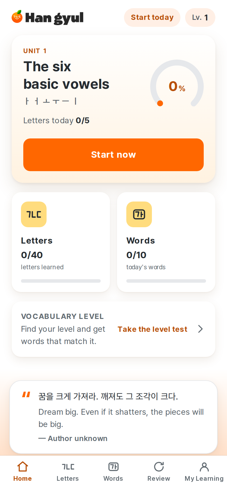
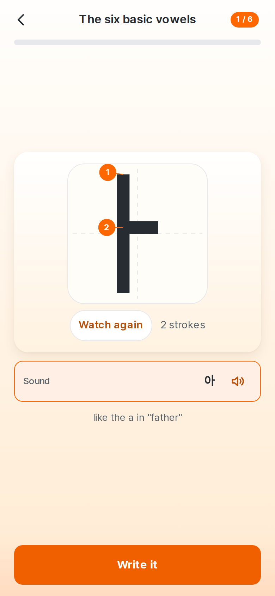
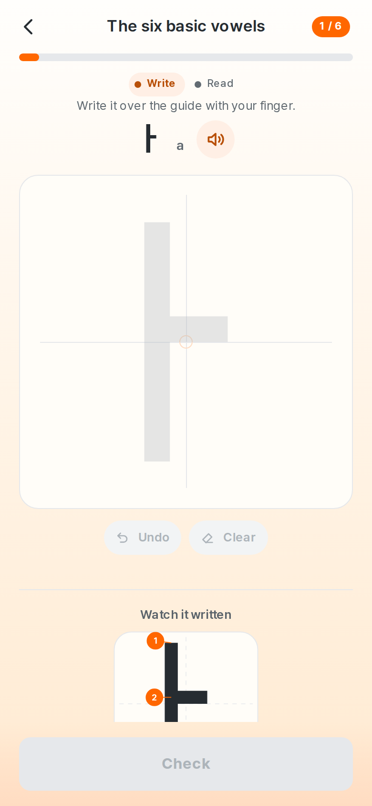
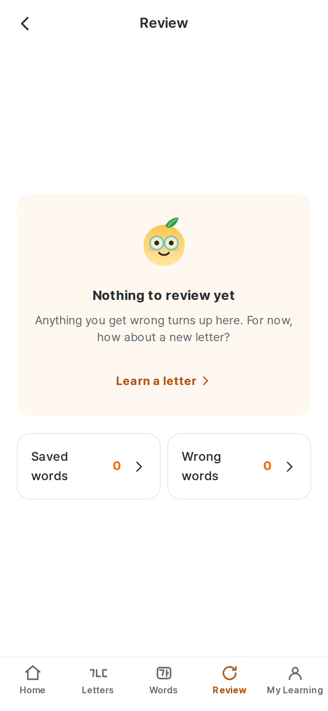
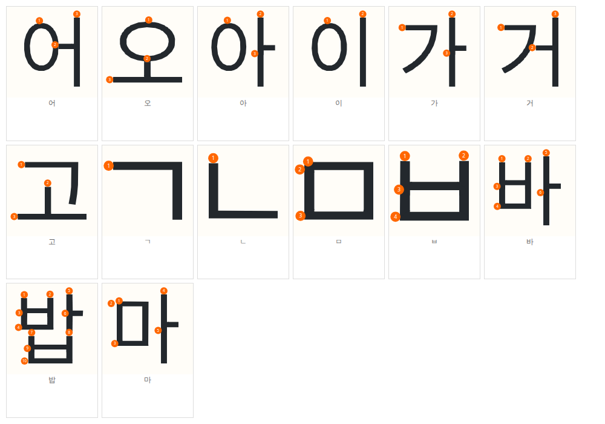
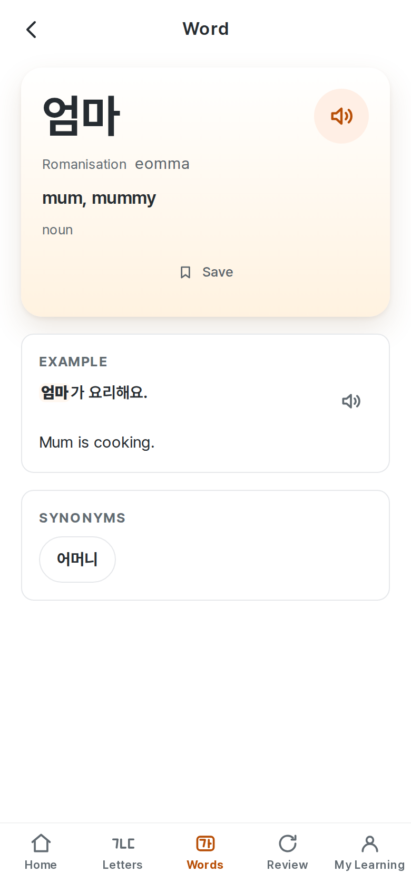
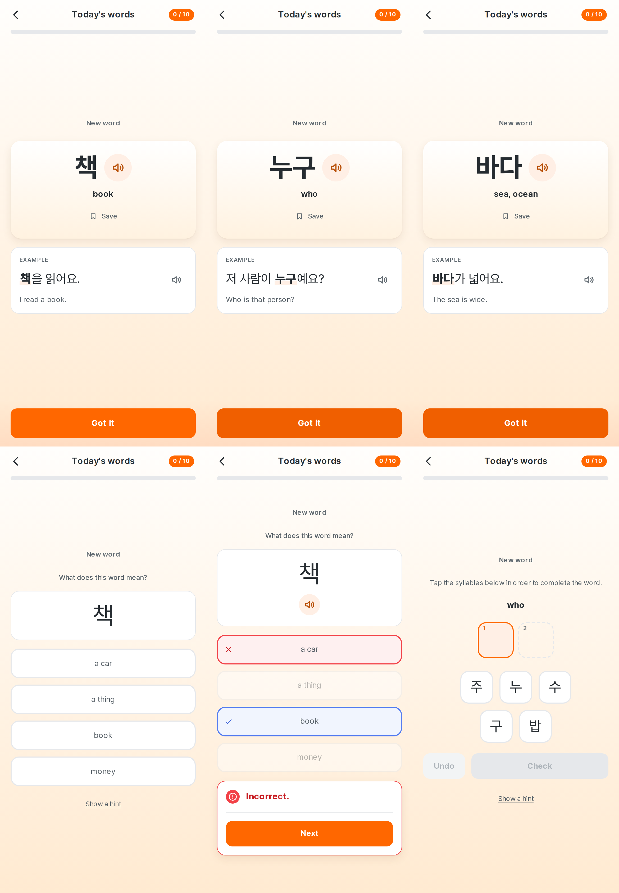
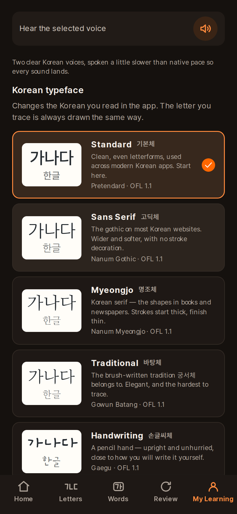

# 1. About this report

This is an **internal product truth document** — not marketing, not a changelog.
It is regenerated after each development cycle and handed to a reviewer, usually
another model, as the authoritative description of what Hangyul ganada
*currently is*.

It was written by re-auditing the running product and the current source, not by
editing the previous report. Where the code and older documents disagreed, the
code won and the disagreement is recorded.

## How to read the claims

Every substantive claim carries one of these labels. They are not decoration:
they are how a reader knows which sentences to trust without re-checking.

| Label | Means |
| --- | --- |
| **VERIFIED** | Confirmed by running the product, reading the code, or a script whose output is quoted here |
| **INFERRED** | Follows from the architecture but was not directly observed this cycle |
| **RECOMMENDED** | A product suggestion, not a statement of fact |
| **EXTERNAL** | From outside the repository; see §30 for the limits on this |

Feature status uses a second scale:

| Status | Means |
| --- | --- |
| **VERIFIED WORKING** | Does what it should, checked this cycle |
| **PARTIALLY WORKING** | Works for the common path; a real case is unhandled |
| **UX-PROBLEMATIC** | The code is correct and the customer experience is not |
| **BROKEN** | Does not work |
| **NOT IMPLEMENTED** | Does not exist |
| **NEEDS VERIFICATION** | Could not be settled from this machine |

## What this report will not do

It will not call something finished because a UI exists, a test passes, or a
previous document said so. §33 lists what is wrong, including work that was
reported fixed and is only partly fixed.

---

# 2. Audit metadata

| | |
| --- | --- |
| Report generated | 20 August 2026 |
| Product | Hangyul ganada (한귤 가나다) |
| Application version | 0.1.0 |
| Git branch | `main` |
| Git commit | `192bbcea763a46fa7ec6163b488124ac12a31f3c` |
| Working tree | Clean at `192bbce`; artefacts rebuilt — see §2.2 |
| Production URL | `https://ganada.talkhangyul.com` |
| Target platforms | Web (primary), Android (Capacitor), iOS (project only — no IPA) |
| Interface languages | 10 |
| Words shipping | 2,581 |
| Categories | 18 |
| Study sets | 524 (five words each) |
| Characters taught | 73 |
| Pronunciation notes | 503 |
| Audio clips | 10,454 |
| Architecture | Static React SPA, no backend, IndexedDB persistence, build-time content |

## 2.1 Package versions

| Package | Version |
| --- | --- |
| react / react-dom | ^19.0.0 |
| react-router-dom | ^7.1.5 |
| vite | ^7.3.6 |
| typescript | ^5.7.3 |
| i18next | ^25.10.10 |
| vitest | ^3.0.5 |
| @playwright/test | ^1.50.1 |
| @capacitor/core | ^8.5.0 |

## 2.2 Commit and artefact state — **VERIFIED**

This section carried a P0 in the last two reports: the work was in the working
tree and the shipped artefacts predated it. Both are now closed, and the order
they were closed in is the part worth recording.

```
aaf06bb  premium quality pass — hints, strokes, ten languages
deda959  wrong-answer notebook — show what the learner confused it with
1d6831a  rebuild the release from the committed tree, and verify the bytes
528d201  sound-free practice, one taught sense per word, a question that is not four boxes
2e879c5  finish Vietnamese and Thai, and fix what translating found
192bbce  write the "More about it" section instead of deriving it
40c5e6d  ship AndroidX strings for Vietnamese and Thai too
         ↓  commit first
         ↓  then mobile:sync + gradlew assembleRelease bundleRelease
         ↓  then unpack the delivered APK and grep it
result/hangyul-ganada-release.apk   built from 40c5e6d, verified to contain it
```

Building before committing produces a signed artefact that looks current and is
not, which is worse than a stale one because nothing about it says so.

The delivered APK was unpacked and its markers checked in both directions —
eight strings that must be in it, three that must not. The three that must not
are the derived dictionary fragments the old *More about it* block carried
("prophase", "phylum", "straw thatch"); all three are gone. Of the eight, three
are the newly written explanations in English, Thai and Vietnamese, two are
words past the old 500-word Vietnamese and Thai cut, two are pinned glosses, and
one is the corrected Korean hint template. All eight present. `build-info.json`
now also reports **ten** complete vocabulary locales, counted from the emitted
packs rather than read off a corpus field that names only the eight carried on
entries.

**The signing key was recovered rather than regenerated.** The keystore is not
in the repository and not in the environment; generating a new one would have
changed the app's identity permanently. It was located on the build machine and
its certificate compared against both the keystore *and* the superseded artefact
before anything was built — `157a2bb1…3323debc` in all three. A second keystore
on the same machine carries a different certificate and was not used. No key,
password or path value appears in the repository, in `result/`, or in any log
this build produced.

It installs, launches, stays resumed and never crashes on a wiped Android 16
emulator, and renders the home and Words screens correctly. It got no further:
the emulator's own system processes wedged twice — *System UI isn't responding*,
then *Process system isn't responding* — on a software renderer under load. Both
dialogs name Android, not this app, and the app's activity was still
`topResumedActivity` at the end of the session with zero `FATAL EXCEPTION` in
the logcat. So the device evidence this cycle is thinner than last cycle's and
says so; the new content is evidenced by the marker table (it is *in* the
package) and by the browser and end-to-end suites (it *renders*).

Nothing is uncommitted. The `gradlew.bat` line-ending difference that the last
two reports carried as the one remaining exception was swept into `40c5e6d`
along with the Gradle change beside it, so the working tree is clean at
`15ce55c`.

## 2.3 Figures for the next report to diff against

| Metric | Now | Last report |
| --- | --- | --- |
| Interface languages | 10 | 8 |
| Vocabulary headwords | 2,581 (target 10,000 — **7,419 short**) | 2,581 |
| Vocabulary meanings in every shipping language | **10 of 10 locales at 2,581** | 8 of 8 |
| Lesson titles translated | 10 of 10 locales | **2 of 8** — undetected |
| Letter copy translated | 10 of 10 locales | 8 of 8 |
| Verified synonym pairs | 71 | 72 |
| Verified antonym pairs | 65 | 64 |
| Words with any verified relation | 243 of 2,581 (9.4%) | 242 |

The three relation rows moved by one without anybody touching a relation.
Correcting 적다 from verb to adjective changed which sense `teaches_first_sense`
believes the corpus teaches, and relation scoping reads that — so one pair moved
from synonym to antonym and one more word gained a section. Recorded because a
±1 drift with no relation work in the cycle looks like noise and is not: it is
the sense fix propagating, which is the whole argument for pinning senses.
| Longer explanations (`definition`) | **25, written, in all 10 languages** | 784, derived, English only |
| Words whose taught sense is pinned by exact string | 11 | 0 |
| Web unit (`vitest`) | 589 | 550 |
| Handwriting core (`vitest`) | 95 | 95 |
| End-to-end (`playwright`) | 228 (114 × 2 projects) | 220 |
| Rendered stroke frames measured in pixels | 1,345 | **0** |
| Handwriting false-accept / false-reject | 0.21% / 0.78% | 0.21% / 0.78% |
| Word-corpus bundle | 169.1 kB gz of a 220 kB budget | 180.8 kB |
| Everything precached | 854 kB gz of a 900 kB budget | 802 kB of 800 kB |

---

# 3. Executive summary

**The two defects a learner could see most clearly are fixed, the product speaks
ten languages, and the release process is still a cycle behind the code.**

This cycle's brief was not "add features". It was: the hints give the answer
away, the strokes still look broken, and the vocabulary session feels like one
screen shown ten times. All three were true. All three were fixed at the level
they were actually wrong at, and all three now have a test that would have
caught them.

**What was wrong with the hints was not a bug, it was a line.** `hint: copy.value`
— the word's meaning — on six question types, including the one whose four
options *are* meanings. Pressing *Hint* on "what does 사과 mean?" printed
**apple**. The same line put the romanisation on the letter question whose
options are romanisations. It is now a three-rung ladder that never opens with
the answer, and `hints.test.ts` renders every rung of every question type in all
ten languages and looks for the answer inside it. That test immediately found a
second defect nobody had suspected: 배우다 is *học* in Vietnamese and its category
is *Học tập & Công việc*, so the category hint handed a Vietnamese learner the
answer while being perfectly safe in the other nine languages.

**What was wrong with the strokes was never the renderer.** `StrokeOrder`
masks each stroke's own outline, so painted ink is already a subset of that
stroke's geometry and no renderer change could have fixed anything. The defect
was in the *cut*: the authored skeletons in `data/strokes.ts` run a branch **to
the centreline** of the upright it meets — `ㅓ: [stroke([[20,50],[55,50]]),
vertical(55)]` — which is harmless for ㅏ, where the upright is written first,
and half a stem of overrun for ㅓ, where it is written second. Four previous
attempts targeted the renderer. §11 has the whole trace.

**What could not see any of it was the test suite**, which passed 73 items, 269
strokes and 1,345 frames through every broken round, because it validated path
data and never rasterised a pixel. There is now a second checker that renders
the frames and measures them, and it found and drove out a twelve-unit intrusion
in ㅎ, a detached chip beside ㅊ's bar, a route drawn through blank paper in ㅞ,
and a ㅊ authored as a vertical tick against a face that draws it horizontal.

**Ten interface languages, complete, and a gap that had been invisible for two
cycles.** Vietnamese and Thai now carry interface copy, the whole letter
curriculum, and a meaning and example translation for every one of the 2,581
words — no locale is partial any more. Adding them surfaced the more serious
finding: **lesson titles existed only in English and Korean**, so Japanese,
Chinese, Spanish, French, German and Portuguese learners have been reading
English headings in the largest type on the home screen since the curriculum
shipped — while `i18n:check` reported 100% coverage, correctly, about the files
it looks at. Lesson titles are not in those files.

**Translating is also the check nothing else was running.** Writing a meaning
from the example sentence forces a reading of the gloss against that sentence,
and eleven disagreed: 열 glossed "fever" above 열까지 세어 보세요, 전기 glossed
"first period" above 전기가 나갔어요, 마디 glossed "a joint" above 한 마디만
할게요. All eleven are now authored and pinned by exact string. No automated
check found any of them and none could have — what a machine can decide here is
narrow, two heuristics were built and both discarded, and §14.2 says exactly
where the line is.

Three things still stand between this and a paid release.

**1 · The corpus is a quarter of its stated size, and its delivery does not
scale.** 2,581 words against a 10,000 target, and the bundle forecast says the
current mechanism could not carry 10,000 anyway — 655.3 kB gz against a 220 kB
budget, **298%**. The precache budget was raised *twice this release* purely to
fit two more languages, which is the same architecture saying the same thing
from a second direction. The three possible remedies were costed against the
code this cycle and none was implemented; §13.4 says what each would cost and
why the gate at 4,000 headwords is the honest answer for now.

**2 · The dictionary is thinner than the screen implies — but no longer
unevenly.** 243 of 2,581 words have a verified synonym or antonym, which is a
source-coverage limit and not a defect. The *More about it* block went the other
way and is worth reading twice: it used to appear on 784 words in English only,
filled by the build with the dictionary's second and third senses — "phylum"
under 문, "graveyard" under 산, "prophase" under 전기. It now appears on 25 words
in all ten languages, and every word of it was written. **That row got smaller
and the product got better**, which is the shape of most of this cycle.

**3 · The shipped artefacts are no longer stale, for the first time in three
reports.** The cycle was committed and the Android artefacts rebuilt from that
commit — in that order, which is the part that kept going wrong. The delivered
APK was then unpacked and grepped for seven markers of this cycle's work, all
seven present, and installed and launched on an emulator. That closes the P0
that opened the last two reports.

Against that: nothing that was reported broken is still broken. The 마디
recording, open as a P3 for two cycles, is regenerated and checked on the device
by byte length. Learning data survives refresh and reopen. The storage warning cannot appear without a real
write/read failure. Dark-mode hover no longer paints white on white. A first
vocabulary session now asks three shapes of question in three layouts instead of
the same one ten times. A learner who finishes the alphabet is told where to go
next — as soon as somebody supplies the URL.

**Current sellability: *Barely ready* standalone; *Good* as a funnel product.**
Reasoning in §32.

---

# 4. Product definition

## 4.1 What it is — **VERIFIED**

A single-purpose application that takes someone who cannot read Hangul to the
point where they can read it, write it by hand, and know a few hundred words. It
is deliberately small: two learning tracks (letters, words), one review system,
one settings screen.

It runs as a web app at `ganada.talkhangyul.com` and as an Android app wrapping
the same build. No account, no server, no network requirement after first load.

## 4.2 The intended journey

```
interest in Korean
   → speaking/TOPIK feels too difficult
      → Hangyul ganada          ← this product
         → Hangul foundations
         → practical basic vocabulary
         → confidence
      → back to main Hangyul for speaking and TOPIK
```

## 4.3 Does the product support that positioning?

**Partly — and one link is missing entirely.**

| Stage | Supported? | Evidence |
| --- | --- | --- |
| Hangul foundations | **Yes** | 73 characters across 12 ordered lessons, demonstration, guided writing, recognition |
| Practical basic vocabulary | **Partly** | 2,581 words, 5–20 a day, quiz-first. Months of study; a quarter of the ambition |
| Confidence | **Yes, mechanically** | Daily goals, streak, activity calendar, a review system that does not pile up |
| Return to main Hangyul | **BUILT, NOT CONFIGURED** | The hand-off exists — a card at the end of the alphabet and a permanent row in My Learning — and renders nothing until a destination is set |

That last row changed this cycle, and it changed to *almost*.

The hand-off is built. When the learner finishes all forty letters, the letters
screen shows a quiet card under the alphabet: *"You can read Hangul now.
Speaking and TOPIK practice continue in Hangyul."* A permanent row sits in My
Learning under the learner's own activity, shaped like every other row and given
none of the emphasis. Neither interrupts a lesson; neither repeats; neither has
a dismiss button, because there is nothing to dismiss.

**It renders nothing at all, because nobody has supplied the URL.** The
destination is not in this repository and cannot be guessed, so `HANGYUL_URL` is
read from `VITE_HANGYUL_URL` at build time and every piece of the hand-off is
absent when it is unset — which is the state of a plain checkout. Shipping a
card that leads nowhere would be worse than the dead end it was built to fix.

Setting one environment variable turns it on. Until somebody does, **the product
is still described as a funnel and still contains no funnel**, and this stays on
the P1 list.

---

# 5. Current product decisions, audited

Each decision is stated as intended, then checked against the implementation.
This is the fastest way to see what must not be accidentally reversed.

| # | Decision | Current implementation | Status |
| --- | --- | --- | --- |
| 1 | No mandatory login | No auth code anywhere; no server | **VERIFIED WORKING** |
| 2 | Device-local persistence | IndexedDB via a driver seam; SQLite on native | **VERIFIED WORKING** |
| 3 | Hangul foundation learning | 12 lessons, 73 items | **VERIFIED WORKING** |
| 4 | Handwriting only where it teaches | Letters and syllables only | **VERIFIED WORKING** |
| 5 | Vocabulary never handwritten | No canvas reachable from any word screen; e2e asserts it | **VERIFIED WORKING** |
| 6 | Vocabulary is quiz-first | Meet → choose → recognise; six step types | **VERIFIED WORKING** |
| 7 | Vocabulary daily goals | 5 / 10 / 15 / 20, persisted | **VERIFIED WORKING** |
| 8 | 10,000-word corpus as depth | 2,581 shipping | **PARTIALLY WORKING** |
| 9 | Never expose the corpus as one list | The day's plan is the entry point | **VERIFIED WORKING** |
| 10 | Categories/search secondary | Both below the day card on `/words` | **VERIFIED WORKING** |
| 11 | No vocabulary images | e2e asserts zero `` on word screens | **VERIFIED WORKING** |
| 12 | Rich Word Detail | Headword, IPA, audio, POS, gloss, example, Save, relations | **PARTIALLY WORKING** (§15) |
| 13 | Pronunciation notation | IPA on every word | **VERIFIED WORKING** |
| 14 | Pronunciation audio | 10,454 clips, two voices | **VERIFIED WORKING** |
| 15 | Example sentences | 2,581 of 2,581 | **VERIFIED WORKING** |
| 16 | Saved Words | Toggle on card and detail; own screen | **VERIFIED WORKING** |
| 17 | Wrong Answer Notebook | One row per item; retires after 2 correct | **VERIFIED WORKING** |
| 18 | Memory-based Review | Per-item, per-skill recall model | **VERIFIED WORKING** |
| 19 | Sentences are context, not SRS items | No sentence is a memory key | **VERIFIED WORKING** (§21.6) |
| 20 | Multiple quiz formats | 6 vocabulary steps, 7 review modes | **VERIFIED WORKING** |
| 21 | Listening autoplay | Once per arrival at an item | **VERIFIED WORKING** |
| 22 | Daily goal completion state | Completion card with a mascot | **VERIFIED WORKING** |
| 23 | Optional extra learning | 5 / 10 / 20 more, appended to the day | **VERIFIED WORKING** |
| 24 | Progress above 100% | 12/10 reads 120%; the bar caps at full | **VERIFIED WORKING** |
| 25 | Language first in settings | First card under the stats on `/me` | **VERIFIED WORKING** |
| 26 | Device-language detection | Navigator languages → fallback chain | **VERIFIED WORKING** |
| 27 | Dark Mode | System / light / dark, semantic tokens | **VERIFIED WORKING** |
| 28 | Simplified Hangul learning | Intro reduced to demo + sound + one line | **VERIFIED WORKING** |
| 29 | Automatic stroke animation | Plays once on arrival, rests on the finished glyph | **VERIFIED WORKING** |
| 30 | One guided writing attempt | Write, then a recognition check | **VERIFIED WORKING** |
| 31 | No second faded-guide stage | Removed; e2e asserts the step list | **VERIFIED WORKING** |
| 32 | Tolerant of beginner writing | 0.78% false reject, measured | **VERIFIED WORKING** |
| 33 | Scribbles must fail | 0.21% false accept, measured | **VERIFIED WORKING** |
| 34 | Clean canonical stroke animation | Rebuilt this cycle | **VERIFIED WORKING** (uncommitted) |
| 35 | SPA routes survive refresh | Hosting rules + a service-worker guard | **VERIFIED WORKING** |
| 36 | Progress survives refresh/reopen | 6 end-to-end cases | **VERIFIED WORKING** |

Two decisions are enforced by test rather than by convention, which is worth
knowing before touching them:

**Decision 5** — `journey.spec.ts` asserts no `writing-canvas` element exists
anywhere in a word session. Adding word handwriting will fail CI, by design.

**Decision 19** — memory keys are `${kind}:${itemKey}` with kind ∈ {`character`,
`word`}. There is no sentence key, so a sentence cannot become an SRS item by
accident.

---

# 6. Target customer and job to be done

## 6.1 The person — **RECOMMENDED framing**

A complete beginner who knows little or no Hangul and may not read English well
either; is learning casually, quite possibly lying down, on a phone; has low
commitment in week one and will quit anything that feels like homework; finds
handwriting on glass tiring if asked for too much of it; and wants visible
progress fast enough to come back tomorrow.

## 6.2 The job

> *Help me start Korean easily enough that I don't give up before I can use a
> speaking-focused product.*

## 6.3 Does the product do the job?

| Requirement | Current product | Verdict |
| --- | --- | --- |
| Start in seconds, no account | Opens into Unit 1 with a Start button | **Yes** |
| Readable without English | 10 languages, device-detected, language is the first settings row | **Yes** |
| Short sessions | Letter lesson ≈ 6 items; vocabulary default 10 words | **Yes** |
| Not tiring | One guided write per letter, none per word | **Yes** |
| Visible progress | Letters *n*/40, words learned, streak, calendar, daily ring | **Yes** |
| Comes back tomorrow | Daily goal resets; totals do not | **Yes** |
| Hands off to the next product | — | **No** (§4.3) |

**The job is done except for its last clause** — the clause that justifies this
product existing alongside another one.

---

# 7. Technical architecture

**VERIFIED** by inspecting `apps/`, `packages/`, `vercel.json`, and the absence
of any server directory.

```
                      ┌──────────────────────────────────────────┐
                      │  BUILD TIME (never runs on a device)     │
   Wiktionary  ──┐    │                                          │
   OpenSubtitles ├───▶│  scripts/content/*.py    vocabulary      │
   editorial pack┘    │  scripts/*.mjs           strokes         │
   Azure TTS     ────▶│                          audio, curriculum│
                      └───────────────┬──────────────────────────┘
                                      │ generated JSON + mp3
                                      ▼
   ┌────────────────────────────────────────────────────────────────┐
   │  apps/web  —  React 19 + Vite + TypeScript, one static bundle  │
   │                                                                │
   │   pages/      routes             features/  session flows      │
   │   domain/     memory · review · plan · mastery · activity      │
   │   data/       generated corpus · strokes · fonts               │
   │   storage/    driver seam ▸ IndexedDB | SQLite | Memory        │
   │   i18n/       8 locales (i18next)                              │
   │   ui/ + design-tokens   themed components                      │
   └───────────────┬──────────────────────────────┬────────────────┘
                   │                              │
        ┌──────────▼──────────┐       ┌───────────▼────────────┐
        │  Web                │       │  Android (Capacitor 8) │
        │  static host +      │       │  same bundle +         │
        │  service worker     │       │  SQLite, haptics,      │
        │  IndexedDB          │       │  notifications         │
        └─────────────────────┘       └────────────────────────┘

   NO BACKEND. No API, no database, no session, no telemetry.
   The only runtime fetch() in the whole app loads an audio file.
```

**There is no FastAPI service and no backend of any kind.** The brief for this
audit assumed one; the repository does not contain one. `vercel.json` reserves
`/api/*` out of the SPA fallback so a backend *could* be added later without
being shadowed, and `docs/DEPLOYMENT.md` states plainly that there is no server
component. **VERIFIED**: grepping `fetch(`, `XMLHttpRequest`, `axios` and
`WebSocket` across `apps/web/src` returns exactly one hit —
`PronunciationPlayer.ts`, loading an mp3.

## 7.1 Why this matters to the product

Every learner-facing consequence follows from one choice: **the learner's data
never leaves the device.** That gives the product its best properties — works
offline, no signup, nothing to breach, no running cost — and its worst risk
(§24.5: one copy, no export, no recovery).

---

# 8. Information architecture

## 8.1 Sitemap

```
/                        Home — today's unit, two counters, review nudge, quote
│
├── /letters             Learn letters — 12 lessons, alphabet progress
│   ├── /letters/:lessonId       Letter session (intro → write → read)
│   └── /letters/sounds          When sounds meet — 6 sound-change patterns
│
├── /words               Learn words — today's card, saved link, categories, search
│   ├── /words/today             Vocabulary session (the day's plan)
│   ├── /words/category/:id      One category's word list
│   ├── /words/word/:wordId      Word Detail
│   └── /words/saved             Saved words (search, order, review)
│
├── /review              Review — resolved plan count, modes, two counters
│   ├── /review/session          Review session
│   └── /review/mistakes         Missed answers (wrong-answer notebook)
│
├── /me                  My Learning — stats, language, goals, voice, typeface…
│   ├── /me/activity             Learning activity — calendar, streak, insights
│   ├── /me/language             Choose a language (8, native names, search)
│   ├── /me/privacy              Privacy
│   └── /me/legal                Legal & Licences
│
└── /dev/stroke-gallery  Development only — not in production navigation
```

**VERIFIED**: all 14 customer-facing routes were opened this cycle and rendered
with **no console or page errors**.

## 8.2 Screen by screen

| Route | Purpose | Primary action | Persists | Status |
| --- | --- | --- | --- | --- |
| `/` | Answer "what do I do now" | **Start now** | reads only | **VERIFIED WORKING** |
| `/letters` | The alphabet as 12 lessons | open a lesson | reads only | **VERIFIED WORKING** |
| `/letters/:lessonId` | Teach one letter | Write it → Check | progress, memory, attempts, mistakes, activity, session | **VERIFIED WORKING** |
| `/letters/sounds` | The 6 sound changes | read | — | **VERIFIED WORKING** |
| `/words` | The day + discovery | **Start / Keep going** | settings (goal, plan) | **VERIFIED WORKING** |
| `/words/today` | Run the day's plan | answer | plan, progress, memory, mistakes | **VERIFIED WORKING** |
| `/words/category/:id` | Browse one shelf | tap a word | saved | **VERIFIED WORKING** |
| `/words/word/:wordId` | The dictionary entry | listen / Save | saved | **VERIFIED WORKING** (§15) |
| `/words/saved` | The learner's own list | search, open, review | saved | **VERIFIED WORKING** |
| `/review` | What needs practice | Start, or pick a mode | reads a resolved plan | **VERIFIED WORKING** |
| `/review/session` | Run the plan | answer | memory, mistakes, attempts | **VERIFIED WORKING** |
| `/review/mistakes` | What went wrong | retry | mistakes | **VERIFIED WORKING** |
| `/me` | Record + every setting | change a setting | settings | **VERIFIED WORKING** |
| `/me/activity` | Streak, calendar, insights | read | reads only | **VERIFIED WORKING** |
| `/me/language` | Change interface language | pick | localStorage | **VERIFIED WORKING** |
| `/me/privacy`, `/me/legal` | Required notices | read | — | **VERIFIED WORKING** |



*Figure 1 — Home. One unit, one button, two counters, and a review row that
disappears when there is nothing to review.*

---

# 9. User flows

Each flow was walked this cycle unless marked otherwise.

## 9.1 First launch — **VERIFIED**

Open → Home renders immediately with Unit 1 ("Six vowels to start"), `0 days`
streak, `Letters 0/40`, `Words 0/10` and **Start now**. No account wall, no
onboarding carousel, no permission prompts. The interface is already in the
device's language if it is one of the eight.

**Friction: LOW.** The one thing missing is any statement of what the product is
*for* — a first-time visitor sees a lesson, not a proposition.

## 9.2 Change language — **VERIFIED**

`/me` → **Language** is the first row after the stats → `/me/language` → eight
languages in their own names with a search box → tap → the interface changes
immediately and the choice is written to `localStorage`.

**Friction: LOW.** This is the flow a non-English reader needs most, and it is
placed correctly.

## 9.3 Learn a first Hangul character — **VERIFIED**

`/letters/lesson-vowels-core` → a one-card unit explainer → **Got it** → the
letter screen.



*Figure 2 — The letter introduction after this cycle's simplification. The
demonstration is the only glyph on the screen and starts on arrival; the still
picture that used to sit above it is gone.*

The demonstration begins automatically and settles on the finished character.
The letter says itself once. Below: the letter's name, its sound with an example
syllable, and one line about that sound. Primary action: **Write it**.

**Friction: LOW.** This screen was three times longer two cycles ago.

## 9.4 Write a character — **VERIFIED**

**Write it** → a large box with a grey reference glyph and crosshair guides →
trace with a finger → **Undo** / **Clear** → **Check**. Below the fold, a *Watch
it written* helper replays the demonstration.



*Figure 3 — The writing step. The demonstration sits under the canvas so the pen
is above the fold on a small phone.*

Passing advances to a recognition check ("Now read it") — pick the letter out of
look-alikes — then the next letter.

**Friction: LOW–MEDIUM.** One guided write per letter is the right amount. The
remaining friction is inherent: writing on glass.

## 9.5 Start today's vocabulary — **VERIFIED**

`/words` → the day card shows `0/10` and **Start** → `/words/today`. The first
screen is a *meeting card*: the word, its sound (played automatically), its
meaning and the sentence it lives in, with **Save**. **Got it** moves on. Words
interleave — you meet two or three before being asked about the first.

## 9.6 Complete a vocabulary item — **VERIFIED**

A word is complete for the day when every step the plan scheduled for it is
done. The counter moves by **one word**, never by one question, and a repeat is
ignored.

## 9.7 Reach the goal, then study more — **VERIFIED in the browser this cycle**

10 of 10 → the card switches to a completion state with a mascot and **A little
more** → tapping offers **5 more / 10 more / 20 more** → the chosen number is
*appended* to the day, `completed` is untouched, and the goal does not move.
Twelve of a goal of ten reads **12/10, 120%**, and the progress ring stays full
rather than overflowing.

## 9.8 Save a word and find it again — **VERIFIED**

Save is on the meeting card and on Word Detail. `/words/saved` lists them newest
first with search, three orderings, and a **Review** link that builds a plan from
saved words only.

## 9.9 Answer wrongly — **VERIFIED**

A wrong answer writes a row to the `mistakes` store keyed by the *item*, not the
attempt. `/review/mistakes` shows what was asked, what was chosen and what was
right. Two correct answers retire the row from the active list without deleting
the history.

## 9.10 Review — **VERIFIED**

`/review` shows a number that comes from a *resolved plan* — the same object the
session iterates — plus per-mode counts, each disabled when its plan is empty.



*Figure 4 — Review on a fresh profile. The empty state routes the learner to a
new letter instead of showing an empty list.*

## 9.11 Resume, refresh, reopen — **VERIFIED**

Leaving mid-session and returning resumes the same day's plan with the same
remaining words. Refreshing any nested route reloads the app at that route with
the profile intact. Closing the tab and reopening does the same. Six end-to-end
cases cover this; §24 has the detail.

---

# 10. Hangul learning system

## 10.1 Curriculum shape — **VERIFIED**

73 taught items across 12 lessons, in a deliberate order:

| Unit | Lesson | Teaches |
| --- | --- | --- |
| 1 | Six vowels to start | ㅏ ㅓ ㅗ ㅜ ㅡ ㅣ |
| 2 | Your first consonants | ㄱ ㄴ ㄷ ㄹ ㅁ |
| 3 | Syllables — 가 | consonant + vowel, side by side |
| 3 | The vowel moves | consonant + vowel, stacked |
| 4 | More consonants | ㅂ ㅅ ㅇ ㅈ ㅎ |
| 5 | More syllables / silent ㅇ | blocks, and ㅇ's two jobs |
| 6 | Y vowels | ㅑ ㅕ ㅛ ㅠ |
| 7 | Aspirated consonants | ㅊ ㅋ ㅌ ㅍ |
| 8 | E vowels | ㅐ ㅔ ㅒ ㅖ |
| 9 | Tense consonants | ㄲ ㄸ ㅃ ㅆ ㅉ |
| 10 | W vowels | ㅘ ㅝ ㅚ ㅟ ㅢ … |

Syllables are taught as a *third thing*, after their parts — which is the
pedagogically correct order, and why the curriculum is 73 items rather than 40.

## 10.2 The mastery ladder — **VERIFIED**

`unseen → introduced → practised → learned`. What "learned" requires depends on
the kind:

| | Letter / syllable | Word |
| --- | --- | --- |
| Demonstration watched | required | not applicable |
| Written over a guide | required | **never** |
| Recognised among look-alikes | required | required |
| Heard | recorded, **not required** | recorded, **not required** |

**The `heard` rung was removed as a requirement this cycle**, and the reason
belongs in the record: it was set from an autoplayed clip, and desktop browsers
block autoplay until the page has been interacted with. The rung was therefore
not "has the learner heard this" but "did this browser allow sound", and a
learner whose browser never allowed it could never complete anything — silently.
Hearing is still recorded and still feeds the scheduler.

## 10.3 Progress and daily goals — **VERIFIED**

* Letters: `n / 40` — the forty letters, not the 73 items, because 40 is a
  number a beginner can hold in their head.
* Daily letter goal: 3 / 5 / 10 / 15 / 20, default 5.
* Daily word goal: 5 / 10 / 15 / 20, default 10.

## 10.4 Audio in the lesson — **VERIFIED WORKING**

`useEntryAudio` plays one clip per *arrival at an item*, guarded by a ref so a
re-render, a locale change or returning from the background cannot make it speak
twice. Leaving stops playback so a clip cannot follow the learner onward.

---

# 11. Stroke renderer

Reported broken more often than anything else in the product, and reported
broken again this cycle after the last report called it fixed. That is the most
useful fact in this section, so it goes first: **the last report was wrong, and
it was wrong in a way its own evidence could not have caught.**

## 11.1 Verdict

**RELEASE QUALITY, with a measured residual.** In the uncommitted working tree —
not at commit `8a06c11`, and not in the packaged Android artefacts. The residual
is eighteen sub-visible intrusions, listed in full in §11.6 rather than rounded
off.

## 11.2 The thing four fixes got wrong

`StrokeOrder.tsx` paints the active stroke like this:

```jsx
<path d={active.shape} mask={`url(#${maskId})`} />
```

The ink is `active.shape` **intersected with** a reveal ribbon. It is therefore
always a subset of that stroke's own asset geometry, and it has been for four
rounds of fixes. **No change to the renderer could ever have stopped a stroke
bleeding into the next one**, because the renderer cannot paint outside the
shape it is given. Every previous attempt was aimed at the wrong file.

The defect was in the shape. Which means it was in the **cut** — how the glyph
is divided between the strokes — and, one level further back, in the authored
skeletons the cut is guided by:

```ts
ㅏ: [vertical(45), stroke([[45, 50], [80, 50]])],   // upright first
ㅓ: [stroke([[20, 50], [55, 50]]), vertical(55)],   // branch first
                          ▲                  ▲
                          └── the branch is authored as running ──┘
                              to the stem's own centreline
```

For ㅏ that is harmless: the upright is written first, so by the time the branch
runs into it the ink is already black. For ㅓ the order is reversed and the same
line says "draw the connector half a stem *into* a stem that does not exist
yet". Everything downstream inherits it — the claim follows the route, the
re-read centreline follows the claim, and by the second pass the intrusion is no
longer past the end of the route, so the existing safeguard could not see it.
The same authored pattern is in ㅗ, ㅕ, ㅔ, ㅖ and every syllable built from them.

## 11.3 Architecture — **VERIFIED**

One geometry source, built rather than composed at runtime.

```
Pretendard glyph  ──rasterise──▶  ink mask
                                     │
  data/strokes.ts polylines  ──────▶ │ claim ink per stroke (3 passes)
  (order + direction only)           │ ├ routes trimmed out of later strokes ← new
                                     │ ├ adaptive per-stroke reach, capped at the pen
                                     │ ├ centreline re-read from the ink each pass
                                     │ └ cap ink handed to the later stroke
                                     │
                                     │ settle route ⇄ ink, twice          ← new
                                     │ hand back stray chips              ← new
                                     │ keep the pen on its own ink        ← new
                                     ▼
                            trace + simplify per stroke
                                     ▼
              apps/web/src/data/generated/strokeAssets.json
                 73 items · 269 strokes · shape + draw route + start
                                     ▼
     ┌───────────────────────────────┴────────────────────────────────┐
     │ ui/StrokeOrder.tsx — one <svg viewBox="0 0 100 100">            │
     │   grey ghost  = every stroke's shape                            │
     │   black ink   = completed strokes' shapes                       │
     │   active      = this stroke's shape, through a mask             │
     │   mask        = a ribbon swept along this stroke's own route    │
     │   markers     = ui/strokeMarkers.ts, same viewBox               │
     └─────────────────────────────────────────────────────────────────┘
```

`union(stroke shapes) === the reference glyph` still holds by construction — the
build reports 100.00% coverage for every item — so the final frame cannot drift
from the glyph the learner copies.

## 11.4 The invariant, stated precisely

Two obvious formulations are both wrong, and knowing why is what made the fix
possible:

* **"Strokes must not overlap"** can never fire. They are cut disjoint from one
  glyph; the check would pass on the broken build.
* **"Stroke *i* must not enter stroke *j*'s body"** fires constantly on things
  that are correct. ㅏ is an upright written first and a crossbar attached to
  its middle written second, so the upright inevitably occupies ink beside the
  crossbar's route. Nothing looks wrong, because the crossbar's own region
  starts to the right of the upright and stays grey.

What separates them is **where on stroke *i* the contact happens**:

```
  ㅏ  upright (1) ─┬─ crossbar (2)     beside route 1's middle
                   │                     → 1 is passed by 2. Fine.

  ㅓ  connector (1) ──┤ upright (2)     past the end of route 1
                                          → 1 runs into 2. The defect.
```

So:

> **ink(stroke *i*) that lies past the end of route *i* ∩ body(stroke *j*) = ∅,
> for every *j* > *i*.**

"Body" is the route stroked with **butt** caps — square at the last point, no
bulge beyond it — so two strokes meeting end-to-end at a corner are not an
intrusion, which is right.

## 11.5 What the pixel QA found — **VERIFIED**

`npm run strokes:visual` rasterises every frame and measures it. Run against the
build the last report called release-quality:

| Character | What it did | Size |
| --- | --- | --- |
| 어, and the whole ㅓ family | connector reaching into the stem | 4.4 units, half the stem |
| 하 · 한 | the bar of ㅎ growing a blob into the still-grey ring | 323 and 563 px |
| ㅈ · ㅉ · 자 | a lump on the leg that is drawn first, in the leg drawn second | 113–216 px |
| ㅎ · ㅊ · ㅍ | detached chips floating beside the stroke, appearing from nowhere | 74–171 px |
| ㅞ | stroke 3's route drawn through blank paper while its ink sat elsewhere | 29 samples off-ink |
| ㅊ | tick authored as a vertical against a face that draws it horizontal | pen travelled 12 units through nothing |

Every one of them was invisible to `strokes:qa`, which validated the same 1,345
frames and reported no problems, because it was reading path data. The gap
between "the data is well formed" and "the picture is right" is this whole
section.

Four generator changes closed them, each general rather than per-character:

1. **Routes are trimmed out of later strokes.** A route may end *at* a stroke
   that comes later, never inside one. Trimmed from the two tips inward and
   nowhere else — which is the safety property: where a later stroke lands in
   the middle of an earlier one, the earlier route's tips are far away and
   nothing moves, so no hole opens in ㅏ's upright.
2. **Route and ink are settled against each other.** The shipped route is
   re-read from the regions and then trimmed, so it is shorter than the working
   route the claim used — and "past the end of my own route" is measured against
   the end of *a* route. The first version of the fix asked about a route the
   learner never sees and changed almost nothing.
3. **Stray chips are handed to the ink they touch.** A sliver cut off behind a
   neighbour has no attachment, so it appears out of nowhere the instant its
   stroke starts. Given to whichever region it shares the most edge with — and a
   near-tie goes to the *later* stroke, because a chip under ink that is about
   to arrive is invisible and a chip on blank paper is the artefact.
4. **The pen is kept on its own ink**, including through corners, which are
   between the route's vertices rather than at them: ㄱ's turn had both ends on
   ink and the straight line between them cutting the corner.

Two authored skeletons were also corrected against the reference face — ㅊ's
tick, and ㅞ's connector, which sits a stroke's width lower than it was written.
Those are data corrections, not renderer hacks: the polylines are matched
against the glyph, and one that disagrees with the glyph is wrong.


*Figure 5 — 어 at 35%, 70% and 100% of each stroke, with unwritten strokes in
grey. Stroke 2 stops at the stem instead of painting a block of stroke 3.*



*Figure 6 — Markers after the anchor fix. Each disc touches the tip of its own
stroke rather than hovering near it.*

## 11.6 Residual — the honest list

The check draws two lines rather than one, because a boundary between two
regions traced and simplified independently leaves a rim of a pixel or two that
is real, invisible, and would get the check switched off if it failed on it.

**Above the failure line: nothing.** Zero intrusions over 100 px or deeper than
4 units, zero fragmented strokes, zero routes off their own ink.

**Below it, and not rounded away — eighteen, in fourteen characters:**

| Character | Depth | Size |
| --- | --- | --- |
| ㅈ stroke 2 → 3 | 3.14 units | 68 px |
| 국 stroke 3 → 4 | 1.59 units | 76 px |
| ㅉ stroke 5 → 6 | 1.75 units | 57 px |
| ㅉ stroke 2 → 3 | 2.53 units | 36 px |
| 자 stroke 2 → 3 | 2.53 units | 25 px |
| ㅙ stroke 1 → 2 | 1.14 units | 20 px |
| 가 나 다 라 마 바 사 아 산 자 꽃 ㅒ | 1.2–2.6 units | 1–8 px each |

The largest is ㅈ, where both legs start from the same point under the lid and
the leg drawn first keeps a nub of about ten square units of the leg drawn
second. It is visible if you look for it. It is not what the complaint was
about, and calling it zero would be the kind of claim that made the last report
wrong.

## 11.7 The gallery

`npm run strokes:visual` also writes `.stroke-qa/visual.html` — all 73 items,
each stroke alone, five moments of each being drawn, one colour per stroke.
Scanning the colour column makes an intrusion obvious at a glance in a way no
table does, and every item in the curriculum was scanned that way this cycle.
Machine checks decide what to look at first; they do not decide whether it looks
right.

---

# 12. Handwriting recognition

## 12.1 How it works — **VERIFIED**

The learner's ink and the reference glyph are rasterised to a 128×128 mask and
compared. Two error terms are measured separately and **added**:

* `outsideStrokeRatio` — of the ink laid down, how much is not part of the glyph.
  Catches scribbles, wrong shapes, oversized writing, writing in the wrong place.
* `missingCoverageRatio` — of the glyph, how much was never written. Catches
  half-finished characters and missing strokes.

Errors are **graded, not binary**: a pixel within 4% of the resolution costs
nothing, then ramps to full cost over 1.5× that distance. A hard in-band test
makes every attempt inside the band score identically, destroying the signal.

A **contiguous unwritten blob** is weighted 2.5×. Mean coverage alone dilutes a
missing stroke: dropping the branch of ㅏ in 가 is 4% of the glyph and the
difference between 가 and 기, and it used to score as a rounding error.

Nothing re-centres or re-scales the learner's ink — placement in the box is part
of the task.

| Constant | Value | Meaning |
| --- | --- | --- |
| `MAX_MISMATCH_RATIO` | 0.10 | pass threshold |
| `GLYPH_TOLERANCE_RATIO` | 0.04 | free distance |
| `TOLERANCE_FALLOFF_MULTIPLIER` | 1.5 | ramp width |
| `STRUCTURAL_GAP_WEIGHT` | 2.5 | missing-blob penalty |
| `MIN_INK_RATIO` | 0.08 | too little ink to judge |
| `MAX_PATH_LENGTH_RATIO` | 2.5 | path far longer than the glyph ⇒ scribble |
| `MAX_REVERSAL_DENSITY` | 6 | direction changes per unit ⇒ scribble |

## 12.2 Is the balance right? — **VERIFIED, measured**

`npm run handwriting:robustness` replays fixture strokes across all six shipping
typefaces:

| Typeface | False accept | False reject |
| --- | --- | --- |
| nanum-gothic | 0.00% | 0.28% |
| nanum-myeongjo | 0.00% | 1.38% |
| gowun-batang | 0.00% | 0.55% |
| gaegu | 0.21% | 1.10% |
| gowun-dodum | 0.00% | 0.83% |
| **overall** | **0.21%** | **0.78%** |

The confusions are ones a human makes too: ㅈ←ㅊ, ㅐ←ㅒ, ㅂ←ㅍ — pairs differing
by one short stroke.

**Assessment: the balance is correct and slightly generous, which is the right
direction for a beginner product.** The earlier complaints — tiring repetition,
scribbles passing — are not reproducible against the current constants. 95
handwriting-core tests pass.

## 12.3 The limitation this does not solve — **VERIFIED**

The evaluator compares *ink*, not *strokes in order*. A learner who draws the
right shape in the wrong order passes. Stroke order is taught by the
demonstration and commented on afterwards in the notes, but it is not graded.
**Deliberate, not a gap** — grading order would fail beginners for something the
demonstration has only just shown them.

---

# 13. Vocabulary data

## 13.1 Scale — **VERIFIED**

| | |
| --- | --- |
| Headwords shipping | 2,581 |
| Target | 10,000 |
| Gap | **7,419** |
| Categories | 18 |
| Study sets | 524 |
| Removed during curation | 328, each with a recorded reason |

Part of speech: 1,023 verbs, 996 nouns, 283 adjectives, 208 adverbs, 27
pronouns, 21 interjections, 13 determiners, 10 numerals.

## 13.2 Sources — **VERIFIED**

| Field | Source | Licence |
| --- | --- | --- |
| Part of speech, topic categories | English Wiktionary | CC BY-SA 4.0 |
| Synonyms (유의어), antonyms (반의어) | Korean Wiktionary | CC BY-SA 4.0 |
| Frequency band, rank, rate | OpenSubtitles Korean corpora | MIT / CC BY-SA |
| Meanings, examples, translations | Hangyul ganada editorial pack | ours |
| Pronunciation, syllables, difficulty, readiness | computed | ours |
| Audio | Azure Neural TTS, two Korean voices | vendor terms |

Every word carries a `sources` array naming which source supplied which field.
Licences requiring attribution are shown in-app under **Legal & Licences**.

## 13.3 Field coverage — **VERIFIED**

| Field | Coverage |
| --- | --- |
| Headword, IPA, part of speech, category | 2,581 / 2,581 |
| Example sentence | 2,581 / 2,581 |
| Word audio, example audio | 2,581 / 2,581 |
| Pronunciation note (spoken ≠ written) | 503 |
| Meaning, each of 8 original languages | 2,581 |
| Meaning, Vietnamese and Thai | **2,581 each** — see §23.4 |
| Example translation | 2,581 in 9 languages (Korean has none — the example *is* Korean) |
| **Longer explanation (`definition`)** | **25, in all 10 languages** — see §15 |
| Verified synonym or antonym | **243** |

Two of these rows moved this cycle and they moved in opposite directions, which
is the point.

Vietnamese and Thai went from 500 words to all 2,581, so no locale is partial
any more. The longer explanation went from 784 to 25 — *down* — because the 784
were derived from a dictionary and were not worth reading. §15 has what they
said. What replaced them is written, and written only where a one-line gloss
genuinely misleads.

The relations row is the remaining content gap and it is not a schema gap: the
field exists, the sources are conservative, and 243 of 2,581 is what two
licensed sources actually state.

## 13.4 The 10,000-word strategy — **PARTIALLY WORKING**

The intent is a corpus deep enough that the app never runs out, surfaced a
handful of words a day rather than as a list. **The surfacing is built and
works. The corpus is at 26% of target.**

**And the delivery path for the rest is unsolved.** `npm run bundle:budget`
forecasts the corpus at 10,000 headwords as **655.3 kB gzipped against a 220 kB
budget — 298%**. The forecast is printed but *not enforced*. Today's corpus is
169.1 kB gz and still ships in the **first load**. Growing it without splitting
would roughly quadruple the initial download.

**RECOMMENDED:** decide the delivery mechanism — per-category chunks, or an
on-demand fetch with an offline-first cache — *before* authoring more words,
because the choice changes the data shape.

### Why it was not done this cycle, stated rather than implied

It was looked at properly and left alone, and the reasoning belongs in the
report rather than in a commit nobody reads.

The three remedies the budget script names were each costed against the code:

* **Drop the corpus out of the eager module graph.** `LearnerProvider` builds
  today's plan from `vocabularyByPriority()` and the home screen renders that
  plan, so the corpus is needed *before the first screen paints*. Making it
  lazy is not a bundler setting; it is a loading state on the home screen and a
  change to what the app promises on a cold start. That is a product decision,
  and §62 of the brief lists the home screen's behaviour among the things not
  to reverse.
* **Ship only the fields the learning path reads.** Measured field by field:
  dropping provenance saves 2.1 kB gzipped, difficulty 8.4 kB, the frequency
  triple 22 kB. All of them are consumed inside `data/vocabulary.ts` into one
  normalised `VocabularyWord`, so splitting them makes that shape partial and
  asynchronous across fifteen call sites, for ~30 kB.
* **Shard by the session's plan.** The largest change of the three, and the
  only one that actually scales to 10,000.

At 2,581 words the first load is at 95% of its budget with every budget green,
and the corpus is 77% of its own. The gate that forces the work exists and is
enforced: `LAZY_REQUIRED_HEADWORDS = 4_000` in `check-bundle-budget.mjs` fails
the build at the commit where the current architecture becomes the wrong one.
Doing the refactor now would be a large, risky change to the whole data layer
for a benefit the product does not yet need; doing it at 4,000 is the same work
with a reason. **What would be wrong is authoring 7,419 more words first**, and
that is exactly what the gate prevents.

---

# 14. Vocabulary content quality

## 14.1 Automated checks — **VERIFIED, run this cycle**

| Check | Result |
| --- | --- |
| `content:qa:check` | 2,581 kept, 328 removed; **4 warnings** |
| `examples:qa:check` | 2,581 PASS, 0 REVIEW, 0 REWRITE; 2,173 distinct sentence shapes; largest shared template used 8 times; 1,303 inflected target forms |
| `audio:pronunciation:check` | 2,612 items, 0 errors, 0 warnings |
| `content:coverage:check` | every applicable row at 100% |
| `vocabulary:sense:qa:check` | 2,581 words, 8 complete languages, 11 pinned senses held; `vi`/`th` at 2,581 each; 25 long definitions present in all 10 |
| `audio:qa` | 10,550 clip slots, 48.9 MB, 0 errors, 0 warnings |
| `copy:audit:check` | 5,499 strings across 10 languages, 0 errors |

The four content warnings are loanwords whose translations are the same word in
Latin script — 호텔 → *hotel*, 골프 → *golf*, 위스키 → *whisky*, 요가 → *yoga*.
**Correct, not defects**: the checker flags identical strings, and these
genuinely are identical.

## 14.2 Manual sample — **VERIFIED**

Sampling by hand (엄마, 고기, 하다, 밝다, 남자, 좋다):

* **Meanings are learner-shaped, not dictionary-shaped.** 엄마 → "mum, mummy",
  not "a term of address for one's female parent".
* **Examples are short and natural.** 엄마가 요리해요 / 방이 밝아요 / 고기를 구워요.
* **Inflection is handled.** 먹다's sentence says 먹어요, and the card says so.

**Eleven glosses contradicted their own example, and all eleven are fixed.**

This is the defect §18 of the brief names, and it had a single cause. The seven
non-English meanings are written per entry in the editorial pack, and `pack.py`
refuses an entry that is missing one. English was not: it fell through to the
first usable dictionary sense, and a derivation has to *pick* a sense, so on a
polysemous headword it picks one and the example demonstrates the other.

| Word | Gloss said | Its own example says | Gloss now |
| --- | --- | --- | --- |
| 네 | "who, whom" | "Yes, that's right." | "yes" |
| 열 | "fever" | "Please count to ten." | "ten" |
| 찍다 | "to take a photo" | "I stamped it with a seal." | "to stamp" |
| 쓰다 | "to wear, to put on" | "I write my name." | "to write" |
| 타다 | "to burn" | "I take the bus." | "to ride, to get on" |
| 정말 | "that which is true or genuine" | "Thank you very much." | "really, truly" |
| 수도 | "waterworks" | "The capital of Korea is Seoul." | "the capital city" |
| 있다 | "to exist" | "The book is on the desk." | "to be in a place" |
| 적다 | "to write, to write down" | "There is little money." | "to be few, to be little" |
| 전기 | "first period, early period" | "The power went out." | "electricity" |
| 마디 | "a joint" | "Let me say just one word." | "a word, a remark" |

Each now carries an authored `en` in the pack, which the build prefers over
anything derived. 적다 needed its part of speech corrected as well: the
derivation had taken the verb "to write down" for a headword whose example is
the adjective. That changed its difficulty score, which re-ordered the corpus
slightly — harmless, because every id is stable and all copy is keyed by id, and
worth noting because it is why some figures in this report moved by one.

### How they are held

`npm run vocabulary:sense:qa` is new and does three things a machine can
actually decide:

* **Coverage** — every shipping word has a meaning in every language that
  claims to be complete. Hard failure.
* **Part of speech against the shape of the gloss** — an infinitive gloss on a
  noun, or a verb glossed as a bare noun. Hard failure, with one documented
  exception (실컷, an adverbial phrase that begins with the word "to").
* **The eleven pinned senses, matched by exact string.** Hard failure. A
  near-match would let a regeneration replace "ten" with "the number ten, a
  count" and call it unchanged, and the point of pinning is that the sense stops
  moving.

It also *reports*, without gating, the 103 glosses that carry more than one
sense in some language — 차 is "a car, or the tea you drink" in Korean and
車、お茶 in Japanese. Those are real and they are content work, so they are
listed rather than made to block a build nobody can unblock.

### What it deliberately does not claim

**It cannot decide that two glosses in two languages mean the same thing.** That
was attempted twice. Comparing the English gloss against the example translation
by word overlap flags 11% of the corpus and is mostly noise. Comparing the
English and Korean glosses by grammatical *shape* flags 21 entries of which most
are correct. Neither is a check; both are a way of generating work, and both
were discarded rather than shipped as a number that looks like rigour.

So the honest state of §14.2's older finding — Korean and English describing
different senses of a polysemous word — is that the three named cases (쓰다, 적다,
밝다) are fixed, eight more were found and fixed, and **there is no automated
guarantee that a twelfth does not exist**. Finding one still takes a person
reading a card. What changed is that finding one now has somewhere to put it.

## 14.3 Lexical relations — the fix from last cycle, audited

**Previously:** Word Detail carried a section headed *비슷한 낱말* whose contents
were computed — the four words nearest in the same category. Under 고기 that
printed 사과, 음식, 먹다, 우유: the food shelf, under a heading claiming a
dictionary had found them alike.

**Now — VERIFIED WORKING.** That section is gone. In its place, two explicitly
typed sections that appear only when there is something true to put in them:

* **유의어 / Synonyms** and **반의어 / Opposites**, built from the Korean
  Wiktionary's own `유의어` / `반의어` metadata.
* A relation ships only when the dictionary states it, *as that relation*, scoped
  to the part of speech and primary sense this app teaches; **both headwords
  state it**; and both words ship, so every chip opens.
* 고기 shows **neither section**. Its stated synonyms are 살 and 육, neither in
  the corpus. That is the correct answer.

`vocabulary:relations:qa` enforces the rules — typed relations only, no
self-reference, no duplicates, no dangling target, both directions stated, and a
guard that the old `nearby` key has not returned. It passes.

**The honest trade:** 243 of 2,581 words have any relation. The dictionary is now
trustworthy and sparse. That is the right order to fix it in, but the sparseness
is visible.

**One caveat — NEEDS VERIFICATION.** NAVER's Korean dictionary is the reference
the product brief names, and it is unreachable from the build environment
(`ko.dict.naver.com` answers with its own service-unavailable page; there is no
relation API; the terms do not grant redistribution of extracted metadata). The
Korean Wiktionary was used instead. A reviewer with NAVER access should
spot-check a sample of the 136 pairs.

---

# 15. Word Detail

## 15.1 What a learner sees — **VERIFIED**



*Figure 7 — Word Detail. Headword, IPA, meaning, part of speech, Save, the
example with its own audio, and a verified synonym.*

| Element | Present for | Status |
| --- | --- | --- |
| Headword, large, in the chosen typeface | 2,581 | **VERIFIED WORKING** |
| IPA pronunciation | 2,581 | **VERIFIED WORKING** |
| Word audio | 2,581 | **VERIFIED WORKING** |
| Part of speech | 2,581 | **VERIFIED WORKING** |
| Meaning in the learner's language | 2,581 | **VERIFIED WORKING** |
| Save | 2,581 | **VERIFIED WORKING** |
| Example + translation + example audio | 2,581 | **VERIFIED WORKING** |
| Sound-change note | 503 | **VERIFIED WORKING** |
| **Longer explanation** | **25, all 10 languages** | **VERIFIED WORKING** |
| Synonyms / Opposites | 243 | **PARTIALLY WORKING** — correct when present |

## 15.2 The *More about it* block, rewritten from the ground up

The row above went from 784 words to 25 and that is an improvement, which needs
explaining.

**What it used to be.** The build filled the block with the dictionary's second
and third senses for the headword, joined with a semicolon. Nobody wrote a word
of it. Reading the 784 words that had one is what settled its fate:

```
  개    "someone who does the bidding of another"
  문    "phylum"
  산    "graveyard"
  얼굴  "visage"
  새    "straw thatch used for roofing"
  전기  "prophase"
```

Under a heading that reads *More about it*, in English only, on a screen whose
whole purpose is to be trustworthy about a word. And English only meant a
Japanese or Spanish learner never saw the heading at all — the previous report
called that the defect, and it had the diagnosis backwards. The absence was not
the problem. The presence was.

**Two filters were written and both were abandoned.** Putting each clause
through the same `gloss.py` bar the primary meaning has to clear leaves 좋다
reading "to be good; to be good" and 알다 repeating its own meaning. A stricter
pass that also drops anything duplicating the gloss still keeps the thatch and
the graveyard. The text is a dictionary talking *about* a word, which is the
precise thing `gloss.py` exists to keep away from a beginner, and no shape rule
turns it into writing.

**What it is now.** Nothing is derived. 25 words carry a written explanation in
all ten languages, and they are the words where one line genuinely misleads:

* **The sibling terms** — 오빠, 형, 언니, 누나, 동생. Korean picks the word by the
  *speaker's* gender, so 오빠 and 형 are the same brother seen from two sides.
  No gloss carries that; the block says it in a sentence.
* **The eleven pinned polysemous entries** from §14.2, each naming the sense it
  is *not* teaching: 차 is a car and also tea, 열 is ten and also a fever, 파리
  is a fly and also Paris.
* **The words whose grammar is the point** — 하다 is how most Korean verbs are
  built, 있다 is one word where English needs both "be" and "have", 되다 is heard
  far more often as 안 돼요 than as "become".

The other 2,556 words have no block, deliberately. A paragraph under every word
is a paragraph a learner scrolls past, and this one is worth reading precisely
because it does not always appear.

**How it is held.** `pack.py` refuses an entry whose long definition is written
in some of the eight entry-carried languages and not the rest. `vocabulary:sense:qa`
compares all ten packs index by index, so the block cannot appear in Vietnamese
and vanish in Thai — verified by deleting one row and watching the check fail.
`wordDefinition.test.tsx` holds the two properties a screen can check: the block
appears on 차 and mentions tea, and it is absent from 사과, which is an apple and
nothing else.

## 15.3 Assessment

**A credible dictionary entry, now in ten languages rather than one.** The
remaining thinness is relations: 243 of 2,581 words show a synonym or an
opposite, and that is a source-coverage limit rather than a defect — see §14.3.

**Customer impact:** none outstanding for the meanings. **Severity: closed.**

---

# 16. Vocabulary learning experience

## 16.1 The shape — **VERIFIED**

```
today's goal (10)  →  meet · choose · recognise  →  progress  →  completion
                       interleaved across words
```

Not "browse 10,000 words", and not "handwrite every word". Both alternatives were
built at some point and both were removed.

## 16.2 Question types actually implemented — **VERIFIED**

| Step | On screen | Layout | Tests |
| --- | --- | --- | --- |
| `intro` | the word, sound, meaning, sentence | card | nothing — this is the teaching |
| `meaning` | Korean, four meanings | full-width rows | can they read it |
| `listen` | a clip, four words | **2 × 2 tiles** | can they hear it |
| `listenMeaning` | a clip, four meanings | full-width rows | does the sound mean anything yet |
| `produce` | a meaning, four Korean words | **2 × 2 tiles** | can they find it from the idea |
| `context` | its sentence with a gap | **chips under the sentence** | do they know which word it wants |

**Matching and keyboard recall are still NOT IMPLEMENTED**, and are not promised
anywhere in the code. A matching exercise spans four words at once and the plan
is a per-word object — `completesWord`, `wordId` — so it is a scheduling change
rather than a screen, and it was not attempted here rather than half-attempted.

## 16.3 What changed this cycle, and why it was the right level

The complaint was that a session feels like one screen shown ten times. Walking
a real first session showed that it literally was:

> A beginner's plan is ten **new** words. Every new word owed `intro → meaning`.
> So a first-time learner's entire experience of the vocabulary half of the
> product was *meet a word, pick its meaning*, ten times, in one layout.

Two changes, at two different levels:

**The new-word check now rotates by position** — `meaning`, `listen`,
`listenMeaning`, `context` — so a first session asks four skills instead of one.
All four are recognition, deliberately: a word met thirty seconds ago should not
be asked to be produced, which is the same reason `produce` waits for the word
to be familiar. The rotation is by index and therefore deterministic, so a
learner who leaves and returns finds the same session.

**The options take the shape of what they are.** A Korean word is two or three
syllables and is a short label adrift in a full-width row; in a square tile it
is the object being chosen. A meaning is a phrase — *to stay, remain in a
location* — and a phrase in a square is two awkward line breaks. A gap-fill's
candidates go on one line under the sentence, because four tall rectangles push
the sentence off the top of a phone and the learner is holding that sentence in
their head.

That last point is the distinction §16 of the brief draws and the reason this is
not decoration: the layout follows the content, so it changes exactly when the
question changes and never merely for variety.



*Figure 8 — the first six screens of a first session. Three introduction cards,
then three different question shapes in three different layouts, where the same
six screens previously held one.*

## 16.4 Question quality — **VERIFIED**

* **Distractors** come from the same category and difficulty band, so a question
  cannot be answered by eliminating implausible options.
* **Answerability is checked before a question is offered.** A candidate that
  cannot produce four distinct options is never asked — the same filter the
  Review counts use, which is why those counts cannot over-promise.
* **Listening questions autoplay once** on arrival, so the prompt is not hidden
  behind a button the learner may not realise is the question.

## 16.5 Weaknesses that remain

* **Still four options on a card, most of the time.** Three layouts is more than
  one and is not the same thing as a genuinely different interaction. Matching
  and limited keyboard recall are the two that would change the rhythm rather
  than its presentation, and neither is built.
* **Everything is still recognition.** Nothing asks the learner to produce
  Korean from memory — `produce` asks them to pick it out of four.
* **A session is still roughly 20 taps.** Fewer of them are identical now.

---

# 17. Hints and help

This is a new section. The system it describes did not exist last cycle; what
existed was one line of code repeated six times.

## 17.1 The defect — **VERIFIED, and it was the worst one in the product**

```ts
hint: copy.value,   // the word's meaning
```

On "what does 사과 mean?", with four meanings to choose between, pressing
*Hint* printed **apple**. Not a strong hint. The answer, in the option list, in
the learner's own language.

The same line was on the letter questions, where the hint was the romanisation
and the options *were* romanisations. Five of the nine question types handed
over their own answer:

| Question | Options were | Hint was |
| --- | --- | --- |
| word `read` | meanings | **the meaning** |
| letter `read` | romanisations | **the romanisation** |
| letter `distinguish` | letters labelled with romanisations | **the romanisation** |
| word `context` | Korean words | the target's meaning |
| word `listen` | Korean words | the meaning — collapsing it into a different question |

A question you are told the answer to has not been practised, it has been read.
Retrieval *is* the exercise, so this did not weaken the vocabulary system, it
switched it off for anyone who pressed the button — and the learner most likely
to press it is the one who most needed the retrieval.

## 17.2 The rule

```
A hint helps a learner reason toward the answer.
An answer tells them what it is.
The first press must never be the second.
```

## 17.3 The ladder — **VERIFIED**

One control that gets stronger, not four buttons. A learner who is stuck is the
last person to hand a menu to.

| Rung | Gives | Example |
| --- | --- | --- |
| `light` | what kind of thing it is | "It's a verb — something in Everyday Actions." |
| `strong` | narrows it | "It's used like this: 저는 공부를 해요." |
| `answer` | tells them, and says so on the button | "The answer is to do." |

What each question may say depends entirely on which direction it runs, which is
what the old code missed — the meaning is safe help when the learner is choosing
a *Korean word* and is the answer itself when they are choosing a meaning:

| Mode | Light | Strong | Reveal |
| --- | --- | --- | --- |
| `read` · `listenMeaning` | part of speech + category | the word in its own sentence | the meaning |
| `produce` | part of speech + category | first syllable — "사…" | the word |
| `listen` | play it again | first syllable | show the word (the §37 accessibility fallback) |
| `context` | part of speech only | first syllable | the word |
| letter `read` | consonant / vowel / doubled … | a word it starts | the sound |
| letter `listen` · `distinguish` | play it again | a word it starts | the letter |
| letter `write` | the sound — genuinely help here | — | watch the strokes again |

The strong rung for `read` is the word in a sentence, and that is the one worth
justifying. The light rung is weak on purpose *and weaker than it looks*: good
distractors share a category with the answer, so being told 하다 is a verb from
Everyday Actions rules out nothing when the options are *to go*, *to stay*, *to
do* and *to be late*. That is not a bug in the hint, it is what a plausible
distractor set costs — and it is why there is a second rung. Context is how a
person actually works out a word they half-know, and it cannot leak, because the
sentence is Korean and the answer is not.

Letter `write` is the one place the old hint was doing its job: the answer there
is a shape drawn on a canvas, and naming the sound does not give the strokes
away. It stays, as the light rung.

## 17.4 Scoring — **VERIFIED**

Asking for help is not getting it wrong, and a product that punishes the ask
teaches people not to ask. What changes is what the success is worth as
*evidence*:

| Rungs taken | Stability growth on a success | First-time stability |
| --- | --- | --- |
| 0 — unaided | ×2.2 | 1.0–1.5 days |
| 1 — light | ×1.7 | 0.5 days |
| 2 — narrowing | ×1.35 | 0.5 days |
| 3 — the answer was shown | ×1.0 — no growth | 0.25 days |

The zero-growth row is the honest one. A learner who was shown the answer and
then clicked it has demonstrated that they can click; treating that as recall
would let someone press through to the reveal on every question and be told they
had learned the day's words.

`hint_level` is stored alongside the old `hint_used` boolean rather than
replacing it, because every attempt written before the ladder existed has the
boolean and no level, and reading a missing level as 0 would silently re-score
that whole history as unaided recall.

## 17.5 How it is checked — **VERIFIED**

`features/review/hints.test.ts` renders every rung of every question type for a
spread across the corpus, **in all ten languages**, and looks for the answer
inside the rendered sentence. 23 assertions.

It found two things immediately.

**One in the Korean copy.** The hint "…로 시작해요" contains 시작, which is itself
a taught word — so a Korean-interface learner asked about 시작 was handed it. The
copy was reworded to "첫 글자는 ‘시’예요".

**One that no amount of care in English could have predicted.** 배우다 is *học*
in Vietnamese, and its category is *Học tập & Công việc*. The category hint —
correct, natural, and safe in the other nine languages — printed the answer for
Vietnamese learners. The fix is general: `wordHints` now receives the localised
answer and drops the category from the hint when naming it would give it away,
falling back to the part of speech alone. Renaming the category would have been
fixing a correct translation to work around one word out of 2,581.

The matcher is shared between the product and the test rather than duplicated,
which matters more than it sounds: a second copy would be a second opinion about
what counts as giving the answer away, and the day they disagreed the test would
be certifying a rule the product does not follow. That is precisely the failure
mode that let the original defect ship with a green suite.

### Two more found this cycle, and why the second one moved the check

**The Korean template, again, on a different word.** `첫 글자는 ‘{{start}}’예요`
appends 예요 after the interpolated syllable, so for 아예 the rendered line is
첫 글자는 ‘아’예요 — and with punctuation stripped, that spells the answer. The
template now ends in an ellipsis like the other nine languages do.

It surfaced only because 적다's part-of-speech correction re-ordered the corpus
and dropped 아예 onto a sampled index. The sample was every thirty-seventh word;
a sample that finds a *template* defect only when a particular word falls into
it is a sample that reports luck, so it is now every seventh — the whole file
runs in about four seconds.

**The one a template fix cannot reach.** Tightening the sample found:

```
  이렇게, meaning in de   →  "so"
  review.hint.inSentence  →  "So wird es benutzt: 이렇게 써 보세요."
                              ▲▲
```

The German is a correct rendering of "Here's how it's used". The Korean sentence
is safe. The answer is a real gloss. The collision exists only once the three
are put together — and in Spanish and Portuguese too, because *así* and *assim*
open the same sentence. There is nothing to fix upstream short of picking
lead-ins that avoid every gloss in ten languages, which is not a rule anybody
could keep.

So the check moved to where the string finally exists. `usableHints` renders
each rung with the component's own `t` and drops any that hands the answer over;
`ChoiceExercise` and `BuildExercise` both run it, so this is a runtime
guarantee and not only a test. The rung is simply gone and the ladder is
shorter, which is the right trade — a hint that gives the answer away is worse
than a missing hint, and the reveal rung is never dropped, so a learner can
always get out.

The test now audits the *filtered* ladder, and bounds how much the filter has to
remove: today it drops two rungs each in German, Spanish and Portuguese out of
1,845 questions per language, and strands nothing. A safety net doing heavy
lifting would mean the hints are badly written, and the bound is what would say
so.

## 17.6 What the unit test could not catch

The ladder was correct, safe in ten languages, and rendered on screen as:

> It's a **vocabulary:partOfSpeech.verb** — something in
> **vocabulary:categories.actions**.

The hints carry translation keys and the *pages* had not been given anything to
resolve them with. A unit test on `wordHints` sees key names and is happy,
because key names are what that function returns. Only a browser sees the
sentence — so `e2e/hints.spec.ts` now opens a session, presses the button, and
asserts that no translation key reaches the page.

Found by opening the app and looking at it, which is the argument of this whole
report in one screenshot.

---

# 18. Daily goals

## 18.1 Behaviour — **VERIFIED in the browser this cycle**

| Situation | Displayed | Verified |
| --- | --- | --- |
| Nothing done | `0/10` | yes |
| Five words | `5/10`, 50% | yes |
| Goal reached | `10/10`, 100%, completion card + **A little more** | yes |
| +5 chosen | still `10/10`, 100% — **not reset** | yes |
| Two extra done | `12/10`, **120%**, ring stays full | yes |
| After reload | `12/10`, 120% | yes |

## 18.2 Counting rules — **VERIFIED**

* **Unique words, not questions.** Ten means ten words.
* **A retry does not double count** — `completeWord` ignores a repeat.
* **Review does not inflate the learned total** — the daily plan and the mastery
  ladder are separate stores.
* **A new local day resets today's counters** and nothing else. Totals, saved
  words, the notebook, memory state and preferences all persist.

## 18.3 Two bugs fixed here this cycle — **VERIFIED**

1. **"Studied ten words, counter still 0/10 after reload."** The plan was built
   from the *placeholder* state on the first render, before the asynchronous read
   of the store had finished, and the resulting empty plan was written to
   storage — racing, and sometimes beating, the read still in flight. Fixed by
   gating plan derivation and persistence on hydration.
2. **"Tapped 더 학습하기 and the counter went back to 0/10."** Extending rebuilt
   the plan from scratch, emptying `completed`. It now appends.

---

# 19. Saved Words

**VERIFIED WORKING.**

| | |
| --- | --- |
| Where it is set | Meeting card during a session; Word Detail |
| Where it lives | `settings.saved_items`, an append-ordered list of memory keys |
| Where it is read | `/words/saved`, linked from `/words` and `/review` |
| List features | Search (Korean or meaning), three orderings (recent, A–Z, needs work), unsave in place |
| Review | A **Review** action that builds a plan from saved words only |

Ordering by "needs work" reads the memory model's stability for each saved word,
so the learner's own list can be sorted by the system's opinion of what they are
losing.

**Saved ≠ Review ≠ Mistake**, kept apart deliberately:

| | Whose decision | Means |
| --- | --- | --- |
| Saved word | the learner's | *I want to keep this* |
| Review | the system's | *this is fading* |
| Mistake | neither — a fact | *I answered this wrong* |

---

# 20. Wrong Answer Notebook

**VERIFIED WORKING.**

* **What creates an entry:** any wrong answer, in any session type.
* **Stored fields:** `id`, `kind`, `itemKey`, `mode`, `skill`, `chose`,
  `answer`, `firstAt`, `lastAt`, `wrongCount`, `correctSince`.
* **One row per item, not per attempt.** Missing 엄마 three times is one thing to
  fix, not three things to read. The row accumulates and shows the most recent
  question.
* **Ids, not text.** `chose` and `answer` store option ids, so the notebook does
  not go stale when the interface language changes.
* **Mistakes are meant to be finished with.** Two correct answers retire the row
  from the active list; the history is kept so the scheduler still knows the item
  was difficult.

## 20.1 Does it help, or is it just a log?

**It helps, narrowly.** The retry action and the recovery rule make it a task
list rather than a record. What it does *not* do is explain *why* the answer was
wrong — it shows what was chosen and what was right, and leaves the learner to
work out the difference. For a confusable pair (ㅈ/ㅊ) that is often enough; for a
meaning mix-up it is not.

**RECOMMENDED (post-release):** when the mistake was a meaning confusion, show
the two words side by side with their examples.

---

# 21. Review system

## 21.1 The principle — **VERIFIED implemented**

> Do not review everything the learner has ever seen. Review what they are about
> to forget.

`ReviewSummary.total` counts *items with something worth doing now*, not items
ever met. Items whose memory is holding are not counted. This is why the Review
screen does not grow without limit as the learner progresses.

## 21.2 The memory model — **VERIFIED**

Memory is tracked **per item and per skill**, not per item. A learner can read 가
and not recognise it by ear, and the model says so.

| Kind | Skills tracked |
| --- | --- |
| Letter / syllable | read, listen, write, (distinguish) |
| Word | read, produce, listen, listenMeaning, context |

Each pair carries a stability in days and a last-seen date; recall decays from
those. Signals that move it: correct/incorrect, how many times the item has
lapsed, and *which* wrong option was chosen — which feeds a confusion pair so the
learner can later be shown the two side by side.

## 21.3 Session construction — **VERIFIED**

The scheduler deliberately does *not* always pick the weakest item, because that
produces `ㄹ ㄹ ㄹ ㄹ ㄹ` and is the last session that learner ever does. It
interleaves across items and skills, caps how much of a session one item may
take, and prefers a skill not asked recently.

Seven exercise modes: `read`, `produce`, `listen`, `listenMeaning`, `write`,
`distinguish`, `context`. `write` is letters-only — no word has a writing skill,
so the scheduler cannot generate one.

## 21.4 Is it better than a fixed queue? — **VERIFIED, measured**

`npm run review:benchmark` simulates seven learner profiles against a
non-adaptive baseline. Result: **adaptive retains more in total for 7 of 7
profiles.** The benchmark reports coverage, retained recall, late repeats, final
interval and chronic items.

## 21.5 The "says N, opens empty" bug — **VERIFIED FIXED**

**Previously:** the Review screen printed a count derived from a *candidate
pool*; the session then filtered that pool through the question generator and
could arrive at zero. Start led to a dead end.

**Now:** `practicePlan()` resolves a `PracticePlan` — `{ id, items, count, modes,
source, emptyReason }` — in which every item is already known to be answerable.
The screen prints `plan.count`, which is `plan.items.length`, and the session
iterates the same object. A mode whose plan is empty renders disabled. **The
displayed count and the session length are the same number by construction, not
by agreement.**

`emptyReason` distinguishes four cases the learner can act on: `nothing-due`,
`mode-empty`, `none-saved`, `no-mistakes`.

## 21.6 Sentences are not SRS items — **VERIFIED**

Memory keys are `${kind}:${itemKey}` with kind ∈ {`character`, `word`}. There is
no sentence key and no code path that could create one. Example sentences appear
only as the `context` exercise — the sentence with a gap where the word goes.

---

# 22. Audio and pronunciation

## 22.1 Audio — **VERIFIED WORKING**

| | |
| --- | --- |
| Clips | 10,454 distinct files — 5,275 entries × two voices |
| Voices | Azure Neural TTS, one female and one male Korean voice |
| Generated | at build time, not at runtime |
| Spoken | letter names, letter sounds, syllables, every word, every example sentence |
| Delivery | cached by the service worker **on play**, not precached |
| Rate | slower than native pace, deliberately |

Audio is generated at build time because a runtime TTS call would need a network,
a key and a per-play cost, and would make the app's core promise — works offline,
costs nothing to run — untrue.

**The audio cache is versioned by the audio build's own date stamp**
(`20260818-31822f90`), so a corrected recording replaces the old one. This exists
because a fixed clip would otherwise never reach a learner whose app had already
played the wrong one.

## 22.2 Autoplay — **VERIFIED WORKING**

`useEntryAudio` plays once per arrival, guarded by a ref rather than an effect
dependency, so a re-render cannot make it speak twice; leaving stops it. This is
also the mechanism that revealed the mastery bug in §10.2: on the web an
autoplayed clip may simply never play, so nothing downstream may depend on it.

## 22.3 Pronunciation notation — **VERIFIED**

* **IPA for every word** — 2,581 of 2,581, derived from the spoken form where it
  differs from the spelling.
* **503 words carry a sound-change note** naming which of six patterns applies
  (tensing, aspiration, nasal, lateral, palatal, liaison), so the app explains
  the *pattern* rather than the instance.
* `/letters/sounds` teaches those six patterns as a screen of its own.

`audio:pronunciation:check` reports **0 errors, 0 warnings** over 2,612 items. It
notes 52 compounds where §30 of the standard would insert an ㄴ if the second
half were a word on its own; they are read as ordinary liaison, correct for the
Sino-Korean ones.

## 22.4 The 마디 defect — **VERIFIED FIXED**, and what its screen says now

The male voice read **마디** as [마지], and this report carried it as an open P3
for two cycles. It is fixed: the clip was regenerated, the manifest agrees with
the file on disk, 마디 is a permanent entry in the pronunciation fixture set, and
`scripts/qa-native-android.mjs` checks on-device that the byte length served
matches the manifest — so a cached older recording cannot quietly survive an
update.

Three layers ran this cycle, and they answer different questions:

| Layer | Question | Result |
| --- | --- | --- |
| A. Asset integrity | Is this a real, well-formed recording? | 10,550 slots, 48.9 MB, **0 errors, 0 warnings** |
| B. Utterance mapping | Right item, right text, matching note? | 2,612 items, **0 errors, 0 warnings** |
| C. Linguistic pronunciation | Does it sound like correct Korean? | screen only — see below |

**Layer C reported one disagreement and it is not being called a defect.** The
recogniser transcribes both 낳다 clips as 낫다. The fixture comment used to claim
both voices had been confirmed correct; neither claim survives contact with the
same clips at a different decoder setting:

```
  낳다 [male]    → '낫타'      ← aspirated, so the ㅌ *is* in the recording
  낳다 [female]  → '락타'      ← not a Korean word
  마디 [female]  → '바티'      ← a clip nobody has ever disputed
```

An engine that writes 바티 for the female 마디 is not in a position to convict
the female 낳다. So the fixture stays — it is the right thing to keep watching —
and the comment now records the instability instead of a confidence nothing
supports. **What would settle it is a person listening, which is exactly what
layer C is documented as not being.** No claim is made here in either direction.

**Severity: 마디 closed. 낳다 unknown, and stated as unknown.**

---

# 23. Localization

## 23.1 Languages — **VERIFIED**

Ten: English, 한국어, 日本語, 简体中文, Español, Français, Deutsch,
Português (BR), **Tiếng Việt**, **ไทย**.

Vietnamese and Thai were added this cycle. Neither needed a code change to
appear: locales are discovered from the filesystem and both were already in the
curated descriptor table with their native names, so dropping
`src/locales/vi/*.json` into place is the whole registration. Device detection
picks up `vi-*` and `th-*` through the same negotiation as every other locale.

## 23.2 Coverage — **VERIFIED**

| Language | UI (554 keys) | Lesson titles | Letter copy | Word meanings | Example translations |
| --- | --- | --- | --- | --- | --- |
| English | 100% | 15 | 73 | 2,581 | 2,581 |
| 한국어 | 100% | 15 | 73 | 2,581 | n/a — the example *is* Korean |
| 日本語 | 100% | 15 | 73 | 2,581 | 2,581 |
| 简体中文 | 100% | 15 | 73 | 2,581 | 2,581 |
| Español | 100% | 15 | 73 | 2,581 | 2,581 |
| Français | 100% | 15 | 73 | 2,581 | 2,581 |
| Deutsch | 100% | 15 | 73 | 2,581 | 2,581 |
| Português (BR) | 100% | 15 | 73 | 2,581 | 2,581 |
| **Tiếng Việt** | 100% | 15 | 73 | **2,581** | **2,581** |
| **ไทย** | 100% | 15 | 73 | **2,581** | **2,581** |

## 23.3 The gap that a 100% coverage report could not see

**The lesson-title column is the finding in this section.** Before this cycle it
read `en 15 · ko 15 · everything else 0`. Lesson titles live in
`data/characters.ts` with the curriculum, not in the translation bundles, so
`i18n:check` never looked at them — and reported 100% coverage, correctly, about
the files it does look at.

The effect: **Japanese, Chinese, Spanish, French, German and Portuguese learners
have been reading English lesson headings on the home screen since the
curriculum shipped**, in the largest type on the screen, under a progress ring.
It is now fixed for all ten, and `e2e/hints.spec.ts` asserts the Thai home
heading actually contains Thai characters — a check on the rendered page rather
than on a file, because a check on the files is what missed it.

Two years of green localisation reports did not contain this fact. That is worth
more attention than the fix.

## 23.4 The Vietnamese and Thai vocabulary gap — **CLOSED**

It was 500 of 2,581 in both, and the last report said so rather than rounding it
to "nearly done". It is now 2,581 of 2,581 in both. **All ten languages carry a
meaning and an example translation for every word that ships.**

The architecture did not change to make that true, and that is worth stating
because a closed gap is often a removed seam. Vietnamese and Thai are still
hand-written files keyed by word id in `content/vocabulary/copy/`; a word with
no line there still builds and still gets a `null` row; `wordCopy` still
resolves that down the fallback chain and reports `isFallback`, which the
interface still renders **marked with its source language**. A word added to the
corpus tomorrow ships in eight languages and falls back in two until somebody
writes those two lines. What changed is that today there are no such words.

**Coverage is not review.** These 5,162 rows were written for this release and
have not been read by a native speaker of either language. That is the subject
of `docs/LOCALIZATION_NATIVE_REVIEW.md` and is not altered by the coverage being
complete — §29 of the brief is explicit that a locale is not to be marked
native-reviewed unless a human native speaker actually reviewed it, and none
has. The specific risks are enumerated there: register, Thai spacing,
classifier choice, and verb glosses in two languages that have no infinitive
marker.

**Finishing it is also what found three more content defects.** A translator
working from the example sentence writes "electricity" beside a gloss that says
"first period", and the disagreement has to be resolved before the line can be
written. 적다, 전기 and 마디 came out of that; see §14.2. No automated check found
any of the eleven, and none of the checks in §23.2 could have.

## 23.5 Language UX — **VERIFIED WORKING**

* **Detected from the device** on first launch, walking region → language →
  English (pt-BR → pt → en; vi-VN → vi; th-TH → th).
* **First row of settings**, above every other option, because a learner who
  cannot read the interface must be able to find the way out of it.
* **Native names** — 日本語, Tiếng Việt, ไทย, not "Japanese" — with a search box.
* **Switches immediately**, no reload.
* **Korean never mirrors** in RTL layouts; previews pin `dir="ltr"`.

## 23.6 Thai and Vietnamese rendering — **VERIFIED by looking**

**Thai.** Diacritics stack correctly above and below the line at every size the
interface uses, including the tab bar. Thai is written without spaces between
words and nothing in the layout assumes otherwise — normal flow and
`text-wrap: pretty`, never a per-word break. Pretendard carries no Thai, so it
falls through to the platform face, which is correct and needs no download.

**Vietnamese.** Every tone mark renders, including stacked ones (ế, ữ, ợ).
Pretendard covers Vietnamese, so it sets in the same face as the rest of the
interface rather than falling back mid-sentence.

Neither overflows a button or truncates in the tab bar.

The letter copy for both is written from the reader's own sound system rather
than translated, and in these two languages that is a real gain rather than a
formality: ㅓ is simply *ơ* in Vietnamese and ㅡ is *ư*, where the English has to
reach for "the o in song" and "lips flat and wide, no English equivalent". Thai
has the same advantage with อือ.

## 23.7 Naturalness, as distinct from coverage

**PARTIALLY VERIFIED, and the honest answer is in a file of its own.**
`copy:audit:check` passes over 5,499 strings in ten languages with 0 errors, and
`i18n:check` reports 100% for all ten — but both check structure. Neither can
tell whether a sentence reads well to someone who grew up speaking the language.

**No locale has been reviewed by a native speaker.** `docs/LOCALIZATION_NATIVE_REVIEW.md`
records that per language, separates automated status from human status, and
lists what a review would have to cover in priority order. Nothing in this
product is marked native-reviewed, and nothing should be until somebody has
read it.

That document also records eight vocabulary entries whose English gloss
contradicts its own example sentence — 열 glossed "fever" beside "please count
to ten", 찍다 glossed "to take a photo" beside "I stamped it with a seal" —
found by translating them, which forces a reading of every gloss against its
example. Those are English-side defects that propagate into all ten languages.
See §14.

---

# 24. Persistence

The most important system in a product with no account, and the source of the
most damaging recent bug.

## 24.1 Architecture — **VERIFIED**

```
   learning action (a tap)
        ↓
   LearnerProvider callback — the only writer
        ↓  updates memory immediately (the UI moves this frame)
        ↓  void repo.save(...)  — fire and forget
   Repository (settings | progress | sessions | attempts | activity | memory | mistakes)
        ↓
   PersistenceDriver ── IndexedDB (web) │ SQLite (native) │ Memory (fallback)
```

Eight object stores. Small preferences that must be known before the first paint
— the locale — use `localStorage`, deliberately.

## 24.2 Startup order — **VERIFIED, and this is where the bug was**

```
   open driver (retried once)
        → run schema migrations
        → read all eight stores in parallel  ─┬─ and probe write/read/erase
        → setState(everything)                │
        → ready = true                        │
        → ONLY NOW may anything derive or persist a daily plan
```

The `ready` gate is the fix for the reported data loss. Before it, the daily plan
was derived from the *placeholder* state on the first render — default settings,
no plan, no progress, because hydration had not finished — and an effect
persisted that empty plan, racing the read still in flight. When the write won,
ten minutes of work was overwritten before the learner touched anything. It never
reproduced in a quick click-through, because which promise settled first decided
whether it happened at all.

## 24.3 What survives — **VERIFIED by end-to-end test**

A profile touching every store — both daily goals, appearance, interface
language, a saved word, three learned letters, three finished words, a notebook
entry — was built through the interface and reloaded three ways:

| | Result |
| --- | --- |
| Plain refresh | everything intact |
| Refresh from `/words/word/…`, `/review`, `/me/activity`, `/letters` | everything intact, no 404 |
| Fresh tab over the same profile | everything intact |

**Status: WORKING.** Six e2e cases hold it.

## 24.4 Defensive behaviour — **VERIFIED**

* **A corrupt row is skipped, not fatal.** `progressRepo.loadAll()` returns
  `{ rows, dropped }`, and the dropped count is surfaced in settings.
* **A failed hydration does not wipe anything.** It leaves the learner with a
  working session and re-asks the storage question rather than declaring storage
  broken.
* **Migrations run forward only**, and the legacy `localStorage` blob import is
  guarded so a browser refusing `localStorage` cannot throw the launch.
* **`onversionchange` reopens.** Another tab upgrading the database used to leave
  this one holding a dead handle, silently swallowing every later write.

## 24.5 Persistent storage is now requested — **VERIFIED**

Last cycle's recommendation is implemented. `navigator.storage.persist()` is
called once, **after the learner's first finished lesson**, which is the first
moment the request has a reason and the moment a person is most likely to grant
it — they have just invested in the thing being kept.

Not at startup, deliberately. `persist()` is a permission request: Firefox puts
a prompt in front of the learner and Chromium decides silently on how engaged
the site looks. Both go badly on a first paint, where there is nothing stored
and nothing to be engaged about.

**A refusal changes nothing and is never mentioned.** Storage without the
persistent flag is still storage; it is merely evictable under disk pressure,
which for a few hundred kilobytes on a daily-use device is close to theoretical.
The only storage message a learner can ever see is the one that follows a real,
measured write-then-read failure — see §25.

## 24.6 The remaining risk — honest statement

There is still exactly one copy of the learner's history and **no export in the
web build**. A learner who clears site data loses everything with no recovery,
and requesting persistence does not change that — it reduces the chance of
*eviction*, not of deletion.

No raw JSON export was added, deliberately: the technical backup screen was
removed in an earlier cycle for being a developer feature wearing a customer
label, and reintroducing it would undo that. A real backup feature is a designed
thing — an account, or a file the learner recognises — and neither is in scope
for a product with no login.

---

# 25. The storage warning

**VERIFIED WORKING.**

**Previously:** ordinary desktop browsers were shown a red panel saying learning
data was not being saved.

**Now:** the warning is driven by one thing — a real write/read/verify/erase
round trip through the app's own persistence layer, on the driver actually in
use.

* `navigator.storage.persisted() === false` **cannot** produce the warning. It is
  the default for nearly every origin and says only that the browser may evict
  under pressure. An e2e test forces it false and asserts silence.
* **No private-mode detection exists anywhere**, and a unit test asserts on the
  source that none has crept back in (`/incognito|private|estimate|quota/`).
* A hydration failure no longer implies a storage failure.
* Three states, not two: *not yet known*, *known good*, *known bad*. Only the
  third may say anything.

An e2e case removes IndexedDB entirely and confirms the warning **does** appear
then, so the fix did not simply delete the feature.

---

# 26. Routing and deployment

## 26.1 Configuration — **VERIFIED**

| | |
| --- | --- |
| Build output | `apps/web/dist`, a static bundle |
| Router | `BrowserRouter`, clean URLs |
| Vercel | `vercel.json` rewrites everything except `/api/*` and `/assets/*` to `/index.html` |
| Netlify-style hosts | `public/_redirects`, shipped inside the build |
| Service worker | network-first for the app, cache-first for audio |

## 26.2 Refresh and deep links — **VERIFIED WORKING**

`npm run routing:check` serves the **built** `dist` the way a static host would,
applying the repository's own rewrite rules:

```
ok  17 application routes survive a direct request
ok  6 static files are served as themselves
ok  /api/* and missing bundles are left alone
ok  the worker treats a failed navigation as a miss, not as the shell
```

That last line is a code-level fix from this cycle worth recording. `fetch`
*resolves* on a 404 — it only rejects when the request never completes — so the
service worker took a host's 404 page as a valid navigation response and wrote it
into the cache **as the app shell**. From then on every navigation served the
error page, offline included, and repairing the hosting rule would not have
cleared it. Non-OK navigations are now treated as a miss.

## 26.3 Consequence

The app now survives a host with *no* SPA fallback at all: the first request
404s, the worker falls back to the cached shell, and the learner lands on the
route they asked for.

---

# 27. Design system and dark mode

## 27.1 Tokens — **VERIFIED**

Generated from `packages/design-tokens/src/index.ts` into `tokens.css`;
`tokens:check` fails the build if they drift. Three layers: a raw ramp
(`--hg-orange-*`, `--hg-gray-*`, `--hg-warm-*`), semantic roles
(`--hg-surface`, `--hg-text-secondary`, `--hg-border-selected`), and per-theme
overrides.

Themes: **system / light / dark**, applied as `data-theme` on `<html>`, with
"system" removing the attribute so `prefers-color-scheme` decides.

## 27.2 The dark-mode contrast bug — **VERIFIED FIXED**

**Previously:** hovering a typeface card in dark mode painted it near-white
(`#FFF8F1`) while the text stayed near-white (`#F6F0EA`). The card's entire
contents vanished under the mouse.

**Root cause:** hover states reached into the *raw palette ramp* instead of a
semantic token. A ramp value is one colour in both appearances — correctly,
because a palette that flipped with the theme would be unusable — so every hover
using one was light in dark mode.

**Fix:** two semantic tokens, `--hg-surface-hover` (#FFF8F1 light / #2C241E
dark) and `--hg-primary-subtle-hover` (#FFEAB1 / #4A2E19), applied to every hover
the audit found: typeface cards, language rows, locale options, chips, secondary
buttons, the streak pill, the modal close.

Two further findings from the same sweep:

* **The page ground had the same mistake.** `.shell`, `.warm` and `body` painted
  from the ramp, so dark mode had a near-white surround around a dark app on
  desktop. Now `--hg-bg-warm`, byte-identical in light mode.
* **Hover is now inside `@media (hover: hover)`.** A touch browser applies
  `:hover` on tap and leaves it applied, which is how a card gets stuck in a
  state the finger has already left.



*Figure 8 — Dark mode, hovering "Myeongjo". Name, Korean label, description and
licence line all remain readable, and selection still reads stronger than hover.*

**States checked this cycle:** normal, hover, selected, selected + hover, and
keyboard focus — the last with a visible orange ring, which was not removed.

---

# 28. Typefaces

**VERIFIED.** Six practice faces, all open-licensed, all visually distinct:

| Shown as | Family | Licence | Character |
| --- | --- | --- | --- |
| Standard 기본체 | Pretendard | OFL 1.1 | even, modern; the default, and the face the strokes are cut from |
| Sans Serif 고딕체 | Nanum Gothic | OFL 1.1 | wider, softer, no stroke decoration |
| Myeongjo 명조체 | Nanum Myeongjo | OFL 1.1 | serif; strokes start thick, finish thin |
| Traditional 바탕체 | Gowun Batang | OFL 1.1 | brush tradition; the hardest to trace |
| Handwriting 손글씨체 | Gaegu | OFL 1.1 | a pencil hand, upright and unhurried |
| Rounded 둥근체 | Gowun Dodum | OFL 1.1 | soft, no sharp corners; the gentlest to trace |

The choice is meaningful rather than cosmetic: the reference mask the evaluator
grades against is rendered from the chosen face, and §12.2 shows the false-reject
rate differs by face (0.28% for Nanum Gothic, 1.38% for Nanum Myeongjo). Each
card previews 가나다 / 한글 in its own face.

---

# 29. Mobile UX, accessibility, performance, offline

## 29.1 Mobile — **VERIFIED WORKING**

* **Safe areas** are covered by a dedicated `safe-area.spec.ts` suite that
  emulates Android three-button navigation and gesture bars and asserts every
  bottom control clears the system bar, including while focused.
* **Primary actions are pinned** in a footer that is part of the layout grid and
  are the last tab stop — checked by test.
* **Touch targets** are 44 px minimum on the controls audited this cycle.
* **The lesson fits one phone screen** with no scroll after this cycle's
  simplification.

## 29.2 Accessibility — **PARTIALLY VERIFIED**

| Item | Status |
| --- | --- |
| Focus ring, visible in both themes | **VERIFIED** — `:focus-visible`, 2 px, brand orange |
| Keyboard reachability | **VERIFIED** — an e2e case tabs the whole app |
| Semantic buttons, `aria-pressed` on toggles | **VERIFIED** |
| Skip link | **VERIFIED** — first tab stop on every screen |
| Korean marked `lang="ko"` | **VERIFIED** |
| Audio-only questions | **UX-PROBLEMATIC** — a listening question has no text alternative; a deaf learner cannot answer it |
| Colour-only state | **VERIFIED OK** — selection carries a border *and* a check mark |
| Text scaling | **NEEDS VERIFICATION** — one e2e case covers enlarged system text on the session footer; the rest is unchecked |
| Screen-reader walkthrough | **NOT DONE** |

## 29.3 Performance — **VERIFIED**

`bundle:budget:check` — every budget met:

| | Now | Budget |
| --- | --- | --- |
| First load | 439.2 kB gz, 6 chunks | 460 kB |
| Largest locale pack | 38.2 kB gz | 44 kB |
| Largest route chunk | 4.7 kB gz | 24 kB |
| Stroke assets | 22.1 kB gz | 32 kB |
| **Word corpus** | **169.1 kB gz** | 220 kB |
| Everything precached | 854.0 kB gz, 73 files | 900 kB |
| *Forecast at 10,000 words* | *655.3 kB gz* | *220 kB — **298%*** |

The precache budget was raised twice this release for the same two languages —
800 → 840 kB when Vietnamese and Thai arrived at 500 words each, and 840 → 900 kB
when their copy was finished to all 2,581. **Two raises in one release is the
finding, not the kilobytes.** The service worker precaches every locale's word
copy so that a learner who installs and goes offline before opening a word
screen still has their own language; that is right, and it does not scale — the
total grows by a locale pack per language and by the whole corpus per word. The
architecture that fixes it is the same one §13.4 is about.

The word corpus is in the **first load**, not a lazy chunk. At today's size that
is affordable; at the target size it is not (§13.4).

Search is a linear scan over the corpus, deferred with `useDeferredValue` so
typing stays responsive. **INFERRED**: at 10,000 words this remains a fraction of
a frame, but it has not been measured at that size.

## 29.4 Offline — **VERIFIED**

Tested by loading the app, visiting a lesson and a word, then cutting the
network:

| Route | Offline |
| --- | --- |
| `/` | renders |
| `/letters/lesson-vowels-core` | renders |
| `/words/word/word_eomma` | renders |
| `/review` | renders |
| `/me` | renders |

Caches after that visit: app shell 2 entries, content 79 entries, audio 1 entry.

**Precisely what that means:** the interface, the curriculum, the corpus and the
learner's history are fully offline. **Audio is not** — clips are cached as they
are played, so a lesson never opened online will be silent offline. The 47 MB
audio set is deliberately not precached: downloading it before the learner has
met a single letter would be a hostile way to introduce a product.

The Android build has no such caveat — every asset is inside the app bundle.

---

# 30. Competitive benchmark

## 30.1 A necessary caveat

**EXTERNAL — and only partly verifiable.** What follows compares **product
categories and well-established characteristics**, not a feature-by-feature
audit of current competitor releases. **No competitor feature has been
invented**, and every claim that could not be checked from here carries a ¹.

Network access is available this cycle and was used, which produced one useful
correction and one warning. The correction is in §30.3. The warning is that
`drops.com` is an Italian umbrella manufacturer — the language app is
`languagedrops.com` — and a benchmark assembled by fetching plausible domains
would have described the wrong company with a straight face. Every fetch below
was confirmed to be the right product before anything was read from it.

What still cannot be checked from here is the part that matters most: the first
five minutes of each app. Those are behind an account, a mobile install, or
both, and no amount of page-fetching substitutes for using them. A reviewer with
the apps installed should re-verify before using this for positioning.

## 30.2 Comparison

| Dimension | Hangyul ganada | Duolingo | Drops | Memrise | LingoDeer | Quizlet | 말해보카 |
| --- | --- | --- | --- | --- | --- | --- | --- |
| First launch | straight into Unit 1, no account | account/goal funnel¹ | account¹ | account¹ | account¹ | account¹ | account¹ |
| Zero-beginner Hangul | **core purpose** | brief alphabet section¹ | minimal¹ | some¹ | dedicated section¹ | user-made sets | not the focus¹ |
| Handwriting | **yes, graded** | no¹ | no¹ | no¹ | no¹ | no | no¹ |
| Stroke order taught | **yes, animated per stroke** | no¹ | no¹ | no¹ | limited¹ | no | no¹ |
| Session length | 5–10 min | 5 min¹ | 5 min¹ | ~10 min¹ | ~10 min¹ | variable | ~10 min¹ |
| Spaced repetition | per-item **per-skill** memory model | proprietary¹ | yes¹ | yes¹ | yes¹ | basic | yes¹ |
| Mistake notebook | **yes, with recovery** | limited¹ | no¹ | yes¹ | yes¹ | no | yes¹ |
| Saved words | yes, with its own review | no¹ | no¹ | yes¹ | yes¹ | yes | yes¹ |
| Dictionary depth per word | IPA, audio, example, relations | shallow¹ | shallow¹ | medium¹ | medium¹ | user-defined | deep¹ |
| Audio | 10,454 pre-generated clips, 2 voices | yes¹ | yes¹ | native speakers¹ | yes¹ | TTS | yes¹ |
| Offline | **UI + content fully; audio partial** | partial¹ | partial¹ | partial¹ | partial¹ | partial | partial¹ |
| Gamification | streak + calendar only | heavy¹ | medium¹ | medium¹ | light¹ | light | heavy¹ |
| Localisation | 10 languages | many¹ | many¹ | many¹ | 16, verified | many | Korean-first¹ |
| Ads / subscription | none — paid once | freemium + ads¹ | freemium¹ | freemium¹ | subscription¹ | freemium¹ | subscription¹ |
| Data leaves device | **never** | yes¹ | yes¹ | yes¹ | yes¹ | yes¹ | yes¹ |

¹ **EXTERNAL, not freshly verified this cycle.**

## 30.3 The question that matters

> **Why would someone use this instead of a free Hangul YouTube video, a free
> chart, or Duolingo?**

Answered honestly rather than as marketing:

**The defensible answer today is handwriting plus stroke order, graded.** A
YouTube video can show you how ㄹ is written; it cannot tell you that *your* ㄹ is
wrong, and a chart cannot either. Duolingo teaches Hangul reading and does not
ask you to write anything. This app watches you write, grades the shape against
the real typeface outline, and tells you which stroke you missed. That is a
genuine capability difference, and it is *measured* (0.21% false accept, 0.78%
false reject) rather than asserted.

**The second answer is that nothing leaves the device and there is no account.**
For a casual learner who does not want another login, that is real. Verified
this cycle from their own sites: Duolingo, Drops, Memrise, LingoDeer and Quizlet
all open on a sign-in or sign-up path.

## 30.3 One claim corrected by checking

The previous report implied the ten-language interface was a differentiator.
Checked directly: **LingoDeer's own site offers its interface in sixteen
languages, including Tiếng Việt and ไทย** — the two added here this cycle — and
Drops advertises 55+ target languages.

So a wide interface-language list is table stakes in this category, not an
advantage. It is still the right thing to have built, for the reason in §23: a
beginner who cannot read the interface cannot start. It is not a reason anyone
would choose this product over another, and the previous report should not have
suggested it was.

**What is *not* a defensible answer today:**

* **Vocabulary depth.** 2,581 words with 243 relation entries does not beat a
  dedicated vocabulary product.
* **Motivation.** A streak and a calendar against Duolingo's entire machine.
* **Content volume.** Free Hangul material is abundant and good.

**So the product has one clear reason to exist, and it is the handwriting
track.** Everything else is competent rather than distinctive. **That is a viable
position for a companion product and a weak one for a standalone purchase** —
which is exactly what §32 concludes.

---

# 31. Customer experience audit

Assume the learner paid for this.

| Question | Answer | Evidence |
| --- | --- | --- |
| Does it feel professionally made? | **Yes.** Consistent type, spacing and motion; no placeholder text anywhere | 4,137 copy strings pass audit |
| Does it feel rushed? | **In two places.** Word Detail is thin for non-English learners; the vocabulary quiz is still four options on a card | §15, §16.5 |
| Is the purpose immediately clear? | **No.** The first screen is a lesson, not a proposition | §9.1 |
| Is anything confusing? | Not in navigation. The one confusion is what happens after the alphabet | §4.3 |
| Too much text? | **No — not any more.** The letter screen was three times longer two cycles ago | §9.3 |
| Is handwriting tiring? | **No.** One guided write per letter, none per word | Decisions 4–5 |
| Does the learner know what to do next? | **Yes.** Home answers it with one button | Figure 1 |
| Does progress feel meaningful? | **Yes.** Letters *n*/40, words learned, streak, calendar, daily ring | §10.3 |
| Does Review feel intelligent? | **Yes**, and it is | §21.4 |
| Does the app remember the learner? | **Yes**, now | §24.3 |
| Better than free alternatives? | **For writing, yes. For vocabulary, not clearly** | §30.3 |
| Would they recommend it? | **To a friend starting Hangul, plausibly** | — |

## 31.1 What could produce a 1–3 star review

Ranked by likelihood from the current state:

1. **"It has 2,500 words, not the vocabulary app I expected."**
2. **"The word quizzes get boring."**
3. **"There's no explanation for most words in my language."**
4. **"I cleared my browser and lost everything."**
5. **"It taught me the alphabet and then stopped being useful."**

**None of the top five is a bug.** The bugs that would have generated one-star
reviews — lost progress, false storage warnings, empty review sessions — are
fixed. What remains is product shape.

---

# 32. Paid-product value

## 32.1 As a standalone paid app: **Barely ready**

The engineering quality supports a paid price: stable, offline, private, tested,
and it does one thing free alternatives genuinely cannot. But a buyer comparing
it to other paid Korean apps will compare vocabulary counts, and 2,581 against a
stated 10,000 is a gap they will notice. The dictionary is English-first. The
quiz loop is monotonous. None of that is broken; all of it is thin.

It would survive release. It would not delight.

## 32.2 As a Hangyul funnel product: **Good**

For its actual job — get someone from "cannot read Hangul" to "can read and write
it, knows a few hundred words, and is not intimidated" — it is well made and
complete. The alphabet track is genuinely good. The review system is better than
it needs to be. Persistence is now trustworthy.

**But the funnel has no exit.** The product never mentions the thing it is
supposed to funnel into. Adding that is small work with an outsized effect on the
product's stated purpose.

## 32.3 The distinction

These are different questions with different answers. **The product is a good
foundation course and a mediocre vocabulary app**, and its own information
architecture currently presents it as both.

---

# 33. Known issues

Split across two tables so that every column stays legible at A4: what the
problem is, then how to confirm and fix it. The IDs line up row for row.

## 33.1 What is wrong, and who it hurts

| ID | Area | Sev | Issue | Customer impact | Status |
| --- | --- | --- | --- | --- | --- |
| **I-01** | Release | **P0** | Shipped Android AAB/APK predate every fix in this report and the last one | Anyone installing today gets a product two cycles old | **RESOLVED** — rebuilt from the committed tree, contents verified, installed and launched |
| **I-02** | Repo | **P0** | This whole cycle is uncommitted | A fresh checkout has hints that print the answer and strokes that bleed | **RESOLVED** — six commits on `premium-quality-pass` |
| **I-03** | Product | **P1** | The Hangyul hand-off is built but has no destination | The card renders nothing; the funnel still does not exist | **OPEN** |
| **I-04** | Vocabulary | **P1** | 2,581 of a stated 10,000 words | Buyers compare corpus size | **OPEN** |
| **I-05** | Performance | **P1** | Corpus at 10,000 words is 298% of the bundle budget, and the precache budget was raised twice this release | The delivery architecture cannot carry the plan | **OPEN — costed, deliberately deferred, gated at 4,000 headwords** |
| **I-06** | Word Detail | **P1** | Longer explanations existed for 784 words, English only, and were dictionary scrapings | Non-English learners never saw the block; English learners read "phylum" under 문 | **RESOLVED** — 25 written words in ten languages; §15.2 |
| **I-07** | Vocabulary | **P1** | Vietnamese and Thai vocabulary covers 500 of 2,581 words | Past word 500 a vi/th learner reads marked English | **RESOLVED** — 2,581 in both |
| **I-08** | Content | **P1** | Entries whose gloss contradicts their own example | 열 reads "fever" above a sentence about counting to ten | **RESOLVED** — eleven found, all authored and pinned |
| **I-09** | Vocabulary UX | **P2** | No matching exercise; production is tiles, not a keyboard | Matching spans four words and the plan is per-word | **PARTIAL** — `build` added, matching still absent |
| **I-10** | Content | **P2** | Korean and English glosses describe different senses for some polysemous words | Meaning changes when the interface language changes | **PARTIAL** — the eleven known cases are pinned; no automated guarantee a twelfth does not exist |
| **I-11** | Accessibility | **P2** | Listening questions rely on the hint ladder's reveal for a text alternative | Usable, but it is scored as a reveal rather than as an accommodation | **PARTIAL** — sound-free practice added; the reveal is still the per-question fallback |
| **I-12** | Persistence | **P2** | No export | Clearing site data still destroys the history irrecoverably | **OPEN — by decision**, see §50 of the brief |
| **I-13** | Relations | **P2** | 243 of 2,581 words carry any relation | Synonym/antonym sections rarely appear | **OPEN** |
| **I-14** | Strokes | **P2** | Eighteen sub-visible intrusions remain, largest ㅈ at 68 px | Visible if you look for it; not what was complained about | **OPEN** |
| **I-15** | Audio | **P3** | 마디 is mispronounced in one voice | One word sounds wrong | **RESOLVED** — regenerated, fixtured, checked on-device |
| **I-16** | Audio | **P3** | The recogniser screen reports 낳다 as 낫다 in both voices | Unknown — it may be the decoder | **OPEN, and stated as unknown**; §22.4 |
| **I-17** | i18n copy | **P3** | No locale has been reviewed by a native speaker, now across 5,162 more rows | Unknown awkwardness in nine languages | **OPEN** |
| **I-18** | Content | **P3** | 103 glosses carry more than one sense in some language | 차 is "a car, or the tea you drink" in Korean | **OPEN** — reported by `vocabulary:sense:qa`, not gated |

**P0: 0 open · P1: 3 · P2: 6 (4 partial) · P3: 3**

The two P0s were resolved in an earlier session of this cycle and are left in
the table with their resolution rather than deleted — they were the two most
repeated findings in this product's history.

Five rows closed this cycle (I-06, I-07, I-08, I-15, and the second P0). Three
are new (I-16, I-17 restated, I-18), and every one of them is new because a
check that did not exist last cycle can now see it. **The list stays about the
same length and the product is better, which is what happens when the instruments
improve faster than the defects.**

One row deserves its own sentence. **I-06 closed in the opposite direction to
the one the last report recommended.** That report said to author the missing
784 explanations in the other nine languages. Reading the 784 is what changed
the answer: they were not worth translating, and the fix was to delete them and
write 25. A recommendation followed without reading its subject would have
produced 7,056 translated dictionary fragments.

## 33.2 How to confirm it, and what to do

| ID | Reproduction | Evidence | Likely cause | Recommended fix |
| --- | --- | --- | --- | --- |
| **I-01** | was: `ls -la result/*.apk` → 19 Aug, `a7cc604` | the delivered APK contains `capability-probe`, `surface-hover`, `showMoreHint`, `hintLevel`, `nextStep`, `Tiếng Việt`, `ไทย` | artefacts had not been rebuilt since | **done** — see `result/RELEASE_VALIDATION.md` |
| **I-02** | `git log --oneline -6` | `aaf06bb` … `192bbce` | not committed | **done** — committed before the artefacts were built, in that order |
| **I-03** | finish the alphabet, look at `/letters` | `HANGYUL_URL` is null in a plain checkout | the URL is not in this repository | set `VITE_HANGYUL_URL` at build time |
| **I-04** | `vocabulary:qa:check` | "7,419 short of the 10,000 target" | content work unfinished | decide I-05 first, then author |
| **I-05** | `bundle:budget` | 655.3 kB gz forecast vs 220 kB; precache 854 kB of 900 kB | corpus and every locale pack ship eagerly | chunk the corpus; precache the shell and one locale, cache the rest on use — §13.4 has the costing |
| **I-06** | open 차 with the interface in Thai | the block renders Thai; `vocabulary:sense:qa` reports 25 in all 10 | — | **done** |
| **I-07** | set the interface to Vietnamese, open word 600 | `vocabulary.vi.json` has 2,581 non-null rows | — | **done** |
| **I-08** | open 열, 찍다, 쓰다, 타다, 적다, 전기, 마디 | `vocabulary:sense:qa:check` passes with 11 pins | gloss derived, example authored | **done** — pinned by exact string |
| **I-09** | run a 10-word sitting | §16.5 | matching spans four words; the plan is per-word | scheduling change, not a screen |
| **I-10** | 차, 아니면, 이상 in `vocabulary:sense:qa` output | 103 multi-sense glosses listed | glosses authored per language independently | read them; there is no mechanical test — §14.2 |
| **I-11** | Settings → sound-free practice, then any session | `soundFree.test.ts` | the reveal rung doubles as the per-question fallback | give listening its own text alternative, scored as aided |
| **I-12** | clear site data | §24.6 | consequence of having no account | none — §50 of the brief forbids a customer-facing export |
| **I-13** | open ten words at random | §14.3 | source coverage, deliberately conservative | accept, or add a second licensed source |
| **I-14** | `npm run strokes:visual` | 18 findings listed in §11.6 | Y-junctions where two strokes share a start point | improve the claim at shared origins, or accept and keep measuring |
| **I-15** | play 마디 in the male voice | manifest bytes match the file; on-device check in `qa-native-android.mjs` | TTS artefact | **done** |
| **I-16** | `npm run audio:listen:fixtures` | 낳다 → 낫다 both voices; at beam 5, 낫타 and 락타, and 마디 → 바티 | probably the decoder, possibly the clip | a person listens; §22.4 says why nothing else settles it |
| **I-17** | — | `docs/LOCALIZATION_NATIVE_REVIEW.md` | not done | native review before a paid launch |
| **I-18** | `npm run vocabulary:sense:qa` | 103 listed, per locale | one gloss carrying two senses | split or choose, per entry; it is content work |

---

# 34. Recently resolved

These were real, are fixed, and are covered by tests. **They should not be
re-reported as open.**

| Was | Now | Held by |
| --- | --- | --- |
| **Pressing *Hint* printed the answer**, on five of nine question types | A three-rung ladder whose first rung never reveals | 23 assertions across ten languages |
| Hints rendered as `vocabulary:partOfSpeech.verb` on screen | The pages resolve the keys | `e2e/hints.spec.ts` |
| The Vietnamese category hint gave away 배우다 | The hint drops the category when it collides with the answer | the same suite, per locale |
| **어's second stroke painting a block of its third** | Routes trimmed out of later strokes; ink settled against the shipped route | pixel QA, 1,345 frames |
| ㅎ's bar growing a blob into the still-grey ring | Cap ink handed to the stroke whose body holds it | pixel QA |
| Detached chips beside ㅊ, ㅎ, ㅍ appearing from nowhere | Chips handed to the ink they touch, ties to the later stroke | pixel QA |
| ㅞ's pen travelling through blank paper | Authored connector corrected; route kept on its own ink | pixel QA |
| ㅊ's tick authored vertical against a horizontal face | Authored horizontal | pixel QA |
| **Lesson titles in English for six locales**, undetected for two cycles | All fifteen in all ten | `e2e/hints.spec.ts` asserts Thai on the home heading |
| A first vocabulary session asking one question shape ten times | Four skills in three layouts | `vocabularyDay.test.ts` |
| A first-time visitor never told what the app is for | One sentence, on a fresh profile only | — |
| Persistent storage never requested | Requested after the first finished lesson, silently | — |
| `vocabulary:saved.order.alphabetical` untranslated in four locales | Recorded as a deliberate cognate — "A–Z" *is* the label | `i18n:check` |
| `docs:consistency` silently skipping the APK/AAB sizes for two cycles | Matches by extension; reports 62.9 MB and 61.7 MB | the checker itself |
| Learning data lost after a browser refresh | Plan derivation and persistence gated on hydration | 6 e2e + 7 store tests |
| "배운 단어" stuck at 0 after studying | `heard` removed as a completion gate | store tests |
| 더 학습하기 resetting the counter to 0/10 | Extension appends instead of rebuilding | store tests |
| Progress could not exceed 100% | `percent` uncapped; `ratio` capped for the bar | store tests |
| Dark-mode hover painting white on white | Semantic `surfaceHover` / `primarySubtleHover` tokens | token build |
| Refresh 404 on internal routes | SPA fallback, and the worker no longer caches a 404 as the shell | `routing:check` |
| **Vietnamese and Thai vocabulary at 500 of 2,581** | All 2,581 in both; ten locales complete | `vocabulary:sense:qa:check` |
| **Eleven glosses contradicting their own example** | Authored `en`, pinned by exact string | `vocabulary:sense:qa:check` |
| 적다 filed as a verb because the derivation took the wrong sense | An adjective, in the pack | the same check's POS rule |
| ***More about it* filled with "phylum", "graveyard", "prophase"** on 784 words | 25 words, written, in all ten languages | `wordDefinition.test.tsx` + pack-level parity |
| The same block appearing in English and nowhere else | Refused by `pack.py`; ten packs compared index by index | `vocabulary:sense:qa:check` |
| 첫 글자는 ‘아’예요 spelling 아예 once punctuation is stripped | Template ends in an ellipsis, like the other nine | `hints.test.ts`, now every 7th word |
| "So wird es benutzt" handing over 이렇게 in de, es, pt-BR | `usableHints` drops a rung that reveals, at render time | the same suite, bounded |
| **마디 read as [마지] by the male voice**, open for two cycles | Regenerated; permanent fixture; checked on-device by byte length | `audio:qa`, `audio:pronunciation:check`, `qa-native-android` |
| The 낳다 fixture claiming both voices confirmed correct | The comment records the recogniser's instability instead | — it is now stated as unknown |

---

# 35. Regression inventory

Behaviours that must stay tested. Each maps to a real past failure.

| # | Regression | Guarded by |
| --- | --- | --- |
| 1 | A stroke bleeding into the next stroke's area | visual review of all 73; `strokes:qa` |
| 2 | Stroke protrusions, wedges, spikes at junctions | same |
| 3 | Marker detached from its stroke start | `strokeMarkers.test.ts` — anchor on ink, at the tip |
| 4 | Scribble accepted as valid handwriting | `handwriting:robustness` false-accept rate |
| 5 | Reasonable beginner writing rejected | same, false-reject rate |
| 6 | Review reports N and opens empty | one `PracticePlan` object |
| 7 | Listening audio does not autoplay | `entry.spec.ts` |
| 8 | Audio plays twice on a re-render | `useEntryAudio` ref guard + unit tests |
| 9 | Saved word unreachable | `journey.spec.ts` |
| 10 | Data lost on refresh | `persistence.spec.ts` × 6 |
| 11 | False storage warning | `storageWarning.test.tsx`, `capability.test.ts`, e2e |
| 12 | Nested-route refresh 404 | `routing:check` |
| 13 | Dark-mode light-on-light hover | semantic tokens; visual check |
| 14 | Vocabulary progress returning to 0 | `vocabularyProgress.test.tsx` |
| 15 | Learned-word count not updating | same |
| 16 | Extra-learning percentages | same |
| 17 | Vocabulary never handwritten | `journey.spec.ts` asserts no canvas |
| 18 | A sentence becoming an SRS item | memory keys admit only character/word |
| 19 | Session opening empty on a slow store | `wordSessionHydration.test.tsx` |
| 20 | **A hint containing the answer**, in any of ten languages | `hints.test.ts` — every rung, every mode, every locale |
| 21 | **A translation key rendering on screen** | `e2e/hints.spec.ts` |
| 22 | A hint ladder that starts with the reveal, or never reaches one | `hints.test.ts` |
| 23 | **A stroke holding ink past its own end inside a later stroke** | `strokes:visual --check`, 1,345 rasterised frames |
| 24 | A stroke arriving in disconnected pieces | same |
| 25 | A pen travelling where its stroke's ink is not | same |
| 26 | Curriculum content untranslated in a shipping locale | `e2e/hints.spec.ts` for th and vi; `data.test.ts` for the maps |
| 27 | A first session asking one question shape ten times | `vocabularyDay.test.ts` on the new-word rotation |
| 28 | A learner who cannot hear being left with no session | `soundFree.test.ts` — heard-only steps gone, session still varied |
| 29 | **A rendered hint containing the answer** even when the rung is safe | `usableHints` at render time; `hints.test.ts` audits the filtered ladder |
| 30 | A hint filter quietly removing so much that the ladder is a reveal | the same test bounds drops and strandings per locale |
| 31 | **A gloss drifting back to a sense its own example contradicts** | `vocabulary:sense:qa:check` — eleven pins, exact string |
| 32 | A locale's word copy silently going partial | the same check, coverage rule |
| 33 | **A *More about it* block in one language and not another** | `pack.py` refuses a partial `d`; the same check compares ten packs |
| 34 | A derived dictionary fragment returning to that block | `wordDefinition.test.tsx` — it must not restate the meaning, and must stay rare |
| 35 | A corrected recording being replaced by a cached older one | `qa-native-android.mjs` compares served bytes to the manifest |

Rows 20–25 are the ones worth noting. Every one of them guards a defect that
**shipped past a full green suite**, because the suite was testing the artefact
one level away from the thing that was wrong: path data instead of pixels, hint
objects instead of rendered sentences, translation files instead of screens.

---

# 36. QA and test coverage

## 36.1 Commands that exist and pass — **VERIFIED, run this cycle**

| Command | Purpose | Result |
| --- | --- | --- |
| `verify:quick` | The gate: name, i18n, copy, strokes, **stroke pixels**, vocabulary, relations, sense, tokens, lint, typecheck, unit tests, build, bundle budget, routing | **PASS** |
| `verify:release` | `verify:quick` plus store, curriculum, fonts, icons, content, examples, audio mapping, coverage, docs consistency | **PASS** |
| `test` | 589 web unit + 95 handwriting-core | **PASS** |
| `test:e2e` | 228 Playwright cases (114 × 2 projects) | **PASS**, both projects run in full this cycle |
| `strokes:qa:check` | 73 items, 269 strokes, 1,345 frames — path validity | **PASS** |
| **`strokes:visual:check`** | the same 1,345 frames **rasterised and measured** | **PASS**, 18 sub-threshold findings reported |
| `vocabulary:qa:check` | corpus shape, categories, locales | **PASS** |
| `vocabulary:relations:qa` | typed, bidirectional, non-dangling relations | **PASS** |
| `content:qa:check` | editorial pack quality | **PASS**, 4 benign warnings |
| `examples:qa:check` | 2,581 sentences | **PASS**, 0 review, 0 rewrite |
| `audio:pronunciation:check` | 2,612 items | **PASS**, 0 errors |
| `audio:qa` | 10,550 clip slots, 48.9 MB | **PASS**, 0 errors, 0 warnings |
| `vocabulary:sense:qa:check` | one taught sense per word, 11 pins, definition parity across 10 packs | **PASS** |
| `content:coverage:check` | field completeness matrix | **PASS**, every row 100% |
| `copy:audit:check` | 5,499 strings, **10 languages** | **PASS** |
| `handwriting:robustness` | false accept / reject by typeface | **0.21% / 0.78%** |
| `review:benchmark` | adaptive vs fixed scheduler | adaptive wins **7 of 7** |
| `bundle:budget:check` | size budgets | **PASS**, forecast flagged, precache budget raised |
| `routing:check` | SPA fallback against the built dist | **PASS** |
| `i18n:check` | translation completeness | **PASS**, 10 locales at 100% |
| `docs:consistency:check` | one value per metric across docs | **PASS** |
| `tokens:check` | tokens.css matches its source | **PASS** |

`verify:quick` is not the whole gate, and this cycle proved it three times. Three
things sat broken behind a green `verify:quick`, and all three are only checked
by `verify:release`:

* `content/curriculum.json`, a generated export, three commits stale;
* `content/vocabulary/relations.json`, stale for the same reason — the corpus
  had been re-ordered under it;
* `examples_qa.py`'s own fixture, which constructs a `pack.Entry` positionally
  and stopped constructing at all when that dataclass gained the long-definition
  field. A `TypeError`, not a content finding, and the whole check was dead.

That last one is the report's recurring pattern in miniature: the check existed,
had been passing for cycles, and was not in the command anybody was running. All
three are fixed. Worth noting because "quick" reads like "the fast version of the
same thing" and it is not — `verify:release` runs eleven checks `verify:quick`
never sees.

**`verify:release` cannot exit zero today, by design.** `vocabulary:qa:target`
fails on "2,581 headwords — 7,419 short of the 10,000 target", which is I-04
stated as a build failure rather than as a note. Every other check in it passes.
A future reader should not read that non-zero exit as a broken suite.

## 36.2 The check that was added, and why it matters more than its findings

`strokes:visual` is new. It rasterises the frames the learner actually sees and
measures the pixels, where `strokes:qa` validates the path data those frames are
drawn from.

The distinction is the whole lesson of this cycle. `strokes:qa` passed **73
items, 269 strokes and 1,345 frames** through every round in which the
demonstration was visibly broken on screen — not because it was weak, but
because it was testing the wrong thing. The paths were valid. They were valid
and wrong.

The same pattern held for hints (a unit test on the hint object sees translation
keys, and key names are what the function returns) and for localisation
(`i18n:check` audits the translation bundles, and lesson titles are not in
them). Three green checks, three shipped defects, one shape of mistake:
**measuring the artefact one level away from the thing that can be wrong.**

## 36.3 What the tests still do not cover

* **No human usability testing.** Recorded as a blocker in
  `result/BUILD_OR_SIGNING_BLOCKERS.md`.
* **No screen-reader walkthrough.**
* **No native-speaker review of any of the ten interfaces**, including Korean.
  See `docs/LOCALIZATION_NATIVE_REVIEW.md`.
* **"Does this look right" is still a human judgement.** The pixel QA decides
  what to look at first; the gallery of all 73 items is for looking at, and was
  looked at.
* **Search and corpus performance are untested at the 10,000-word target.**
* **Nothing tests whether a hint is *useful*.** The suite proves it is not the
  answer. Whether "It's a verb — something in Everyday Actions" helps anybody is
  not a machine-checkable property, and against four verb options it plainly
  helps less than it looks.

---

# 37. Product scorecard

Each score carries its evidence. Nothing here is a feeling. Arrows show movement
since the last report.

| Area | Score | Evidence |
| --- | --- | --- |
| Product positioning | **7/10** ▲ | The funnel is built and waiting for a URL (§4.3, I-03) |
| Onboarding | **8/10** ▲ | No account, device language detected, and now one line saying what the app is for on a fresh profile |
| Hangul learning | **9/10** = | 73 items, 12 lessons, correct order, syllables taught as their own thing |
| Handwriting UX | **8/10** = | One guided write, undo/clear, helper below the canvas; inherently tiring on glass |
| Stroke animation quality | **8/10** = | Now measured in pixels rather than asserted: zero visible intrusions, 18 sub-visible ones listed (§11.6), and committed |
| Vocabulary depth | **5/10** ▲ | 2,581 of 10,000 and delivery unsolved at target (I-04, I-05) — but every word now carries a meaning and an example in all ten languages, which is depth of a different axis |
| Vocabulary learning | **7/10** ▲ | Four skills in three layouts on a first session, where there was one. Still four options on a card (I-09) |
| **Hints and help** | **8/10** ▲▲ | Was 2/10 and unscored: the button printed the answer. Now a graded ladder, audited in ten languages |
| Dictionary quality | **6/10** ▲ | Trustworthy and sparse: 243 relation entries, and a *More about it* block that is now written rather than scraped — 25 words, ten languages (§15.2) |
| Review | **9/10** = | Per-skill memory, interleaving, measured against a baseline, counts that cannot lie |
| Saved Words | **8/10** = | Search, three orderings, its own review plan |
| Wrong Answer Notebook | **7/10** = | One row per item, recovery rule, retry. Does not explain *why* |
| Audio / pronunciation | **9/10** ▲ | 10,454 clips, two voices, IPA everywhere, 503 sound-change notes. 마디 is fixed; one recogniser disagreement stands unresolved and is stated as unknown (I-16) |
| Localization | **8/10** ▲ | Ten languages at 100% UI, full curriculum, and now every one of the 2,581 words. It does not reach 9 because none of it has been read by a native speaker (I-17), and because the lesson-title gap shows what a coverage report can miss |
| Progress / persistence | **9/10** = | Eight stores, migrations, corrupt-row recovery, six e2e cases, persistence now requested. No export (I-12) |
| Web reliability | **9/10** = | Every route survives refresh, fresh tab and offline |
| Mobile UX | **8/10** = | Safe-area suite, pinned actions, 44 px targets, one-screen lesson |
| Visual polish | **8/10** = | Coherent tokens, both themes audited, no placeholder content |
| Accessibility | **6/10** = | Focus, keyboard, semantics, skip link. The listening fallback exists but is scored as a reveal (I-11); no screen-reader pass |
| Performance | **7/10** = | Every budget met today; the corpus target breaks one and two languages forced another to be raised (I-05) |
| Paid-product value | **5/10** = | Sound engineering, thin content, one genuine differentiator (§30.3) |

**Mean: 7.4 / 10**, up from 7.2. The spread still matters more: the learning
machinery scores 8–9 and the content scores 4–5, and nothing this cycle moved
the content.

**Localization deserves its flat score explained.** Two languages were added,
every locale reached 100%, and the score did not move — because the same work
uncovered that six locales had been reading English lesson headings for two
cycles under a green coverage report. A number that only goes up when features
are added, and never down when a measurement turns out to have been wrong, is
not a score.

---

# 38. Customer journey friction map

| Stage | Friction | Why |
| --- | --- | --- |
| First launch | **LOW** | One button. No account. Right language already |
| First letter lesson | **LOW** | Demo plays itself, sound plays itself, one line of text |
| First writing attempt | **MEDIUM** | Writing on glass is effortful; tolerance is generous (0.78% false reject) but the physical act remains |
| First completion | **LOW** | Immediate, and the counter moves |
| Moving to vocabulary | **MEDIUM** | Nothing tells the learner *when* to start words; both tracks are simply available |
| Daily vocabulary goal | **LOW** | 10 words, ~5 minutes, honest counter |
| Repeated vocabulary sittings | **HIGH** | The same four-option card, six shapes, every day (I-07) |
| Review | **LOW** | Small, targeted, never a wall of everything ever learned |
| Returning next day | **LOW** | Streak, calendar, today's counters reset, totals do not |
| Finishing the alphabet | **HIGH** | Nothing happens. No hand-off, no "what now" (I-03) |

---

# 39. Top 10 product problems

Ranked by customer impact × paid-app perception × learning effectiveness ×
frequency — not by ease of fixing.

1. **The shipped build is two cycles stale (I-01).** Every fix in this report
   and the last one is absent from the artefact a customer would install today.
2. **This cycle is uncommitted (I-02).** A fresh checkout is the product with
   the hint bug and the stroke bug in it.
3. **The funnel is built and switched off (I-03).** One environment variable
   stands between a dead end and the product's stated purpose.
4. **The corpus is a quarter of its promise (I-04)** — and the delivery path for
   the rest is unsolved (I-05), now saying so from two directions.
5. **The dictionary is English-first (I-06)**, and Vietnamese and Thai are
   500-of-2,581 on top of that (I-07). Nine of ten languages get a thinner
   product than the language picker implies.
6. **The vocabulary loop is still recognition-on-a-card (I-09).** Better than it
   was, and not yet varied in the way that changes retention.
7. **Eight entries contradict their own example sentence (I-08).** Small, and a
   credibility defect in the one place the product claims authority.
8. **One cleared browser still destroys everything (I-12).** Persistence is now
   requested, which reduces eviction and does nothing about deletion.
9. **Listening questions still have no first-class text alternative (I-11).**
   The reveal rung works and is scored as giving up.
10. **No locale has ever been read by a native speaker (I-16)**, including the
    Korean the product teaches in.

---

# 40. Must fix before a paid release

## P0 — genuine blockers

| Item | Why it blocks | Expected impact |
| --- | --- | --- |
| ~~I-02 · Commit this cycle~~ | **Done** — `aaf06bb`, `deda959` | a checkout is no longer a regression |
| ~~I-01 · Rebuild and re-sign the release artefacts~~ | **Done** — built from `deda959`, contents verified, installed and launched on an emulator | every fix in §34 now reaches a customer who installs |

They were done in that order for a reason, and it is the reason this P0 kept
recurring: rebuilding from a dirty tree packages the old geometry and the old
hints and produces a signed artefact that *looks* current. That is worse than a
stale one, because nothing about it says so.

**There are no open P0s.** The next release blocker will be whatever the next
cycle leaves uncommitted, which is the same failure wearing a different date —
so `build-info.json` now records the commit and `RELEASE_VALIDATION.md` carries
a table of markers grepped out of the delivered bundle.

## P1 — release-quality, not release-blocking

| Item | Why | Expected impact |
| --- | --- | --- |
| **I-03 · Set `VITE_HANGYUL_URL`** | The product's stated reason to exist | Turns a dead end into the funnel it is named for. One variable |
| **I-06 · Explanations in every language, top 500 words** | The dictionary is the credibility claim | Removes the "why is my language worse" gap |
| **I-07 · Finish Vietnamese and Thai vocabulary** | Two languages are advertised in the picker and thin past word 500 | Content only; the pipeline is built and merges whatever is there |
| **I-08 · Pin one taught sense per entry** | Eight cards currently contradict themselves | Fixes I-10 as a side effect and stops the class recurring |
| **I-09 · One genuinely new vocabulary interaction** | Monotony is the top churn risk | Layout variety was the cheap half; this is the half that changes the rhythm |

**I-04 and I-05 are deliberately *not* release blockers.** 2,581 words is a
usable product, and shipping it while the corpus grows is reasonable —
**provided the marketing does not claim 10,000.** If it does, I-04 becomes P0.

# 41. Should fix after release, and nice to have

## Should fix

| Item | Note |
| --- | --- |
| I-05 · Corpus delivery mechanism | Must be decided **before** authoring more words, or the work is done twice |
| I-09 · Text alternative for listening questions | Accessibility, and cheap |
| I-10 · Export + persistent-storage request | Insurance against the one irrecoverable failure |
| I-08 · Sense alignment across glosses | A content pass over polysemous headwords |
| I-16 · Native review of 7 interfaces | Before any marketing push into those markets |

## Nice to have

* Explaining *why* a notebook answer was wrong (§20.1).
* Gamification beyond streak and calendar — but see the caution below.
* A second relation source to lift the 243-word coverage.

**A caution on gamification.** The product's restraint is currently a feature: no
ads, no gems, no nagging. Adding Duolingo-style mechanics would compete on the
one axis where it cannot win. The monotony problem (I-07) is better solved with
*interaction variety* than with *reward variety*.

---

# 42. Quick wins

High customer impact, low effort. Effort is an engineering estimate, not a
promise.

| Win | Impact | Effort |
| --- | --- | --- |
| Translate the one missing i18n key (I-14) | Removes an English word from four languages | **LOW** |
| One line of purpose on first launch (I-12) | First-run comprehension | **LOW** |
| Fix the APK/AAB filename in the docs checker (I-15) | Two figures start being verified | **LOW** |
| Regenerate the 마디 clip (I-13) | One word stops being wrong | **LOW** |
| Request persistent storage after lesson 1 (I-10, partial) | Materially reduces data-loss risk | **LOW** |
| "You've finished the alphabet" card linking to Hangyul (I-03, partial) | Implements the funnel's exit | **LOW–MEDIUM** |
| Show the word as a hint on listening questions (I-09) | Accessibility | **MEDIUM** |
| One new vocabulary interaction (I-07) | Churn | **MEDIUM–HIGH** |
| Explanations for the top 500 words × 10 languages (I-06) | Dictionary credibility | **HIGH** (content) |

---

# 43. ChatGPT handoff brief

## Product in 10 sentences

1. Hangyul ganada teaches a complete beginner to read and write Hangul, then
   gives them practical basic vocabulary.
2. It is a static React SPA with **no backend, no account and no telemetry**;
   everything lives on the learner's device.
3. The alphabet track is 73 items across 12 lessons: meet the letter, watch it
   written, write it once over a guide, then recognise it.
4. Handwriting is graded by comparing rasterised ink against the real typeface
   outline, measured at 0.21% false accept and 0.78% false reject.
5. Vocabulary is quiz-first and never handwritten: a daily goal of 5–20 words,
   six step types in three layouts, with optional extra study past the goal.
   Help is a three-rung ladder that never opens with the answer.
6. The corpus is 2,581 words against a stated 10,000 target, with IPA, audio, an
   example sentence and — for 243 words — verified synonyms or antonyms.
7. Review is a per-item, per-skill memory model that surfaces only what is
   fading; its displayed count and its session are the same object.
8. There is a Saved Words list and a Wrong Answer Notebook, and they are
   deliberately three different things from Review.
9. **Ten** interface languages, detected from the device, switchable from the
   first row of settings — Vietnamese and Thai added this cycle.
10. The product is positioned as a foundation course that hands the learner on to
    the main Hangyul product — the hand-off is now **built and renders nothing**,
    because no destination URL exists in this repository.

## Current architecture

Static bundle from `apps/web` (React 19, Vite 7, TypeScript 5.7, react-router 7).
Content — vocabulary, strokes, curriculum, audio — is generated at build time by
scripts in `scripts/` and `scripts/content/` and shipped as JSON and mp3.
Persistence goes through a `PersistenceDriver` seam: IndexedDB on the web, SQLite
on native, an in-memory fallback. Android ships the same bundle inside
Capacitor 8. Hosting is any static host with an SPA fallback.

## Current learning model

`unseen → introduced → practised → learned`. Letters require the demonstration
watched, one guided write and a recognition pass. Words require recognition only
and are never written. Hearing is **recorded but not required** — it depended on
autoplay, which browsers block.

## Current vocabulary model

A `DailyPlan` is built once per calendar day, persisted, and extended only on
request. A word counts as done when every step the plan scheduled for it is
complete — once, however many questions that took.

## Current review model

`memory.ts` models one item-and-skill's stability and recall. `review.ts` turns a
profile into a sitting, interleaving so no session becomes one item five times.
`plan.ts` resolves a `PracticePlan` whose every item is already known to be
answerable; screens print `plan.count`.

## Current persistence model

Eight IndexedDB stores; locale in `localStorage`. Startup: open driver (retry
once) → migrate → read all stores in parallel while probing write/read/erase →
`setState` → `ready = true`. **Nothing derives or persists a daily plan before
`ready`** — that gate is the fix for the data-loss bug.

## Current UI/design system

Semantic tokens generated from TypeScript into `tokens.css`, checked in CI.
Themes: system/light/dark via `data-theme`. Hover uses `--hg-surface-hover` and
`--hg-primary-subtle-hover`, wrapped in `@media (hover: hover)`.

## Biggest strengths

Handwriting grading; the review scheduler; persistence reliability; offline
capability; content-pipeline discipline (every field traceable to a source);
restraint in the interface.

## Biggest weaknesses

Corpus size and its delivery path; sparse lexical relations; vocabulary
interaction still mostly four options on a card; a funnel exit that is built and
switched off; ten languages of copy that no native speaker has read.

## The pattern worth carrying forward

Defects shipped past a full green suite all cycle, and they are the same mistake
repeated: **the check measured the artefact one level away from the thing that
could be wrong.** Path data instead of rendered pixels. Hint objects instead of
rendered sentences. Translation files instead of screens. A hint audited before
translation instead of after it. When something is reported broken and the tests
are green, suspect the level the test is looking at before suspecting the report.

The second pattern is quieter and appears three times in this report. **Doing
the content work is what found the content bugs.** Translating 2,081 words into
two languages surfaced three glosses that contradicted their own examples;
reading the 784 derived explanations is what established they should be deleted
rather than translated; listening-layer QA only became meaningful once somebody
checked what the recogniser said about a clip nobody disputed. None of the three
was reachable by a check written in advance.

## P0 bugs

None open. **I-01** (stale artefacts) and **I-02** (uncommitted cycle) were both
closed, in that order — commit, then build, then unpack the delivered APK and
check the bytes.

## P1 bugs

**I-03** hand-off built but unconfigured · **I-04** corpus at 26% of target ·
**I-05** corpus delivery breaks the bundle budget at target, costed and gated at
4,000 headwords.

Three P1s closed this cycle: **I-06** (the *More about it* block), **I-07**
(Vietnamese and Thai vocabulary) and **I-08** (glosses contradicting their own
example).

## Current UX inconsistencies

* Nothing indicates when a learner should move from letters to words.
* Synonyms and opposites appear on 243 words of 2,581, and the absence is silent
  — correct, and it makes the section feel arbitrary when it does appear.
* Sound-free practice removes the audio-only questions but the per-question
  fallback for a listening step is still the reveal rung, scored as a reveal.

## Product decisions that must NOT be reversed accidentally

1. **Vocabulary is never handwritten** — enforced by an e2e assertion.
2. **Sentences are context, not SRS items** — memory keys admit only
   `character:` and `word:`.
3. **The corpus is never shown as one list.**
4. **No account, no server, no telemetry.**
5. **No vocabulary images.**
6. **Only verified lexical relations are shown; absence shows nothing.**
7. **The storage warning requires a proven write/read failure.**
8. **`heard` is recorded, never required for completion.**
9. **One guided writing attempt — no second faded-guide stage.**
10. **Nothing may derive or persist a daily plan before `ready`.**
11. **No first-level hint may contain the answer** — in any of the ten
    languages. `hints.test.ts` enforces it; the matcher is shared with the
    product so the two cannot drift.
12. **No stroke may hold ink past its own end inside a later stroke.**
    `strokes:visual` enforces it on rasterised frames, not on path data.
13. **The hand-off renders nothing when no destination is configured** — a card
    that leads nowhere is worse than the dead end it replaces.
14. **The *More about it* block is written, never derived** — and appears in all
    ten languages or in none. `pack.py` refuses a partial one;
    `vocabulary:sense:qa` compares the ten packs index by index. Reinstating a
    generated block would undo §15.2.
15. **A taught sense, once pinned, does not move** — eleven entries are matched
    by exact string, so a regeneration cannot quietly restore a gloss that
    contradicts its own example.

## Technical areas that are fragile

* **The stroke generator** (`scripts/build-stroke-assets.mjs`) — three
  interacting passes plus a settling loop; changing one constant moves geometry
  everywhere. It needs a server on port 4477 to build, which the script does not
  start and does not document. It is *less* fragile than last cycle only in that
  `strokes:visual` now tells you immediately when a change has broken something,
  and every fix this cycle came from reading its output rather than from
  guessing.
* **The authored skeletons** (`apps/web/src/data/strokes.ts`) — they are matched
  against a real typeface, so a polyline that disagrees with the face is a bug in
  the polyline. Two were wrong for as long as they have existed (ㅊ, ㅞ). Nothing
  checks them except the pixel QA, indirectly.
* **The hydration gate** — anything reading `vocabularyDay` before `ready`
  reintroduces the data-loss bug. `WordSessionPage` already did once.
* **The audio cache version** — a corrected clip only reaches learners because
  the cache key carries the audio build's date stamp.
* **Fire-and-forget writes** — a rejected write is invisible; a store failing
  mid-session is not currently detected.

## Highest-priority next development work

Commit (I-02), then rebuild the release from that tree (I-01) — in that order,
because rebuilding first produces a signed artefact that looks current and is
not. Then set the hand-off URL (I-03), which is one variable. Then the content
work: finish Vietnamese and Thai (I-07) and pin the taught senses (I-08).

## Files to inspect first

| Area | Path |
| --- | --- |
| Routes | `apps/web/src/App.tsx` |
| Home | `apps/web/src/pages/HomePage.tsx` |
| Letter lesson | `apps/web/src/pages/LetterSessionPage.tsx`, `features/learning/CharacterIntro.tsx` |
| Stroke renderer | `apps/web/src/ui/StrokeOrder.tsx`, `data/strokeAssets.ts`, `ui/strokeMarkers.ts` |
| Stroke generator | `scripts/build-stroke-assets.mjs` |
| Handwriting | `packages/handwriting-core/src/evaluate.ts`, `config.ts` |
| Vocabulary data | `apps/web/src/data/vocabulary.ts`, `data/generated/vocabulary*.json` |
| Vocabulary session | `apps/web/src/pages/WordSessionPage.tsx`, `domain/vocabularyDay.ts` |
| Word Detail | `apps/web/src/pages/WordDetailPage.tsx`, `data/relations.ts` |
| Saved Words | `apps/web/src/pages/SavedWordsPage.tsx` |
| Review | `apps/web/src/domain/{memory,review,plan}.ts`, `pages/ReviewPage.tsx` |
| Notebook | `apps/web/src/domain/mistakes.ts`, `pages/MistakesPage.tsx` |
| Persistence | `apps/web/src/store/LearnerProvider.tsx`, `storage/*` |
| Settings | `apps/web/src/pages/MyPage.tsx` |
| Localization | `apps/web/src/i18n/*`, `src/locales/*` |
| Themes | `packages/design-tokens/src/index.ts` |
| Deployment | `vercel.json`, `apps/web/public/_redirects`, `public/sw.js` |

---

# 44. Recommended next development pass

**Not to be implemented as part of this report.**

The previous report's recommended pass is done — the hand-off is built, the
purpose line ships, persistence is requested — with two exceptions that carried
forward because they are the same two P0s, and one decision that was deferred
again and should not be a third time.

## Goal

Get what is already fixed into a customer's hands, then stop the content from
being the thing that holds the product back.

## Scope

**1 · Ship what is already fixed.** Commit the cycle — 60 files. Rebuild and
re-sign the Android artefacts *from that commit*, not from the working tree.
Update `result/RELEASE_VALIDATION.md` and `build-info.json`. Verify by grepping
the packaged bundle for `capability-probe` and for a hint key, the same way this
report verified that the current artefacts lack them.

**2 · Turn the hand-off on.** Set `VITE_HANGYUL_URL` in the release build. This
is one environment variable and the entire feature is behind it; it renders
nothing today for exactly that reason.

**3 · Decide corpus delivery — a written decision, not code.** Deferred by the
last report and deferred again by this one. It is now being reported by two
independent budgets: the 298%-of-budget forecast at 10,000 words, and the
precache total that had to be raised from 800 kB to 840 kB purely to fit two
more languages. Per-category chunks, or on-demand fetch with an offline-first
cache. Record it in `docs/VOCABULARY_DATA.md`. **Do not author the remaining
7,419 words before this exists**, because the delivery mechanism decides how the
content has to be shaped.

**4 · Pin one taught sense per entry.** A `senseId` on every vocabulary record,
with the gloss, example, example translation, audio, relations and distractors
all derived against it. Eight entries currently contradict their own example
sentence in English; the same defect in a different form makes 쓰다 mean "write"
in Korean and "wear" in English. Fixing them one at a time fixes eight cards;
fixing the identity stops the class.

**5 · Finish Vietnamese and Thai vocabulary.** 2,081 words × 2 languages, keyed
by word id into `content/vocabulary/copy/`. Content work only — the pipeline
merges whatever is there and a missing word already falls back correctly.

## What is deliberately *not* in this pass

* **Another stroke fix.** The renderer is measured now. If it regresses,
  `strokes:visual` says so in the same run; if it does not, leave it alone.
* **A matching or keyboard-recall exercise.** It is the right next step for
  vocabulary variety, and it is a scheduling change — the plan is a per-word
  object and matching spans four. It deserves its own pass rather than being
  wedged into a release one.
* **Native-speaker review.** Necessary before a paid launch, not achievable by
  writing code, and tracked in `docs/LOCALIZATION_NATIVE_REVIEW.md`.

## Files affected

`result/`, `docs/VOCABULARY_DATA.md`, `content/vocabulary/copy/*.json`,
`packages/shared-types/src/index.ts`, `scripts/content/`.

## Expected customer improvement

Everything in §34 reaches an actual customer for the first time. A learner who
finishes the alphabet gets a next step. A Vietnamese or Thai learner stops
hitting English at word 501. Eight cards stop contradicting themselves.

## Acceptance criteria

* `git status` clean; `verify:quick` passes on the committed tree.
* Release artefacts rebuilt **from that commit**, and the packaged bundle
  verified to contain this cycle's code.
* The hand-off card appears on completing the fortieth letter, in all ten
  languages, and opens the configured URL.
* `vocabulary.vi.json` and `vocabulary.th.json` have 2,581 non-null rows.
* No entry's gloss contradicts its own example — checkable, and worth a check.
* The corpus-delivery decision is written down with its reasoning.

---

# 45. Technical appendix

## 45.1 Data model

| Type | Where | Key | Holds |
| --- | --- | --- | --- |
| `VocabularyWord` | `shared-types` | `id` | headword, IPA, POS, example, frequency, difficulty, category, syllables, required jamo, audio ids, sources |
| `HangulCharacter` | `data/characters.ts` | `character` | letter name, sound example, stroke count, group, translations |
| `StrokeAsset` | `data/generated/strokeAssets.json` | character | `viewBox`, `pen`, and per stroke `shape`, `draw`, `start`, `reveal` |
| `ItemProgress` | `progress` store | `${kind}:${itemKey}` | stage, attempts, passes, fails, trace/practice passes, demo seen, recognition passes, heard, learned, review due |
| `ItemMemory` | `memory` store | `${kind}:${itemKey}` | per-skill stability, last seen, lapses, confusion partner |
| `Mistake` | `mistakes` store | `${kind}:${itemKey}` | mode, skill, chose, answer, firstAt, lastAt, wrongCount, correctSince |
| `DailyPlan` | inside `settings` | — | date, goal, planned words with their steps, completed ids |
| `StoredSettings` | `settings` store | `preferences` | daily goals, saved items, appearance, voice, typeface, daily plan |
| `DailyActivity` | `activity` store | `YYYY-MM-DD` | per-day roll-up feeding streak and calendar |
| `LearningSession` | `sessions` store | id | kind, size, started/finished |
| `AttemptRecord` | `attempts` store | id | one review exercise; pruned |
| `PracticePlan` | derived, not stored | — | id, items, count, modes, source, emptyReason |

**Relationships.** `ItemProgress` answers *where is this learner with this item*;
`ItemMemory` answers *how well is it held right now*; `Mistake` answers *what
went wrong*. They are keyed identically and deliberately kept separate.

## 45.2 Storage schema

Stores: `meta`, `settings`, `progress`, `sessions`, `attempts`, `activity`,
`memory`, `mistakes`. IndexedDB structure version 2; the data schema version is
migrated separately by `runMigrations`, so a record-shape change does not need an
`onupgradeneeded` dance.

## 45.3 Content pipeline

```
content/vocabulary/entries/*.jsonl        editorial pack, hand-authored
        │  scripts/content/build_vocabulary.py
        ▼
apps/web/src/data/generated/vocabulary.json + vocabulary.<locale>.json

content-cache/relations-wikitext.jsonl    fetched, git-ignored
        │  scripts/content/build_relations.py
        ▼
content/vocabulary/relations.json  →  data/generated/relations.json

data/strokes.ts (order + direction) + Pretendard
        │  scripts/build-stroke-assets.mjs   (needs a server on :4477)
        ▼
data/generated/strokeAssets.json

speech plan  →  Azure Neural TTS  →  public/audio/*.mp3 + manifest.json
```

## 45.4 Release status

| Artefact | State |
| --- | --- |
| Web build | current, deployable |
| `HangyulGaNaDa-release.aab` | built 19 Aug at `a7cc604` — **stale** |
| `HangyulGaNaDa-release.apk` | built 19 Aug at `a7cc604` — **stale** |
| iOS IPA | **not built** — needs macOS, Xcode and an Apple signing identity |

Eight blockers are recorded in `result/BUILD_OR_SIGNING_BLOCKERS.md`; six are
external (credentials, hosting, a designer, human testing) and none is a code
problem.
