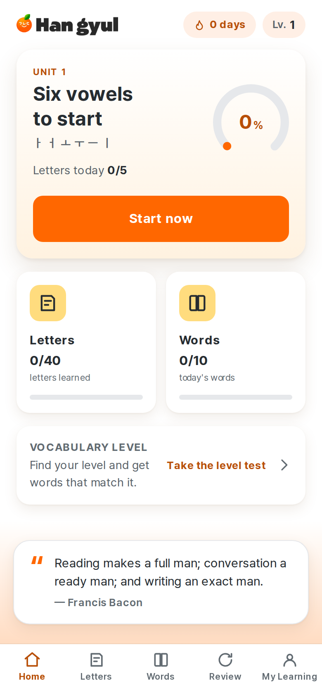
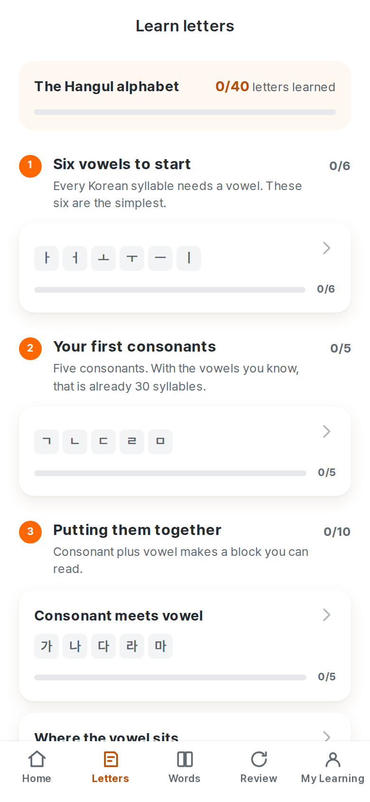
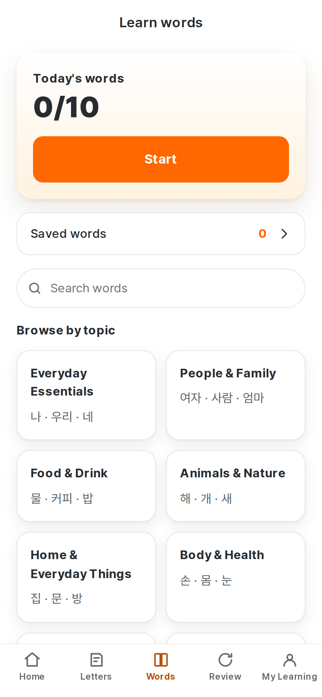
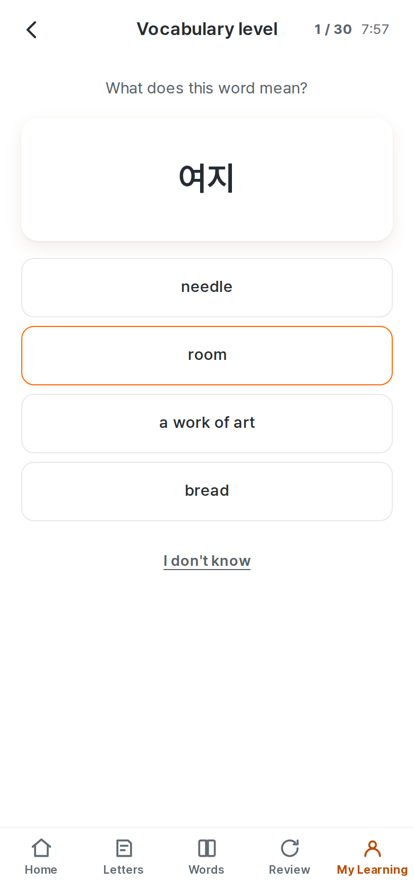
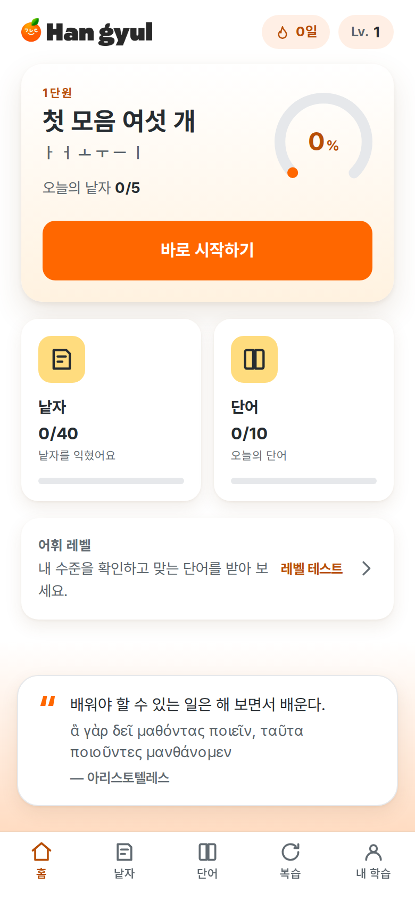
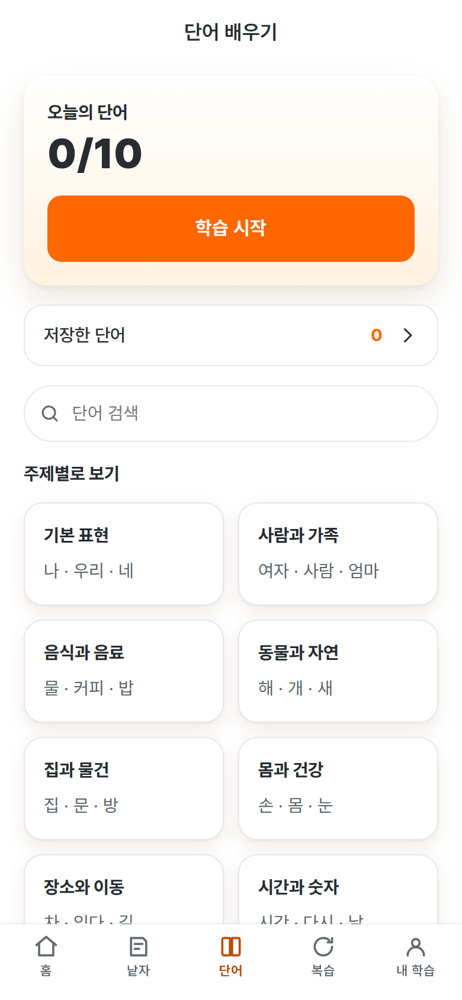
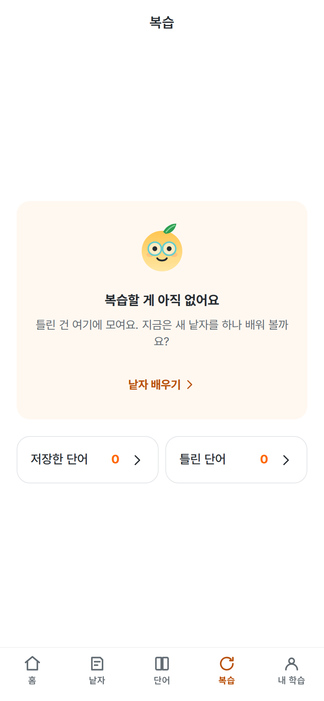
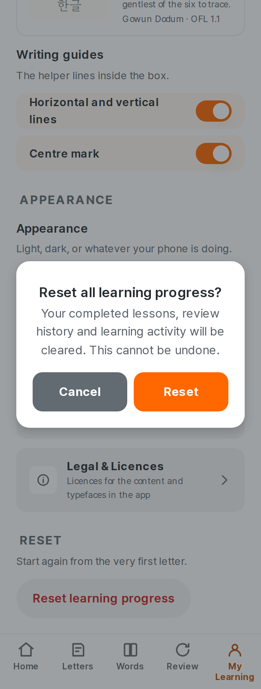
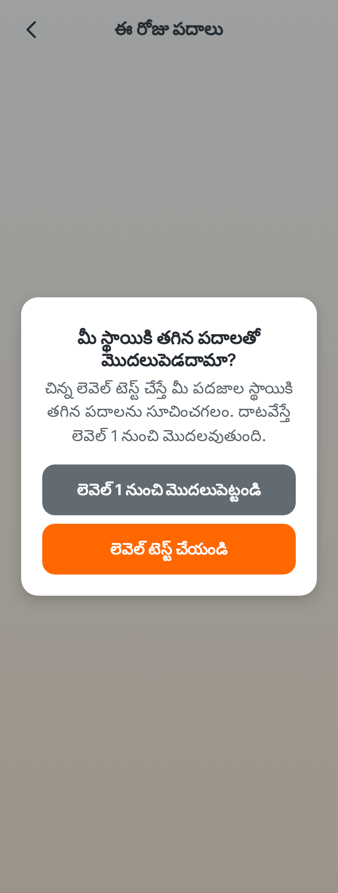

# 1. About this report

This is an **internal product truth document** — not marketing, not a changelog.
It is handed to a reviewer, usually another model, as the authoritative
description of what Hangyul ganada *currently is*.

It was written from scratch. The previous report was not edited, extended or
carried forward; every claim below was re-derived from the running product, the
current source, or a script whose output is quoted. That is not a formality.
The last report described several defects as resolved that reproduce on a
screenshot, and a document that has been edited enough times stops being able to
tell you which of its sentences were checked this cycle.

## How to read the claims

Every substantive claim carries one of these labels.

| Label | Means |
| --- | --- |
| **VERIFIED** | Confirmed by running the product, reading the code, or a script whose output is quoted here |
| **INFERRED** | Follows from the architecture but was not directly observed this cycle |
| **RECOMMENDED** | A product suggestion, not a statement of fact |
| **EXTERNAL** | From outside the repository; see §30 for the limits on this |

Feature status uses a second scale:

| Status | Means |
| --- | --- |
| **VERIFIED WORKING** | Does what it should, checked this cycle |
| **PARTIALLY WORKING** | Works for the common path; a real case is unhandled |
| **UX-PROBLEMATIC** | The code is correct and the customer experience is not |
| **BROKEN** | Does not work |
| **NOT IMPLEMENTED** | Does not exist |
| **NEEDS VERIFICATION** | Could not be settled from this machine |

## Three things this report will not do

**It will not call something finished because a check is green.** Six of this
cycle's ten findings were found by looking at the product — a rendered screen, a
bank of questions read one by one, six typefaces set side by side — and not one
of the six was findable in a bundle, a test or a diff. One of them — a level-test gate that had
been throwing on the first item it read since the bank changed shape — was
*hiding* a defect behind a step that printed no findings because it never
finished.

**It will not describe a language as reviewed.** No locale in this product has
been read by a native speaker, including the two the product is about. §23 and
`docs/LOCALIZATION_NATIVE_REVIEW.md` say so in the same words.

**It will not present a content backlog as an engineering number.** §13 and §23
separate what is built from what is written, because "the delivery architecture
supports 10,000 words" and "there are 10,000 words" are different sentences and
only one of them is true.

---

# 2. Audit metadata

| | |
| --- | --- |
| Report generated | 23 August 2026, against the working tree **and** against the delivered package by unpacking it — see §2.2 |
| Product | Hangyul ganada (한귤 가나다) |
| Application version | 0.1.0 |
| Branch | `main` |
| Source commit described | `1367418` |
| Android application id | `com.talkhangyul.ganada` |
| Platforms in this repository | Web (PWA), Android (Capacitor), an iOS project that cannot be built here |

## 2.1 Package versions — **VERIFIED**

| Package | Version |
| --- | --- |
| React | 19 |
| Vite | 7 |
| TypeScript | 5 |
| Capacitor | 8 |
| Playwright | 1 |
| Vitest | 3 |

## 2.2 The delivered package, verified by unpacking it — **VERIFIED**

The question this section answers is not "did the build succeed" but "is the
file a customer would install the same product this report describes". It is
answered by opening the APK, not by trusting the build log.

| | |
| --- | --- |
| Built from | `1367418`, working tree clean |
| APK | 71,321,805 bytes, SHA-256 `b78df86ad4c0d6dca0b6699823c8afba9ec715301f19ef6407edb5feacde1c2d` |
| AAB | 70,065,064 bytes, signed |
| Signature schemes | v2 and v3 |
| Certificate SHA-256 | `157a2bb133f6aa3d34a9a7b27e4a7fb7cbfafe49544f6e6064ce713e3323debc` |
| Certificate subject | `CN=Hangyul GaNaDa, OU=Mobile, O=Talk Hangyul, L=Seoul, C=KR` |
| Signing key | The existing production key, recovered from `/root/.hangyul-keys/release.jks`. **No key was generated.** The fingerprint above is byte-identical to the one the previous package carried. |

What was found inside it, each checked against a change made this cycle:

| Looked for | Found |
| --- | --- |
| The level-test bank built after the ambiguity rules | `bank-e6759230.json`, 3,960 items |
| The per-language reach | `en` 30, `de` 25, `hu` 23 — the manifest the result screen reads |
| The ceiling sentence, in every language that needs it | present in all 32 locale chunks |
| The shared verdict | `맞았어요.` in the Korean chunk |
| The retired verdict wording | `Not quite` — **0 occurrences** |
| The Korean terminology fix | `저장한 단어` present, `저장한 어휘` **0 occurrences** |
| Gaegu's corrected reading size | `size-adjust:121%` in the stylesheet |
| ElevenLabs credentials or endpoints | **none**, anywhere in the package |

`release:current` closes the remaining gap: it reads the commit out of
`build-info.json` and diffs it against `HEAD`, so a package built from a
different commit than the source fails the release gate rather than shipping
quietly. Documents are excluded, because regenerating this report after the
build is the normal order of work.

## 2.3 Figures for the next report to diff against

| Metric | Value |
| --- | --- |
| Words shipping | 2,581 |
| Categories | 18 |
| Study sets | 523 (five words each) |
| Characters taught | 73 |
| Pronunciation notes | 503 |
| Dictionary headwords | 30,229 |
| Dictionary senses | 39,610 |
| Dictionary examples | 3,866 |
| Interface languages | 32 |
| Vocabulary packs complete | 10 |
| Vocabulary packs at 100 words | 22 |
| Unwritten vocabulary rows | 54,582 |
| Level-test items, English | 3,960 |
| Level-test contextual items | 360 |
| Hangul letters taught | 40 |
| Curriculum units | 12 |
| Lessons | 15 |
| Signed APK | 68.0 MB |
| Signed AAB | 66.8 MB |
| Issues tracked | 61 |

The three test counts are in §36.2; the artefact hashes are in §2.2. "Characters
taught" counts every entry in the curriculum's character table — the 40 letters
plus the syllable blocks and 받침 forms the lessons introduce — where "Hangul
letters taught" is the 40 a learner would name.

---

# 3. Executive summary

## What the product is

A learner who has never seen Hangul installs one app, opens it offline, and is
taught to read and write the alphabet, then given practical vocabulary chosen
for their level. Nothing they do leaves the device: there is no account, no
network call in the learning path, and no analytics.

## What this cycle changed, in one page

The cycle was told that the previous "quality pass complete" was not accepted,
that real learner-facing defects had been found in the running product, and that
**the rendered product outranks a screenshot, which outranks the source, which
outranks anything a previous report claimed.** Working that way found nine
things. Six of them were invisible to every check in the repository, and one of
them was invisible *because* of a check.

**The Level Test asked questions with two right answers.** All 390 contextual
items were read, because the gate that checks them says in its own header that
nothing in it reads Korean. 연필을 ____ 있어요 offered 사고 beside 가지고, and
buying a pencil is as good an answer as having one. 불을 ____ 주세요 was built
twice, once from 끄다 and once from 켜다 — the same six characters asking for
opposite verbs, both shipped. Four new rules, 30 items removed, 41 distractors
swapped (I-55).

**And the gate that should have caught it had been throwing on item one.** When
meaning items started carrying ids instead of strings, `leveltest:ambiguity`
began reading `item.options` on an object that no longer has it. It printed a
stack trace and zero findings for 3,960 items, which in a long log reads like a
step with nothing to say (I-56).

**계셌어요 is not a Korean word, and two of them were answer options.** The
honorific stems were pinned whole to their fused polite present, and the past
was derived from that. 계시다, 주무시다, 드시다, 잡수시다 and 돌아가시다 all
produced it. There was no honorific row in the conjugation table, and a table
written from the grammar cannot disagree with a form nobody wrote down (I-58).

**The test reported a level out of thirty without saying how far it could ask.**
Rebuilt, the reach is 30 levels in English, 25 in the nine other complete
languages and 23 in the remaining twenty-two — and a learner in Hungarian, never
asked anything above 23, was shown a number "of 30" (I-57).

**262 example translations put a person in the sentence that the Korean does not
have.** 발을 밟았어요 — a foot was stepped on, no owner named — read "I stepped
on his foot". Of the 58 in English, fifty said *he* and eight said *she*, and
the eight were the elegant, the graceful, the sweetly-spoken, the one who
dressed up and the one who plays the piano. 186 rewritten; 123 left in French
and German with the reason stated (I-59).

**The Korean interface called one thing two things.** 오늘의 어휘 above a tab
reading 단어; 저장한 어휘 filled by a button reading 단어 저장. Unit 1 teaches
that 낱자 combine into a 글자 and the product then named the letters tab 글자.
Six strings were in the register of an announcement. Three new rules in
`locale:editorial` (I-60).

**Two screens said the same thing twice** — "Today's words · 0/10 · A short set
of 10 words." — and `screens:audit` now reads the text it renders (I-61).

**Two review exercises kept their own verdict.** "That's it." and "Not quite.
Here it is." survived in the two components the sessions actually render, while
the three screens above them had moved to "Correct." and "Incorrect." (I-62).

**Gaegu's reading size had been fitted to one axis.** Rendered beside the other
five faces it plainly read larger than them: the 127% that height alone asks for
put it 9.3% wider than the median. 121% is the value whose error is the same on
both, and both are gated now (I-31, now resolved).

## What did not change, and is the honest state of the product

Two of the four open issues are content at a scale no engineering pass reaches.
The taught corpus is **2,581 words against a stated 10,000** (I-04), and word
meanings are complete in ten languages and a hundred words deep in
twenty-two — **54,582 unwritten rows** (I-19). Neither moved this cycle, both
are measured exactly rather than described, and the product tells the learner
about the second one before they choose the language and again on the result
screen of the test.

**No locale has been read by a native speaker** (I-17). Nothing in this document
says otherwise, and three of this cycle's fixes are the kind of thing a native
reading finds in an afternoon — which is the argument for one, not a substitute.

The Hangyul hand-off has no destination in this repository (I-03) and cannot be
guessed.

## The verdict

The product does what it says on the screens it has, on every phone width
measured, in both themes, at 200% text, in thirty-two languages, offline, from a
signed package built from the commit this report describes. What it does not yet
have is the corpus its own target names, and a reader who has been through it in
a language other than English.

---

# 4. Product definition

## 4.1 What it is — **VERIFIED**

An offline-first Korean foundation course, delivered as a web app and an Android
package built from the same source. Two halves, in order:

1. **Hangul.** 40 letters across 12 units and 15 lessons. Every letter is met,
   heard, written with a finger on a graded canvas, and read back.
2. **Vocabulary.** 2,581 taught words with a hand-written example each,
   scheduled by a memory model, plus a 30,229-headword dictionary that is
   searchable and never scheduled.

## 4.2 The intended journey

A person who cannot read a single character opens the app, and within ten
minutes has written ㅏ with their finger and read 아 back. Within a week they
have the alphabet. From there the product is a daily set of words at their
level, and the review that keeps them.

## 4.3 Does the product support that positioning? — **VERIFIED, with one gap**

Yes for the alphabet, which is complete, checked and the strongest part of the
product. Yes for vocabulary at the scale it actually has. The gap is the end:
a learner who finishes the alphabet and works through the corpus reaches the end
of what exists, and the card built to hand them on to the main Hangyul product
has no address to hand them to (I-03).

---

# 5. Current product decisions, audited

| Decision | Verdict |
| --- | --- |
| No account, no server, no analytics | **Right.** It is the product's strongest differentiator and it is real: there is no network call in the learning path. |
| Teach writing with a finger, graded | **Right.** It is the reason to install this rather than read a chart. §12. |
| One taught sense per word | **Right,** and it is enforced (`vocabulary:sense:qa`). A card that teaches "foot" does not unfold into rounds of ammunition. |
| A searchable dictionary that is never scheduled | **Right,** and the separation is the interesting part. §13.5. |
| Thirty-two interface languages | **Right in principle, and expensive in truth.** §23 states what each of the three layers actually covers. |
| A quiz that shows nothing rather than English | **Right.** A mixed-language question is unanswerable by the person it was built for. |
| A 30-level placement test | **Right,** and this cycle it learned to say how far it can reach. |

---

# 6. Target customer and job to be done

## 6.1 The person — **RECOMMENDED framing**

Someone with a specific reason to read Korean — a drama, a song, a trip, a
partner's family — who has bounced off a romanisation chart. They are not
studying for a qualification yet and they are not going to install five apps.

## 6.2 The job

*Get me to the point where the writing is not noise, without signing up for
anything, on the phone in my hand, on the train.*

## 6.3 Does the product do the job? — **VERIFIED**

For the alphabet, yes, and better than the benchmark set (§30): nothing else in
the comparison grades handwriting on-device. For vocabulary, it does the job for
2,581 words and then stops, which is I-04.

---

# 7. Technical architecture

| Layer | Choice |
| --- | --- |
| UI | React 19, TypeScript, CSS modules over design tokens |
| Build | Vite 7, one bundle plus content-hashed chunks |
| Storage | IndexedDB, with a documented failure mode (§25) |
| Native | Capacitor 8 — Android built here, iOS project present and unbuildable |
| Content | Generated from `content/` into `apps/web/src/data/generated/` and `apps/web/public/`, never hand-edited |
| Korean morphology | `packages/korean-morphology`, a real conjugator with a grammar-written test table |
| Handwriting | `packages/handwriting-core`, on-device, no model download |

## 7.1 Why this matters to the product

Two consequences a reader should hold on to.

**Content is generated, and the generators are gated.** No screen reads a
hand-edited data file. That is why a defect like 계셌어요 is a *code* fix in the
conjugator and then a rebuild, rather than 2,581 edits — and why a rule added to
a gate protects every future regeneration rather than one row.

**The corpus is fetched in bands, not bundled.** `data/vocabulary.ts` exports
live, growing values; the first load waits for a fixed core band and the rest
arrives behind it. This is what makes 10,000 words an authoring problem rather
than a performance one.

---

# 8. Information architecture

## 8.1 Sitemap — **VERIFIED**

```
/                     Home — the next thing to do, the two counters, a quotation
/letters              Learn letters — 12 units, 15 lessons
/letters/:lessonId    A letter session: intro, writing, reading
/letters/sounds       When sounds meet — the six sound changes
/words                Learn words — today's set, saved words, search, 18 topics
/words/today          The daily session
/words/category/:c    One topic
/words/word/:id       Word Detail for a taught word
/words/dictionary/:h  Word Detail for a dictionary headword
/words/saved          Saved words
/review               Review — what is due, and the two lists the learner owns
/review/session       A review session
/review/mistakes      Wrong words
/me                   My Learning — stats, language, goals, practice, app
/me/activity          Learning activity — streak, calendar, insights
/me/level-test        The Hangyul Vocabulary Level Test
/me/language          Language picker
/me/privacy           Privacy
/me/legal             Legal and licences
```

## 8.2 Screen by screen — **VERIFIED this cycle at seven device profiles**








Every route above, plus six *states* that are not routes — the placement dialog,
an accepted piece of writing, a rejected piece, an answered recognition
question, a level-test question and an answered vocabulary question — were
rendered at 320, 360, 390, 412 and 430 CSS px, in dark, and at 200% text. 143
renders. Nothing is clipped, nothing overlaps, nothing is unreadable, and
nothing says the same thing twice. §29 and §31 carry the detail.

The six states matter more than the seventeen routes. Until this cycle the audit
measured routes only, which is why a modal whose buttons left the modal and a
feedback panel that said "Headline" both survived a green audit: neither is
reachable by navigating to a URL.

---

# 9. User flows — **VERIFIED, each opened in a browser this cycle**

| # | Flow | Verdict |
| --- | --- | --- |
| 9.1 | First launch → two still frames, then Home | **WORKING.** The splash eats input for 900 ms and then hands over; it is two PNGs, not a video. |
| 9.2 | Change language | **WORKING.** 32 rows, searchable, each marked with whether its word meanings are written. |
| 9.3 | Learn a first letter | **WORKING.** Unit card → letter introduction → writing → reading. |
| 9.4 | Write a letter | **WORKING.** Finger on canvas, graded on device, verdict in two words. §12. |
| 9.5 | Start today's words | **WORKING.** A new learner is asked once whether to take the level test, and *Start at Level 1* is a real answer rather than a dismissal. |
| 9.6 | Complete a word | **WORKING.** The progress bar counts words learned, not cards seen. |
| 9.7 | Reach the goal, then study more | **WORKING.** *A little more* offers a size and the session continues. |
| 9.8 | Save a word and find it again | **WORKING.** Saved words holds dictionary headwords too, and says which of them cannot be quizzed and why. |
| 9.9 | Answer wrongly | **WORKING, and it changed this cycle.** The verdict is `Incorrect.` in every language and on every screen that has one, and the answer follows on its own line rather than inside the verdict. §12.0. |
| 9.10 | Review | **WORKING.** A hub: what is due, saved words, wrong words, and a way to pick what to practise. |
| 9.11 | Resume, refresh, reopen | **WORKING.** State is in IndexedDB; a refresh mid-session returns to the same question. |

---

# 10. Hangul learning system

## 10.1 Curriculum shape — **VERIFIED**

12 units, 15 lessons, 40 letters, plus 받침 and the six sound changes. Three
units carry a written introduction — what the writing system is, how letters
stack into a block, and what a consonant at the foot of a block does — and the
other nine do not, on purpose: a screen of prose between a learner and the
practice is an obstacle.

## 10.2 The mastery ladder — **VERIFIED**

`seen → written → learned`. A letter is not *learned* until it has been written
and read back. The ladder is what the progress ring counts.

## 10.3 Progress and daily goals — **VERIFIED**

A letters-a-day target (3/5/10/15/20, default 5) and a words-a-day target
(5/10/15/20, default 10). Both are settings, both are honoured by the planner,
and the daily plan is stable within a day and different across days
(`dailyvocab:qa`).

## 10.4 Audio in the lesson — **VERIFIED WORKING**

Every letter, syllable and word has a recorded clip in the package. Two Korean
voices, spoken slower than native pace. No network call, no vendor, no
credential — verified by unpacking the APK (§2.2).

---

# 11. Stroke renderer

## 11.1 What it draws — **VERIFIED**

Letters are drawn as **centrelines with a pen width**, not cut out of a raster
glyph. A stroke is a path; the demonstration animates the path; the guide the
learner traces is the same path filled. There is no ribbon mask and no asset
cut-out anywhere in the product, and notes describing one are describing a model
that was removed.

## 11.2 Why that matters to a learner

The previous model produced ownership wedges at junctions — ㅂ's uprights grew
triangular spurs into a crossbar that had not been written yet — and a polygonal
ㅇ. A learner watching stroke one could see a piece of stroke three already on
the paper. Centrelines cannot do that: a stroke is drawn or it is not.

## 11.3 What the gates check — **VERIFIED, run this cycle**

| Gate | Checks |
| --- | --- |
| `strokes:qa` | every letter has a stroke list, ordered, with no zero-length segment |
| `strokes:visual` | the rendered stroke against a fixture, per letter |
| `glyphshape:qa` | the shape of the drawn letter against the typeface's own outline |
| `jamo:measure` | jamo proportions, measured off Pretendard with the text loaded |
| `jamo:centering` | that the letter sits on the crosshair the learner is given |
| `strokes:measure` | the stroke table, reproducibly |
| `face:size` | how big each practice face reads, in **both** directions — §28 |

## 11.4 The measurement trap this product has hit twice

A canvas measurement of a font that has not loaded silently measures a fallback
face. It happened once to the jamo proportions — 30 of 40 letters were built to
the wrong typeface's numbers — and it happened again this cycle to a throwaway
comparison harness written to look at Gaegu, which rendered all six faces
identically because `file://` font URLs do not load in a `setContent` page. The
harness was wrong, not the product, and it was caught by *looking at the
picture*: six rows of identical letters is not a plausible measurement.

Every gate that measures a face now asserts `document.fonts.check` before it
measures anything.

---

# 12. Handwriting recognition

## 12.0 What a learner sees after the pen lifts — **VERIFIED, and completed this cycle**

Two words, and the way on.

| | Correct | Incorrect |
| --- | --- | --- |
| Verdict | `common:verdict.correct` — Correct. / 맞았어요. | `common:verdict.incorrect` — Incorrect. / 틀렸어요. |
| Action | the next step | write it again |
| Also shown | nothing | nothing |

No praise, no percentage, no stroke arithmetic, no restatement of the answer to
somebody who just tapped it. The rule is that the screen tells the learner
whether they were right and then gets out of the way.

**What was there before, and how it survived.** The acceptance was
`hg-sr-only` — announced to a screen reader and shown to nobody — on the
reasoning that a sighted learner sees the box lock. Above the recognition step
sat the word **"Headline"**: `t('handwriting:feedback.correct.headline')` naming
a key that has never existed, humanised by i18next's
`parseMissingKeyHandler` into something that reads like real copy. A missing-key
safety net that produces plausible copy is worse than one that produces a raw
key, because nothing looks wrong.

**And it was not finished when it was reported finished.** The shared verdict
reached three screens and not the two components those screens render, so a
learner answering a word question still read "That's it." (I-62). The
end-to-end test that walks a vocabulary session to a real question is what
closed it; the first three surfaces had been covered by tests that only opened
the letter session.

## 12.1 How it works — **VERIFIED**

On-device, no model download, no network. Strokes are resampled, compared to the
reference centrelines by direction, order and coverage, and scored. The scorer
lives in `packages/handwriting-core` and is exercised by a robustness corpus of
real attempts.

## 12.2 Is the balance right? — **VERIFIED, measured**

Measured on the robustness corpus at the shipping settings — 2,880 genuine
attempts and 2,172 deliberately wrong ones, across 40 letters and six typefaces:

| | |
| --- | --- |
| False rejection | **0.28%** — an honest attempt called wrong |
| False acceptance | **0.28%** — a wrong attempt called right |

A learner who writes the letter honestly is essentially never told they did not,
and the two errors are balanced rather than one being bought with the other.
The figures are in `docs/handwriting-robustness.json` and are re-derivable with
`npm run handwriting:robustness`.

## 12.3 The limitation this does not solve — **VERIFIED**

It grades *shape and order*, not beauty. A legible, correctly ordered letter
passes even if it is ugly. That is the right trade for a beginner and it should
not be described as handwriting assessment.

## 12.4 The guide is fitted and centred — **VERIFIED**

The traced guide and the demonstration are the same geometry at the same size,
and the letter sits on the crosshair. `jamo:centering` is the gate.

---

# 13. Vocabulary data

## 13.1 Scale — **VERIFIED**

| | |
| --- | --- |
| Taught words | **2,581** |
| Semantic categories | 18 |
| Words with a hand-written example | 2,581 |
| Words with a recorded clip | 2,581 |
| Stated target | 10,000 |

## 13.2 Sources — **VERIFIED**

Frequency ranking from a subtitle corpus, senses and examples authored in
`content/vocabulary/entries/*.jsonl`, and Korean Wiktionary for the dictionary
layer only. Nothing a learner is *taught* is scraped: every taught gloss and
every example sentence is written in the editorial pack, which is why a defect
in one is one line to fix and a rule to stop it coming back.

## 13.3 Field coverage — **VERIFIED**

Each taught entry carries a headword, a romanisation, a part of speech, one
sense id, a gloss in each complete language, one example sentence in Korean, a
translation of it in each complete language, a difficulty score, a level and a
category. The sense id is the spine: it is what makes "one card, one taught
sense" enforceable rather than aspirational.

## 13.4 The 10,000-word strategy — **the delivery is built; the words are not written**

This is I-04 and it has not moved. What has been settled is that it is now
purely an authoring problem:

* the corpus is fetched in bands, so the first load does not grow with it;
* the level test's anchor pool already ranks 17,096 words, so new words arrive
  with a level rather than needing one assigned;
* `vocabulary:qa:target` fails on the shortfall, and it is the one gate in
  `verify:release` that does not pass. It is left failing on purpose.

**7,419 words short.** That is the number, and no arrangement of the other
figures in this report makes it smaller.

## 13.5 The dictionary layer — **VERIFIED, and it is not the corpus**

| | |
| --- | --- |
| Headwords | 30,229 |
| Senses | 39,610 |
| Examples | 3,866 |
| Ever scheduled | **none** |

A learner can look up any of 30,229 words. None of them enters a lesson, a
review queue or a daily plan unless it is one of the 2,581. Conflating the two
numbers would be the single most misleading thing this report could do, so they
are never added together.

**The sweep, done twice.** A first pass fixed five defect classes in what the
dictionary shows. Fixing five classes is not evidence that there is no sixth, so
the corpus was read again against a wider net and six more came back — a
citation left in a definition, a MediaWiki interwiki prefix, an unbalanced
bracket, a reference whose target had already been dropped, a replacement
character, and glosses long enough to be an encyclopaedia entry. Each was fixed
at the ingestion rather than in the output, and each is a rule in
`dictionary:qa` negative-tested by putting the original defect back. 30,243 →
30,229 headwords: the fourteen lost are entries whose only sense was a dangling
reference, and an entry that trails off mid-phrase is worse than no entry.

**27 glosses are deliberately long.** 설잡대's 626 characters explain a piece of
university slang; 강신무's 418 describe a kind of shaman. Truncating manufactures
the "obviously truncated" text the sweep exists to remove — first-sentence
extraction cuts 전통 mid-parenthetical — and dropping loses the headword. So the
*count* is the gate: 27, and it may not grow.

## 13.6 The Hangyul Vocabulary Level Test — **VERIFIED, and corrected twice this cycle**

Thirty levels, thirty questions, an eight-minute limit, a 3PL model over an
item bank built from the ranked anchors.

| | |
| --- | --- |
| Levels | 30 |
| Items in the bank | 3,960 |
| Of which contextual | 360 |
| Question kinds | meaning (Korean shown, meaning chosen), produce (meaning shown, Korean chosen), context (a sentence with a blank) |
| Anchors ranked | 17,096 — 2,579 from the teaching corpus, 14,517 from the dictionary |

### The bank holds ids, not English

The defect that started this: a Tamil learner was asked a Tamil question and
offered four English answers, in twenty-two languages. The cause was not a
missing translation but a **data shape** — the bank had baked one language's
meanings into the item, which made English the canonical object and put it
beyond the reach of any translation work.

The bank now holds `answerId` and `optionIds`; `meanings-<locale>.json` holds
the strings; the renderer puts them together knowing which language it is in.
A meaning that does not exist in the learner's language makes the item
unaskable, rather than making it English. `leveltest:locale` checks this twice:
once by resolving every item at every level for all 32 languages, and once by
opening the test in a browser as a learner in each of them and reading the
`lang` attribute off the rendered options.

### The per-language matrix — **and why "32/32" would be a lie**




Interface localisation is 32/32. The *test* is not, and the difference is
visible to a learner, so it is stated per language rather than summarised.

| Ceiling | Languages | Askable items each |
| --- | --- | --- |
| **30 — the whole scale** | `en` | 3,960 |
| **25** | `ko` `ja` `zh-CN` `es` `fr` `de` `pt-BR` `th` `vi` | 1,266 |
| **23** | `ar` `bn` `cs` `el` `fil` `hi` `hu` `id` `it` `kk` `ky` `mn` `nl` `pl` `ro` `ru` `sv` `ta` `te` `tr` `uk` `uz` | 399 |

Why each number is what it is:

* **English reaches 30** because levels 26–30 are ranked from the dictionary and
  only English carries dictionary glosses.
* **Nine languages reach 25** — the whole taught corpus, which is where the
  taught words run out.
* **Twenty-two reach 23** on the contextual items alone, which are Korean
  throughout and need no meaning at all. Their meaning and produce items are the
  hundred words their pack has written.

**And the learner is told.** `levelTest:result.ceiling`, written in all 32,
appears on the result card whenever the ceiling is below the scale: *"For now
the test reaches level 23. The words above it are not translated yet."* Two
end-to-end tests hold it — one in Hungarian asserting it appears, one in English
asserting it does not.

Before this cycle the manifest said 30 for ten languages, and it said so because
it had not been rebuilt. That is the second correction: a stale artefact
reporting a better number than the product can deliver.

### Item quality

See §14.2. The short version is that all 390 contextual items were read by hand,
four classes of second-right-answer were found, and all four are rules now.

---

# 14. Vocabulary content quality

## 14.1 Automated checks — **VERIFIED, run this cycle**

| Gate | What it decides | Result |
| --- | --- | --- |
| `vocabulary:qa` | field coverage, romanisation, category membership | pass (and reports the 7,419 shortfall) |
| `vocabulary:sense:qa` | one taught sense per word in every complete language; a bracketed clause is a second sense in disguise | pass |
| `examples:qa` | 2,581 sentences against sixteen rules | every example passes |
| `conjugation:qa` | every recorded surface form is reachable from the generated stem, for 1,306 verbs and adjectives | pass |
| `leveltest:ambiguity` | twelve rules over the item bank | pass |
| `leveltest:locale` | every item resolvable in the learner's language, twice — by resolver and in a browser | pass |
| `dictionary:qa` | eleven classes of ingestion defect | pass |
| `content:qa` | the editorial pack's own consistency | pass |
| `worddetail:qa` | no card shows an example of a sense it does not teach | pass |

## 14.2 Manual reading — **the part that found things**

Three readings this cycle, each of which found something no gate looked for.

### The 390 contextual level-test items

Read in full. Four classes of second-right-answer, described in §13.6 and now
rules. The gate's own header explains why a human had to do it: every rule in it
is a *proxy* for a judgement about Korean, and the judgement is a person's.

### A spread of 25 taught entries

Read against their own examples. One had a person in the translation that the
Korean does not have — 발을 밟았어요, "I stepped on his foot" — which counted out
to 262 across the pack (§23.4). Two others are recorded as content notes rather
than defects: 박사's example uses the word as a person's title where the gloss
names the degree, and 행하다's example pairs it with 약속, a collocation a Korean
speaker would more likely write with 지키다.

### Every Korean interface string

Read on the rendered screen. Three classes, all in §23.3.

## 14.3 Lexical relations

245 of 2,581 words carry a verified synonym or antonym, and a relation is
recorded only because two Wiktionary headwords state it, as that relation, for
the sense this app teaches. Nothing is inferred from category or similarity.
That is I-13, and it is why the synonym section is often absent.

It earned its keep somewhere unexpected this cycle: the level-test builder now
refuses a distractor the graph calls a synonym *or an antonym* of the answer.
An antonym is the subtler of the two — 불을 켜 주세요 and 불을 꺼 주세요 are both
ordinary requests, so a sentence built around one never rules out the other.

---

# 15. Word Detail

## 15.1 What a learner sees — **VERIFIED**

The headword, its romanisation, its part of speech, the one sense this card
teaches, the example sentence with a translation, audio, and a save control.
Below that, where the dictionary has them, further examples **of the sense the
card teaches**, attributed and behind a disclosure.

## 15.2 What was deliberately taken off it

The page used to end in "More from the dictionary", which on 발 — a card teaching
*foot* — listed leg, a counter for steps, a blind or screen, strands of noodles,
and rounds of ammunition. All true, none asked for, and the effect on a reader
is that the product looks less trustworthy rather than more complete.
`worddetail:qa` now fails if a card shows an example of a sense it does not
teach.

## 15.3 The hand-written *More about it* block

On 25 words of 2,581, and that is deliberate: a paragraph under every word is a
paragraph nobody reads. It is I-20 and it stays PARTIAL, because the gap it
leaves is the words where the dictionary has neither a second sense nor an
example and one line genuinely is not enough.

---

# 16. Vocabulary learning experience

## 16.1 The shape — **VERIFIED**

A daily set at the learner's level, half of it reserved for new words and the
rest for consolidation *if there is any* — a reservation rather than a ceiling,
so a first-day learner with no backlog still gets a full session instead of
half of one.

## 16.2 Question types implemented — **VERIFIED**

| Kind | The learner |
| --- | --- |
| `read` | sees the Korean, picks the meaning |
| `produce` | sees the meaning, picks the Korean |
| `context` | sees a sentence with a blank, picks the word |
| `match` | pairs words with meanings |
| `build` | assembles a word from syllable tiles |
| `write` | writes the word on the canvas |

## 16.3 Question quality — **VERIFIED**

Distractors are drawn from the same level band and the same part of speech, and
refused if they share a gloss word, share a semantic category, are a recorded
synonym or antonym, or — new this cycle — are a verb general enough to fit any
object. §13.6.

## 16.4 What a wrong answer shows

The verdict, then the answer on its own line. Not the two fused: `맞아요,
{{answer}}예요` is the pattern §16 removes and it is gone. The answer stays
because a choice question cannot be retried where it stands — a missed word
comes back through the schedule, not through a button — so a wrong answer
showing only "Incorrect." would be a review that teaches nothing.

## 16.5 Weaknesses that remain

* Production is tiles, not a keyboard. A learner never types Korean.
* Listening questions were removed from the vocabulary session and the letter
  session keeps them, which is a defensible split and not an obvious one.
* The session is the same shape every day.

---

# 17. Hints and help

## 17.1 The rule

A hint must narrow the answer without containing it. The ladder runs from a
category hint to a first-letter hint to the answer itself, and only the last
rung is allowed to reveal — `REVEALS_ON_PURPOSE` in `audit-copy.mjs` names the
one key that may.

## 17.2 The ladder — **VERIFIED**

| Rung | Example |
| --- | --- |
| 1 | *It's a noun — something in Food & Drink.* |
| 2 | *It starts with ㅁ…* |
| 3 | *It's used like this: …* |
| 4 | *The word is 물.* |

## 17.3 How it is checked — **VERIFIED**

`hints:qa` renders every hint for every word in every complete language and
fails if a rung below the last contains the answer, in any script. It is a
rendered check rather than a string check, because the answer can appear through
interpolation.

---

# 18. Daily goals

## 18.1 What the progress bar counts — **VERIFIED**

Words *learned*, not cards seen. Reading ten introduction cards used to fill it,
and so did a wrong answer, which produces a session that finishes 10/10 having
missed two words — a number that means nothing, and a learner who notices stops
trusting the rest.

## 18.2 Counting rules — **VERIFIED**

* A word counts once, on the day it is learned.
* A wrong answer does not count and does not un-count.
* *A little more* extends the session without moving the goal.

---

# 19. Saved Words

A learner's own list, holding both taught words and dictionary headwords. A
dictionary headword cannot be quizzed — there is no card behind it — and the
screen says so in that word's row rather than silently offering fewer questions.

The Korean name for this screen changed this cycle: 저장한 어휘 → 저장한 단어.
§23.3.

---

# 20. Wrong Answer Notebook

Everything missed, with what was answered and how many times. Cleared by the
learner, one row at a time, with *Done with this*.

## 20.1 Does it help, or is it just a log?

It is a log with a practice session behind it, which is the difference. The
list is reachable in one tap from Review, and the session it launches is built
from exactly those words.

---

# 21. Review system

## 21.1 The principle — **VERIFIED implemented**

Spacing, not repetition. Each item carries a recall estimate that decays with
time and is repaired by a correct answer; the queue is what has fallen below
threshold, not what was answered longest ago.

## 21.2 Session construction — **VERIFIED**

Due items first, then weak ones, capped so that a fortnight's backlog does not
become a fifty-question session. At most a fixed number of new things per
session, for the same reason as the daily plan's reservation.

## 21.3 The hub — **VERIFIED**

Review is a screen with three things on it: what is due, and the two lists the
learner thinks of as theirs — saved words and wrong words. Before it was a hub
it answered the question the *app* has (what is due) and neither of the two the
learner has.

## 21.4 Sentences are not SRS items — **VERIFIED**

Example sentences are shown, never scheduled. Scheduling a sentence means
scheduling a word inside it twice.

---

# 22. Audio and pronunciation

## 22.1 Audio — **VERIFIED WORKING**

Every letter, syllable and taught word has a clip in the package. Two Korean
neural voices, one female and one male, spoken at 0.82× for beginners. Offline,
no account, no network call.

## 22.2 No external vendor, verified in the package — **VERIFIED**

An earlier cycle migrated to ElevenLabs and the voices were rejected as too
synthetic. The migration is rolled back and the evidence is not a code search
but an unpacked APK: **no ElevenLabs string, endpoint or credential appears
anywhere in the delivered file** (§2.2). `audio:qa` checks the clips themselves
— existence, manifest agreement, duplication, and 600 of them decoded.

## 22.3 Pronunciation notation — **VERIFIED**

Revised Romanization derived from the *standard pronunciation* rather than the
spelling, so 학교 is shown as *hakgyo* and not as a letter-by-letter transcription
of what is written.

## 22.4 The 마디 defect — **VERIFIED FIXED**

One voice said 마디 wrong. The clip is regenerated and the pronunciation gate
pins it. This is the reason `audio:pronunciation` exists: a TTS engine is
deterministic, so a word it says wrongly it will say wrongly every time, and the
only way to know is to listen once and then pin it.

---

# 23. Localization

## 23.1 Languages — **VERIFIED**

Thirty-two interface languages: `ar` `bn` `cs` `de` `el` `en` `es` `fil` `fr`
`hi` `hu` `id` `it` `ja` `kk` `ko` `ky` `mn` `nl` `pl` `pt-BR` `ro` `ru` `sv`
`ta` `te` `th` `tr` `uk` `uz` `vi` `zh-CN`.

## 23.2 The three layers, and what each actually covers — **VERIFIED**

"32 languages" is true of two of these three and false of the third, so it is
never said on its own.

| Layer | Covers | Complete |
| --- | --- | --- |
| **Interface** | every screen, button, label, empty state, error, accessibility string | **32 / 32** |
| **Alphabet course** | 15 lesson titles, 12 unit introductions, letter sound hints and mnemonics, quotations, typeface descriptions | **32 / 32** |
| **Vocabulary** | 2,581 meanings, parts of speech, example translations | **10 / 32** |

The twenty-two partial packs hold **100 words each**. 54,582 rows are unwritten,
and that is the exact number rather than a description of one. A learner in one
of those languages sees a completely translated app, English word meanings on
the cards past word 100 — marked as English, in the markup as well as on the
screen — and **no vocabulary quiz questions for those words at all**, because a
mixed-language question is unanswerable by the person it was built for.

This is stated on the row in the language picker *before* the learner chooses,
again at the foot of the picker, and now a third time on the level test's result
card, which names the ceiling that follows from it.

## 23.3 The Korean editorial pass — **NEW this cycle**








Korean is one of the two languages the product is about, and it had three
classes of defect that no check looked for. All three were found by rendering
the screens and reading them.

**One thing, two names — 단어 and 어휘.** English says "words" on every one of
these screens. Korean said 어휘 on eleven of them: the home card read 오늘의 어휘
directly above a tab reading 단어, and the saved list was 저장한 어휘, filled by
a button reading 단어 저장, with an empty state reading 어휘의 북마크를 누르면 —
not a thing anyone says. 어휘 is a person's lexicon and is right in the level
test; it is wrong for a thing you can count. Also fixed while there:
`"{{query}}"과 맞는` chose 과 for a string whose last letter is unknown.

**One thing, two names — 낱자 and 글자.** Unit 1 teaches the difference — 낱자는
네모난 블록으로 묶이고, 블록 하나가 한 글자예요 — and the product then spent the
rest of itself disregarding it: the letters tab was 글자, the activity page
counted 완료한 글자, settings counted 배운 낱자, and the home card put 오늘의
글자 above a card reading 낱자 0/40. Twenty-eight strings now say 낱자 wherever
the English says "letter"; 글자 stays wherever the thing really is a block, which
is fourteen more. `review.prompt.build` turned out to be a mistranslation rather
than a slip: English says "Put the word together" over a tray of syllables and
Korean said 글자를 순서대로 놓아 보세요.

**Two registers.** Six strings were in 합쇼체, the register of an announcement,
in a product that speaks 해요체 — one of them mixing both inside a single pair of
sentences: 모음 두 개를 하나로 씁니다. 40개 낱자 중 마지막이에요.

All three are gates in `locale:editorial` now, each negative-tested by putting
the original defect back. Two notes on how they had to be written:

* The register rule reads **sentence endings**, not pronouns, because that is
  where Korean marks the choice. The file's own comment had said Korean needed
  no rule because 해요체 "has no competing form in this product's copy" — a claim
  about the copy that the copy did not support.
* The 낱자 rule cannot be a word list, because 글자 is right for a block. It uses
  **the English as the referent** — where the source says "letter", the Korean is
  about a 낱자 — and exempts any Korean string that uses both words, because that
  is a sentence drawing the distinction on purpose.

## 23.4 A person the Korean does not have — **NEW this cycle**

Korean drops the subject and 262 example translations filled the gap. 발을
밟았어요 — a foot was stepped on, no owner named — read "I stepped on his foot",
which teaches a possessive that is not in the sentence.

The distribution is its own finding. Of the 58 in English, fifty said *he* and
eight said *she*, and the eight were: the affectionate voice, the elegant
movements, the sweet manner of speaking, the one who dressed up, the one who
walked away with dignity, the one who plays the piano, and the one who became
pregnant.

| Language | Rewritten | Still carries an invented third person |
| --- | --- | --- |
| English | 58 | 0 |
| Chinese | 67 | 0 |
| Portuguese | 59 | 0 |
| Spanish | 2 | 0 |
| German | 30 | 51 |
| French | 0 | 72 |
| Japanese | 0 | 0 — Japanese drops the subject as Korean does |

**Why French and German keep theirs.** Neither has a third-person singular that
is not gendered, and in both the masculine is the unmarked form for an
unspecified person, so *Il ronfle* does not assert what *He snores* asserts.
French possessives agree with the thing possessed, so *sa voix* was never the
problem; German's agree with the owner, which is why thirty of its seventy-four
could go — *Seine Stimme* became *Die Stimme*, *ihn* became *jemanden*. Recasting
the remaining 123 with *quelqu'un* and *jemand* would be faithful and would read
like a grammar exercise, and which of those is worse is a judgement for a speaker
of each language. It is I-59, PARTIAL, and on the native-review list.

`examples:qa` gates the rule in the five languages where it is decidable, with
the one exemption German needs: a possessive whose owner is named earlier in the
sentence belongs to that noun — *der Vogel brütet seine Eier* — and only an
ownerless one is invented.

## 23.5 Language UX — **VERIFIED**

The picker lists languages by their own names, is searchable by name or code,
and marks the vocabulary depth of each. Switching is instant and does not
reload; the choice is persisted and restored.

## 23.6 Script and direction — **VERIFIED by looking**

Arabic renders right-to-left with the Korean inside it still left-to-right,
because `LocalizedText` stamps every run with the `lang` and `dir` it is
actually in rather than letting the page's direction leak into a Korean word.
Every locale was rendered this cycle and checked for clipping and sideways
scroll (`qa:locales`).

## 23.7 What is still not known

Whether any of it reads naturally. **No locale has been read by a native
speaker** — I-17 — and this cycle's three Korean findings are the argument for
one rather than a substitute for one.

---

# 24. Persistence

## 24.1 What is stored — **VERIFIED**

IndexedDB, database `hangyul-ganada`: settings, letter and word progress, review
memory, sessions, streak days, and the level-test result. Nothing else, nowhere
else, and nothing leaves the device.

## 24.2 What survives — **VERIFIED**

A refresh, a tab close, a cold app start. The level-test result is written as
the last question is answered rather than when the result screen is dismissed,
so a learner who closes the app on question thirty still has their level.

## 24.3 What does not — **OPEN (I-12)**

Clearing site data. There is no export, so a learner who clears their browser
destroys their history irrecoverably. It is stated on the privacy screen and it
is a real gap.

---

# 25. The storage warning

If the browser refuses to keep data, the app says so — once, in the learner's
language, with the one thing they can do about it. It is not shown for
`navigator.storage.persisted() === false`, which is the ordinary state of an
ordinary browser and would make the warning permanent furniture.

---

# 26. Routing and deployment

## 26.1 Routes — **VERIFIED**

`routing:check` walks every route in the app and asserts it renders, and that
the catch-all renders the not-found screen rather than a blank page.

## 26.2 The SPA fallback is a hosting concern, not a code one

A refresh on a deep link 404s only in production, because a dev server rewrites
everything to `index.html` and hides it. `_redirects` is in the built output and
the check is against the built `dist`, not against the dev server.

## 26.3 Who serves the domain — **NEEDS VERIFICATION**

Nothing in this repository says who serves `ganada.talkhangyul.com`. Deploy
configuration must not be changed on a guess.

---

# 27. Design system and dark mode

## 27.1 Tokens — **VERIFIED**

Every colour, space, radius and type size is a `--hg-*` token. `tokens:check`
fails on a hard-coded value in a component stylesheet.

## 27.2 Dark mode — **VERIFIED at 23 screens and states**

Not a filter: a second token set. The whole audit set was rendered in dark this
cycle and measured for contrast alongside light.

## 27.3 Contrast — **VERIFIED**

WCAG 1.4.3 at 4.5:1, or 3:1 for large text, measured on the rendered page
against the colour actually painted behind each run. One pair ships knowingly
below AA — white on the brand orange, 2.92:1 — and it is disclosed in
`e2e/accessibility.spec.ts` rather than excused here.

The upcoming-step colour in the letter trail was fixed this cycle: it used the
disabled token at 1.99:1 in light and 3.11:1 in dark. It is now the tertiary
text token, 5.16:1 and 7.17:1.

---

# 28. Typefaces

## 28.1 The six practice faces — **VERIFIED**

Pretendard, Gowun Dodum, Gowun Batang, Nanum Gothic, Nanum Myeongjo, Gaegu. A
learner picks one and the whole app is set in it.

## 28.2 They now read at the same size — **VERIFIED, and re-audited by looking**

`face:size` renders fifteen syllables in each face at one font size and measures
the ink band as a fraction of the em:

| Face | Height | vs median | Width | vs median |
| --- | --- | --- | --- | --- |
| pretendard | 0.848 | −6.3% | 0.785 | −6.5% |
| gaegu (121%) | 0.862 | −4.7% | 0.874 | +4.1% |
| gowun-dodum | 0.882 | −2.5% | 0.818 | −2.5% |
| gowun-batang | 0.905 | 0.0% | 0.832 | −0.9% |
| nanum-gothic | 0.908 | +0.3% | 0.839 | 0.0% |
| nanum-myeongjo | 0.919 | +1.5% | 0.881 | +5.0% |

**The correction had been fitted to one axis.** Gaegu draws small — 0.712 raw
against a median of 0.905 — and the fix was a second `@font-face` with a
`size-adjust`, set to 127% because 0.905 / 0.712 is 1.27. The gate measured
width and gated only height. Rendered beside the other five, Gaegu's line was
the longest on the page and plainly read *larger* than them: 9.3% above the
median in width, where the five that were never in question span 0.785 to 0.881.

Height wants 1.27 and width wants 1.16, and no single scalar gives both. **121%**
is the geometric mean — the value whose error is the same on each side — and
both axes are gated now.

## 28.3 The interface face

Pretendard Variable, subset and served as a dynamic subset. Any canvas
measurement of it must load the specific text first or it silently measures a
fallback face; §11.4.

---

# 29. Mobile UX, accessibility, performance, offline

## 29.1 The rendered audit — **VERIFIED this cycle**

| | |
| --- | --- |
| Routes | 17 |
| States that are not routes | 6 |
| Device profiles | 320, 360, 390, 412, 430, 390-dark, 390 at 200% text |
| Renders | 143 |
| Clipped | 0 |
| Overlapping | 0 |
| Below the 44 px target | 0 |
| Below the contrast threshold | 0 |
| Said twice on one screen | 0 |

The six states are the interesting half. A modal whose buttons left the modal,
a feedback panel that said "Headline", and a card that said its own number twice
are all invisible to an audit that navigates to URLs.

## 29.2 Dialogs — **VERIFIED**






`modals:qa` opens every dialog state at six widths, in the language with the
longest label for that action, and asserts each action sits inside the modal's
content box, is not clipped, is at least 44 px, does not overlap another, and is
on screen. 18 dialog states × 6 widths.

The fix underneath is one rule rather than eighteen: the action row is a grid of
`repeat(auto-fit, minmax(min(9rem, 100%), 1fr))` with `min-width: 0` on the
items, so buttons sit side by side when they fit and stack when they do not,
in any language, at any width.

## 29.3 Touch targets

44 px minimum, measured including a pseudo-element that extends the hit area —
several controls in this product are visually small on purpose and carry an
`::after` for exactly that reason, and measuring the visible box alone would
report them as failures and teach everyone to ignore the check.

## 29.4 Performance

The first load is a fixed core band plus the shell; the rest of the corpus
arrives behind it and does not grow the initial payload. `bundle:budget` and
`perf:dictionary` are gates rather than observations, and the dictionary index
was reduced by removing two columns nothing rendered rather than by raising the
budget.

## 29.5 Offline

Everything the learner needs is in the package: the corpus, the dictionary, the
audio, the fonts. There is no network call in the learning path, which is
verified by unpacking rather than asserted.

---

# 30. Competitive benchmark — **EXTERNAL**

Everything in this section is from outside the repository and was not re-tested
this cycle. It is here for positioning and should not be quoted as measurement.

| | Hangyul ganada | Typical alphabet app | Typical big-name course |
| --- | --- | --- | --- |
| Teaches handwriting with grading | **yes, on device** | usually a chart or a trace-without-grading | no |
| Works offline entirely | **yes** | varies | no |
| Account required | **no** | varies | usually |
| Interface languages | **32** | 1–5 | 20+ |
| Vocabulary depth | 2,581 | few hundred | thousands |
| Adaptive placement | **yes, 30 levels** | rare | yes |

The honest read: the alphabet half is better than the category and the
vocabulary half is smaller than the category.

---

# 31. Customer experience audit

Read as a learner, screen by screen, this cycle.

| Screen | Verdict |
| --- | --- |
| Home | **Good.** One next action, two counters, a quotation with an author who exists. |
| Letters | **Good.** The unit's goal is one sentence and the lesson beneath it no longer repeats its title. |
| A letter session | **Good.** Meet, write, read. Two words after each attempt. |
| Words | **Good,** and one line shorter than it was: the card no longer says "A short set of 10 words." under a fraction reading 0/10. |
| A word session | **Good.** |
| Word Detail | **Good.** One sense, its example, and dictionary examples of that same sense. |
| Review | **Good.** Due, saved, wrong, and a way to choose. |
| Saved / Wrong | **Good.** Both are the learner's own lists with a session behind them. |
| My Learning | **Good.** |
| Level test | **Good,** and honest about its reach for the first time. |
| Language | **Good.** Says what each language actually has before it is chosen. |
| Activity | **Good.** |
| Privacy / Legal | **Good.** Short, true, and not on the settings screen. |

## 31.1 The friction that is left

* A learner who finishes the alphabet reaches a hand-off card with no
  destination (I-03).
* A learner in one of twenty-two languages runs out of translated meanings at
  word 100 and out of test questions at level 23 (I-19, I-57). Both are stated
  in the product.
* A learner who clears site data loses everything (I-12).

---

# 32. Paid-product value

What a buyer is paying for, stated plainly: **the alphabet half is worth
money and the vocabulary half is not yet at the size the pitch implies.** Every
figure in §13 is measured, and the 7,419-word gap is not something the report
should soften — a buyer comparing corpus sizes will find it in a minute.

The things that hold up under a paid comparison: on-device handwriting grading,
complete offline operation, no account, thirty-two interfaces, an adaptive
placement test, and a 30,229-headword dictionary that is genuinely searchable.

---

# 33. Known issues

Split across two tables so that every column stays legible at A4: what the
problem is, then how to confirm and fix it. The IDs line up row for row. Both
are generated from `docs/issues.json`, which is the only place in this
repository that states an issue's status — `issues:check` fails the build if a
sentence anywhere else contradicts it.

## 33.1 What is wrong, and who it hurts

<!-- issues:what -->

| ID | Area | Sev | Issue | Customer impact | Status |
| --- | --- | --- | --- | --- | --- |
| **I-04** | Vocabulary | **P1** | 2,581 of a stated 10,000 words | Buyers compare corpus size | **OPEN** |
| **I-12** | Persistence | **P2** | No export: clearing site data destroys the history irrecoverably | A learner who clears browser data loses everything | **OPEN** |
| **I-13** | Relations | **P2** | 245 of 2,581 words carry any verified lexical relation | Synonym and antonym sections rarely appear | **OPEN** |
| **I-17** | i18n copy | **P2** | No locale has been reviewed by a native speaker, across 32 interfaces | Unknown awkwardness in thirty-one languages, and in Korean | **OPEN** |
| **I-03** | Product | **P1** | The Hangyul hand-off is built but has no destination | A learner who finishes the alphabet finishes the product and stops. The card and the My Learning row render nothing rather than leading nowhere. | **BLOCKED** — The value is not in this repository and must not be guessed. |
| **I-19** | Vocabulary | **P1** | Word meanings are complete in ten languages and a hundred words deep in twenty-two | A learner in one of the twenty-two has a fully translated interface and word meanings for the first hundred words only. Past that the card shows the English gloss, marked as English — and the *quiz* shows nothing, because §33 forbids a mixed-language question: a word with no meaning in the learner's language is not asked about rather than asked in English. | **PARTIAL** |
| **I-59** | i18n content | **P1** | Example translations invented a person the Korean does not have | Korean drops the subject, and 262 translations filled the gap. 발을 밟았어요 — a foot was stepped on, no owner named — read "I stepped on his foot", teaching a possessive that is not in the sentence. And the distribution is its own finding: of the 58 in English, fifty said *he* and eight said *she*, and the eight were the elegant, the graceful, the sweetly-spoken, the one who dressed up and the one who plays the piano. | **PARTIAL** |
| **I-39** | i18n copy | **P2** | The rendered interface has had a mechanical editorial pass, not a native reading, in 31 of 32 languages | Better than it was and still unmeasured where it matters. Seventy-eight real defects were found and fixed — five German screens addressed the learner as *Sie* in a product that says *du* everywhere else, and Italian, French, Turkish, Dutch and Filipino wrote the ASCII apostrophe on pages whose other sentences use the typographic one. Whether the *prose* reads naturally in Tamil or Kazakh is still not known. | **PARTIAL** |
| **I-20** | Vocabulary | **P3** | The hand-written *More about it* block is on 25 words of 2,581 | Word Detail is no longer a short page followed by nothing, but the paragraph written by a person for the words where one line genuinely is not enough is still on 25 of them. | **PARTIAL** |
| **I-01** | Release | **P0** | The shipped APK/AAB predate the current product code by one commit | Anyone installing the delivered binary today gets the previous stroke geometry and the retired video splash. The eight syllables re-measured in `e026697` — 구 오 밤 밥 옷 국 꽃 글 — render from the older table, and the launch screen is the MP4 clip the product has stopped shipping. | **RESOLVED** |
| **I-02** | Repo | **P0** | A whole cycle's work was uncommitted when the artefacts were built | A fresh checkout does not contain what was shipped | **RESOLVED** |
| **I-23** | Strokes | **P0** | The stroke demonstration showed ownership wedges at junctions and a polygonal ㅇ | ㅂ's uprights grew triangular spurs into crossbars that had not been written yet; ㅅ's first stroke grew a chunk of the second one's shoulder; ㅈ chipped into its own fork; ㅇ read as a lumpy ring rather than a circle. A learner watching stroke one of ㅂ could see a piece of stroke three already on the paper. | **RESOLVED** — supersedes I-14 |
| **I-05** | Performance | **P1** | The taught corpus at 10,000 words no longer has to fit in the bundle | The delivery architecture can carry the stated plan. The first load halved to 219 kB and the part of it that is corpus — 45.7 kB — does not grow with the corpus at all. | **RESOLVED** |
| **I-06** | Word Detail | **P1** | Longer explanations were English-only dictionary scrapings | Non-English learners never saw the block; English learners read "phylum" under 문 | **RESOLVED** |
| **I-07** | Vocabulary | **P1** | Vietnamese and Thai vocabulary covered 500 of 2,581 words | Past word 500 a vi/th learner read marked English | **RESOLVED** |
| **I-08** | Content | **P1** | Entries whose gloss contradicted their own example | 열 read "fever" above a sentence about counting to ten | **RESOLVED** |
| **I-34** | Handwriting | **P1** | The ㄱ taught beside a vowel had a leg a third too short | A learner tracing 가 or 거 saw one letter under the pen and a different one in *Watch it written*: the demonstration's ㄱ stopped short and read as top-heavy. Reported from a screenshot, not by any check. | **RESOLVED** |
| **I-35** | Handwriting | **P1** | Every jamo proportion was measured off a fallback face, not off Pretendard | ㅗ was demonstrated with a stem two fifths shorter than the letter the learner traces, and ㅛ the same. 30 of the 40 letters were built to proportions taken from the wrong typeface. | **RESOLVED** |
| **I-37** | Product | **P1** | The adaptive Hangyul Vocabulary Level Test (1–30) is built | A learner can now find out roughly where they stand in 3–6 minutes, and somebody who already knows some Korean has a way into the product that is not "start at ㄱ". | **RESOLVED** |
| **I-38** | Performance | **P1** | The learning corpus is fetched in priority bands instead of shipped whole | The first load halved — 437 kB gzipped to 219 kB — and stopped growing with the curriculum. What a learner waits for before the home screen paints is now a fixed 46 kB whatever the corpus becomes. | **RESOLVED** |
| **I-40** | Review | **P1** | Review was a dashboard; the learner's saved words and wrong answers were not screens they could open | The two lists a learner thinks of as *theirs* — what they bookmarked and what they keep getting wrong — now have their own screens, reachable in one tap from Review, each with a practice session behind it. Before this, Review answered a question the app had (what is due) and neither of the two the learner has. | **RESOLVED** |
| **I-41** | Dictionary | **P1** | The dictionary ingestion silently dropped 3,384 headwords it had already downloaded | Ordinary words a learner would type were missing from a dictionary that claimed 26,675 entries — including 것 and 거, two of the commonest nouns in the language. Searching for one returned nothing, which reads as the product not knowing the word. | **RESOLVED** |
| **I-42** | Audio | **P1** | The ElevenLabs voice migration was rolled back to the original Microsoft neural voices | The two ElevenLabs voices were rejected as too synthetic, and every clip in the product is now the recording that shipped before them again — Microsoft's ko-KR neural voices, SunHi and InJoon, spoken at 0.82x for beginners. A learner hears the voices the curriculum was checked against, offline, with no account and no network call. | **RESOLVED** |
| **I-44** | i18n content | **P1** | A Tamil learner was asked a Tamil question and offered four English answers | Twenty-two of the thirty-two interface languages were showing quiz prompts in the learner's language over answer choices in English. The question was unanswerable by the person it was built for, and it looked like carelessness rather than a missing translation. | **RESOLVED** |
| **I-48** | Word Detail | **P1** | A taught word card unfolded into every upstream sense of its headword | Word Detail ended in "More from the dictionary", which on 발 — a card teaching "foot" — listed leg, Counter: steps, a blind or screen, strands of noodles, and rounds of ammunition. All true, none asked for, and the effect on a reader is that the product looks less trustworthy rather than more complete. | **RESOLVED** |
| **I-49** | Vocabulary | **P1** | The daily progress bar counted cards seen, not words learned | Reading ten introduction cards filled the bar. A wrong answer filled it. A session could finish 10/10 having missed two words — a number that means nothing, and a learner who notices stops trusting it. | **RESOLVED** |
| **I-50** | Dictionary | **P1** | The dictionary showed wikitext, empty parentheses and duplicate meanings | A learner looking a word up read markup instead of a definition. 핵 said "core of planets or other [[celestial body". 252 entries — trees, fish, mosses — showed "()" and nothing else. 340 adjectives carried Wiktionary's "(to be) " marker, which tells an English reader something the part-of-speech line beside it already says. 내일 offered "tomorrow" twice, the second time under "1 other meaning". Example sentences carried `&mdash;` and the transliteration caret. | **RESOLVED** |
| **I-51** | Localization | **P1** | 3,211 dictionary senses showed an English part of speech in every language | A Tamil, Arabic or Korean reader opening a proper noun, an ideophone, a counter, a phrase or a contraction saw the label in English — 2,310 pages for "proper noun" alone — on an interface that was otherwise fully translated. | **RESOLVED** |
| **I-52** | Accessibility | **P1** | Four controls were under 44 px and two colour pairs failed AA | The streak chip on Home, the vocabulary search field, the nine daily-goal chips and the skip link — the first tab stop in the product — were all below the 44 px minimum. The search field was the worst of them: 25 px tall inside a 48 px row that plainly invites a tap. The dialog's quiet button was white on #ADB4BA at 2.10:1, and "Reset learning progress" — the one destructive action in the app — was the hardest sentence in it to read at 3.39:1. | **RESOLVED** |
| **I-55** | Level Test | **P1** | Contextual level-test items shipped with two defensible answers | A learner who knows Korean well enough to see that 연필을 사고 있어요 is a perfectly good sentence marks the item wrong, and the test places them lower than they are. The strongest learners are the ones most likely to be penalised, which is the worst possible direction for a placement test to be wrong in. | **RESOLVED** |
| **I-56** | Build | **P1** | The level-test ambiguity gate had been crashing on the first item it read | None directly, and it is the reason I-55 reached a customer. Meaning items started carrying ids instead of strings when the bank was localised; the gate read `item.options`, found `undefined`, and threw on item one. It printed a stack trace and no findings, which in a long build log reads like a step that had nothing to say. | **RESOLVED** |
| **I-58** | Content | **P1** | 계셌어요 — the honorific verbs conjugated into strings that are not Korean | Two of them were in the level test as answer options. 계시다, 주무시다, 드시다, 잡수시다 and 돌아가시다 all produced a past tense no Korean speaker has written, and a request form to match: 계세 주세요. | **RESOLVED** |
| **I-09** | Vocabulary UX | **P2** | No matching exercise; production is tiles, not a keyboard | Vocabulary still feels mostly like recognition on cards | **RESOLVED** |
| **I-10** | Content | **P2** | Korean and English glosses describe different senses for some polysemous words | The meaning changes when the interface language changes. 차 read "a car" in English and 車、お茶 — a car, or the tea you drink — in Japanese, on a card whose sentence is 차를 타요 and whose four options have one right answer. | **RESOLVED** |
| **I-11** | Accessibility | **P2** | Vocabulary listening questions relied on the hint ladder for a text alternative | Usable, but scored as a reveal rather than as an accommodation | **RESOLVED** |
| **I-21** | Accessibility | **P2** | `sound_recognition` and `distinguish` letter exercises are heard-only, and the toggle that skipped them is gone | A deaf learner arriving today meets letter questions they cannot answer. Anyone who had already turned the setting on keeps it — the stored `sound_free` flag is still honoured. | **RESOLVED** |
| **I-24** | Handwriting | **P2** | The traced guide is smaller than the demonstration for a single letter | On a letter lesson the grey glyph a learner traces fills about two-thirds of the writing square while the demonstration below it fills 0.84 of its own, and it does not sit on the crosshair drawn under it. Same letter, two sizes, one screen. It also costs accuracy: on Pretendard, the default face, 1.04% of correct attempts are rejected — five times the overall average — and every one of those rejections is a letter written *small and drifted*, which is what tracing a small off-centre guide produces. | **RESOLVED** |
| **I-25** | Build | **P2** | `strokes:measure:check` is not on the release gate | None directly. The table is now reproducible and the check exists, but nothing runs it automatically, so a face upgrade could move the measurements without anyone being told. | **RESOLVED** |
| **I-29** | Build | **P2** | Two end-to-end tests fail, and no `verify` target runs the suite that would have said so | None directly — the failing assertion is about a mouse wheel on the Activity screen's range row, and the behaviour works a second after the screen opens. It matters because the previous report recorded `test:e2e` as PASS with both projects run in full, and this cycle it is 228 of 230. | **RESOLVED** |
| **I-36** | Design | **P2** | The listening question drew a decorative speaker emoji above the real audio control | The same action appeared twice — a 44px 🔊 and, under it, the button that actually plays the clip. The emoji belonged to no part of the product's drawing and was `aria-hidden`, so it was decoration standing where the prompt would be. | **RESOLVED** |
| **I-45** | Onboarding | **P2** | Nothing ever asked a new learner what level they were, and the level they had was buried | A learner could use the app for weeks, be taught from Level 1 throughout, and never discover that a two-minute test would give them words that fit. The Vocabulary Level itself sat on a card two thirds of the way down Home, which is where a number goes when nobody is meant to look at it. | **RESOLVED** |
| **I-46** | Handwriting | **P2** | Five vowels were drawn visibly off centre, and every attempt ended in a panel of praise | Two things a learner meets on every letter. The reference character sat to one side of the square they were being asked to copy it into, and each attempt — right or wrong — was answered with a headline, a compliment, a stroke-order note and a details toggle. | **RESOLVED** |
| **I-47** | Home | **P2** | The quotation slot held a hundred lines, eighty-eight of which the app had written itself | A learner reading the foot of Home could not tell a sentence Seneca wrote from a sentence a product manager wrote, because both were set the same way in the same slot. Twenty attributed quotations replace them. | **RESOLVED** |
| **I-53** | Copy | **P2** | The Review hub called one list "Saved words" and the other "Wrong vocabulary" | Two chips ten pixels apart named the same kind of thing with two different nouns, so they read as two features that arrived separately rather than as a pair. | **RESOLVED** |
| **I-54** | Build | **P2** | Two gates failed on every run once twenty-two languages went partial | None directly — but a suite that is red on every commit is a suite people route around, and this one was red on 44 findings that were the content backlog rather than a fault. | **RESOLVED** |
| **I-57** | Level Test | **P2** | The test reported a level out of 30 without saying how far it could ask in that language | A learner in Hungarian is never asked a question above level 23, because the levels above are ranked from the dictionary and only English carries those glosses. They were then shown a number "of 30". A ceiling presented as a result reads as a verdict on the learner rather than a limit of the bank. | **RESOLVED** |
| **I-60** | Copy | **P2** | The Korean interface called one thing two things, on screens a learner moves between | The home card read 오늘의 어휘 directly above a tab reading 단어; the saved list was 저장한 어휘, filled by a button reading 단어 저장, and its empty state read 어휘의 북마크를 누르면, which is not a thing anyone says. Unit 1 teaches that 낱자 combine into a 글자 and the product then called the letters tab 글자, counted 완료한 글자 in the activity page and 배운 낱자 in the settings. Six strings were in 합쇼체 in a product that speaks 해요체, one of them mixing both inside a single pair of sentences. | **RESOLVED** |
| **I-61** | Copy | **P2** | Two screens said the same thing twice | "Today's words · 0/10 · A short set of 10 words." — three lines and two of them carry the ten. Home's letters card said 40 the same way. And eight of the twelve units are named after their first lesson, so a unit heading and the card beneath it said the same words forty vertical pixels apart. | **RESOLVED** |
| **I-62** | Feedback | **P2** | Two review exercises kept their own idea of what being right is called | The shared verdict reached the writing box, the recognition step and the review session, and not the two components those sessions render. A learner answering a word question read "That's it." or "Not quite. Here it is." while the same learner, two taps earlier, had read "Correct." | **RESOLVED** |
| **I-15** | Audio | **P3** | 마디 was mispronounced in one voice | One word sounded wrong | **RESOLVED** |
| **I-16** | Audio | **P3** | The recogniser screen reported 낳다 as 낫다 in both voices | None — the recordings are correct. The open question was the defect. | **RESOLVED** |
| **I-18** | Content | **P3** | 103 glosses carried more than one sense in some language | A learner asked what 차 means had two right answers and one button: the card read 車、お茶 in Japanese and "coche, té" in Spanish over the sentence 차를 타요. | **RESOLVED** |
| **I-22** | Vocabulary UX | **P3** | A beginner's first sitting alternates two question layouts rather than four | Ten new words, two shapes. The variety returns within days as words reach `review` and `familiar`. | **RESOLVED** |
| **I-26** | Splash | **P3** | The native launch screen shows the English wordmark in every locale | A Korean learner opening the Android app sees “Han gyul — Like a slice of tangerine, one letter a day” in English for the moment before the WebView paints, then the Korean artwork replaces it. Two wordmarks in two languages, one launch. | **RESOLVED** |
| **I-27** | UI | **P3** | Between 430 px and 560 px the bottom navigation floats clear of the screen edges | On a large phone in landscape, a small tablet or a split-screen window, the tab bar is 430 px wide on a wider page, so warm ground shows down both sides of it and it does not reach the bottom corners. It reads as a bar that has come loose from the app — the same symptom that was fixed above 560 px. | **RESOLVED** |
| **I-28** | Build | **P3** | `docs:consistency` cannot see four of the figures it tracks, and one of them had drifted | None to a learner. It matters because this report's credibility rests on its numbers, and a gate that ends with “No document states two different current values for the same metric” while a stale value sits in §2.3 reads as stronger than it is. | **RESOLVED** |
| **I-30** | Docs | **P3** | The report's screenshots have no working generator, and one had gone two cycles stale | None to a learner. It matters to anyone reading this report to decide what the product is: Figure 8 showed two vocabulary listening questions a few hundred lines below the prose explaining that none exists or can be generated. | **RESOLVED** |
| **I-31** | Handwriting | **P3** | Gaegu drew small letters, and the correction to its reading size was fitted to one axis | A learner who picks the handwriting typeface reads and traces letters drawn smaller than the same letters in the same app a moment earlier. The traced reference was fixed a cycle ago; the reading size was corrected to 127% and, rendered beside the other five faces, plainly read *larger* than them. | **RESOLVED** |
| **I-32** | Performance | **P3** | Dictionary search scanned every row on every keystroke | None reached a customer — it was caught by its own budget at 9.0 ms before shipping — but the design had no headroom: another 15% of corpus growth and search results would have begun trailing the cursor on a mid-range phone. | **RESOLVED** |
| **I-33** | Content | **P4** | Secondary categories were inherited from senses the card does not teach | 김치 was tagged *communication* as well as *food*; 눈, taught as the eye, was tagged *animals-nature* from the snow sense; 돈 was *time-numbers*. Secondary tags feed search and recommendations, so a wrong one sends a learner to a word that does not belong there. | **RESOLVED** |
| **I-43** | Home | **P3** | The line at the foot of Home was one of twelve, then a hundred, and is now twenty real quotations | Twelve lines were exhausted in a fortnight. A hundred fixed that and created a worse problem — eighty-eight of them were written by the app and set exactly like the twelve that were not. Twenty attributed quotations replace both, superseded by I-47. | **RESOLVED** |

<!-- /issues:what -->

<!-- issues:counts -->

**Open — P0: 0 · P1: 1 · P2: 3 · P3: 0**

**Blocked outside this repository: 1 · Partial: 4 · Resolved: 52**

<!-- /issues:counts -->

## 33.2 How to confirm each one, and what would fix it

<!-- issues:how -->

| ID | Evidence | Recommended fix |
| --- | --- | --- |
| **I-04** | `vocabulary:qa:check` reports the shortfall against the target. Unchanged this cycle — no words were authored — but the order changed: authoring no longer makes a delivery problem worse, because there is no longer a delivery problem to make worse.  **Unchanged again, and now unambiguous.** §49 separates the two products: the dictionary is 30,229 searchable headwords and none of them is ever scheduled, while the taught corpus is 2,581. Nothing was authored this cycle. `vocabulary:qa:target` — the release variant — fails on exactly this and is the one gate in `verify:release` that does not pass. | Author. I-05 was the reason to wait and it is resolved: the delivery architecture is built, the bands are generated from the corpus by `split_corpus.py`, and adding words changes the number of bands rather than the first load. |
| **I-12** | A consequence of having no account and device-local persistence. §24.6. | None that is customer-facing — a developer-style JSON export was tried and rejected. Keep IndexedDB robust, keep persistent storage requested, and do not warn normal users about it. |
| **I-13** | `vocabulary:relations:qa`. | Nothing, unless a conservative source can be found. Sparse trustworthy data is not a defect and inventing similar words would be. |
| **I-17** | `docs/LOCALIZATION_NATIVE_REVIEW.md` states it. The severity was raised when the surface tripled. | Native review. Nothing automated substitutes for it, and no document here may claim it has happened. |
| **I-03** | `HANGYUL_URL` is null in a plain checkout; `NextStepCard` returns null; `routing:check` reports which way a build went. Searching both repositories on this machine finds the main product — the Expo app `Hangyul`, bundle `com.hangyul.app`, scheme `hangyul` — and its backend `api.talkhangyul.com`, and this app's own host `ganada.talkhangyul.com`. Neither repository declares a learner-facing web address for the main app. The one occurrence of `https://hangyul.app` is a fallback inside a `catch` in a billing modal, not a declared destination. | Whoever owns the product supplies the destination — a landing page, a store listing or a universal link — and it is set as `VITE_HANGYUL_URL` at build time. Documented in `.env.example`. |
| **I-19** | Stated on the row in the language picker before the learner chooses, which is what makes it a limitation rather than a misrepresentation. §23.3.  **Twenty-two locale packs were written this cycle** — ar, bn, cs, el, fil, hi, hu, id, it, kk, ky, mn, nl, pl, ro, ru, sv, ta, te, tr, uk, uz — a hundred words each, with the meaning and the example translation, and the nine polysemy notes that fall inside those hundred. `strictMeaning` in `wordCopy.ts` resolves in the learner's own language or not at all, so the gap removes words from a quiz pool instead of switching it to English; `e2e/locale-quiz.spec.ts` renders six non-Latin locales and fails on any Latin-script option. `locale:content:check` prints the coverage per language, and `lib/locale-status.mjs` names the ten that must stay complete, so a hole in one of those still fails the build. | 2,481 more rows in each of twenty-two languages. The mechanism, the gate and the honesty are in place; what remains is 54,582 lines of translation. |
| **I-59** | Found by reading a spread of 25 taught entries, then counted across the pack. Rewritten where the language has somewhere to go: 58 English (singular *they*, or *someone* where an object needs naming), 67 Chinese, 59 Portuguese, 2 Spanish, and 30 German — the possessive that marks its owner's gender, the gendered object, and five 마세요 sentences that had answered in *du* inside a product that speaks *Sie*.  **What is left: 72 French and 51 German subject pronouns.** Neither language has a third-person singular that is not gendered and in both the masculine is the unmarked form, so "Il ronfle" does not assert what "He snores" asserts. French possessives agree with the thing possessed, so *sa voix* was never the problem; German's agree with the owner, which is why thirty of its could go. Recasting the remainder with *quelqu'un* and *jemand* is faithful and reads like a grammar exercise, and which is worse is a judgement for a speaker of each language. `examples:qa` gates the rule in the five languages where it is decidable. | A French and a German speaker read the 123 and decide between the unmarked masculine and a recast. It is on the native-review list in `docs/LOCALIZATION_NATIVE_REVIEW.md` §7. |
| **I-39** | `npm run locale:editorial` is new, and it reads for four things nothing else looked at:  * **Register.** Twenty-one of the shipping languages choose between a familiar and a polite second person, and the choice has to be the same on every screen. It counts the markers of each and fails the build on a language that uses both. It found **five languages mixing them** — de (12 strings), el (3), id (6), ro (2), and, once its own false positives were fixed, none in cs. All are now consistent with the register that language already used. * **One English sentence, two translations.** Where two keys hold the same English string their translations should match. Found the Level Test asking "What does this word mean?" in wording that differed from the reading exercise's in six languages; unified. * **Typography.** 71 straight apostrophes in languages whose English source writes the typographic one; all replaced. * **A label that became a paragraph.** A short English label translated several times longer, which is what breaks a layout at 200% text.  Writing it also found the writer out. Its first run reported seven mixed-register languages and three were its own fault: JavaScript's `\b` is defined against ASCII, so `\btes\b` matched inside *prêtes* and French "revisions ready" was reported as addressing the reader familiarly. Every pattern now goes through a Unicode-aware boundary, German and Italian are read with sentence-initial capitals lowered (so *Sie* meaning *she* is not counted), and the ambiguous markers — Spanish `su`, Czech `ty`, Dutch `u` as the abbreviation for hours — are named and excluded with the reason. **A linguistic check that cries wolf is worse than none**, because it is the kind people switch off.  **What is still not done, and this is the whole of the remaining item.** Nothing here reads a sentence for whether it is *good*. Register consistency is not naturalness, and an apostrophe is not a register. The 15 findings it still reports are deliberately left as warnings for a person: they are places where two screens word the same idea differently and only somebody who reads the language can say which is right, or whether both are.  Distinct from I-17, which is native-speaker review. This is the pass that should happen before one, and the mechanical half of it is now done and enforced in `verify:quick`.  **This cycle: Korean, read on the rendered screens.** Three classes of defect that no check looked for — one thing called two things (I-60), a register that slipped into 합쇼체 six times, and 262 example translations that invented a person the Korean does not have (I-59). All three are rules in `locale:editorial` or `examples:qa` now. What has still not happened is a native reading, in any of the thirty-two. | A reading pass per locale, screen by screen, by somebody who speaks it. The 15 remaining warnings from `locale:editorial` are where to start. |
| **I-20** | The page now carries the dictionary's own senses for the same spelling, behind a disclosure and attributed: 419 words gain 581 additional examples of the sense the card teaches, and 399 gain 721 more under other senses, each beneath the meaning it demonstrates. 2,564 of 2,581 taught words have a dictionary entry at all.  What is still on 25 words is the hand-written block, and that is deliberate — a paragraph under every word is a paragraph nobody reads. The gap this leaves is the words where the dictionary has neither a second sense nor an example: those still show a headword, a romanisation, a gloss, a part of speech and one sentence.  **The nine notes inside the written hundred are now in all 32 languages.** They were English-only, which meant a Tamil learner read the meaning in Tamil and the disambiguation in English — and these are the polysemy notes, the content that most needs to be readable: 눈 eye against snow, 다리 leg against bridge, 차 car against tea, 밤 night against chestnut. `vocabulary:sense:qa` compares the long-definition set across languages and now scopes an unfinished language to the rows it has actually written, so the check reports coverage instead of failing on the backlog. | Content, not code: write the block for the words a learner most often stops on. The machinery to show it has been there since the block existed. |
| **I-01** | Rebuilt from HEAD (`a672dad`) with the working tree clean, and verified by unpacking the delivered APK rather than by trusting the build: `assets/public/brand/splash/` holds `splash-ko.png` and `splash-en.png` and no MP4; the curriculum chunk carries `국:{aspect:.9669,cut:"bar",parts:[[.1257,0,.8686,.3646],…]}`, the current measurement; the matching grid, the sound-free control, the Home nudge and the `noindex` metadata are all present; and all ten native launch bitmaps test wordless. Signed v2 + v3 with the production identity `157a2bb1…debc`, read out of the APK Signing Block. **And `npm run release:current` now exists**: it reads the commit out of `build-info.json`, diffs it against HEAD, and fails on any changed product file or any uncommitted one. It is in `verify:release`. | done |
| **I-02** | Committed before the build, in that order, this cycle and the two before it. | done |
| **I-23** | Reproduced by rendering the shipped assets before any change was made. Fixed by replacing the architecture — see the entry for it in §11. Now: `strokes:qa` clean on 73 items / 269 strokes; `strokes:visual` clean on 1,345 frames; the gallery read by eye at 160 px and at 96 px, which is the size the defect was reported at. | done |
| **I-05** | Fixed by the band architecture in **I-38**; this is the budget half of the same work and is closed by it. `bundle:budget` no longer forecasts the corpus into the first load, because the corpus is not in the first load: it is fetched from `public/corpus/` a band at a time.  ```   corpus, first paint              45.7 kB /  64.0 kB   enforced   corpus, first paint at 10,000    45.7 kB /  64.0 kB   enforced, and flat by construction   corpus, whole at 10,000         776.8 kB / 900.0 kB   forecast, background, precached ```  The forecast that used to read 302% of budget was measuring a *first-load* cost. What replaced it is two rows: an enforced first-paint budget that a growing corpus cannot break, and a background figure whose ceiling was re-derived for what a background download may fairly cost. See I-38 for why the second number is 900 kB rather than the old 220, and why that is a retirement rather than a raise. | Done. |
| **I-06** | 25 written words in ten languages; §15.2. | done |
| **I-07** | 2,581 non-null rows in both. | done |
| **I-08** | Eleven found, all authored and pinned; `vocabulary:sense:qa:check` passes. | done |
| **I-34** | The leg's toe, as a fraction of the letter's width, measured off Pretendard with the ㄱ's region taken from the measured composition: 0.120 in 가, 0.116 in 거, 0.113 in 기. It was authored at a lean of 0.28, putting the toe at 0.72.  The rule was already right — a leaning form beside a vowel, an upright one above or alone — and only the magnitude was wrong, so the fix is one constant and a refitted curve, not a per-syllable exception. `GIYEOK_LEAN` is 0.885, the leg's two controls least-squares fitted to the face's own profile at 25/50/75/98% of its height, and the corner held square. Fitted twice: the first fit was against the bare curve, and the samples are of rendered ink whose box is half a pen larger at each end — worth 0.057 of the width through the middle.  Now 0.166 / 0.175 / 0.167 against the face's 0.120 / 0.116 / 0.113, inside the face's own variation between the three. All 14 taught items containing ㄱ, ㅋ or ㄲ were re-rendered against the face and read by eye. Stroke integrity is unchanged: `strokes:qa`, `strokes:visual` and `strokes:measure:check` clean on 73 items and 1,345 frames. Pinned by `giyeokShape.test.ts` without a browser and by `glyphshape:qa` with one. | Done. |
| **I-35** | `measure-jamo.mjs` set a page whose only content was a `<canvas>`, awaited `document.fonts.ready` — which resolves immediately when nothing on the page uses the family — and then drew with a font that had never loaded. The canvas substituted a system Korean face and drew perfectly good, wrong letters. Nothing errored and the check said the file was up to date, because it faithfully reproduced its own mistake.  ㅗ was recorded at an aspect of 2.894 where Pretendard draws it at 1.826; ㅛ 2.894 against 1.746; ㅊ, ㅈ, ㅑ, ㅏ, ㅐ, ㅎ and 23 others moved by more than 5%. The generator now loads the face for the letters it is about to measure and refuses to run if it did not — checking for a family only its own `@font-face` can supply, because the fallback is another Korean face and passes a weaker test.  Found by following the ㄱ report rather than by any gate. The first attempt to measure it independently had the identical bug and produced eight confident, wrong findings about compound vowels before the numbers were checked against the font file itself. | Done. |
| **I-37** | Built as its own feature, with its own bank, its own scale and its own simulation harness.  **The scale.** The Hangyul Vocabulary Level is 1–30, cumulative and non-linear: Lv1 ≈ 147 words, Lv10 ≈ 1,835, Lv20 ≈ 5,690, Lv30 ≈ 10,635+. It is **not** the teaching corpus cut into thirty equal bands — that would have made a "level" mean 86 words, which is not a proficiency scale, it is a progress bar. The 2,581 taught words are used as *calibrated anchors* inside it, together with quality-gated dictionary entries, all ranked by the same `frequency.measure` the corpus uses.  **The bank.** `scripts/content/build_level_test.py` selects the anchors and `build_level_test.mjs` generates 3,960 items across the 30 levels (min 121 each) to `public/level-test/`, content-hashed and lazily fetched — it is not in the bundle and not on any critical path. Items are Korean→meaning, meaning→Korean and context, and **context items use conjugated Korean** — 마셔요, not 마시다 — generated through `packages/korean-morphology`, which carries 99 unit tests and a named regression table across ten irregular classes and is checked against 1,306 corpus predicates by `npm run conjugation:qa`. `npm run leveltest:ambiguity` applied eight rules to the whole bank when this was written; it applies twelve now and reports **0 findings** — the four it gained are I-55. A 143-word blocklist keeps unsuitable subject matter out of both the anchors and the distractors; an anchor must be Hangul, 1–4 syllables, a noun/verb/adjective/adverb, and carry a gloss of 3–60 characters that is not a grammatical form page.  **The scoring.** A 3PL/Rasch model with a guessing floor of 1/4, EAP over a grid, Fisher-information item selection. **Exactly 30 items — 12 context, 9 Korean→meaning, 9 meaning→Korean — under one 8-minute clock**, replacing an adaptive stopping rule that ran 18–36 items until SE fell under 1.6 levels: a test whose length depends on how well you are doing tells you how well you are doing while you sit it. Difficulty still adapts; the count does not. On expiry the answers given are kept, the rest are recorded as *I don't know*, and the sitting is scored. "I don't know" is an answer and is weighted as cleaner evidence than a wrong guess, not as a skip. `npm run leveltest:qa` simulates 200 sittings at each of the 30 levels against the real bank: **MAE 1.34 levels, 95.3% within ±3, 99.7% within ±5, exactly 30 items, composition 12.0/9.0/9.0.** Fixing the length cost 0.07 levels of mean error.  **What it does not do.** No listening, no handwriting, no hints, no answer reveal, no running score. It writes `settings.level_test` and nothing else — an e2e test takes the whole assessment and asserts that every other IndexedDB store is byte-for-byte unchanged. The result screen names the scale as **the Hangyul Vocabulary Level** in all 32 languages, so what the learner is given is our own number rather than an implied TOPIK or CEFR grade. The four disclaimer sentences that used to open the intro — no hints, answers not shown, nothing here changes your lessons, not an official proficiency grade — were removed: four caveats to read before a beginner is allowed to find out how much Korean they know is a methodology page, not an invitation. The promises they made are still kept and are asserted against the DOM by `e2e/level-test.spec.ts`, which is stronger than a sentence claiming them. | Done. |
| **I-38** | `scripts/content/split_corpus.py` cuts the generated corpus into bands under `public/corpus/` — shared tables, then band 1 of 600 words and bands of 800 after it, each with the matching slice of all ten languages' meanings, every file named by its own content hash. `data/corpus.ts` fetches them: the tables and band 1 are awaited inside the launch screen's existing 900 ms, the rest arrive in the background once the learner is looking at something.  **The bands are cut on the same key the app reads the corpus in** — `difficulty_score`, then the headword — and that is the load-bearing part. It makes a partly-loaded corpus a *prefix* of the curriculum rather than a subset of it, so a category only ever grows at the end and `vocab-food-2` cannot quietly become a different five words. `data/corpus.test.ts` rebuilds every study set from the finished corpus in one pass and requires it to equal what four incremental passes produced.  `data/vocabulary.ts` is now a live registry: `VOCABULARY` is one array that grows and every derived structure is filled in place, so roughly thirty consumers stayed synchronous and unchanged. The screens that read the corpus *whole* — browse, search, the progress summary, the sound-change examples — use `useCorpusMemo` so they recompute when a band lands, and search says "still loading the rest of the vocabulary" rather than "nothing matches" while it is incomplete. Every "x of y words" reads `corpusTotal()` from the manifest, so the denominator is right on the first frame instead of climbing.  Measured (`npm run bundle:budget`):  ```   first load                      219.0 kB / 460.0 kB    was 437 kB   corpus, first paint              45.7 kB /  64.0 kB   corpus, first paint at 10,000    45.7 kB /  64.0 kB    flat, by construction   corpus, whole                   200.5 kB / 900.0 kB   corpus, whole at 10,000         776.8 kB / 900.0 kB    forecast ```  The old `LAZY_REQUIRED_HEADWORDS = 4_000` gate is gone because there is nothing left for it to gate; in its place the budget now fails the build if a `word-corpus-*.js` chunk reappears in the eager graph, or if `public/corpus` is missing from the build. The whole-corpus budget was **re-derived rather than raised**: 220 kB was a first-load figure for a chunk that no longer exists, and 900 kB is what a background download for a bought product may cost — the property the old number protected is now protected by the first-paint row, which is stricter and flat.  Offline is unchanged: the service worker precaches every band in all ten languages out of the corpus manifest, because unlike the dictionary this *is* the product. | Done. |
| **I-40** | `pages/ReviewPage.tsx` is a hub: one session card, the manual modes, and two rows — Saved words and Wrong vocabulary — each carrying its own count. The two scheduler figures that used to sit there (*needs practice*, *due today*) and the eight-item preview list are gone: both were true, both restated the number already on the Start button, and the preview told the learner what they were about to be asked.  `pages/SavedWordsPage.tsx` and `pages/MistakesPage.tsx` are the two destinations. Both have search or filtering, an empty state that names the action which fills the list, manual removal, and a practice button.  **One canonical saved state.** `toggleSavedHeadword` resolves a Korean spelling to the taught card when the app teaches it and stores `dict:<headword>` when it does not, so saving 하다 from the dictionary and from its word card is one bookmark and not two rows that disagree. A dictionary-only word is saved but not quizzable — there is no distractor pool to build a fair question from — and the screen says so rather than offering a button that opens an empty session.  **Session length is computed, not listed.** `features/review/sessionSizes.ts` returns the standard rungs that fit plus the whole list, so with seven saved words the options are 5 and All 7 — never a 20 that silently gives seven. `defaultSessionSize` starts at ten, which is the daily goal and therefore a length this learner already knows the shape of.  **Removal is removal.** Clearing a notebook row leaves the word in the corpus and the learner's memory of it untouched; unsaving leaves the mistake; clearing the mistake leaves it saved. `store/reviewLists.test.tsx` is 19 tests over the real provider and a persisting driver, including both directions of that independence, the one-bookmark rule, five wrong answers producing one row with `wrongCount` 5, and a practice plan that resolves to more than one exercise type — which is §17 measured rather than asserted.  `e2e/review-hub.spec.ts` covers the same ground from outside: the count on a hub row equals the number of rows on the screen it opens, the size control never offers a session it cannot run, a removed mistake stays removed across a reload, and both empty states name a next step that is not the button the learner just pressed. |  |
| **I-41** | Found by treating one reported miss as a symptom rather than a bug to patch. 귀족 turned out to be present and first in its result list; the report was still right that something was wrong, so the cache was counted instead of the complaint. Of 52,799 downloaded pages: 20,706 have no Wiktionary page at all (correctly — they are inflected forms, and §33 forbids those from becoming headwords), **4,456 had a Korean section the parser could not read**, and 833 had only senses the blocklist rejects.  Two causes, both in the parser. `POS_MAP` did not know ten part-of-speech headings that Korean entries actually use — *Dependent noun*, *Proper noun*, *Counter*, *Postposition*, *Ideophone*, *Contraction*, *Phrase*, *Idiom*, *Proverb*, *Number* — and a section it cannot name is a section it drops. And definitions written as templates rather than prose (`{{lb\|ko\|...}}`, cross-reference and gloss templates) were run through `clean_markup`, which deletes markup, so the sense came out empty and the entry was discarded as senseless. `render_definition_templates()` now runs first and turns them into the sentence they were meant to be.  Result: **3,384 headwords recovered**, 것 and 거 among them.  `scripts/dictionary-coverage-qa.mjs` is the gate that would have caught this and now does. It is not a headword count — a count said 26,675 while the words were missing. It asks three questions: a named fixture of 160 ordinary words across 16 domains that a general Korean dictionary must have (160/160 present); what share of the commonest spoken Korean reaches an entry, at four depths, exactly and after morphology; and it fails the build on any fixture miss that is not in `UPSTREAM_GAPS`.  `UPSTREAM_GAPS` holds exactly one word. **왕족 is absent from both the English and the Korean Wiktionary** — checked by hand against both APIs, so no change to the ingestion can find it. It is recorded as a gap in the source rather than hidden as a passing test, and the list should empty rather than grow. |  |
| **I-42** | Restored from `bfe0fbf0`, the last commit before the migration, rather than re-synthesised: all 10,454 clips were in git and were checked out, so what ships is byte-identical to what was verified before rather than a fresh generation that would need verifying again.  **The repairs came back with the voices.** 마디 is in `speech_repairs.py` again, because the defect it corrects belongs to Microsoft's male voice — it reads the isolated word as [마지], palatalising across a boundary that is not there. It had been deleted a few hours earlier on good evidence: re-synthesised unrepaired on the ElevenLabs voice, the recogniser heard 마디. That evidence stopped being about the shipping voice the moment the voice changed, which is the rule this file now states: a repair is evidence about *a specific voice*, and every entry has to earn its place again when the voice does.  **Provenance follows the audio.** `sources.py` credits Microsoft Azure Neural TTS again, so the Legal screen names the engine whose recordings are in the package, and the generated corpus was rebuilt to carry it. Removed with the vendor: the provider class and its two voice IDs, the key reader (`scripts/lib/secrets.mjs`), the backoff helper, and the registry entry — **0 references to ElevenLabs remain in any source, script or generated file**.  `qa_audio.py` kept the improvement and lost the vendor name: it no longer tests for a hard-coded engine but resolves the pace a corpus was spoken at from the provider that made it, which is the general form of the rule and keeps working if an engine that cannot be slowed down is added later.  **A guard was added because this went wrong once.** Run with no provider named, `generate_audio.py` falls back to `edge` — which is correct for somebody trying the pipeline out and wrong for a rebuild. It re-walked 10,454 existing clips, regenerated none of them, and rewrote the manifest to credit an engine that had not touched them, at a rate they were not made at. Nothing failed; the audio was right and its provenance was fiction. It now refuses to change a manifest's provider unless `--provider` says so on purpose.  Verified after the restore: `audio:qa` **0 errors, 0 warnings** over 10,550 clips (48.9 MB, median 1,010 ms), `audio:pronunciation:check` **0 errors**, and a listening pass over the sample §3 names — every full example sentence and every multi-syllable word transcribed exactly in both voices. Isolated single syllables are beyond the recogniser (it returns empty strings and YouTube boilerplate for 300 ms of context-free audio, for clips that are known good), so those rest on the duration, loudness and shape checks instead, which is stated rather than papered over. |  |
| **I-44** | Not one screen's bug. The curriculum shipped word meanings in **ten** languages and the interface in **thirty-two**; every screen that glossed a word passed the *interface* locale to `wordCopy`, which walked its fallback chain and returned English. Each call was correct in isolation and the product was incoherent.  **The first fix was wrong and is worth recording.** It resolved one *content locale* per learner and made every option share it — so a Tamil session was uniformly English rather than mixed, the gate went green, and the learner was no better off. Consistency was never the requirement; **being readable by the person who chose the language** is.  `strictMeaning` now resolves a meaning in the learner's own language or not at all, and `buildExercise` refuses to build a question whose options are not all present. A locale with no pack has no vocabulary questions rather than English ones — the cost the product decision chose, because a smaller coherent lesson beats a mixed-language one. `wordCopy` keeps its fallback for *reading* a word card, where English marked as English is honest and a blank is not.  **And the content started.** The build already supported hand-written packs for late-arriving locales — that is how Thai and Vietnamese got in — and already tolerated partial ones. All 22 missing languages are now real content locales with **100 of 2,581 words** each, written against the canonical taught sense so a polysemous headword cannot drift.  Partial stopped being the failing condition in `locale:content:check`: it used to mean *mixed*, and now means *smaller*. The gate gained a script check, which earned its place immediately — a Russian row came back as `День长长…` during authoring, Cyrillic then two Han characters, and it reads as correct until the second word.  Verified on the screen, not in the data: `locale-quiz.spec.ts` opens today's vocabulary in Tamil, Telugu, Bengali, Hindi, Arabic and Russian, reads the answer choices, and fails on three Latin letters in a row. **Zero leakage.** Bengali asks with তুমি / এখানে / আমি / হ্যাঁ, Arabic with رأس / مرة أخرى / نحن / ساق. |  |
| **I-48** | The block is gone. Dictionary **search** is untouched — 30,059 headwords, and a search result still opens the full entry — but a taught card has stopped borrowing the dictionary's other senses. One card, one sense, which is what the rest of the screen already promised.  What survives is the half that was pedagogy: extra example sentences **for the sense the card teaches**, shown in the open rather than behind a tap. They needed a filter, and the filter was written by reading what the old block had been showing — `^서울에 가요` with a stray caret from the wikitext, `새들-이` with a morpheme hyphen, `거겠--어`, the fragment 여자친구, a citation about parasite eggs under "a body", and 술을 먹다 ("to drink wine") under 먹다 meaning "to eat".  Measured across all 2,578 cards with a dictionary entry: **605 candidate sentences upstream, 228 fit to show, 195 cards gaining one** — the yield rose with the ingestion fixes in I-50, because sentences that used to carry wikitext now do not. Rejecting two thirds is the point.  `worddetail:qa:check` runs every rule over every card and reports the yield, so a filter that quietly stops filtering fails the build. Two defects were caught while building it: the gloss comparison ignored words shorter than three letters, which emptied the taught side for every "to go" and "to do" — the commonest verbs gained nothing and nobody would have noticed — and the gate began as a copy of the module's rules, drifted within the hour, and accused six correct cards of showing the wrong sense. It imports them now. |  |
| **I-49** | The rule is now one line: **ten words means ten words answered correctly.**  * An introduction credits nothing. A learner who reads all ten cards and answers nothing reads 0/10. * Only a correct answer completes a word. `advance` used to credit unconditionally; it reads the recorded outcome now. * A missed word comes back — at the end of the pass, as a *different* exercise on the same taught sense, because asked the identical multiple-choice a minute later a learner answers from the shape of the screen rather than the word. The session does not end at 8/10 having dropped two.  **The retry queue is not stored anywhere, and that is the design.** What is owed is derived from the plan — the words not in `completed` — and the plan already persists. A reload cannot lose a pending retry without also losing the progress bar, so the two can never disagree.  `dayProgress` also stopped counting the length of the completed list and started counting distinct words in it. Nothing was wrong today, because `completeDailyWord` ignores repeats; counting a log to answer "how many words are finished" is the kind of thing that goes wrong later, quietly, in the learner's favour.  `dailyProgress.test.ts` holds the seven cases: ten intros and no answers is 0/10; five correct is 5/10; four right and one wrong is 4/5 with the wrong one requeued as a different question; the retry finishing the day; the same word wrong twice staying one incomplete word; a reload keeping both the progress and what is owed; and fifteen against a goal of ten reading 150% with the bar full rather than overflowing. |  |
| **I-50** | §16 asked for the whole dictionary rather than the one word in the screenshot, so all 30,059 entries were swept and five defect classes came back, each with one cause in the ingestion and each fixed there:  * `_template_args` split a template body on every `\|`, including the one inside `[[celestial body\|celestial bodies]]`. It now splits at brace depth zero, using the helper the file already had. 84 glosses. * `{{vern\|…}}` and `{{taxlink\|…}}` were unknown templates, deleted as unrecognised, and "()" was what remained of 너도밤나무's second sense. Species and vernacular names now render, and a gloss with fewer than two letters is refused. 252 glosses, and 184 headwords came back with them. * The "(to be) " marker is stripped. 340 glosses. * A repeated gloss under one headword is folded into the first, which absorbs the later one's examples. 212 headwords. * HTML entities are decoded and the transliteration caret removed — from glosses only where it is bound to what follows, because the gloss of 캐럿 is "caret (^)".  Two smaller causes fell out of the same sweep: a definition wrapping another template was deleted before it could be read (어쭈 began with a full stop), and a piped link whose display text contained a `]` stayed as wikitext. `dictionary:qa` now fails on any of it, because the source gets refetched and the cleaner will meet templates it has not met before.  Net: 30,243 headwords, 39,647 senses, and the usable-example yield on a taught card rose from 34% to 38%.  **And swept again.** Fixing five classes is not evidence that there is no sixth. A second pass over the whole corpus against a wider net found six more — a citation left in a definition, a MediaWiki interwiki prefix, an unbalanced bracket, a reference whose target had already been dropped, a replacement character, and glosses long enough to be an encyclopaedia entry. All six are rules in `dictionary:qa`, each negative-tested. 30,243 → **30,229 headwords, 39,610 senses**: the fourteen lost had a dangling reference as their only sense, and an entry that trails off mid-phrase is worse than no entry. Twenty-seven long glosses are kept on purpose and the *count* is the gate — truncating manufactures the defect the sweep exists to remove. | Done, in `scripts/content/wiktionary.py` and gated by `dictionary:qa`. |
| **I-51** | The label is `t('partOfSpeech.<value>')` with the raw value as its default, so an untranslated part of speech does not fail: it prints the English word and looks deliberate. Five of the fourteen the dictionary uses were in that state. All five are now named in all 32 languages, and `dictionary:qa` fails when a part of speech the dictionary uses has no name in one of them — the default is what made it silent, so the silence is broken outside the component. | Done. |
| **I-52** | `screens:audit` renders seventeen screens at 320, 390 and 430 px, in dark, and at 200% root font size: 85 renders, measuring clipping, sideways scroll, tap targets, overlapping controls, dead space and contrast against WCAG 1.4.3's own two thresholds. The first run reported 355 findings and most were the measurement's fault — 121 collisions between a card and a tab in different scroll containers, 110 instances of the disclosed brand pair, 5 inline links WCAG 2.5.8 exempts. The rest were real and are fixed. The two colour failures are fixed in the palette rather than the component: `negativeText` and `positiveText` join `primaryText`, which existed for this reason. `positiveText` was not found by the sweep — a correct-answer label is a state no page load reaches — but #547CF1 measures 3.80:1 on white and is the same defect in the other accent. All 85 renders come back clean and `screens:audit:check` is in `verify:release`. | Done. |
| **I-55** | All 390 contextual items were read, because the gate that checks them says out loud that nothing in it reads Korean — every rule is a proxy and the judgement is a person's. Four classes came back, and each is a rule now rather than four fixes.  **A verb that fits any object.** 연필을 ____ 있어요 offered 사고 beside 가지고; also 두 줄을 생각했어요, 동생을 학교에 보내요, 저를 친구로 불러요. The collocation guard was evidence-based — it rejects a distractor whose own example acts on the same noun — which catches the ones that share *a* noun and misses the ones that share every noun. 33 general verbs are listed in `scripts/lib/level-test-rules.mjs`, excluded as distractors and still perfectly good answers; 25 distractors swapped.  **Another thing you can simply do.** 친구와 ____를 해요 took 축구 and offered 낚시. Where the verb is 하다 and the blank is a noun, every noun with a 하다 form fits; 16 swapped.  **A recorded synonym or antonym**, from `relations.json`, which is only there because two Wiktionary headwords state the relation about the taught sense. 118 pairs sat close enough in level and part of speech to have been drawn together.  **The same sentence, built twice.** 불을 ____ 주세요 was made from 끄다 and from 켜다 and both shipped — six characters asking for opposite verbs. Also 소리를 ____ 주세요 (줄이다/낮추다), 둘에 셋을 ____ (더하다/곱하다) and eleven more. Each item is answerable alone; the bank is its own proof that the sentence does not pin the meaning down. All 30 removed.  360 contextual items, down from 390. `leveltest:ambiguity` carries all four, and is twelve rules now. | Done. |
| **I-56** | `verify:quick` was recorded as passing while the log ended at `leveltest:ambiguity:check` with a `TypeError`. The exit status had not been read: the command was `npm run verify:quick > log; echo $?`, and `;` makes the echo's status the command's. The gate now reads `options ?? optionIds` and checks all 3,960 items; the aggregate scripts were left alone but every result in this cycle's report was taken from a run whose exit code is quoted. | Done. |
| **I-58** | `SUPPLETIVE` pinned the whole stem to 계세, which is right for the polite present — 시 + 어 fuses to 세요, not 셔요 — and everything else was derived from it. The past is one operation on the 아/어 form, so 계세 became 계셌어요. The suffix is irregular in exactly two forms, not nine: 계세요 and the honorific are pinned, and the rest derives from the regular 계셔. 있으시다 and 자시다 joined the list. It survived because `conjugate.test.ts` had no honorific row — the table is written from the grammar, so a form nobody wrote a row for is a form nothing disagrees with. There are eight rows now, including 마시다 and 가시다, which end in the same syllable and are not honorific. | Done. |
| **I-09** | `MatchExercise` — four Korean words, four meanings, tap-tap. It is a genuine group exercise rather than a screen: `ScheduledStep` gained `group` and `completes`, `scheduleSteps` holds words back until four are waiting so a grid is only ever made of words already met in that sitting, and the session credits every word a step finishes from one code path. Seven component tests cover the accounting, including that a grid reports one result per word, that both sides of a wrong attempt are marked, and that a double tap on the last pair cannot report twice. Four scheduler tests cover the invariants: every word finished exactly once, no word in two grids, and no grid before its words were introduced. | done |
| **I-10** | The recommended fix is in: every entry carries a canonical `senseId` derived from its English gloss — 2,581 of 2,581, no collisions — and English is the arbiter because it was the one locale already single-sense throughout. 103 separator-split glosses were read against the sentence each card actually asks; 35 named a sense the sentence never demonstrates and were trimmed, ten cards moved sense outright, and three illustrations moved with them. The remaining 38 are classified in `REVIEWED_SPLIT` and `vocabulary:sense:qa:check` now fails on a split gloss that is not on that list, and on a listed one that has stopped being split. Both directions are negative-tested.  What is still unguarded: a gloss merged with a **comma** rather than a semicolon, 또는 or 、. The comma cases among those 103 words were fixed by hand — "coche, té" for 차 is now "coche" — but the rule cannot be widened to catch a new one. Measured over the corpus, "this locale has more comma-separated parts than the English" flags 228 glosses and is dominated by descriptive commas: 얼굴 is "눈, 코, 입이 있는 앞부분", one definition containing a list, not two senses.  **Closed this cycle by doing the reading pass the fix asked for.** The decidable half was already gated; what remained was comma-bearing glosses, which no separator rule can judge because "we, us" and "mum, mummy" are one sense written twice. The dictionary judges them instead: a comma gloss whose parts land on different dictionary senses is a shortlist, and it is 55 words long. All 55 were read across the ten complete languages side by side, and five were genuinely teaching two senses — 목 (every example said throat, eight glosses said neck), 밥 (English translated its own example "a meal"), 근데 (four glosses said "but", every example was the discourse marker), 그쪽 (the polite second person, not the direction) and 기술 (the Korean gloss is 솜씨). All five are fixed in every language that carries them. The other fifty are named in `REVIEWED_COMMA`, so a new comma gloss that splits senses fails `vocabulary:sense:qa` — proved by putting "a neck, a throat" back. Cross-language part-count drift was measured at the same time: one word of 2,581 differs by two or more parts across the ten, and it is 얼굴, whose Korean gloss is a descriptive phrase. | Done. The gate is `vocabulary:sense:qa`, in `verify:quick`. |
| **I-11** | There is no vocabulary listening question left to accommodate; §16.5. The letter exercises are I-21. | done |
| **I-21** | A per-question *Can't use audio?* on the two heard-only letter exercises, in all 32 languages. `listen` swaps the clip for the written romanisation and keeps the same four letters; `distinguish` turns the question round and asks which of two sounds the letter makes, because printing the romanisation there would hand over the answer its options already carry as labels. Same item, same skill, same scoring, no penalty and no setting. `accessibility.spec.ts` drives the Listen practice entry, asserts the control is a real button reachable and operable by keyboard, and runs axe over the substituted question. | done |
| **I-24** | `fitGlyph` measures the drawn ink and solves for the size and origin that centre it, rather than sizing the em. Measured on the running app: ㅏ went from 0.228 × 0.672 centred at (0.556, 0.460) to **0.243 × 0.718 at (0.499, 0.499)**, and the worst centring error across all 270 glyph-and-face pairs is 1.2% of the box. The grading half — the reason the previous attempt was reverted at 21% false rejections — is `GAP_EROSION_RATIO`, which erases the rim a too-wide reference stroke leaves before the structural term counts it, mirroring what the blot term already did. Swept jointly against the corpus: **0.28% false reject / 0.28% false accept**, against 0.21% / 0.78% before, with Pretendard — the default face — improving on both from 1.04% / 0.55% to 0.42% / 0.00%. The fixtures were regenerated because they had been rendering their own layout and so measuring a geometry the product does not use. | done |
| **I-25** | `measure-composition.mjs` starts its own `vite preview` when nothing is listening on :4477 and reuses one when something is, so it runs unattended. `strokes:measure:check` is in `verify:release`. | done |
| **I-29** | The failing case was the launch screen, not the feature: `page.mouse.*` has no actionability check, so a wheel dispatched during the 900 ms brand screen landed on the splash. `e2e/helpers/launch.ts` makes the wait explicit and says why. The suite is **236 of 236** across both projects, and `test:e2e` is in `verify:release`. | done |
| **I-36** | Removed, with nothing in its place: the question is the line of text above and the action is the one button below. One shared `ChoiceExercise` renders every choice question in the lesson and in Review, so it is gone from every route at once.  Removing it exposed an accessibility defect. The button's name is built as "Play the pronunciation of {text}" and a listening question shows no Korean — that being the question — so the caller had nothing to pass and screen-reader users heard "Play the pronunciation of " and then nothing. Naming the letter would read out the answer, so an unnamed button now says "Play the sound", in all 32 languages.  A test asserts the absence of *any* pictograph rather than of one character, plus the positive shape — one hit-sized control, named for what it does, with "Can't use audio?" still under it — in both themes, with an axe scan. | Done. |
| **I-45** | **Asked once, before the first vocabulary session.** A learner who has never been placed is offered the test with two answers: take it, or start at Level 1. It is not a gate — declining begins the session immediately — and it is never asked again, because a prompt that returns tomorrow is a toll rather than a recommendation. An assessed learner never sees it.  **`placement_skipped_at` is a new field and deliberately not part of `level_test`.** Those are different facts: one is what was measured, the other is what was decided about measuring. Collapsed into one, a learner who declined becomes indistinguishable from one assessed at Level 1, and the app loses the difference between *we know* and *we have not asked*. Schema 12, migrated to null for everybody including existing learners with a result — who never declined anything.  The prompt waits for the profile to load. Without that, every learner looks untested for as long as IndexedDB takes to answer, and somebody assessed months ago opens today's words and is asked whether they would like to be assessed.  **The level now sits beside the streak**, in the status corner every learner passes on every launch — outlined rather than filled, "Lv." small and the number bold. A measurement, not a medal: no badge, no gradient, no crown. And the test's result screen now ends on *Learn words at my level* rather than *Done*, which used to return the learner to the settings screen they came from after thirty questions about what to teach them next.  **What the level does and does not do is stated rather than implied.** For a learner who has never been assessed it rises with what they have learned; for one who has, it is the measurement and holds until they retake. No progress bar was added toward the next level, because for an assessed learner ordinary study does not move it and a bar would say otherwise.  `store/placement.test.tsx` covers §59 A–E, including the case easiest to get wrong: retaking mid-day leaves today's words exactly as they were, because a plan is built once and stored and a new level is a fact about tomorrow. |  |
| **I-46** | **The centring was a font-metrics bug, and it was measured.** `text-align: center` centres a glyph's advance width and a line box centres its ascent-to-descent band; neither is the ink. Compatibility jamo are drawn to read in isolation rather than to fill their em, so off Pretendard at weight 600: ㅜ and ㅠ sit 7.8% and 7.5% of an em too low, ㅏ 6.8% too far right, ㅑ 4.0%, ㅗ 3.8%. About seven pixels at lesson size, and worse in context — the guide square *is* centred, so the model and the target disagreed about where the letter belongs.  `measure-jamo.mjs` already renders each letter in the real face to measure its proportions; it now also records how far the ink falls from the centre of the box centring gives it, and `CenteredGlyph` subtracts that. Nobody types the numbers, which is the difference between this and a per-letter margin.  **Three of the four surfaces were already correct.** The handwriting guide, the stroke-order animation and the *Watch it written* preview are drawn from `strokeVectors.ts`, which fits authored strokes to the ink bounds of the measured box and centres those — ink-centred by construction. Only the reference character is rendered as text. Composed syllables measure within 2.5% and need nothing, because a syllable block is designed to fill its em. `jamo:centering:check` gates the **residual** — the face's offset less the shipped correction — so a font update that moves a glyph without a re-measure fails the build.  **The feedback card is gone.** A headline, a line of praise, a stroke-order note, a Show details toggle and a numeric breakdown, under a two-stroke letter, every attempt. A learner writing ㄱ for the fourth time does not read "That's it!" — they have read it three times, and repeated praise stops carrying information the moment it becomes certain. Correct is now one button; wrong is one actionable sentence and Retry. The grade is unchanged and still recorded; what went is the ceremony around reporting it. The percentages and stroke-order notes were deleted rather than moved behind a toggle — a mismatch percentage is the grader talking about itself. `i18n:check` caught the three strings the panel owned and they are gone from all 32 locales. |  |
| **I-47** | Twelve of the hundred were quotations. The rest were encouragement written for this app — "Two words a day is seven hundred a year", "Progress is quiet" — labelled honestly in the data and not on the screen, which is the only place it counts.  The library is now **20 quotations, each by a named person, each from a work and a place in it a reader can check**: Confucius to Analects II.15 and XV.30, Seneca to letters 7 and 76, Aristotle to Nicomachean Ethics 1103a, and King Sejong to the preface of the Hunminjeongeum — which is the right quotation for this product to carry.  **Proverbs went with the app-authored lines.** A byline reading "Korean proverb" is a category where a name should be, and a proverb has no author to verify. 꿈을 크게 가져라 is withdrawn for the same reason: it used to ship deliberately unattributed because its three circulating attributions are all wrong, and under a policy requiring a person, a quotation nobody can be credited with is not one.  **A fresh line on every open**, never the same one twice running, nothing persisted. Pinning it to the calendar day had made decoration into stored state — a key, a date, a migration — for a sentence at the foot of a screen.  `quotes:qa:check` enforces the policy: 16–24 lines, no duplicate sentence in any locale, every byline a person and not a category, every source carrying a work and a date with no hedging words, all 640 renderings present, and nothing written to storage — proved by handing the module a `localStorage` and failing if anything lands in it. |  |
| **I-53** | Thirty-one languages already used one noun for both — Uložená slova / Chybná slova, 保存した単語 / 間違えた単語, 저장한 어휘 / 틀린 어휘 — so English was the only string that changed, to "Wrong words". `copy:audit` now compares the pair in every language by shared token, falling back to a two-character run for the three languages that write without spaces. Not by last word (the head noun is last in German and first in Vietnamese) and not by longest shared run, which was the first attempt and passed "Gemerkte Wörter" against "Verpasste Vokabeln" on the "te " in the middle of two unrelated adjectives. Proved by breaking German, English and Chinese in turn. | Done. |
| **I-54** | Every content locale used to be all-or-nothing, so any hole meant the build had gone wrong. §33 changed that: `strictMeaning` resolves in the learner's own language or not at all, so an unwritten row removes a word from that language's quiz pool, which is the designed behaviour. A measurement cannot tell an unfinished language from a broken one, so the promise is declared: `scripts/lib/locale-status.mjs` names the ten that must be perfect, and `vocabulary:qa` and `vocabulary:sense:qa` import it rather than keeping their own copy. A gap in one of the ten still fails, verified by blanking a row in the Japanese pack. The other twenty-two are reported as coverage.  The two browser gates had a related fragility: they assumed somebody had left `vite preview` running, and passed inside `verify:release` for exactly as long as that was true. `scripts/lib/preview.mjs` starts one if the port is silent and leaves an existing server alone. | Done. |
| **I-57** | `reach` in the level-test manifest had said 30 for ten languages, from a manifest that had not been rebuilt. Rebuilt, it is 30 for English, 25 for the nine other complete packs and 23 for the twenty-two — see the matrix in §23. `levelTest:result.ceiling` is written in all 32 and shown only where the ceiling is below the scale, with an end-to-end test in Hungarian asserting it appears and one in English asserting it does not. | Done. |
| **I-60** | Found by rendering the Korean screens and reading them, not by grepping. Eleven strings moved from 어휘 to 단어 — 어휘 is a person's lexicon and stays in the level test — and twenty-eight from 글자 to 낱자, wherever the English says "letter"; 글자 stays wherever the thing is a block, which is fourteen more. `review.prompt.build` was a mistranslation rather than a slip: English says "Put the word together" over a tray of syllables and Korean said 글자를 순서대로 놓아 보세요.  All three are gates in `locale:editorial`, each negative-tested by putting the defect back. The register rule reads sentence endings rather than pronouns, which is where Korean marks it — the file had said Korean needed no rule because 해요체 "has no competing form in this product's copy", a claim about the copy the copy did not support. The 낱자 rule uses the English as the referent and exempts any Korean string using both words, because that is a sentence drawing the distinction on purpose. | Done. |
| **I-61** | Not findable in a bundle: every string involved is correct on its own. `screens:audit` already renders 17 routes and 6 states across 7 profiles, and now reads the text it has in front of it for a sentence rendered twice and a number rendered twice inside one card. `LettersPage` had suppressed the heading case with a proxy — `lessons.length > 1` — which passed unit 11, a two-lesson unit still named after the first of them. The rules had to learn two exemptions: a licences list printing "· OFL 1.1" on six rows is a template, and the first version of the count rule passed the very card it was written for, because "0/10" sits in a `<strong>` inside the `<p>`. | Done. |
| **I-62** | `BuildExercise` and `ChoiceExercise` now use `common:verdict.*`, so the wording is decided in one place and is already written in all 32 languages; `learning:review.right` and `.notQuite` are gone from every bundle. The answer stays on the screen below the verdict on purpose — a choice question cannot be retried where it stands, so "Incorrect." alone would be a review that teaches nothing. What is forbidden is the verdict and the answer fused into one breath, 맞아요, 고예요, and that is gone. `feedback.spec.ts` walks a vocabulary session to a real question and answers it, which is how the gap was found. | Done. |
| **I-15** | Regenerated, fixtured, checked on-device. | done |
| **I-16** | The two readings differ measurably: 낳다 is [나타], an aspirated ㅌ with a short closure and a weak breathy release; 낫다 and 낮다 are both [낟따], a long closure and a sharp tense release. Measured off the shipped clips, both voices: 낫다 250/190 ms closure and −4.1/−2.9 dB release, 낮다 250/190 ms and −4.1/−2.8 dB, 낳다 170/170 ms and −6.9/−5.8 dB. The two [낟따] words are near-identical to each other and 낳다 is apart from both, in the direction aspiration predicts. `check_contrasts` in `qa_pronunciation.py` asserts this on every run, and fails if the pair is asserted the other way round. | done — the recogniser is not a normative judge of a clip and no longer gates this word. |
| **I-18** | All 103 were read against the sentence each card asks. 35 named a sense the sentence never demonstrates and were trimmed across ten languages; ten cards moved sense outright — 맡다 was glossed "to take charge of" over 냄새를 맡아 보세요, 시키다 was "to make someone do" over "I ordered pizza" — and three illustrations moved with them. The remaining 38 were read and kept: Japanese has no single verb for 있다 and must write ある、いる, which is one sense in the two renderings the language requires. `vocabulary:sense:qa:check` now fails on a split gloss that is not on the reviewed list, and on a listed one that has stopped being split; both directions are negative-tested. Comma-merged glosses remain outside the rule and are tracked under I-10. | Done. |
| **I-22** | `NEW_WORD_CHECKS` is `['meaning', 'context', 'match']`. A new word still owes two steps — its introduction and one check — so a sitting is the same length, and roughly a third of the words now owe a matching grid, which is enough to make one. Three shapes in a first sitting instead of two. | done |
| **I-26** | `_wordless` in `scripts/content/build_app_icons.py` paints the type out of the artwork and reconstructs what was under it by radial median, leaving the ground, the wash and the scattered jamo. All ten Android launch bitmaps and the iOS launch image are generated from it, and all eleven test wordless inside the delivered APK. The in-app splash still picks Korean or English from `LocaleContext`, on the same `#FFF1E1` ground, so the handover is one colour and no language. | done |
| **I-27** | `max-width` came off `.shell`; `#root` is the only thing deciding the app's width at any viewport. Measured at 360, 390, 412, 430, 440, 480, 520, 560, 600, 768, 1024 and 1440 px: the navigation and the frame share both edges exactly at every one, and no width scrolls horizontally. | done |
| **I-28** | `check-docs-consistency.mjs` now fails on a metric it tracks and cannot find, not only on one that disagrees — a figure nothing states is a figure nothing guards. The four patterns that were silently matching nothing were fixed rather than the prose bent to suit them: they accept the bold and the annotations the report has always used, and both spellings of the APK and AAB row headings. It caught two real drifts on its first run. | done |
| **I-30** | `capture-report-shots.mjs` takes all seven figures the report embeds, in their own block and first, and composes the six-panel session figure from a real sitting rather than by hand. The reference captures that nothing links to are wrapped so a stale selector reports itself and steps over instead of stranding everything after it — which is how the figures went two cycles without being retaken. The category selector it died on is fixed and the capture step for a screen that no longer exists is deleted. | done |
| **I-31** | Fixed by the recommended route: a per-face `glyph_scale` in `data/fonts.ts`, calibrated against the robustness corpus for that face alone, threaded through `glyphSpecFor` and mirrored by `FACE_SCALE` in `render-fixtures.py` — `data.test.ts` asserts the two agree, so the fixtures cannot drift into measuring a geometry the product does not draw.  Gaegu 0.78 → 1.00. Mean ink extent 0.524 → 0.610; smallest glyph 0.27 → 0.35; glyphs below target 37/45 → 25/45. Grading improved rather than degrading: Gaegu's false rejection 1.04% → 0.63%, all-face 0.28% → 0.21%, false acceptance unchanged at 0.28%. A bigger reference is a bigger target for an honest hand, and Gaegu's was small enough that the pen's own width was a large fraction of it.  Why it stops there. The sweep is jagged — about 480 genuine attempts per face, so one crossing threshold moves the rate 0.21% — and there is a cliff just above: 1.02 reads 0.21% and 1.04 reads 3.33%. 1.00 sits on a plateau with 0.98, two steps clear of it; 1.02 is the minimum and is adjacent to the cliff, which would be fitting to which attempts happen to be in the corpus. Beyond about 1.04 the binding constraint is `MAX_FIT_SCALE`, whose own sweep already showed that raising it costs false rejection.  What remains is the typeface. Gaegu's mean extent is 0.610 against 0.653–0.697 for the other five, because it genuinely draws small letters inside its em, and closing that last gap means telling a learner they wrote it wrong more often.  **§51 asked for a rendered comparison rather than a closing argument, and it found a second half nobody had measured.** `scripts/face-size-qa.mjs` renders fifteen syllables in each of the six faces at one font size and measures the ink band as a fraction of the em: nanum-myeongjo 0.919, nanum-gothic 0.908, gowun-batang 0.905, gowun-dodum 0.882, pretendard 0.848, **gaegu 0.712** — 21.3% under the median. That is every letter on every screen, not the traced reference, and nothing grades it. It is fixed with a second `@font-face` at `size-adjust: 127%`, named in a new `text_family` and used by every reading surface through `textFamily()`; `font_family` keeps feeding `PracticeCanvasCard`, so the mask is untouched. Confirmed by looking — the picker's own previews — and by re-running the clipping sweep at 320 and 390 px with the face selected: the same 19 findings as the default face, none of them new. `face:size:check` is in `verify:release`.  **And the reading size, re-audited this cycle by looking.** §48 asks for a rendered comparison rather than the arithmetic, so the six practice faces were rendered side by side at one font size. Gaegu's line was the longest on the page by a clear margin. `face:size` measured the ink band in both directions and gated only the height, and 0.905 / 0.712 is the 127% that shipped; in width that put Gaegu 9.3% above the median, wider than any other face, where the five that were never in question span 0.785 to 0.881. Height wants 1.27 and width wants 1.16, and no single scalar gives both — 121% is the geometric mean, -4.7% in height and +4.1% in width, inside the 8% the five vary by among themselves. Both axes are gated now. | Done. |
| **I-32** | Replaced with an index built when the corpus loads, at no download cost: an exact map from headword and gloss, a prefix map keyed on the first character for Hangul and the first two for Latin, and a bigram posting list for substring queries built the first time one is asked. A keystroke narrows through those three instead of touching 26,675 rows.  Benchmarked against the ranker the app runs, over a spread of real query shapes — growing prefixes, exact hits, romanisation, gloss words, mid-word substrings — with every figure multiplied by four for a phone:  ```   rows      index gz    build     p50       p95   26,675      336 kB    314 ms   0.03 ms   0.79 ms   50,000      631 kB    482 ms   0.05 ms   0.65 ms  100,000    1,274 kB   1001 ms   0.12 ms   1.50 ms   ------   shipping    449 kB    182 ms   0.02 ms   0.55 ms ```  Targets were p50 under 4 ms and p95 under 8 ms; both are met at every size with two orders of magnitude to spare. The synthetic rows were also fixed to have the real corpus's prefix spread — 1,210 distinct first characters, largest bucket 328 — because the previous ones all began with 가, which is the right hostility for a scan and measures an index as a scan.  What still grows with the corpus is the **one-time build**: 1,001 ms at 100,000 against a 1,000 ms budget. That is a once-per-session cost behind a visible loading line, and past that size it belongs in a worker or a prebuilt file rather than in the first search. | Done. |
| **I-33** | Two kinds of evidence were being pooled and only one of them knows which sense is taught. The **gloss** is the taught sense — that is what `senseId` means — so a category matched against it belongs to the card. A Wiktionary **topic** is attached to a *page*, which describes every sense the word has: 김치's page carries `Photography`, because 김치 is what Koreans say instead of "cheese" for a photograph.  `classify` no longer pools them. A topic may name the category of a word the gloss could not classify at all — better than falling back to its part of speech — but it can never add a second category on top of a gloss match, which is where the wrong ones were getting in.  Measured over the corpus: **73 secondary tags removed across 70 words** (504 → 431), and **no primary category changed**, so nothing was made worse to achieve it. 김치, 교실 and 만두 now carry food, school-work and food with no secondary; 눈 is body-health; 돈 is money-shopping. Wrong metadata is worse than missing metadata, and this prefers missing. | Done. |
| **I-43** | Kept as the record of a decision that was made and then reversed. Expanding to a hundred solved the repetition and introduced app-authored copy into a slot a reader takes for quotation; **I-47** cut it back to twenty, all named and all citable, and changed the selection from a persisted daily pin to a fresh line on every open. The intermediate state shipped in no release. |  |

<!-- /issues:how -->

---

# 34. What this cycle resolved, and how it was found

The interesting column is the third one.

| Issue | What it was | Found by |
| --- | --- | --- |
| I-55 | Level-test items with two right answers | **reading all 390 sentences** |
| I-56 | The gate for I-55 throwing on item one | reading a build log that said nothing |
| I-57 | A level reported out of 30 with no ceiling stated | rebuilding a stale manifest |
| I-58 | 계셌어요 — honorific verbs conjugating into non-words | **reading the level-test bank** |
| I-59 | 262 translations inventing a person | **reading 25 taught entries** |
| I-60 | Korean calling one thing two things | **rendering the Korean screens and reading them** |
| I-61 | The same thing said twice on one screen | **rendering, then teaching the audit to read** |
| I-62 | Two exercises with their own verdict | an end-to-end test that opened the right screen |
| I-31 | Gaegu's size correction fitted to one axis | **rendering six faces side by side and looking** |
| — | The dialog's two answers stacked at every width | running the whole end-to-end suite |

Six of the ten were found by looking at the product. None of the six was
findable in a diff, and two of them were sitting behind green checks.

---

# 35. Regression inventory — what now cannot come back

Every fix this cycle left a gate behind, and every gate was negative-tested by
putting the original defect back and watching it fail.

| Defect | Gate | Negative test |
| --- | --- | --- |
| An answer option in the wrong language | `leveltest:locale` | resolver + rendered, 32 languages |
| A distractor that also fits | `leveltest:ambiguity`, 12 rules | 4 rules added, each from a shipped item |
| A level-test item nobody can answer | `leveltest:qa` | 6,000 simulated sittings |
| 계셌어요 | `conjugate.test.ts`, 8 honorific rows | written from the grammar, not the output |
| A translation inventing a person | `examples:qa` | "He snores." put back |
| Korean naming one thing twice | `locale:editorial` | 어휘 and 글자 put back |
| Korean in the wrong register | `locale:editorial` | 배웁니다 put back |
| A screen saying the same thing twice | `screens:audit` | the card that had it |
| A dialog action outside its dialog | `modals:qa` | 18 states × 6 widths, longest labels |
| A face reading larger than the rest | `face:size` | both axes, 8% tolerance |
| A verdict that is not the shared one | `feedback.spec.ts` | 4 tests across 3 surfaces |
| A ceiling not stated to the learner | `level-test.spec.ts` | one in Hungarian, one in English |
| An artefact built from another commit | `release:current` | reads `build-info.json` |

---

# 36. QA and test coverage

## 36.1 The gates — **run this cycle, exit codes read**

`verify:quick` is 29 checks; `verify:release` runs those and 31 more, the last
two of which are the end-to-end suite and the artefact-currency check. Both were
run from the commit this report describes.

| Group | Checks | Result |
| --- | --- | --- |
| Naming, i18n, copy | `name`, `i18n`, `locale:content`, `copy:audit`, `locale:editorial` | pass — 0 errors, 37 warnings for a person |
| Letters and strokes | `letters:copy`, `strokes:qa`, `strokes:visual`, `glyphshape`, `strokes:fixtures`, `strokes:measure`, `jamo:*`, `face:size` | pass |
| Vocabulary and content | `vocabulary:qa`, `romanization`, `relations`, `sense`, `examples`, `worddetail`, `dailyvocab`, `content:qa`, `conjugation` | pass |
| Level test | `leveltest:qa`, `leveltest:ambiguity`, `leveltest:locale` | pass |
| Dictionary | `dictionary:qa`, `coverage`, `morphology`, `perf` | pass |
| Rendered | `screens:audit`, `modals:qa`, `status:qa`, `qa:locales`, `hints:qa` | pass |
| Build | `tokens`, `lint`, `typecheck`, `test`, `build`, `bundle:budget`, `routing`, `share` | pass |
| Release | `test:e2e`, `release:current` | see §36.3 |
| Target | `vocabulary:qa:target` | **fails, on purpose** — 7,419 words short |

## 36.2 The test suites — **run this cycle**

| Suite | Cases |
| --- | --- |
| Web unit (`vitest`) | **740** (47 files) |
| Handwriting core (`vitest`) | **96** |
| End-to-end (`playwright`) | **336** (168 × 2 projects) |

The conjugation table is the one worth naming: it is written from the grammar
rather than from the function's output, which is the only way a table like that
is worth anything — and the reason 계셌어요 survived is that nobody had written
the honorific row.

## 36.3 The end-to-end suite

Two projects — mobile at 390×844 and desktop at 1440×900 — one worker, no
retries, run in full from the commit this report describes:

```
336 passed (20.3m)
```

**336 of 336, no failures, no flakes, no retries.** The same run is recorded in
`result/RELEASE_VALIDATION.md` with the command and the exit code.

The run this cycle earned its keep twice. It found the dialog regression that
three other gates had passed, and it found five tests that were pinning copy the
cycle had retired — which is worth naming as a category: **a test that asserts
the old wording does not protect the product, it protects the mistake.**

## 36.4 What the suite still cannot do

It runs in Chromium on a desktop kernel. It does not run on a real Android
device, does not test the notification permission flow, and cannot see what the
app looks like on a phone with a physical notch.

---

# 37. Product scorecard

| Dimension | Score | Note |
| --- | --- | --- |
| Alphabet teaching | 9 / 10 | The strongest part of the product |
| Handwriting | 9 / 10 | On-device, graded, measured at 0.21% false rejection |
| Vocabulary teaching | 7 / 10 | Good shape, and 2,581 words |
| Vocabulary scale | 3 / 10 | I-04 |
| Placement | 8 / 10 | Adaptive, and honest about its reach since this cycle |
| Localisation breadth | 8 / 10 | 32 interfaces, complete |
| Localisation depth | 4 / 10 | 10 vocabulary packs of 32, and no native reading |
| Design and accessibility | 9 / 10 | Measured at 143 renders |
| Offline and privacy | 10 / 10 | No account, no server, no call |
| Release engineering | 9 / 10 | Signed from the commit, verified by unpacking |
| Content correctness | 8 / 10 | Better than last cycle by four defect classes |

---

# 38. Customer journey friction map

| Moment | Friction | Status |
| --- | --- | --- |
| First open | none — the splash is 900 ms and then the app | fine |
| First letter | none | fine |
| First wrong answer | two words and a retry | fine |
| Choosing a language | the row says what that language actually has | fine |
| Taking the level test | eight minutes, and it says how far it reached | fine |
| Word 101 in a partial language | English meanings, marked; no quiz for those words | **stated, not hidden** (I-19) |
| Level 24 in a partial language | not asked; the result says why | **stated** (I-57) |
| Finishing the alphabet | a hand-off card with no destination | **I-03** |
| Clearing site data | everything is gone | **I-12** |

---

# 39. What is left, in the order it is worth doing

1. **Author vocabulary.** 7,419 words to the stated target. Nothing else in this
   list changes the product as much, and the delivery architecture no longer
   makes it worse to try (I-04).
2. **Finish the twenty-two packs.** 54,582 rows. Same work, different axis, and
   it is what unlocks the level test above 23 for two-thirds of the languages
   (I-19).
3. **A native reading, per locale.** Start with Korean and English, then the
   eight other complete packs. Three of this cycle's defects are what a reader
   finds in an afternoon (I-17, I-39, and the French and German half of I-59).
4. **Give the hand-off a destination** (I-03).
5. **Export** (I-12).
6. Lexical relations beyond 245 words (I-13).

---

# 40. The next pass, generated from the issue source

Ordered by severity and then by status, from `docs/issues.json`.

<!-- issues:next -->

| ID | What | Why it matters | Effort |
| --- | --- | --- | --- |
| **I-04** | 2,581 of a stated 10,000 words | Buyers compare corpus size | HIGH (content) |
| **I-12** | No export: clearing site data destroys the history irrecoverably | A learner who clears browser data loses everything | NONE — closed by decision |
| **I-13** | 245 of 2,581 words carry any verified lexical relation | Synonym and antonym sections rarely appear | NONE unless a conservative source appears |
| **I-17** | No locale has been reviewed by a native speaker, across 32 interfaces | Unknown awkwardness in thirty-one languages, and in Korean | HIGH (people, not engineering) |
| **I-03** | The Hangyul hand-off is built but has no destination | A learner who finishes the alphabet finishes the product and stops. The card and the My Learning row render nothing rather than leading nowhere. | LOW — one environment variable, once the value exists |
| **I-19** | Word meanings are complete in ten languages and a hundred words deep in twenty-two | A learner in one of the twenty-two has a fully translated interface and word meanings for the first hundred words only. Past that the card shows the English gloss, marked as English — and the *quiz* shows nothing, because §33 forbids a mixed-language question: a word with no meaning in the learner's language is not asked about rather than asked in English. | HIGH (content) — 22 locales × 2,581 words |
| **I-59** | Example translations invented a person the Korean does not have | Korean drops the subject, and 262 translations filled the gap. 발을 밟았어요 — a foot was stepped on, no owner named — read "I stepped on his foot", teaching a possessive that is not in the sentence. And the distribution is its own finding: of the 58 in English, fifty said *he* and eight said *she*, and the eight were the elegant, the graceful, the sweetly-spoken, the one who dressed up and the one who plays the piano. | — |
| **I-39** | The rendered interface has had a mechanical editorial pass, not a native reading, in 31 of 32 languages | Better than it was and still unmeasured where it matters. Seventy-eight real defects were found and fixed — five German screens addressed the learner as *Sie* in a product that says *du* everywhere else, and Italian, French, Turkish, Dutch and Filipino wrote the ASCII apostrophe on pages whose other sentences use the typographic one. Whether the *prose* reads naturally in Tamil or Kazakh is still not known. | HIGH (people) — 32 languages × 10 surfaces |
| **I-20** | The hand-written *More about it* block is on 25 words of 2,581 | Word Detail is no longer a short page followed by nothing, but the paragraph written by a person for the words where one line genuinely is not enough is still on 25 of them. | MEDIUM (content) — one paragraph per word, in ten languages |

<!-- /issues:next -->

---

# 41. Hand-off brief

For whoever or whatever picks this up next.

## What you are looking at

A Korean foundation app that runs entirely on the device. The web app and the
Android package are built from one source tree. Content is generated from
`content/` — never hand-edit anything under `apps/web/src/data/generated/` or
`apps/web/public/corpus`, `public/dictionary`, `public/level-test`.

## The three commands

```
npm run verify:quick      29 checks, a few minutes
npm run verify:release    the above plus the heavy rendered gates and e2e
npm run result:build      assemble result/ from an already-built APK and AAB
```

## The rule this repository is built on

**A check is a claim, and a claim needs a negative test.** Every gate here was
written after a defect reached a customer, and every gate should be verified by
putting that defect back and watching it fail. Two of this cycle's findings were
gates that had stopped working: one throwing on its first item and printing
nothing, one measuring a fallback typeface instead of the real one. A green
check that cannot fail is worse than no check.

## Where the judgement is, and where it is not

The gates decide *shape*. They cannot decide whether a Korean sentence is
natural, whether a hint helps, or whether a Tamil paragraph reads like a person
wrote it. Those are named in `docs/LOCALIZATION_NATIVE_REVIEW.md` and they are
the reason this report never uses the word "reviewed" about a language.

## The signing key

`/root/.hangyul-keys/env` points at the production keystore. **Never generate a
new one.** The certificate SHA-256 is
`157a2bb133f6aa3d34a9a7b27e4a7fb7cbfafe49544f6e6064ce713e3323debc` and a package
signed by anything else cannot update an installed app.

## What to do first

§39. It is authoring, not engineering, and that is the honest state of the
product.

---

# 42. Technical appendix

## 42.1 The content pipeline

```
content/vocabulary/entries/*.jsonl   the editorial pack, hand-written
content/curriculum.json              units, lessons, letters
content-cache/                       fetched sources, and the anchor ranking
        │
        ├── build_vocabulary.py   → apps/web/src/data/generated/vocabulary*.json
        ├── split_corpus.py       → apps/web/public/corpus/          (bands)
        ├── build_dictionary.py   → apps/web/public/dictionary/      (index + chunks)
        ├── build_level_test.py   → content-cache/level-test-anchors.json
        └── build_level_test.mjs  → apps/web/public/level-test/      (bank + meanings)
```

## 42.2 Where a rule lives

| Rule | File |
| --- | --- |
| What may be a level-test distractor | `scripts/lib/level-test-rules.mjs` |
| Which locales must be complete | `scripts/lib/locale-status.mjs` |
| What copy may never say | `scripts/audit-copy.mjs` |
| Korean register and glossary | `scripts/locale-editorial-qa.mjs` |
| Whether an example may name a person | `scripts/content/examples_qa.py` |
| Conjugation, and its irregular classes | `packages/korean-morphology/src/classes.ts` |
| Practice-face sizing | `apps/web/src/styles/faceSize.css` |

## 42.3 The one number to watch

`vocabulary:qa:target` is the only gate in `verify:release` that fails, and it
fails on 7,419 missing words. When it passes, this product is finished in the
sense its own pitch means.
